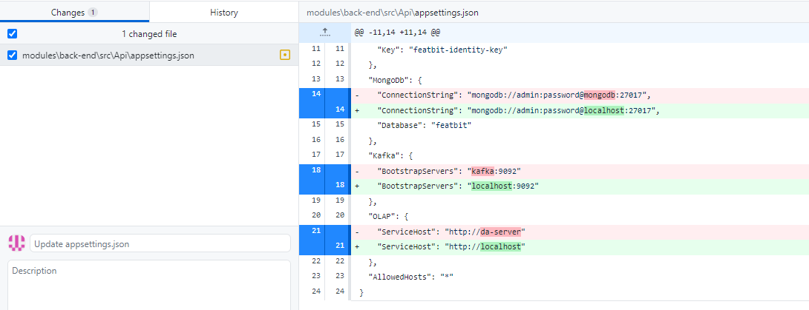

# Description

# Scope

# Screenshot

# How to implement

1.
2.
3.
4.

# Setup dev environment
If the PR is only related to the API, you can do the following to set up your environment:

- Launch the whole APP with docker compose
- Open the UI in browser and follow the guid to initialize the APP
- Stop the API docker container
- Edit the file [appsettings.json](modules\back-end\src\Api\appsettings.json) as following

- Launch the API locally, the UI will automatically connect to your local API.

# Contribution points

Each contribution counts a certain number of points, depending on its difficulty. Contributors earn the appropriate
points when the work is merged. Contribution points are used to describe the contributions that contributors have made.
They can also be used to receive rewards for community events. You can view the current community submissions on a
public [google sheet](https://docs.google.com/spreadsheets/d/1ukyXgi_jRPeXj7EAST0IrnPfLOQ6xDBkcyAJY9N-Yb4/edit#gid=0).

Points: x

# Deadline

We usually give 2 weeks to issue, that means you have 2 weeks to implement the feature starting from the day the issue is assigned to you. If you have any difficulty, please contact us in Slack.

# How to claim to solve the issue

If you want to implement this function, please leave a comment in this issue like:

> I'd like to implement this function, please assign this issue to me.

FeatBit community will assign the issue to you on time.

