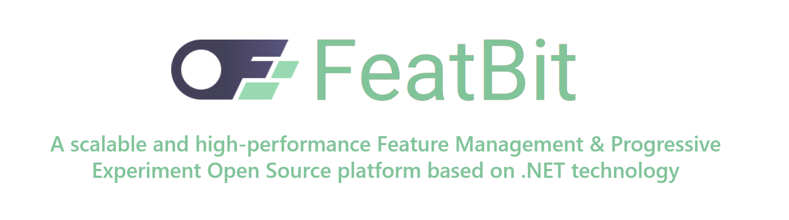

    

## Documentation and Support

Join [our Slack community](https://join.slack.com/t/featbit/shared_invite/zt-1ew5e2vbb-x6Apan1xZOaYMnFzqZkGNQ) if you get stuck, want to chat, or are thinking of a new feature.

We're here to help - and to make FeatBit even better!
