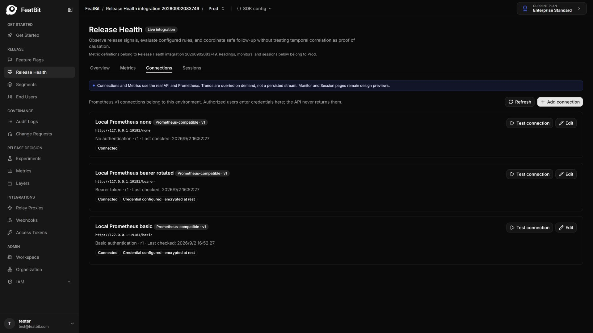
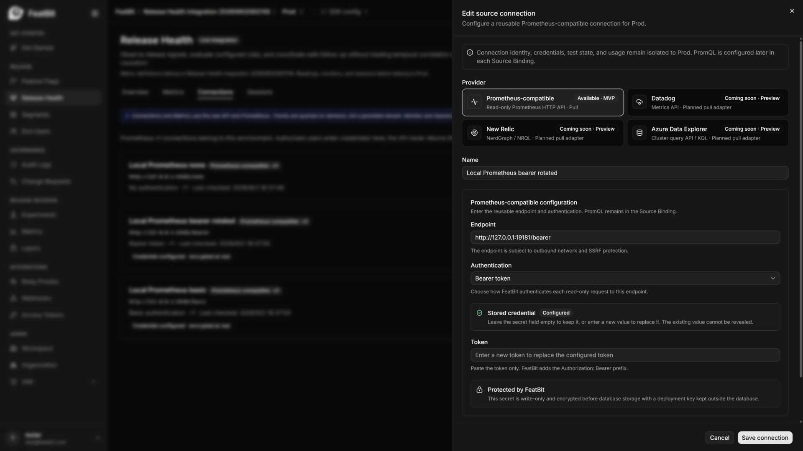
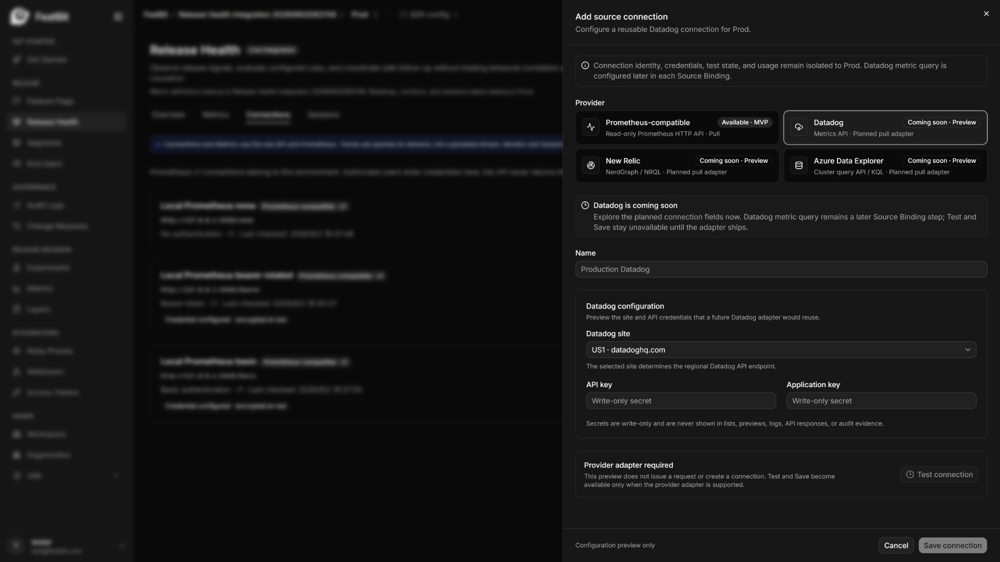
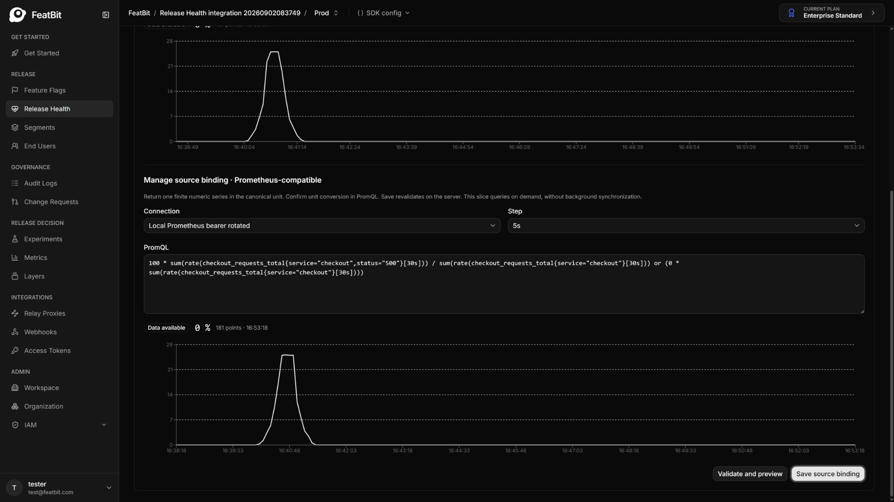
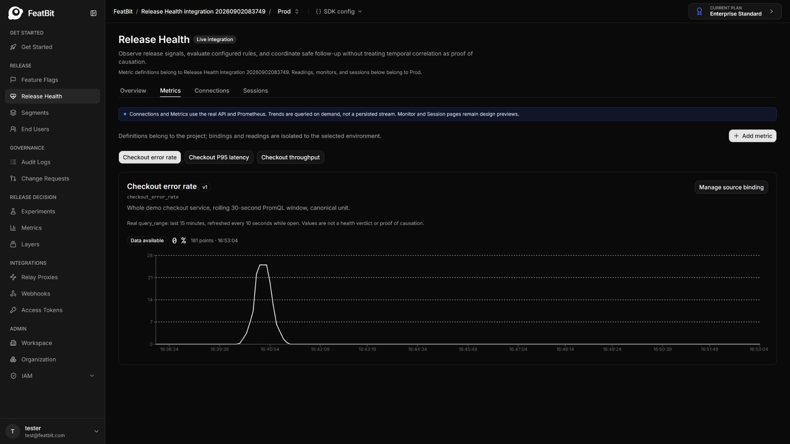

# Release Health integration verification — 2026-09-02

This record preserves the local integration results and screenshots from that run. It is not full Release Health MVP acceptance or a compliance certification. Setup, commands, credentials and implementation limits are maintained in the [fixture README](README.md); generated reports remain gitignored under `reports/`.

## Fixture results

Two runs completed healthy → regression → recovery using real HTTP traffic, OTel export and Prometheus queries. The second run recorded these phase-end values in `reports/demo-latest.md`:

| Phase | Error rate (%) | Histogram p95 (ms) | Phase check |
| --- | ---: | ---: | --- |
| Healthy | 0 | 48.4 | Passed |
| Regression | 25.13 | 778.0 | Passed |
| Recovery | 0 | 48.4 | Passed |

The JSON and HTML reports contain samples and curves. p95 is a histogram estimate. None, Bearer and Basic checks exercised the fixture gateway, not native Prometheus credential management.

## Product and regression results

`reports/product-latest.json`, checked at `2026-09-02T08:52:28Z`, recorded:

- Real Test/Save for all three authentication methods; invalid credentials, unsupported providers and metadata HTTP endpoints rejected.
- Secret rotation preserved semantic revision; stale writes and cross-environment connection references rejected.
- Three saved metrics and environment bindings produced finite trends, with 181 points per metric in the report.
- Out-of-range percentages and multiple series rejected; empty results returned `no_data`, not zero.
- PostgreSQL inspection found no plaintext fixture token/password and confirmed authenticated ciphertext with a key version.

The browser checks also covered saved-credential Keep → Test → Save and Binding Validate → Save. The run recorded 18 backend tests and 27 frontend tests passing, plus a frontend production build and lint of the changed files. These checks were not rerun when this record was consolidated.

Backend builds reported existing security advisories for AutoMapper 14.0.0, Microsoft.OpenApi 2.4.1 and SharpCompress 0.30.1. They were not upgraded in that run and require separate production-readiness review.

## Captured UI

### Saved connections and credential editing

Three persisted Prometheus-compatible connections, followed by editing without revealing the stored secret:

### Provider preview

Datadog remained a clickable configuration preview with Test/Save disabled:

### Query preview and trend

The binding preview used an actual Prometheus query; the error-rate trend showed the injected fault and subsequent recovery:

