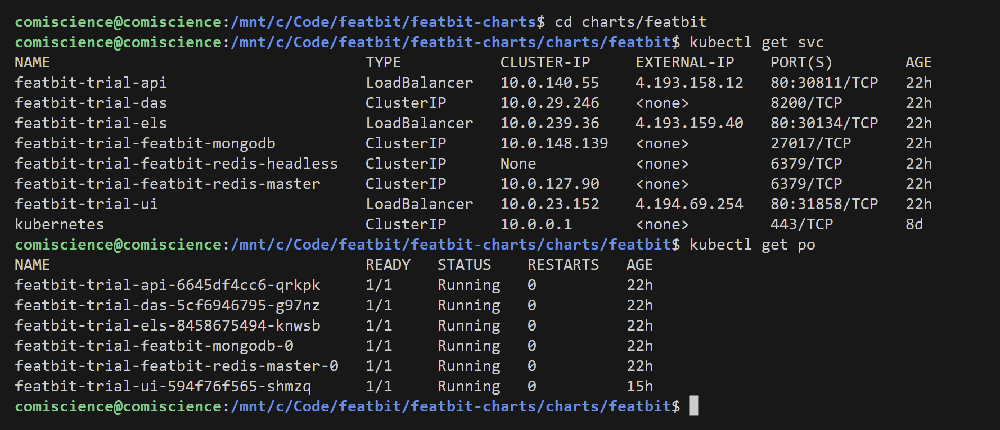
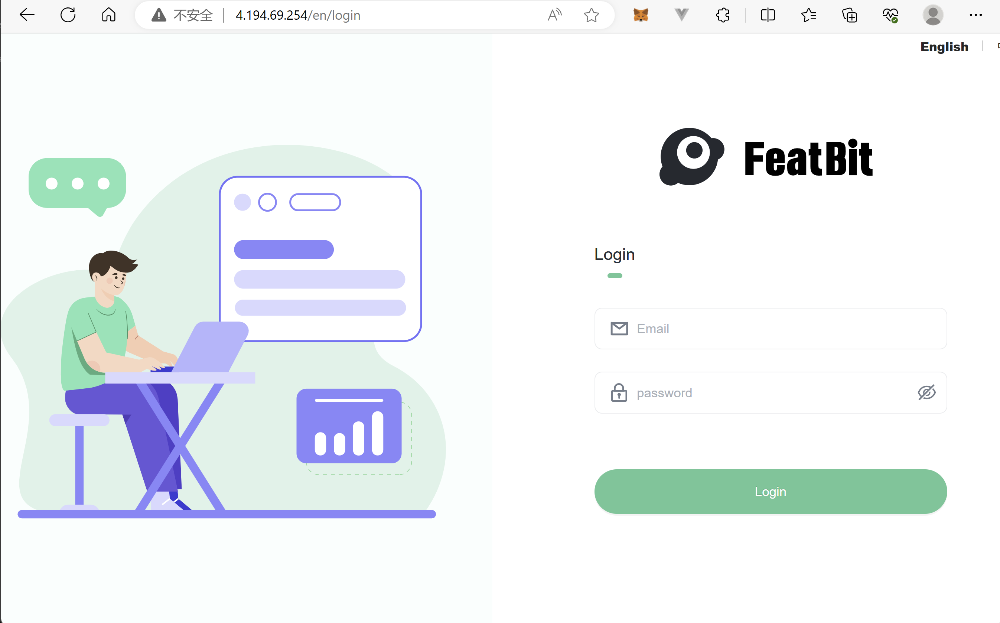

# Deploying the Feature Flags Service to Azure Kubernetes Service (AKS) using Helm, Exposed via Azure Load Balancer

[FeatBit](https://www.featbit.co) is an open-source feature flags service that enables teams to test their applications in production, roll out features incrementally, and instantly rollback if an issue arises.

This guide outlines how to deploy FeatBit to Azure Kubernetes Service (AKS) using Helm charts, with services exposed via Azure Load Balancer.

## Prerequisites

- An active Azure subscription.
- An AKS cluster.
- Azure CLI installed.
- `kubectl` installed.

## Creating Public Static IPs for FeatBit Services

FeatBit utilizes three public services:

1. **UI Portal**: This is the interface for team members to manage feature flags.
2. **API Server**: The backend which the portal communicates with to fetch and manage feature flags.
3. **Evaluation Server**: The endpoint SDKs communicate with to retrieve feature flag variations or rules.

Each service requires its own public IP. Here's how you can set them up:

```bash
# Public IP for the UI Portal
az network public-ip create --resource-group {resource group containing your AKS's vnet} --name featbit-ui-ip --sku Standard --allocation-method static

# Public IP for the API Service
az network public-ip create --resource-group {resource group containing your AKS's vnet} --name featbit-api-ip --sku Standard --allocation-method static

# Public IP for the Evaluation Service
az network public-ip create --resource-group {resource group containing your AKS's vnet} --name featbit-eval-ip --sku Standard --allocation-method static
```

Retrieve the IPs using:

```bash
az network public-ip show --resource-group {resource group containing your AKS's vnet} --name featbit-ui-ip --query ipAddress --output tsv

az network public-ip show --resource-group {resource group containing your AKS's vnet} --name featbit-api-ip --query ipAddress --output tsv

az network public-ip show --resource-group {resource group containing your AKS's vnet} --name featbit-eval-ip --query ipAddress --output tsv
```

# Granting Delegated Permissions to AKS Cluster Identity

Before deploying services with a load balancer, ensure the AKS cluster identity has the necessary permissions to the node resource group.

```bash
CLIENT_ID=$(az aks show --name {your AKS name} --resource-group {resource group name where your aks located in} --query identity.principalId -o tsv)

RG_SCOPE=$(az group show --name {resource group containing your public IPs} --query id -o tsv)

az role assignment create --assignee ${CLIENT_ID} --role "Network Contributor" --scope ${RG_SCOPE}
```

# Deploying with Helm and Custom Values

Add the FeatBit Helm repository:

```bash
helm repo add featbit https://featbit.github.io/featbit-charts/
```

Clone and navigate to the Helm chart repository:

```bash
git clone https://github.com/featbit/featbit-charts

cd /featbit-charts/charts/featbit
```

In the `featbit-charts/charts/featbit/examples` directory, locate the AKS example file, `expose-services-via-azurelb.yaml`. Replace placeholders ({}) with the appropriate values:

- `apiExternalUrl`, the URL that UI portal will call to get feature flags
- `evaluationServerExternalUrl`, the URL that SDK will call to get return variations or rules of feature flags
- `staticIP` of `ui.service`, `api.service` and `els.service`, the public IPs you created in previous step
- `service.beta.kubernetes.io/azure-load-balancer-resource-group`, the resource group name where your public IPs located in

```yaml
apiExternalUrl: "http://{API Service Public IP Address, ex. 4.194.69.254}"
evaluationServerExternalUrl: "http://{Evaluation Service Public IP Address, ex. 4.193.158.12}"
autoDiscovery: true

ui:
  service:
    type: LoadBalancer
    port: 80
    annotations: 
      service.beta.kubernetes.io/azure-load-balancer-resource-group: {Resource Group where your Public IP located in, ex. myNetworkResourceGroup}
    staticIP: {UI Portal Public IP Address, ex. 4.194.13.155}

api:
  service:
    type: LoadBalancer
    port: 80
    annotations: 
      service.beta.kubernetes.io/azure-load-balancer-resource-group: {Resource Group where your Public IP located in, ex. myNetworkResourceGroup}
    staticIP: {API Service Public IP Address, ex. 4.194.69.254}

els:
  service:
    type: LoadBalancer
    port: 80
    annotations: 
      service.beta.kubernetes.io/azure-load-balancer-resource-group: {Resource Group where your Public IP located in, ex. myNetworkResourceGroup}
    staticIP: {Evaluation Service Public IP Address, ex. 4.193.158.12}
```

Preview the Helm installation:

```bash
helm install featbit featbit/featbit -f ./examples/expose-services-via-azurelb.yaml --dry-run
```

If all looks well, install the Helm chart:

```bash
helm install featbit featbit/featbit -f ./examples/expose-services-via-azurelb.yaml

# or to upgrade
helm upgrade --install featbit-trial . -f ./examples/expose-services-via-azurelb.yaml
```

NOTE: 

- Ensure you run the command from the directory containing `expose-services-via-azurelb.yaml`.
- Specify a namespace with `--namespace` option during installation if needed.
- Adjust replica counts or disable autoscaling in the YAML file as desired in `expose-services-via-azurelb.yaml` file:
  - `.Values.{service name， ex. api | ui | els | das }.replicaCount`, the default value is 1
  - `.Values.api.autoscaling.enabled`, set the value to `false`

# Verification

Check that the services and pods are running:

```bash
kubectl get svc

kubectl get po
```

This should show output similar to the provided image:



Finally, access the UI Portal via the public IP you established earlier:



# References

[Deploying ASP.NET Core applications to Kubernetes](https://andrewlock.net/deploying-asp-net-core-applications-to-kubernetes-part-3-deploying-applications-with-helm/)

[FeatBit's helm chart repository](https://github.com/featbit/featbit-charts)

[Use a public standard load balancer in Azure Kubernetes Service (AKS)](https://learn.microsoft.com/en-us/azure/aks/load-balancer-standard)
