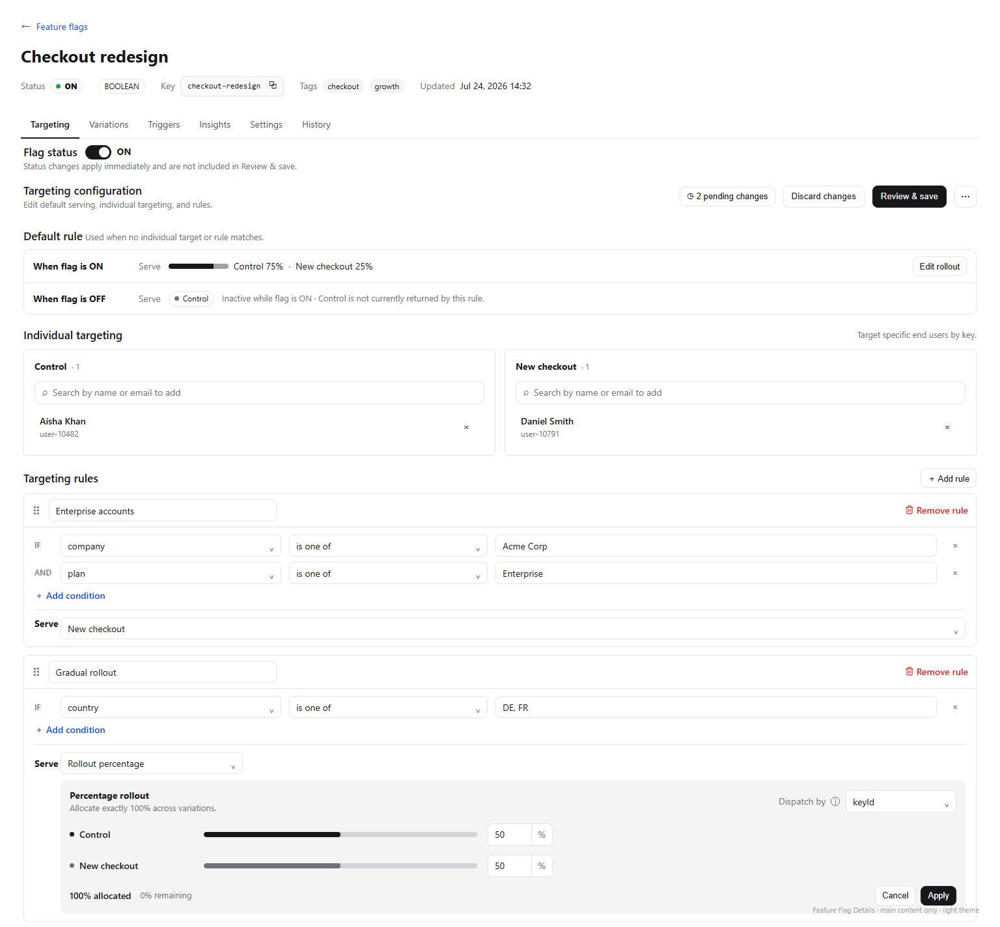
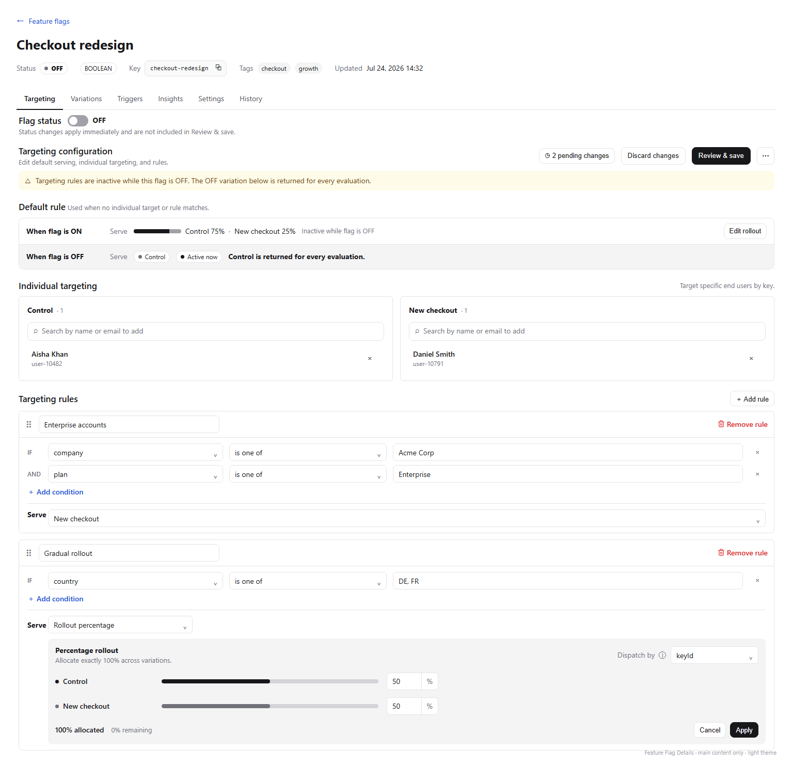
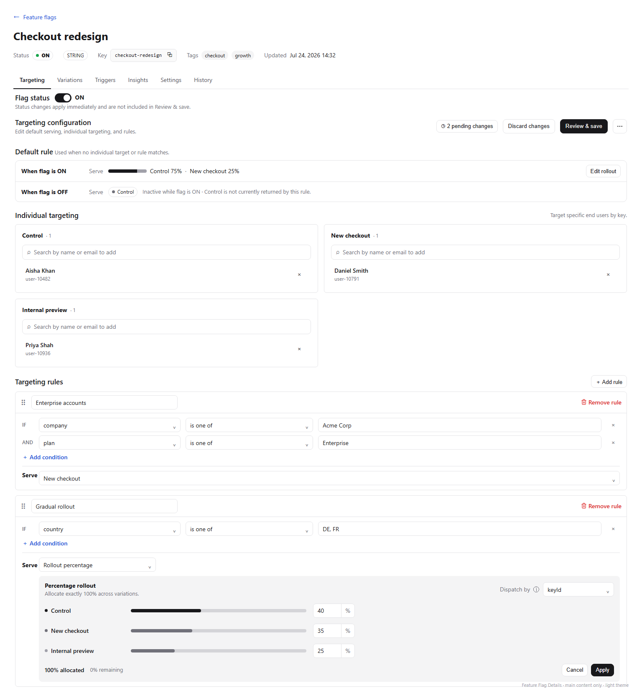
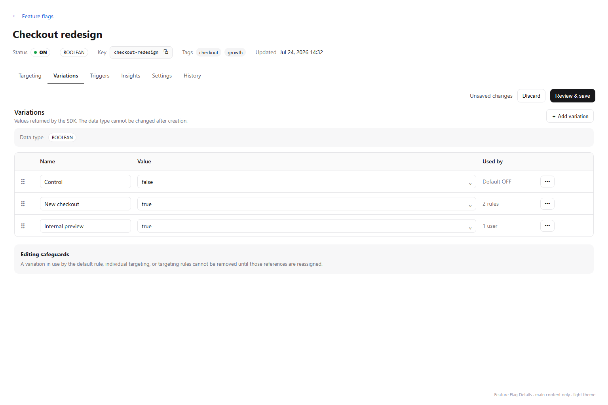
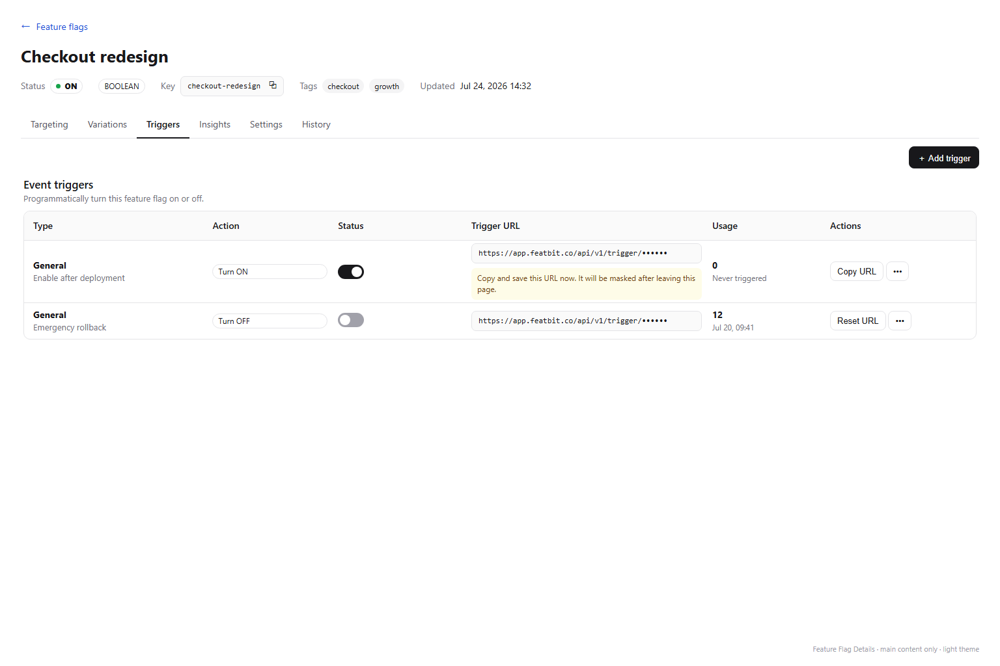
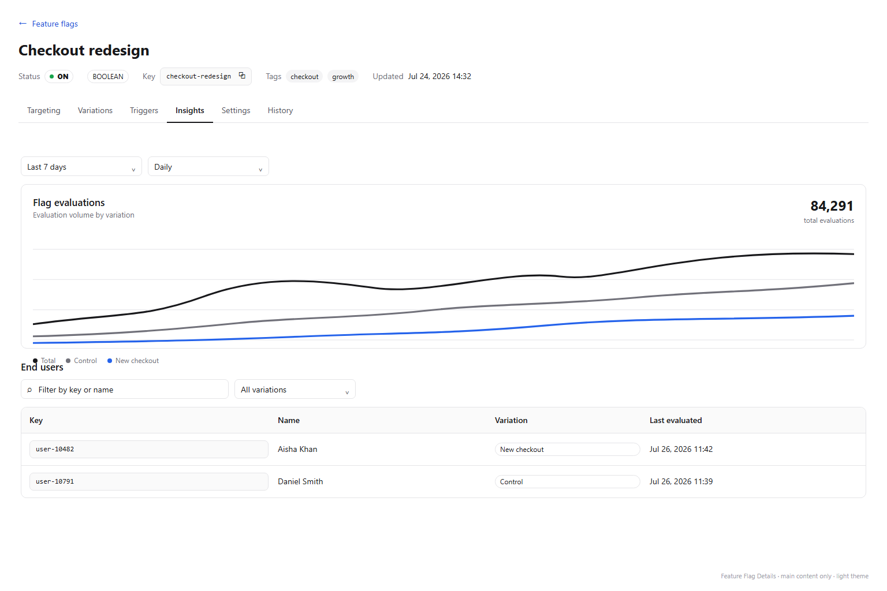
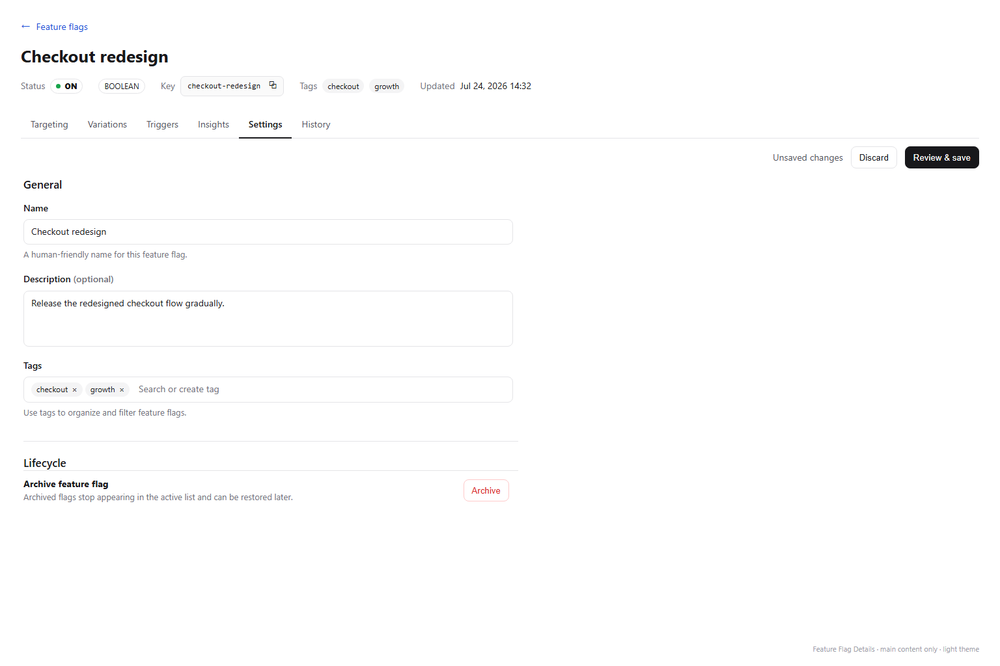
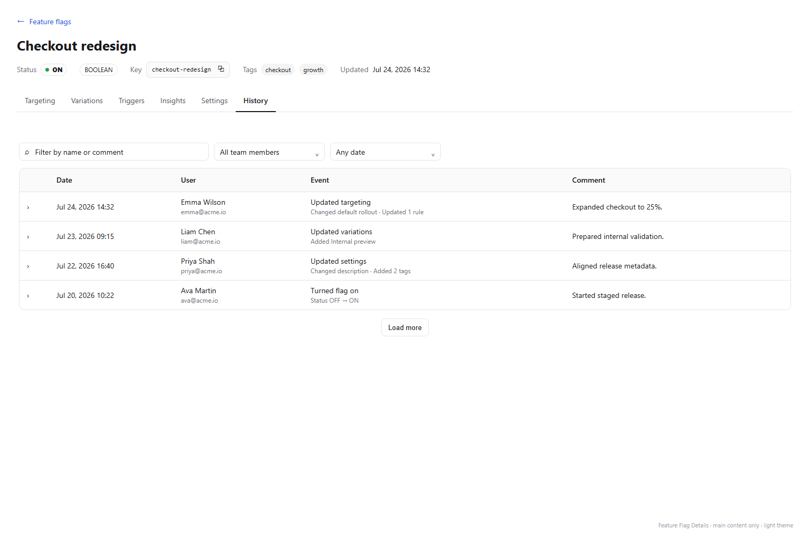

# Feature Flag Details Page Design

## Scope

This document defines the React redesign of the Feature Flag details main content in `front-end-v2`.

Included:

- the compact Feature Flag summary header;
- `Targeting`, `Variations`, `Triggers`, `Insights`, `Settings`, and `History` tabs;
- dialogs, popovers, sheets, validation, loading, empty, error, permission, license, archived, and dirty-navigation states directly owned by those tabs;
- all non-experiment Feature Flag detail behavior present in Angular.

Excluded:

- the application sidebar;
- the organization/project/environment context bar;
- the Feature Flags index and Compare page;
- all experimentation and A/B-test UI, routes, commands, references, warnings, and terminology.

Angular under `front-end/src/app/features/safe/feature-flags/details/` is a read-only functional reference. The visual target is the compact neutral React/shadcn workbench established by `front-end-v2` and the accepted Segment Details design. Do not reproduce Angular/ng-zorro layout or styling.

## Design Assets

The six primary-tab images define the light-theme hierarchy for each route. Additional Targeting images define the Flag OFF state and more-than-two-Variations wrapping behavior. `feature-flag-details-design.html` is the editable design source used to render them. Sample names, keys, users, values, counts, dates, and chart points are illustrative; implementation must render live API data.

The design images intentionally show only the page-owned main content. They do not propose changes to the sidebar or context bar.

## Design Direction

Use a restrained, desktop-first release workbench:

- one persistent identity header keeps flag context visible before any environment-sensitive action;
- route-backed line tabs separate editing responsibilities without creating nested cards;
- action rows remain compact and aligned to the content they commit;
- borders and quiet neutral fills provide structure; no ambient shadows;
- standard shadcn/Base UI controls and existing React details patterns take precedence over custom presentation;
- state, risk, validation, permissions, and license gating appear beside the affected action.

The design optimizes for a developer, product engineer, release manager, or operator reviewing a flag under normal desktop lighting while focused on a potentially production-affecting change. Light and dark themes must retain the same information hierarchy.

## Information Architecture

The main content order is:

1. Back link to `Feature flags`.
2. Persistent Feature Flag summary header.
3. Route-backed tab line.
4. Active-tab command row when the tab has draft or create actions.
5. Active-tab content.

Recommended localized routes:

- `/feature-flags/:flagKey/targeting`
- `/feature-flags/:flagKey/variations`
- `/feature-flags/:flagKey/triggers`
- `/feature-flags/:flagKey/insights`
- `/feature-flags/:flagKey/settings`
- `/feature-flags/:flagKey/history`

Opening a Feature Flag from the index routes to `targeting`. An absent or unknown tab resolves to `targeting`. Preserve the language prefix, query parameters that belong to the surrounding workspace, browser history, and deep linking.

Tab order is fixed: `Targeting`, `Variations`, `Triggers`, `Insights`, `Settings`, `History`. Do not render counts in tab labels.

## Persistent Summary Header

### Back and identity

- `← Feature flags` returns to the current Feature Flags index context.
- The flag name is a restrained 24px page title and truncates with a Tooltip when necessary.
- Name editing belongs in `Settings`; the header always shows the last confirmed server value.

### Metadata row

Show one wrapping metadata line:

- last confirmed server status as a muted `Status` label followed by a compact neutral outline Badge containing a semantic dot and `ON`, `OFF`, or `Archived`;
- immutable variation type as a neutral outline Badge: `BOOLEAN`, `STRING`, `NUMBER`, or `JSON`;
- `Key` followed by a compact monospace copy field and copy action;
- saved Tags as quiet secondary Badges, omitted when empty;
- last-updated timestamp.

Do not repeat these as disabled form fields in the active tab. Key and type are immutable after flag creation.

### Status

Place the last confirmed server status as the first item on the left of the metadata row, before variation type, Key, Tags, and Updated. Keep the title row reserved for the flag name so long names do not compete with state. The status is read-only, is not focusable, and must not visually resemble a switch or button. Its explicit `ON`, `OFF`, or `Archived` text remains present so color is never the only status signal.

Do not render a header overflow menu. `Archive` belongs in `Settings > Lifecycle`, where its consequence and recoverability can be explained in context; a one-item three-dot menu adds indirection without saving meaningful space.

For an archived flag:

- replace the ON/OFF status Badge with an `Archived` Badge;
- keep all information readable but disable mutation controls;
- expose `Restore` and `Remove permanently` in the Settings lifecycle section;
- require the same permission and change-comment behavior as Angular;
- return to the Feature Flags index after successful permanent removal.

## Targeting Tab

Targeting follows the accepted Segment Details editor rhythm while preserving Feature Flag-specific serving behavior.

### Flag status

Place one compact Flag status row first below the tabs. Keep it on the page background without a filled card or separator; typography and vertical whitespace provide the hierarchy. Keep `Flag status`, the controlled switch immediately after the heading, and explicit `ON` or `OFF` text in one left-aligned cluster. The helper copy is invariant and makes the save boundary explicit: `Status changes apply immediately and are not included in Review & save.` Keeping the switch beside its label prevents a pointer trip across the full workbench. This is the only interactive global status control on the page.

Changing the switch opens the existing compact confirmation dialog and explains the effective saved serving behavior. When environment settings require a change comment, collect it before submission. While the request is pending, disable the switch and show its pending state without optimistic movement; after success, update both this control and the read-only header status. On failure, retain the last confirmed state in both locations and show the standard recoverable error feedback.

If the Targeting draft is dirty, the confirmation must state that unsaved Targeting edits are not applied by the status change and must describe the currently saved OFF variation, not an unsaved selector value. An archived or unauthorized flag keeps the status row readable but disables the switch with the established permission or lifecycle explanation.

### Targeting configuration and command row

Place a plain Targeting configuration row directly below Flag status. Use the left side for `Targeting configuration` and the helper `Edit default serving, individual targeting, and rules.` Align the draft command group on the right. This names the scope of Review & save, fills the formerly empty toolbar area with useful context, and visually separates draft operations from the immediate status operation:

- `n pending changes` opens the scheduled/change-request surface and is visible only when the server returns pending items;
- `Discard changes` is an outline button shown when the current draft differs from the loaded revision; it resets the complete Targeting draft to the last confirmed server value after the shared confirmation behavior where required;
- primary `Review & save` validates and opens semantic review; it never submits immediately;
- the far-right control is a 34px outline icon button using lucide `MoreHorizontal`, with Tooltip and localized accessible name `More targeting actions`; its menu contains `Schedule changes` and `Change request`, gated independently by license and permission.

Command order is fixed: pending changes, Discard changes, Review & save, MoreHorizontal. When the draft is clean, omit or disable Discard according to the shared action pattern and disable `Review & save` and scheduling/request commands. Do not include `Set A/B test rule` or any equivalent entry.

### Default rule

Default rule is the first serving editor immediately after the Targeting configuration row because it communicates the final fallback for both flag states.

It contains two compact rows on one bordered surface:

1. `When flag is ON` — configure a single served variation or a percentage rollout across variations. Percentage rows show the distribution visibly and support the existing dispatch-key/user-property behavior.
2. `When flag is OFF` — `If OFF, serve` is represented here as one variation selector whose status copy is driven by the last confirmed global status:
   - while the flag is ON, show `Inactive while flag is ON · {variation} is not currently returned by this rule.` in muted text;
   - while the flag is OFF, give the row a quiet muted background, show neutral `Active now`, and state `{variation} is returned for every evaluation.` The copy must interpolate the currently selected OFF variation rather than a cached name.

The ON row is symmetrical while the flag is OFF: retain its complete configuration for editing but append muted `Inactive while flag is OFF`. Switching status updates these state messages immediately after the server confirms the new state; do not show the OFF row as active during a pending or failed toggle.

This is one conceptual default-rule editor, not two unrelated cards. The OFF row does not move to Variations or Settings.

Validation:

- the ON default must select at least one serving variation;
- a percentage rollout must total exactly 100%;
- the OFF variation is required;
- an archived or unauthorized flag remains readable but not editable.

If the flag is OFF, show one compact warning above the editor: `Targeting changes will not affect evaluations until the flag is turned on.` Do not hide or disable the draft solely because the current status is OFF.

### Individual targeting

The current React `UserPanel` and `UserPicker` in `front-end-v2/src/features/segments/details/targeting/targeting-tab.tsx` are the visual and interaction source of truth. Render one equivalent bounded panel per variation in a two-column grid. Each panel uses the exact Segment structure:

- 6px-radius one-pixel border and 16px internal padding;
- variation name followed inline by ordinary muted `· {count}` text when the panel is non-empty;
- full-width 36px outline search trigger with Search icon and `Search by name or email to add`; there is no separate `Add users` button;
- Popover + Command results with debounced search, loading, empty, error/retry, selectable users, and exact-key creation when the confirmed Feature Flag contract permits it;
- selected-user list begins 8px below the search trigger, is capped at 176px (`max-h-44`), and scrolls internally;
- each selected row shows the same primary user label and secondary stable key as Segment, without an Avatar, plus the same 32px ghost `X` removal action;
- horizontal separators remain between selected user rows and are omitted after the last row.

A user can be assigned to only one variation in the draft. Selecting the same user for another variation moves the assignment after explicit inline confirmation or clear picker messaging. Empty panels retain a compact instructional row rather than collapsing.

For many selected users, scroll only the bounded list; keep the title/count and search trigger visible. Preserve selection, loading, empty, error, creation, and permission-disabled states from the shared Segment/user-picking patterns.

When there are more than two Variations, continue the same two-column grid onto following rows in API/draft order. Do not introduce tabs, a carousel, or a horizontal scroller. With an odd number, the final panel keeps the same half-width column size and leaves the adjacent grid cell empty; do not stretch it across both columns. At constrained desktop widths, the grid becomes one column. The `feature-flag-details-targeting-many-variations-light.png` asset shows the required three-Variation state.

### Targeting rules

The current React implementation in `front-end-v2/src/features/segments/details/targeting/targeting-tab.tsx` is the visual and interaction source of truth for Feature Flag rule structure. The older Segment design document and screenshots must not be used to recreate their former one-row rule layout.

Rules occupy the full content width below Individual targeting. Every rule uses the same independent compact bordered card as the current Segment implementation:

- card header: keyboard-accessible drag handle, 32px-high rule-name input capped at the Segment width, and the exact current Segment destructive ghost action aligned right—14px lucide `Trash2` followed by `Remove rule`, with the shared 4px icon/text gap and vertical alignment;
- card body: vertically stacked condition rows on a borderless surface;
- each condition row uses the exact Segment column order: `IF` or `AND`, Property Select, Operator Select, Value control, and icon-only remove-condition button;
- `IF` labels the first condition and `AND` labels every subsequent condition in the fixed narrow leading column;
- `Add condition` is a compact link action directly beneath the condition list;
- Feature Flag-only `Serve` is appended inside the same card body below a thin divider. Its keyword left edge aligns exactly with `IF` / `AND`, and its return-value control begins on the same column as the condition Property control;
- Serve selects one variation or `Rollout percentage`. A configured rollout normally displays a compact summary and `Edit rollout`; activating it expands the editor inline inside the same rule card rather than opening a modal.

The Targeting design asset intentionally shows the second rule with its percentage editor expanded. The editor contains:

- a persistent Serve mode Select set to `Rollout percentage`;
- one aligned allocation row per variation: stable color marker, variation name, proportional track, and 0–100 numeric percentage input;
- `Dispatch by` property Select in the editor header, defaulting to the confirmed backend default such as `keyId`, plus helper Tooltip explaining stable percentage bucketing;
- a footer that states both `{assigned}% allocated` and `{remaining}% remaining`; when over-assigned, replace remaining copy with a concise destructive inline error;
- local `Cancel` and `Apply` actions. Cancel restores the allocation present when the editor opened; Apply updates the targeting draft but does not save the page.

Keep allocation rows vertical and aligned. Separate Variations with approximately 8px vertical spacing rather than horizontal divider lines; the shared tonal surface and stable columns already communicate that they belong to one allocation group. On wide desktops, cap the proportional track column at approximately 420px and keep the name, track, and numeric input group left-aligned; the track may shrink at constrained widths but must not stretch across all remaining card space. Do not scatter variation inputs and Dispatch by into unrelated equal-width columns, repeat card borders inside the rule, or make the user calculate whether the total is valid. The proportional tracks are supporting feedback; numeric inputs remain the authoritative editable values.

After Apply, collapse the editor back to the distribution summary. `Review & save` remains the only action that persists the targeting draft. The Default rule uses the same rollout editor contract.

Do not collapse a complete rule into one table row, move actions into a three-dot menu, or combine Property, Operator, and Value into one synthetic field. Feature Flag rules should look like Segment rules before the user reaches the additional Serve row.

`Add rule` belongs in the section header. Reordering preserves the Segment drag preview, pointer drop behavior, and keyboard Arrow Up/Arrow Down behavior. Dragging and every mutation control are disabled without rule-update permission. Condition values preserve scalar, multi-value, numeric, date, semantic-version, and Segment reference behavior supported by the Feature Flag targeting contract.

Validation rejects empty condition collections, incomplete conditions, missing serving values, and percentage totals other than 100%. Invalid rows receive a restrained destructive border/ring and an inline message; do not rely on a toast alone.

### Review, save, schedule, and change request

`Review & save`, `Schedule changes`, and `Change request` share one semantic diff source so every submitted targeting change has a readable review entry. The review covers:

- ON default serving changes;
- OFF default variation changes;
- individual user assignments added, removed, or moved between variations;
- rules added, removed, reordered, renamed, or changed;
- condition and serving-distribution changes.

Use the accepted Segment Details review treatment: one borderless muted Changes surface, inline `{count} changes`, deterministic ordering, bounded scrolling, readable old-to-new values, and no raw JSON in pre-save review. The dialog also provides the optional or required change comment.

Scheduling adds title and scheduled time. Change request adds reason and reviewers. A scheduled change may optionally use the existing change-request mode if the backend/license contract supports it. License-denied commands remain visible but disabled with the standard contact/license explanation.

#### Review dialog family

All three Targeting submission paths use the current React Segment Targeting review dialog as their shared shell, rather than reproducing the Angular modal styling:

- `sm:max-w-3xl`-scale centered Dialog with the same header spacing, title/description hierarchy, close action, body rhythm, and transparent borderless footer;
- `Changes` followed by inline `{count} changes`;
- one borderless muted ChangeLedger surface with a bounded height and internal scrolling;
- the same semantic Feature Flag changes, ordering, badges, operation words, and readable old-to-new content in every mode;
- outline `Cancel` followed by one primary mode-specific action.

`Review & save` opens `Review targeting changes`. Beneath the ledger it shows the same `Change comment` field and audit helper used by Segment. The field is optional or required according to Environment settings. The primary action is `Save changes`; there is no Save Mode selector and no immediate submission before this confirmation.

`Schedule changes` opens the same shell titled `Schedule targeting changes`. After the unchanged ledger it shows:

- required Title;
- required Scheduled time using the project's date-time picker, with the effective Environment/user timezone visible directly beneath the control;
- required Reason;
- `Require approval` switch. When enabled, required Reviewers appears and the payload combines Schedule and Change Request, preserving the existing backend capability. When disabled, no reviewer field is rendered.

Scheduled time must be in the future. Inline validation belongs directly beneath the relevant control. The primary action is `Schedule changes`; saving creates a pending schedule and does not apply the local draft immediately.

`Change request` opens the same shell titled `Request approval for targeting changes`. After the unchanged ledger it shows required Reason and required searchable multi-select Reviewers. Exclude the current user from reviewer results and require at least one reviewer. The primary action is `Submit request`; submission creates a pending request and does not apply the draft immediately.

Do not place Save, Schedule, and Change Request tabs inside these dialogs. The Targeting toolbar already provides one explicit immediate-save action and two independently gated More-menu commands. Keeping a dedicated entry and primary verb for each path reduces mode errors while preserving all Angular behavior, including the combined scheduled approval path.

Reference states:

- `feature-flag-details-targeting-review-light.png` — immediate Review & save, visually matched to Segment Targeting;
- `feature-flag-details-targeting-schedule-light.png` — scheduled change with approval enabled;
- `feature-flag-details-targeting-change-request-light.png` — standalone approval request.

The pending-changes surface lists scheduled changes and change requests, including time, author, reviewers/status when present, and removal action subject to permission. Removing an item refreshes its count without discarding the local targeting draft.

#### Pending changes Sheet

Clicking `Pending changes` opens a right-side Sheet over the Feature Flag detail page. Use the current React Sheet vocabulary rather than copying the 600px Angular drawer: fixed header, independently scrolling body, `760px` desktop width, full-width on a narrow viewport, and no footer that competes with item actions. The page remains visible beneath the standard modal backdrop; this Sheet does not alter the sidebar or context bar.

The header contains `Pending changes`, the total count, a concise flag-specific description, and the standard close button. The body begins with `x pending changes · y needs your review` and a compact status filter. This count includes schedules and change requests already submitted to the server; it does not include the current unsaved Targeting draft.

Render the queue as one bordered list with dividers rather than a stack of nested cards. Each item contains:

- type icon, user-facing title or `Change request`, type label, semantic status badge, and `MoreHorizontal` at the far right;
- scheduled time plus effective timezone for schedules;
- schedule reason or change-request reason;
- reviewers and their individual decision state when approval is required;
- collapsible `Changes · n changes` disclosure using the same Feature Flag ChangeLedger and deterministic order as Review & save;
- creator and creation time;
- only the actions currently available to the signed-in user.

Keep the first actionable item expanded in the reference state and the remaining items collapsed. Expansion affects only the selected item. Long queues scroll inside the Sheet; long ChangeLedgers use their own bounded scroll only after the item would otherwise dominate the viewport.

Promote workflow actions out of the Angular ellipsis menu:

- a reviewer sees explicit `Decline` and primary `Approve` buttons while their decision is pending;
- an approved standalone Change Request exposes primary `Apply changes` to the creator or an approving reviewer;
- a schedule awaiting execution has no redundant primary action;
- `MoreHorizontal` remains at the far right and contains `Remove` when permitted. Removal requires a confirmation dialog and must name the schedule/change request being removed.

Status behavior is explicit:

- `Pending review`: approval is incomplete; show reviewer states and the current user's decision controls;
- `Approved`: approval is complete; standalone requests can now be applied;
- `Pending execution`: a schedule is approved or does not require approval and is waiting for its scheduled time;
- `Declined`: show the declined state and reviewer decisions; no Apply action;
- `Applied`: read-only terminal state until the server removes it from the pending collection.

Approve, Decline, Apply, and Remove update the affected item in place, refresh the toolbar count, and preserve the local Targeting draft. Disable the invoked action and show its loading label while the request is in flight. On failure, restore the previous state and show the standard error toast. Empty state copy is `No pending changes` with `Scheduled changes and approval requests will appear here.` Loading uses list-row skeletons rather than a centered spinner.

Reference state: `feature-flag-details-targeting-pending-changes-light.png`.

### Finalized Targeting implementation checklist

The following decisions are locked for the React handoff and take precedence over older Feature Flag or Segment design screenshots where they differ:

- Keep only a read-only `Status` Badge in the persistent page header. Place the page's single interactive global ON/OFF switch in the Targeting `Flag status` row before Default rule.
- Keep status mutation separate from the Targeting draft: it preserves confirmation and change-comment behavior, updates both status displays only after server success, and does not implicitly save dirty targeting edits.
- Link Default rule state copy to the last confirmed switch state. ON makes the OFF value explicitly inactive; OFF highlights the OFF row, marks it `Active now`, and names the exact Variation returned for every evaluation.
- Use the Targeting command order `Pending changes` → `Discard changes` → `Review & save` → icon-only `MoreHorizontal`. The far-right menu contains only Schedule changes and Change request.
- Build each Individual targeting Variation from the current React Segment `UserPanel`/`UserPicker`: title with inline count, full-width search trigger, no Avatar, stable key as secondary text, ghost `X`, and bounded internal user-list scrolling.
- Render Individual targeting panels in a stable two-column grid. More than two Variations wrap to subsequent rows; an odd final panel remains one column wide rather than stretching.
- Build every Targeting rule from the current React Segment rule-card implementation: drag handle, rule-name input, lucide `Trash2` plus `Remove rule`, explicit `IF`/`AND`, separate Property/Operator/Value controls, condition remove, and Add condition.
- Align the Feature Flag-only `Serve` keyword with `IF`/`AND`; align its control with the Property column.
- Expand percentage editing inline inside its rule card. Show Variation name, capped proportional track, numeric percent input, Dispatch by, allocated/remaining totals, Cancel, and Apply.
- Cap percentage tracks at approximately 420px on wide screens and allow them to shrink on constrained desktops. Do not stretch them across all remaining card width.
- Use vertical spacing rather than divider lines between percentage Variation rows.
- Apply updates only the local targeting draft. `Review & save` remains the only immediate persistence path; Schedule and Change request use the same semantic diff.
- Do not render any experimentation or A/B-test action, route, reference, state, warning, or terminology.

## Variations Tab

Variations is a new route and the only place for editing the variation collection.

### Structure

- header: `Variations`, helper copy, and `Add variation` when the type permits it;
- compact tonal strip showing immutable Data type;
- one table-like editor with drag handle, Name, Value, `Used by`, and row actions;
- a quiet safeguard note beneath the editor.

`Used by` is derived from the loaded/current draft and identifies local non-experiment references such as `Default OFF`, `Default ON`, `2 rules`, or `1 user`. It helps prevent accidental removal but is not a new backend contract.

### Editing rules

- names are required and trimmed;
- values are validated by immutable type;
- boolean values are `true` or `false` and retain the fixed boolean variation constraints from Angular;
- number values must be valid numbers;
- JSON must parse as a JSON object under the confirmed backend validator;
- string and JSON values may open a larger editor with `Format`, `Cancel`, and `Apply` actions;
- non-boolean flags can add variations subject to backend limits;
- a removable row must first have all Default, Individual targeting, and Targeting rule references reassigned;
- experiment references and experiment navigation are not queried or displayed in this design.

Rows edit in place so common name/value changes do not require a modal. Use a Dialog only for the larger string/JSON editor or a destructive confirmation.

### Draft and save

Variations uses the same `Unsaved changes`, `Discard`, and `Review & save` command pattern as Settings. Review lists added, removed, reordered, renamed, and value-changed variations with readable typed values. Saving submits the complete ordered variation payload with revision and optional/required comment.

After a successful save, refresh the summary, Targeting variation options, History, and Feature Flags index cache. On revision conflict, retain the draft, explain that the flag changed elsewhere, and offer reload; do not silently overwrite.

## Triggers Tab

### Main table

Use a compact table instead of Angular cards. Columns are `Type`, `Action`, `Status`, `Trigger URL`, `Usage`, and `Actions`.

Each trigger preserves:

- trigger type label and description;
- `Turn ON` or `Turn OFF` action;
- enabled/disabled controlled switch;
- masked trigger URL;
- triggered count, last-triggered time when present, and last-updated time;
- copy URL while the newly issued token is available;
- reset URL and remove commands.

Immediately after creation or reset, show the complete URL and a compact warning: `Copy and save this URL now. It will be masked after leaving this page.` Once the route reloads, render the masked form and do not imply that it can be recovered.

### Create and destructive flows

`Add trigger` opens a compact Dialog containing Type, Action, and Description. Use native React Select composition (`SelectContent > SelectGroup > SelectItem`). The primary action is disabled while invalid or submitting.

Reset explains that the existing URL expires and then exposes the newly issued URL. Remove explains irreversibility. Toggle, reset, and remove preserve the existing permission/error behavior and update only the affected row.

The empty state explains what event triggers do and repeats `Add trigger` for authorized users. Loading uses header and row skeletons; errors preserve the heading and provide Retry.

## Insights Tab

Insights retains Angular reporting behavior but uses Recharts and current React table/filter patterns.

### Evaluation chart

Place `Period` and `Interval` filters above one bordered chart surface. Supported periods remain:

- Last 30 minutes;
- Last 2 hours;
- Last 24 hours;
- Last 7 days;
- Last 14 days;
- Last 1 month;
- Last 2 months;
- Last 6 months;
- Last 12 months.

Available interval choices remain conditional on the selected period exactly as in Angular: minute, hour, day, week, and month where supported. Changing period selects its first valid interval and refreshes both chart and end-user results.

The chart shows Total plus each variation as separate lines, a compact legend, localized time axis, Tooltip values, and the total evaluation count. Use a stable semantic series-color mapping that works in light and dark themes. Do not use G2.

### Evaluated end users

Below the chart, show:

- debounced `Filter by key or name` search;
- `All variations` or one variation filter;
- columns `Key`, `Name`, `Variation`, and `Last evaluated`;
- server total and pagination using the existing response contract.

Changing filters resets pagination. Loading one result region must not blank the other. Empty chart data shows the axes/legend context plus `No evaluations in this period`; empty user results explain which filters produced no matches.

## Settings Tab

Settings reuses the accepted Segment Details form structure: one left-aligned 720–780px column, no card stack, no repeated immutable metadata.

### General

- Name: required, trimmed, standard input, independently permission-gated.
- Description: optional compact textarea, with `(optional)` beside the label.
- Tags: searchable/creatable multi-value input with removable quiet chips, loading state, and duplicate prevention.

The persistent header remains the authoritative read-only surface for Key, variation type, saved tags, status, and update time. Settings edits update the header only after the corresponding operation succeeds.

### Lifecycle

Separate Lifecycle from ordinary fields with whitespace and one top divider, not a danger card.

- Active flag: show `Archive` with recoverable consequence copy and confirmation/change comment.
- Archived flag: show `Restore` and `Remove permanently`; permanent removal uses destructive styling and explicit irreversible confirmation.

### Review and partial success

Dirty Settings shows `Unsaved changes`, `Discard`, and `Review & save`. Review includes only permitted fields that changed and displays Name, Description, and Tags as readable semantic differences.

Preserve the independent backend operations and permissions for name, description, and tags. Submit only dirty fields. If some independent operations succeed and another fails, update the saved baseline/header for successful fields, retain failed drafts, and report the partial result precisely.

## History Tab

Reuse the accepted Segment Details/global Audit Logs React contract rather than the Angular embedded presentation.

### Toolbar and query

- debounced text search: `Filter by name or comment`;
- searchable team-member Popover with `All team members` reset;
- inclusive date-range Popover with draft selection, Apply, and Clear;
- reference type and ID are fixed by the route, so no Type filter or Type column appears.

Changing an applied filter resets pagination. Date and creator filtering remain server-side.

### Audit table

Use columns: disclosure, `Date`, `User`, `Event`, and `Comment`. Every row is collapsed by default. Event preview examples include targeting, variations, settings, status, trigger, archive, restore, and creation operations.

Expanding a row shows:

- `Changes` with inline semantic change count;
- compact object/operation/content ledger;
- complete known flag instructions, including default serving, individual targeting, rule, variation, settings, status, trigger, and lifecycle changes;
- `View raw data` when previous/current snapshots exist;
- bounded expansion for high-cardinality users, rules, tags, and variations.

Raw data opens the shared read-only JSON MergeView Dialog. History uses centered incremental `Load more`; pending loading never dims already loaded records.

## Shared Interaction Rules

### Dirty navigation

Intercept tab switches, back navigation, and route changes while Targeting, Variations, or Settings contains an unsaved draft. Present `Keep editing` and `Discard changes`. Browser refresh may use the standard browser prompt.

Only the active tab owns a draft. Successful saves replace its baseline and clear its dirty state. External query refreshes must not silently replace a dirty draft.

### Permissions and licenses

Keep unauthorized data visible. Disable only the affected mutation and show the shared permission explanation. Do not hide an entire section because its user cannot edit it.

Permission checks remain operation-specific for:

- status, default rule, individual targeting, rules, variations;
- schedule and change request;
- trigger create/status/reset/remove;
- name, description, tags;
- archive, restore, and permanent removal.

License gating applies to Schedule and Change Request independently. A license-gated menu item remains discoverable but disabled with the standard license message.

### Feedback

- use skeletons for initial page and region loading;
- keep the header and tab line stable during tab-specific requests;
- use inline validation near invalid controls;
- use toast feedback for completed copy/save/lifecycle operations;
- keep recoverable errors inline with Retry;
- avoid full-page spinners and decorative motion;
- state transitions use the shared 150–250ms product timing and honor reduced motion.

## State Matrix

| State | Required presentation |
| --- | --- |
| Initial loading | Back link, summary skeleton, tab line, and active-tab structural skeletons. |
| Flag load failure | Keep Back visible; compact error with `Feature flag could not be loaded`, `Retry`, and `Back to feature flags`. |
| Missing flag | Use the established not-found treatment and a Feature Flags return action. |
| Clean editable tab | No dirty label; review action disabled. |
| Dirty editable tab | Dirty label plus Discard and enabled Review action. |
| Validation failure | Row/field-local message and focus the first invalid control; no review opens. |
| Revision conflict | Preserve draft; explain concurrent change; offer Reload and Keep editing where safe. |
| Flag OFF | Header state remains OFF; Targeting warning appears; ON default is marked inactive; OFF row is highlighted with `Active now` and explicitly names the variation returned for every evaluation; draft editing remains available. |
| Archived | Archived Badge; read-only detail content; Restore and Remove permanently in Settings. |
| Permission denied | Data visible, relevant control disabled, shared permission explanation. |
| License denied | Schedule/Change Request visible but disabled with license explanation. |
| No pending changes | Omit pending-change action/count. |
| No targeting users/rules | Compact instructional empty rows and Add actions. |
| No triggers | Educational empty state with authorized Add action. |
| No insight data | Stable chart/table context with filter-aware empty copy. |
| No history | Stable toolbar/table shell with `No history matches these filters`. |

## Internationalization and Content

- Localize every tab, action, helper, validation message, confirmation, status, empty/error state, audit event, period, interval, and relative count.
- Preserve complete flag names, keys, variation values, user identities, comments, and URLs through wrapping, truncation plus Tooltip, or bounded scroll; never silently clip without recovery.
- Format date/time in the current locale while preserving a precise full timestamp in History and Triggers.
- Keep SDK keys and typed variation values monospace where it improves recognition.
- Use `ON` and `OFF` consistently as state labels; sentences use natural localized casing.
- Do not introduce experiment-related translation keys for this page.

## Accessibility and Desktop Behavior

- Use semantic headings, nav, table, form, button, and dialog structures provided by shared components.
- Every icon-only action has a localized accessible name and Tooltip.
- Tabs, disclosures, switches, menus, user pickers, rule builders, variation editor, chart filters, and dialogs remain keyboard operable.
- Focus returns to the invoking control after Dialog/Popover close.
- Do not encode ON/OFF, enabled/disabled, chart series, validation, or destructive state through color alone.
- At narrower desktop widths, allow the metadata row to wrap, keep tabs horizontally scrollable, and allow wide rule/history/trigger tables to scroll horizontally before stacking fields.
- Individual targeting uses two columns when space permits and one column at constrained desktop widths.
- Settings stays left-aligned; it does not stretch to fill the viewport.
- Mobile-specific redesign is outside scope.

## Functional Invariants

- The Targeting status switch preserves Angular confirmation and optional/required change-comment behavior; the persistent header status is read-only.
- `If OFF, serve` is part of Targeting > Default rule and nowhere else.
- Targeting preserves default, individual, ordered rule, percentage rollout, property/operator, validation, review, schedule, change-request, and pending-change behavior.
- Variations preserves immutable type, typed validation, add/edit/remove, ordering, expanded string/JSON editing, revision, and comment behavior.
- Triggers preserves create, enable/disable, one-time URL visibility/copy, usage metadata, reset, and remove behavior.
- Insights preserves period/interval compatibility, total/variation series, user search, variation filtering, and server pagination.
- Settings preserves independent name, description, tags, archive, restore, and permanent-remove operations.
- History preserves resource-scoped filtering, expandable complete semantic instructions, raw data, and incremental loading.
- All write actions remain revision-, permission-, license-, and environment-aware according to their existing contracts.
- No experimentation or A/B-test route, action, reference, warning, status, terminology, or navigation appears in the React design.

## Acceptance Criteria

- Only Feature Flag details main content and its directly owned overlays are designed; sidebar and context bar remain unchanged.
- The page has exactly six route-backed tabs in this order: Targeting, Variations, Triggers, Insights, Settings, History.
- The persistent header exposes identity, immutable metadata, and status without reproducing Angular's stacked settings blocks or adding a one-item overflow menu.
- The persistent header shows only read-only status, while Targeting contains the page's single interactive global ON/OFF switch.
- Targeting shows ON and OFF default serving on one compact Default rule surface; `If OFF, serve` is not duplicated elsewhere.
- Targeting and Settings visibly follow the accepted Segment Details hierarchy and review patterns while retaining Feature Flag-specific behavior.
- Variations is a first-class editor tab, not a modal launched from Settings.
- Trigger URLs clearly distinguish one-time revealed and later masked states.
- Insights uses Recharts and current React filters/table conventions, not G2/ng-zorro presentation.
- History reuses the React audit-table contract and hides the redundant Type filter/column.
- Permission, license, loading, empty, error, archived, validation, dirty-navigation, partial-success, and conflict states are specified.
- No experiment or A/B-test UI appears in any design asset.
- The design uses current React/shadcn tokens, compact density, thin borders, quiet tonal surfaces, and no ambient card shadows.
- No React or Angular implementation, configuration, dependency, test, or resource file is changed as part of this design-only task.
