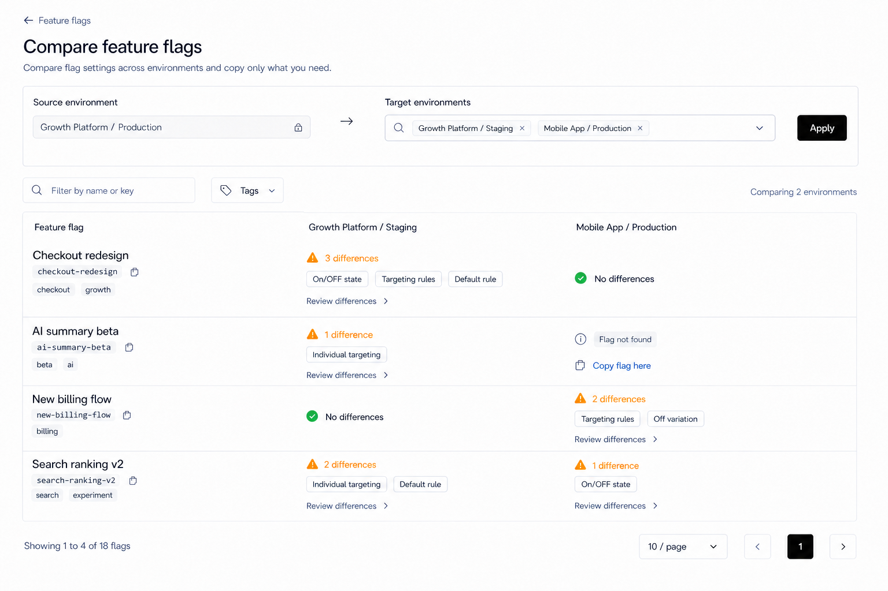
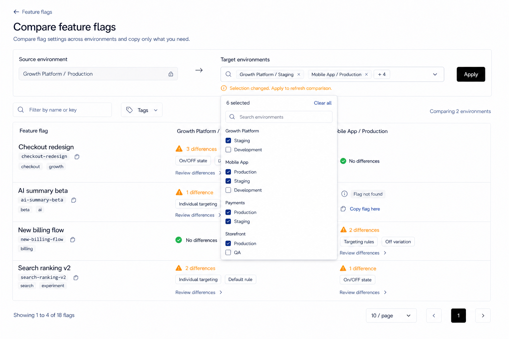
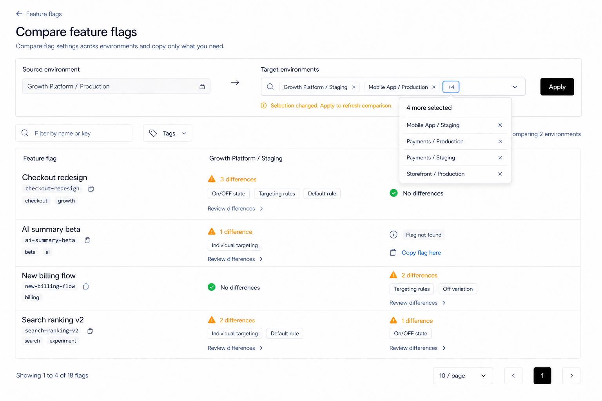
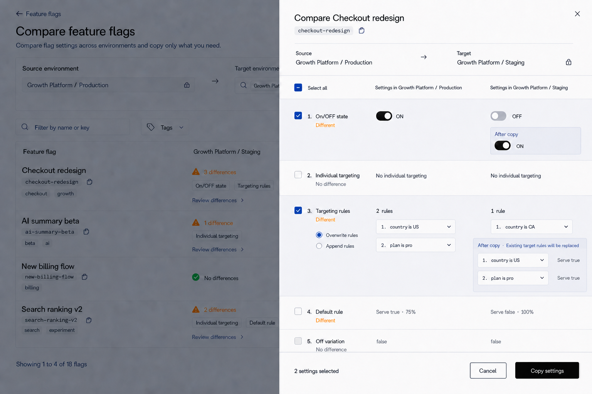
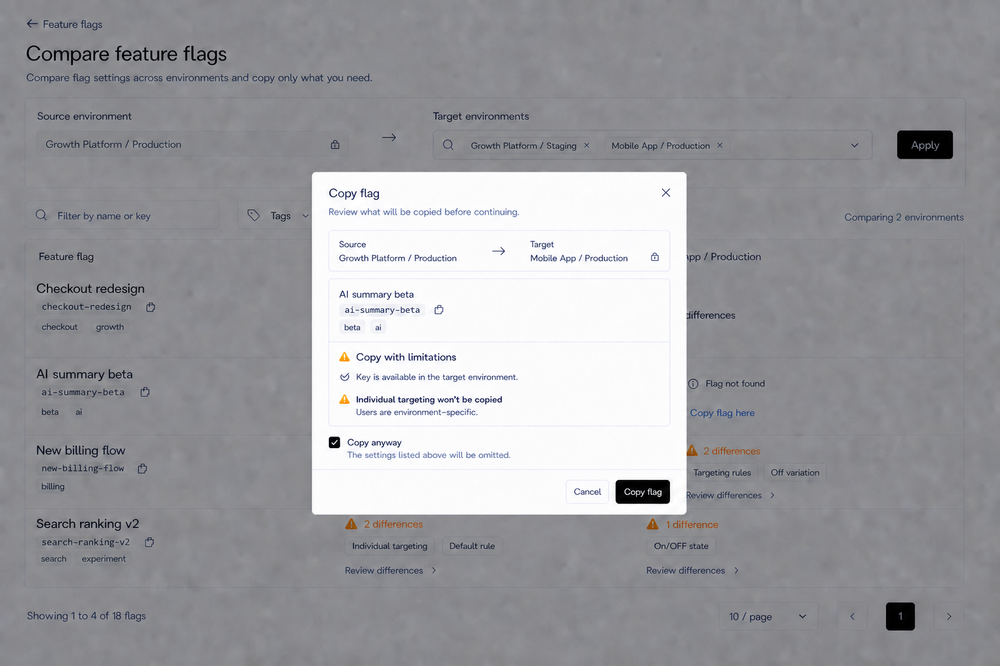
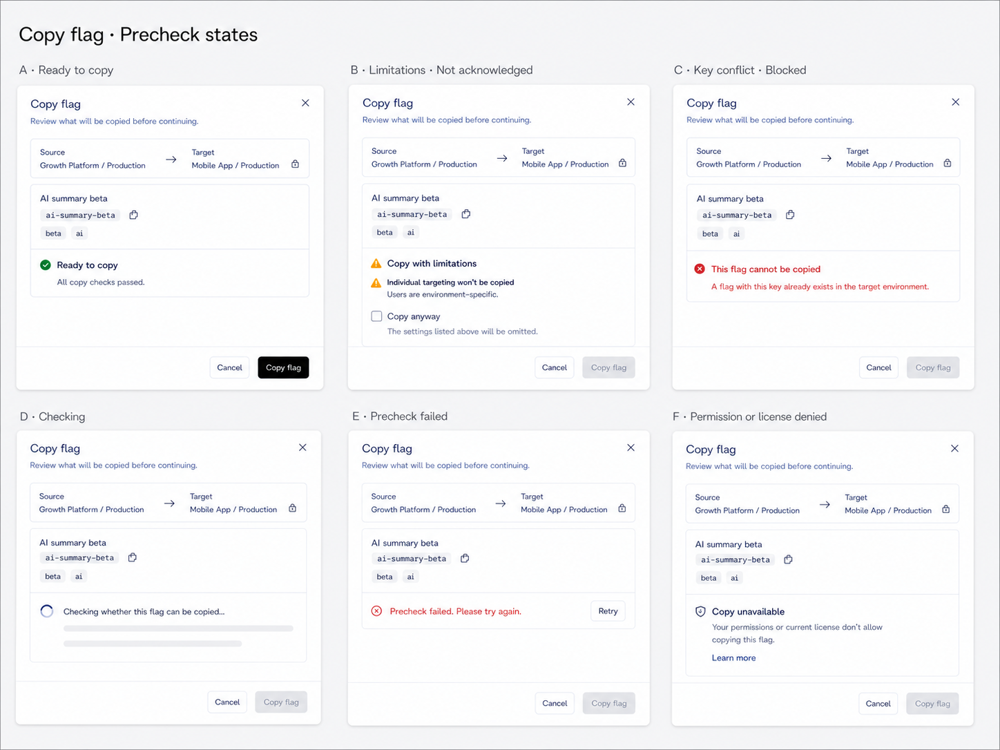
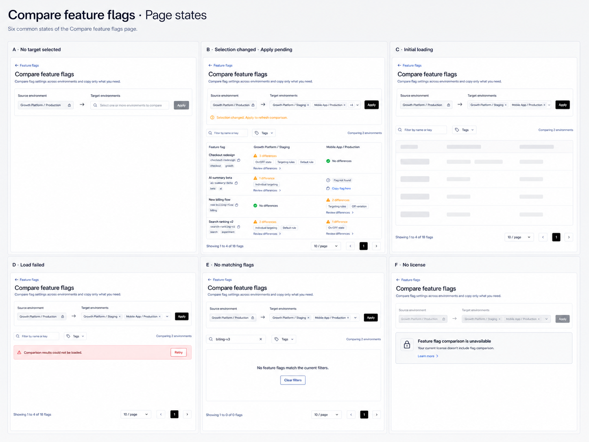
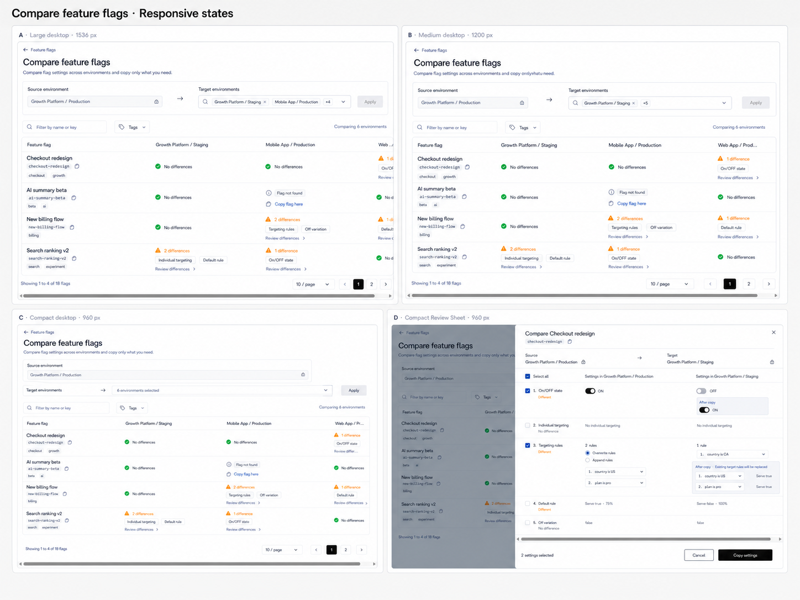

# Feature Flags Compare Page Design

## 1. Scope

This document defines the React redesign of the Feature Flags Compare workflow in `front-end-v2`.

The scope includes:

- the `/feature-flags/compare` main page;
- source and target environment selection;
- search, tag filtering, pagination, and the comparison overview matrix;
- the detailed comparison sheet opened from an explicit `Review differences` action or Feature Flags index row;
- copying an entire missing flag to a target environment;
- selecting and copying individual flag settings from source to target;
- license, permission, loading, empty, error, and unapplied-selection states.

The following are out of scope:

- Feature Flag detail pages and their tabs;
- the sidebar and context bar;
- changes to global environment switching;
- implementation, routes, tests, dependencies, API contracts, or configuration.

The Angular implementation is the functional source of truth. The approved React Feature Flags index and the implemented React Segments/Audit Logs tables are the visual references. Do not copy Angular/ng-zorro styling.

## 2. Visual Reference

The image shows the applied comparison-results state with two target environments. Empty, pending, gated, loading, error, missing-flag, and detailed-sheet states are specified below.

## 3. Product Intent

Compare is an environment-safety workflow. It should help a release manager answer:

1. Which flags differ between the current environment and each selected target?
2. Which settings differ for a specific flag?
3. Is the flag missing entirely from a target environment?
4. Which differences are safe and intended to copy?

The page must expose differences directly without turning into a dashboard or a grid of cards. Environment context, difference type, and copy direction remain visible before any mutation.

## 4. Page Frame And Header

Use the same main-content frame as the Feature Flags index:

- background: `bg-background`;
- large desktop padding: 32px horizontal and 24px vertical;
- flat surfaces with neutral borders and no ambient shadows;
- Inter Variable and the existing compact type scale.

Header content:

- back link: `Feature flags`, with ArrowLeft icon;
- title: `Compare feature flags`;
- subtitle: `Compare flag settings across environments and copy only what you need.`

The back link returns to the Feature Flags index while preserving its URL filters when navigation state is available. Do not reproduce the global organization/project/environment context inside the page header.

## 5. Comparison Scope

Render one flat bordered scope panel below the header. It is a compact configuration surface, not a set of environment cards.

### Source environment

- Label: `Source environment`.
- Read-only neutral field with Environment/Lock icon.
- Value: current project and environment path, for example `Growth Platform / Production`.
- The source always follows the current context-bar environment.
- It cannot appear in target-environment options.

### Target environments

- Label: `Target environments`.
- Searchable multi-select spanning the flexible center area.
- When nothing is selected, use `Select one or more environments to compare` as the control placeholder.
- Options are grouped by project and show `Project / Environment` paths.
- The closed control has a fixed single-row height; selecting many environments must not make the toolbar grow vertically.
- Large screens:
  - 1–2 selected: show every selected environment as a removable compact chip.
  - 3 or more selected: show the first two chips followed by a `+N` summary chip.
  - Selecting `+N` opens a popover listing the remaining selected environments, each with an individual remove action.
- Medium screens: show the first selected environment chip followed by `+N`.
- Compact screens: replace individual chips with the summary `N environments selected`.
- Removing an environment from the closed control or summary popover changes only the draft selection; it does not refresh the comparison automatically.
- Loading, no-result, and retryable load-error states remain inside the picker.
- Do not impose a new target-count limit; many targets are handled through horizontal matrix scrolling.
- All Select options follow `SelectContent > SelectGroup > SelectItem`.

#### Expanded picker

- The picker header shows `N selected` and a `Clear all` action.
- Keep environments grouped under their projects; selected options remain in their original project group instead of being moved into a separate section.
- A selected environment keeps a visible checkmark and can be deselected directly.
- Search filters environment and project names without losing the current draft selection.
- `Clear all` clears only the draft selection.
- Closing the picker preserves draft changes but does not apply them. When the draft differs from the applied selection, continue to show `Selection changed. Apply to refresh comparison.`

#### Selected-overflow popover

- Selecting the trigger's `+N` summary chip opens a compact popover anchored to that chip; it does not open a second full environment picker.
- Header: `<count> more selected`.
- List every selected environment hidden by the collapsed trigger using its full `Project / Environment` path.
- Each row has an accessible Remove icon action. Removal updates only the draft selection and immediately updates `N selected`, `+N`, and the pending-change message.
- Keep the same order as the project-grouped picker; do not reorder by removal time or recent selection.
- The popover has a bounded height and scrolls internally when many hidden selections exist.
- Escape or outside click closes the popover without applying changes.
- When no hidden selections remain, close the popover and return the trigger to its normal one- or two-chip representation.
- The `+N` chip itself is a button with an accessible name such as `Show 4 more selected environments`; it is not a passive count badge.

### Apply behavior

- Primary action: `Apply`.
- Disabled until at least one target is selected.
- Selecting targets updates only the draft selection; it does not immediately replace the applied matrix.
- Apply commits the selected targets, resets the result page to 1, and loads a new overview.
- During Apply, retain the current matrix when possible, disable Apply, and show progress in the button.
- If draft selection changes after results exist, show a compact amber status beside/below the picker: `Selection changed. Apply to refresh comparison.`
- Existing results remain visible until the new selection is applied successfully.
- If the request fails, preserve the prior applied results and provide Retry.

On medium desktop widths, source, arrow, target picker, and Apply may wrap into two rows. The closed target picker shows the first selected environment plus `+N`. On compact desktop widths, stack source above target selection while preserving the source-to-target direction in text and iconography, and summarize the picker value as `N environments selected`.

## 6. Result Toolbar

Once at least one target environment is applied, show a compact toolbar between the scope panel and matrix:

- search input, preferred width 300px;
- placeholder: `Filter by name or key`;
- Tags searchable multi-select filter;
- right-aligned summary: `Comparing <count> environments`.

Search is debounced and server-side. Search or tag changes reset the page index to 1 and reload the overview using the currently applied target environments. Draft, unapplied targets never affect result filtering.

## 7. Comparison Matrix

Use one `overflow-x-auto rounded-md border bg-background` table surface with the same header typography, horizontal cell padding, row separators, and flat treatment as the React Feature Flags/Segments tables.

Strict styling rules:

- one outer border;
- horizontal separator below the header and between rows;
- no vertical spreadsheet grid lines;
- no nested cards inside cells;
- no column-wide decorative background colors;
- differences use restrained semantic icons and text, not color alone.

### Column model

- First column: `Feature flag`, recommended width 260-300px.
- One column per applied target environment, recommended minimum width 300px.
- The first Flag column remains stable/sticky during horizontal matrix scrolling when practical.
- Target headers show full `Project / Environment` names and truncate only with a tooltip.
- Many targets expand the table horizontally rather than compressing cells below readable widths.

### Feature Flag cell

Show:

- semibold flag name;
- copyable monospace key pill;
- up to two tags plus `+N` overflow;
- do not show the flag description in the comparison matrix.

The first column identifies the source-environment flag without repeating descriptive content and does not navigate to details from this workflow.

### Difference categories

The overview preserves the five Angular comparison categories:

1. On/OFF state
2. Individual targeting
3. Targeting rules
4. Default rule
5. Off variation

### Existing flag with differences

- Leading restrained amber Diff/Triangle icon.
- Text: `<count> difference` or `<count> differences`.
- Show only differing categories as compact outline chips.
- Visible affordance: `Review differences` plus ChevronRight.
- `Review differences` is the only navigation affordance in the cell and opens the detailed comparison sheet with flag and target environment locked.
- Do not place an additional trailing chevron at the right edge of the environment cell.
- The complete cell is not clickable; hover and focus treatment belongs only to `Review differences`.

### Existing flag with no differences

- CheckCircle icon plus `No differences`.
- Green is restricted to the small icon; text remains readable without color.
- The state is informational and not clickable.
- Do not show `Review differences` or a trailing chevron when no differences exist.

### Flag missing from target

- Info icon and neutral badge: `Flag not found`.
- Below the missing-state badge, show a compact inline action with a leading Copy icon and the label `Copy flag here`.
- Use link-style action treatment rather than an outlined rectangular button: primary/foreground action color, medium text weight, underline on hover, and the shared focus ring.
- `Copy flag here` opens the existing Copy to environment dialog with this flag and target environment preselected.
- The matrix cell itself does not open an empty comparison sheet.
- Do not show a trailing chevron; `Copy flag here` is the only action in this state.

### Interaction and loading

- A `Review differences` action loading its sheet shows progress without blocking other cells.
- Keyboard focus lands on explicit `Review differences` and `Copy flag here` actions rather than on the complete cell.
- A failed detail request keeps the matrix open and shows a recoverable toast/message.

## 8. Pagination

Match the Feature Flags index and Segments pagination:

- left: `Showing <from> to <to> of <total> flags`;
- right: page-size select with 10, 20, and 30;
- previous/next icon buttons and compact current-page square;
- outside the table border;
- disabled while changing pages;
- hidden when the overview total is zero.

## 9. Detailed Comparison Sheet

Open a wide right-side Sheet, approximately `min(1000px, calc(100vw - 48px))`, titled `Compare <flag name>`. The sheet belongs to the Compare workflow; it is not a Feature Flag detail page.

The reference image shows `Checkout redesign` opened from the `Growth Platform / Staging` matrix cell. `On/OFF state` and `Targeting rules` are selected, `Default rule` remains an unselected difference, and unchanged rows remain visible but unavailable for copying. The Targeting Rules preview shows the concrete overwrite result, including rule order, conditions, served values, and the replacement warning.

### Sheet frame

- Full-height right-side Sheet with a subtle backdrop over the unchanged Compare page.
- Recommended width: 920-1000px on large desktop; `calc(100vw - 32px)` on compact desktop.
- Header and footer remain fixed; only the comparison body scrolls.
- Use one flat comparison surface with horizontal row separators. Do not wrap each setting or environment value in cards.

### Sheet header

- Flag name and copyable key.
- Direction strip: source environment, ArrowRight, target environment.
- When opened from the overview matrix, target environment is locked.
- When opened from a Feature Flags index row, target environment is searchable/selectable and excludes the current source environment.
- Close remains available unless a copy mutation is pending; Escape closes when safe.

### Settings comparison table

Use three columns:

1. Setting and selection control
2. `Settings in <source environment>`
3. `Settings in <target environment>`

Rows appear in this order:

1. On/OFF state
2. Individual targeting
3. Targeting rules
4. Default rule
5. Off variation

Rules:

- Define an eligible row as `has difference && copyable`.
- Every eligible row must be independently selectable through its own checkbox. Selecting or clearing one row updates its preview, selected count, and header checkbox state immediately.
- Header checkbox selects or clears only eligible rows and supports indeterminate state.
- `checked` means every eligible row is selected; `indeterminate` means at least one but not every eligible row is selected; disable Select All when no eligible rows exist.
- Select All must never select a disabled row, including incompatible Targeting Rules.
- Rows without differences remain readable but disabled for copying.
- Targeting Rules that fail compatibility checks remain readable but disabled even when they have differences.
- Selected rows use a subtle neutral/primary tint, not colored side-stripe panels.
- Source and target values use the same content renderer and typography so comparison is structural.
- Long targeting/user/rule content is collapsible within its row; the environment labels remain visible.
- Use concise status text such as `Different` or `No difference` beside the setting name; semantic color supplements the checkbox state but never replaces text.
- The complete row is not a checkbox target. Selection is controlled by its checkbox so users can still select text, expand content, and operate mode controls safely.

#### Angular selection defect must not be migrated

- The current Angular drawer can exhibit a defect where `Select All` changes `row.selected` but an otherwise eligible individual checkbox cannot be toggled.
- This is not intended product behavior and must not be treated as a functional requirement.
- Angular also calculates Select All across all rows and filters bulk selection only by `hasDiff`; that can produce an incorrect checked state or select an incompatible Targeting Rules row.
- The React implementation must derive both individual and header selection from the eligible-row definition above and use one consistent state path for both interactions.

### Append and overwrite modes

For Individual targeting and Targeting rules, selecting the row reveals:

- `Overwrite existing users/rules`;
- `Append to existing users/rules`.

Default mode remains `overwrite`, matching Angular. Mode selection is local to the row.

### Applied-value preview

When a differing row is selected, show a compact `After copy` preview in the target column below the current target value. The preview must be visually subordinate to the current values but explicit enough to prevent destructive misunderstanding.

- Separate the preview from the current target value with spacing and a small ArrowDown/Check icon, not another bordered card.
- Preview content uses a subtle tinted background only within the target column.
- Append/overwrite changes update the preview immediately without mutating server state.

#### Targeting Rules after-copy preview

- Match Angular behavior by rendering the computed post-copy flag through the same Targeting Rules renderer used for the current Source and Target values.
- A count such as `2 rules` may appear as a summary, but it must never replace the concrete rule preview.
- For every resulting rule, preserve and expose:
  - rule order;
  - all conditions, operators, and values;
  - referenced Segment names/identities when applicable;
  - served Variation or percentage distribution;
  - any mapped/new target Variation required by the copied rule.
- `Overwrite rules` preview:
  - show the complete Source rule set as it will exist in the Target after target-variation mapping;
  - omit all current Target-only rules because they will be removed;
  - label the preview `After copy · Existing target rules will be replaced`.
- `Append rules` preview:
  - show current Target rules first;
  - append only Source rules identified by the Angular diff result as different;
  - label the preview `After copy · Existing target rules will be kept`.
- Switching between overwrite and append recomputes the entire preview immediately, including rule order and count.
- When the result contains many or complex rules, individual rules may be collapsed by default, but each rule must remain expandable. Do not reduce the preview to count-only text.
- The preview is read-only and does not permit editing conditions, ordering, or variations from the Compare Sheet.

### Non-copyable targeting rules

If rules reference environment-specific segments or incompatible shared segments:

- disable the Targeting rules checkbox;
- show the full compatibility warning inline across the value columns;
- do not offer append/overwrite modes;
- allow other settings to remain selectable.

### Sticky footer

- Left: `<count> settings selected` or `No settings selected`.
- Right: outline Cancel and primary `Copy settings`.
- Copy settings is disabled when count is zero or permission/license checks fail.
- During mutation, keep the sheet open, disable conflicting actions, and show `Copying...`.
- Success closes the sheet, shows a success toast, and refreshes the overview matrix.
- Failure preserves selections and modes so the user can retry.

## 10. Copy Missing Flag

Reuse the Feature Flags Copy to environment dialog and its existing precheck/copy workflow. The Compare entry configures the shared dialog for one locked flag and one locked target; it does not create a second copy implementation.

The state board documents six states of the same Dialog, not six variants. Locked context, flag identity, header, and footer geometry remain stable while only the precheck result and action availability change.

### Dialog structure

- Centered Dialog, recommended width 620-680px and maximum height 85vh.
- Header:
  - title: `Copy flag`;
  - description: `Review what will be copied before continuing.`;
  - standard close button.
- Scrollable body with compact sections; sticky footer remains visible.

### Locked copy context

- Show a single direction row near the top:
  - `Source` — current `Project / Environment`;
  - ArrowRight;
  - `Target` — the target environment represented by the clicked matrix cell.
- Both values are read-only. Add a Lock icon to the target value; do not render an environment Select.
- Show the selected flag identity immediately below: semibold name, copyable monospace key, and tags when available.
- Do not render a flag picker, checkbox list, or selected-count summary because this entry always copies exactly one flag.

### Precheck result

- Run the existing copy-to-environment precheck immediately when the dialog opens.
- While checking, retain the locked context and show `Checking whether this flag can be copied…` with a compact spinner/skeleton in the result area.
- Present one explicit result heading:
  - safe: CheckCircle + `Ready to copy`;
  - warning: AlertTriangle + `Copy with limitations`;
  - blocked: CircleX + `This flag cannot be copied`.
- List only relevant checks rather than showing a permanent generic restrictions banner:
  - key availability;
  - Individual Targeting, which cannot be copied because users are environment-specific;
  - Targeting Rules compatibility with environment-specific or incompatible shared segments;
  - new property/compatibility information returned by the existing precheck.
- Each check uses icon, concise outcome text, and optional supporting explanation; color is never the only status indicator.

State-specific behavior:

- `Ready to copy`:
  - show `All copy checks passed.`;
  - omit `Copy anyway`;
  - enable `Copy flag`.
- `Copy with limitations` before acknowledgement:
  - show only settings that will be omitted;
  - keep `Copy anyway` unchecked by default;
  - keep `Copy flag` disabled.
- `This flag cannot be copied`:
  - use for key conflict or another non-bypassable precheck result;
  - do not show `Copy anyway`;
  - keep `Copy flag` disabled.
- `Checking whether this flag can be copied…`:
  - retain locked context and flag identity;
  - use a compact spinner and result-shaped skeletons;
  - keep Cancel enabled and `Copy flag` disabled.
- Precheck failure:
  - show `Precheck failed. Please try again.` and a visible `Retry` action in the result area;
  - preserve locked context;
  - keep `Copy flag` disabled.
- Permission or license denial:
  - use the same compact unavailable treatment and keep the primary action visible but disabled;
  - runtime copy must name the applicable reason (`permission` or `license`) rather than showing an ambiguous combined explanation;
  - offer `Learn more` only when a relevant plan/license destination exists.

#### Mapping from Angular Restrictions

- Angular's permanent `Restrictions` alert is represented by contextual precheck outcomes in this Dialog, not by a second standalone information banner.
- `Individual Targeting: Cannot be copied as they are environment specific.` maps to the warning `Individual targeting won’t be copied` with supporting text `Users are environment-specific.`
- `Targeting Rules: Cannot be copied if any of them has references to environment-specific segments or uses shared segments incompatible with the target environment.` appears only when the existing `targetRuleCheck` fails. Use `Targeting rules won’t be copied` and retain the compatibility explanation.
- If both checks pass or are irrelevant, do not show their restriction copy. The user sees only the checks that affect this flag and target.
- These presentation changes do not alter Angular's underlying copy eligibility or `Copy Anyway` semantics.

### Warning acknowledgement

- When one or more copyable settings will be omitted, show a neutral/amber warning surface directly above the footer.
- Require an unchecked acknowledgement with the label `Copy anyway` and supporting text `The settings listed above will be omitted.`
- Keep the primary `Copy flag` action disabled until `Copy anyway` is checked. This preserves Angular's existing selection semantics while keeping the final mutation label explicit.
- The design image shows the checked state so the enabled `Copy flag` action is visible; the default state remains unchecked.
- Do not require acknowledgement for a fully safe result.

### Blocked and race conditions

- If the flag key already exists in the target, show `A flag with this key already exists in the target environment.` and disable the primary action.
- This blocked state can occur if the matrix is stale, even though the entry began from `Flag not found`.
- Precheck failure shows a compact retryable error without closing the Dialog.
- Permission or license denial keeps the action visible but disabled with the reason.

### Footer and completion

- Do not repeat source or target environment in the footer; that context is already visible near the top of the Dialog.
- Right-align outline `Cancel` and primary `Copy flag`.
- During mutation, keep the Dialog open, disable dismissal/conflicting actions, and show `Copying…`.
- Success closes the Dialog, shows a success toast, and refreshes the overview so `Flag not found` becomes a comparison result.
- Failure preserves the precheck and acknowledgement state so the user can retry.

## 11. Page States

The state board uses one stable page frame. Scope and filters remain in place whenever they are still usable, so loading or failure does not erase the user's comparison context.

### No license

- Preserve the `FlagComparison` license gate.
- Keep the source/target scope visible but disabled as appropriate so users understand what is gated.
- Show one compact gated notice explaining that comparison and cross-environment setting copy require the feature.
- Avoid a large decorative lock illustration.
- Use `Feature flag comparison is unavailable` with the specific current-license reason and an optional `Learn more` action.

### No targets applied

- Keep the scope controls active.
- Do not show a separate instructional or empty-state row. The target selector placeholder already communicates the required next action.
- Do not render an empty matrix header.

### Loading

- Scope and filters remain visible.
- Initial overview load uses table-shaped skeleton rows.
- Refetch preserves existing data with subtle progress where possible.
- Skeletons preserve the matrix header and approximate column geometry to prevent layout shift.

### Load error

- Show a compact destructive-tinted inline message above the matrix.
- Copy: `Comparison results could not be loaded.`
- Include Retry and preserve applied environments and filters.
- Do not replace the complete page with an error illustration or discard pagination/list context.

### No matching flags

- Copy: `No feature flags match the current filters.`
- Provide `Clear filters`.
- Keep applied environments unchanged.
- Render the message inside the normal result surface; do not remove the table's outer geometry.

### Environment and tag load failures

- Fail within the owning picker/filter.
- Provide Retry without removing already loaded comparison results.

## 12. Permission And License Behavior

- Comparison overview and detailed comparison require the `FlagComparison` license feature.
- Copy flag and Copy settings must also honor the relevant flag RN permissions and license capabilities.
- Permission data loading is distinct from denial.
- Unsupported actions remain visible but disabled with an explanatory tooltip/title.
- A denied mutation never updates the matrix optimistically.
- The source and target environment direction is repeated immediately before every copy confirmation.

## 13. Responsive Behavior

This remains a professional desktop workflow.

- Large desktop: scope panel uses one row; the target trigger shows two selected chips plus `+N`; matrix shows two or three environment columns comfortably.
- Medium desktop: keep scope controls on one row while they fit; otherwise wrap them into two compact rows. The target trigger shows the first selected chip plus `+N`; result toolbar remains compact; matrix scrolls horizontally.
- Compact desktop: source and target selectors stack; filters wrap; matrix keeps desktop row structure and uses a visible horizontal scrollbar.
- Compact target trigger uses `N environments selected` rather than individual chips.
- Do not convert environment columns into cards or hide difference categories.
- The detailed sheet becomes nearly full-width on compact desktop but retains its three-column comparison with internal horizontal scrolling where necessary.
- Keep 24-32px of backdrop visible beside the compact Sheet so its overlay relationship remains understandable.
- The compact Sheet keeps its sticky footer outside the internal horizontal scrolling region.

## 14. Theme And Accessibility

- Light and dark themes preserve identical hierarchy.
- Difference, no-difference, and missing states always include text and icon; color is supplemental.
- Environment names, flag keys, tags, and difference labels expose full values through tooltips when truncated.
- All icon-only buttons have accessible names and visible tooltips.
- Focus rings use shared shadcn/Base UI behavior.
- Apply, Copy flag here, and Copy settings expose disabled and loading reasons.
- The matrix and detailed table maintain predictable keyboard order.

## 15. Implementation Boundaries

Future React implementation should separate page/query orchestration, environment scope selection, result filters, comparison matrix, pagination, detailed comparison sheet, setting renderers, copy-mode controls, applied preview, and copy dialog integration.

This design task does not authorize implementation or any non-design-file change.

## 16. Acceptance Checklist

- [ ] Sidebar and context bar remain unchanged.
- [ ] Source environment is visible, read-only, and excluded from targets.
- [ ] Multiple targets are searchable and applied explicitly.
- [ ] With no target selected, `Select one or more environments to compare` appears inside the selector rather than occupying a separate row.
- [ ] A large target selection never increases the toolbar height: large shows two chips plus `+N`, medium shows one plus `+N`, and compact shows a count summary.
- [ ] `+N` exposes hidden selections with individual removal; the expanded picker also provides `N selected` and `Clear all`.
- [ ] Closing or editing the target picker changes only the draft selection and never implicitly reapplies the comparison.
- [ ] Draft target changes do not silently replace applied results.
- [ ] Search, Tags, pagination, and organization flag sorting behavior are preserved.
- [ ] Matrix supports all applied target environments through horizontal scrolling.
- [ ] Table uses one outer border and horizontal separators without vertical grid lines.
- [ ] All five Angular difference categories are preserved.
- [ ] Difference, no-difference, and missing-flag states are explicit.
- [ ] Missing flags reuse the existing Copy to environment precheck workflow.
- [ ] The Feature flag column shows name, key, and tags without description text.
- [ ] Only `Review differences` opens the detailed comparison sheet from a matrix cell; no-difference cells are informational and missing-flag cells expose only the icon-led `Copy flag here` inline action.
- [ ] Environment cells do not show an additional trailing chevron.
- [ ] `Copy flag here` opens a focused Dialog with locked source, target, and flag context; it does not repeat environment or flag selection.
- [ ] Safe, warning, acknowledgement, blocked, retry, permission, copying, success, and failure states preserve the existing copy precheck semantics.
- [ ] Ready, unchecked Copy anyway, key conflict, checking, retryable failure, and permission/license states keep one stable Copy flag Dialog structure.
- [ ] Permission and license denial identify the actual reason and never expose an enabled mutation action.
- [ ] Detailed sheet preserves Select All, per-setting selection, append/overwrite modes, applied previews, and compatibility warnings.
- [ ] Every eligible differing setting can be selected independently; individual selection and Select All update the same state and never diverge.
- [ ] Select All checked/indeterminate state is calculated only from eligible rows and never selects no-difference or incompatible rows.
- [ ] The observed Angular individual-checkbox/Select All defect is explicitly not migrated.
- [ ] Targeting Rules After copy uses the complete rule renderer; overwrite shows the full replacement set and append shows retained Target rules plus differing Source rules.
- [ ] Rule count is never the only Targeting Rules preview, and changing copy mode recomputes the concrete preview immediately.
- [ ] Copy settings refreshes the overview after success and preserves selections after failure.
- [ ] License, permission, empty, loading, error, and filtered-empty states are defined.
- [ ] No-target, Apply-pending, initial-loading, load-error, filtered-empty, and no-license page states match the visual state board.
- [ ] Large, medium, and compact target summaries use two chips plus `+N`, one chip plus `+N`, and `N environments selected`, respectively.
- [ ] Medium/compact matrices expose horizontal scrolling, and the compact Review Sheet remains three-column with its own visible horizontal scrollbar and fixed footer.
- [ ] Feature Flag detail pages are not designed or modified.
