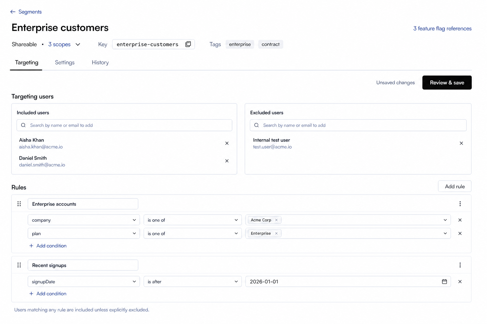

# Segments Details Page Design

## Scope

This document defines the React redesign of the Segment details workflow in `front-end-v2`.

Included:

- the Segment summary header;
- the `Targeting`, `Settings`, and `History` tabs;
- included and excluded user selection;
- targeting-rule creation, editing, removal, and ordering;
- change review and required change comments;
- Segment name, description, tags, key, type, and scope disclosure;
- Feature Flag references;
- permission, loading, empty, dirty, saving, and error states.

Excluded:

- the Segments index workflow, which remains defined by `segments-page-design.md`;
- changes to the authenticated sidebar;
- changes to the organization/project/environment context bar;
- mobile-first layout work.

The Angular page is the functional reference only. The React page must use the compact, neutral shadcn/Base UI and Tailwind patterns established in `front-end-v2`; it must not reproduce the Angular/ng-zorro visual structure.

## Design Asset

The first image defines the accepted default `Targeting` hierarchy and desktop density. The second defines the accepted bounded-list treatment when Included or Excluded contains many users. Sample Segment, user, tag, scope, and rule values are illustrative; implementation must render API data.

## Finalized Design Direction

Use the selected **Focused workbench** direction:

- keep Segment identity and operational context in one compact header;
- use route-backed line tabs for `Targeting`, `Settings`, and `History`;
- place included and excluded users side by side at normal desktop widths;
- give rules the full content width so conditions remain readable;
- keep save state visible near the tab content without turning the page into a dashboard;
- use thin borders and quiet tonal surfaces, not nested cards or ambient shadows;
- keep the page information-dense but preserve 32-36px interactive controls and clear section spacing.

The page starts inside the existing main content area. Do not draw, replace, or restyle the sidebar or context bar.

## Information Architecture

Content order:

1. Back link to `Segments`.
2. Segment summary header.
3. `Targeting`, `Settings`, and `History` tabs.
4. Active-tab content.

The Angular implementation renders editable settings above its tabs. React separates those responsibilities: identity and frequently needed metadata remain visible in the summary header, while editable descriptive fields move into the `Settings` tab. This reduces repeated vertical weight on the main targeting workflow without removing functionality.

Routes should preserve the existing localized route prefix and use explicit detail-tab paths:

- `/segments/:id/targeting`;
- `/segments/:id/settings`;
- `/segments/:id/history`.

Opening a Segment from the index page continues to navigate to `targeting`. An unknown or omitted tab resolves to `targeting` rather than rendering an empty page.

## Segment Summary Header

Use the same compact detail-header rhythm as current React IAM detail pages.

### Back link

Show an Arrow Left icon and `Segments`. It returns to the index route and should preserve any index state already retained by the router/query layer.

### Primary row

- Render the Segment name as the page title.
- Keep the title to one line and truncate only when necessary.
- The Feature Flag reference affordance sits at the far right of the title row and is vertically centered with the title.
- Show the shorter pluralized link `{count} feature flag reference(s)` when references exist, for example `3 feature flag references`.
- Use quiet link color without a permanent underline; show the underline on hover/focus.
- Show `No feature flag references` as muted, non-interactive text when the count is zero.

### Metadata row

Use one compact, single-baseline metadata row beneath the title:

- For a Shareable Segment, combine type and scope count into one semantic group: plain text `Shareable`, a muted middle dot, then the clickable `3 scopes` value with a small Chevron Down. Do not use a `Type` or `Scopes` label, Badge, border, or filled background for this group.
- For a Current-environment Segment, show only the plain text `Current environment`; do not render a scope count or chevron.
- Show a small muted inline `Key` label followed on the same baseline by a compact monospace surface and Copy icon.
- Show a small muted inline `Tags` label followed on the same baseline by quiet neutral filled chips. Show a compact subset followed by `+N` when necessary.
- Separate the semantic groups with approximately 24px of whitespace. Do not add vertical separators or a containing metadata card.

The key copy action copies the complete value and shows `Copied`. Truncated keys and tags must remain recoverable through a tooltip.

The Shareable scope count is a lightweight Popover trigger:

- clicking `3 scopes` or its chevron opens the Popover;
- the chevron points upward while expanded;
- group the complete scope list by project;
- use the same project and environment icons established by onboarding and the Segments scope picker;
- show complete scope names and use a tooltip only when a value still requires truncation;
- keep the Popover read-only; Segment scopes are not edited from the details page;
- use an internally scrolling list when the scope list exceeds the Popover's maximum height.

The header is a summary, not an editing surface. Name, description, and tags are edited under `Settings`.

## Tab Navigation

Use shadcn line tabs on a single bottom border, matching current React detail pages.

- `Targeting` is the default tab.
- `Settings` contains descriptive and classification fields.
- `History` contains Segment audit records.
- Tab selection is represented in the URL so refresh, deep links, and browser navigation behave predictably.
- Switching tabs with unsaved changes must ask the user to discard or remain on the current tab. Do not silently lose a targeting or settings draft.

Do not place counts in the three tab labels. Counts belong near the content they describe.

## Targeting Tab

### Command row

Place a compact command row immediately below the tabs.

- When the draft equals the last loaded Segment, omit `Unsaved changes` and disable `Review & save`.
- When anything changes, show `Unsaved changes` and enable the primary `Review & save` button.
- While saving, disable editing and show the standard pending state on the primary action.
- On success, update the local/server cache, clear the dirty state, and show the shared success toast.
- On failure, retain the complete draft and show a recoverable error message.

The button opens change review; it does not save directly.

### Targeting users

Use one section titled `Targeting users`, followed by two equal-width bordered panels:

- `Included users`;
- `Excluded users`.

Each panel contains:

- a heading with the complete selected-user count rendered as small ordinary muted text, not a Badge;
- a compact `Search or add users` combobox;
- one selected user per row, with display name, secondary key, and Remove action; do not show an avatar or user icon, and do not place two users on the same row;
- an inline empty state when no users are selected.

Keep each panel at a stable bounded height when many users are selected:

- keep the panel heading and search field fixed;
- show approximately four to five complete compact rows before scrolling;
- scroll only the selected-user list inside the panel;
- show a subtle native/customized scrollbar when content overflows;
- let Included and Excluded lists scroll independently so one collection cannot increase the other panel's height;
- use list virtualization for very large collections without changing the visible interaction model;
- do not collapse selected users into a `+N more` summary or paginate the panel.

The combobox query searches both selected and available users. Matching selected users appear first with a visible `Selected` state and remain removable; available results follow and remain addable. This lets users locate an existing member without adding a second filter control.

Results must support the Angular search behavior and user creation capability. A user already selected in either collection must not be duplicated in the same collection. If the same user moves between included and excluded, resolve the conflict explicitly rather than allowing contradictory targeting.

For Shareable Segments:

- search and selection use global users only;
- creation of environment-local users is unavailable;
- selected global users remain visible even when they cannot be found in a later result page;
- the UI explains the global-user restriction beside the chooser, not in a large banner.

At narrower desktop widths, stack the two panels. Do not optimize a separate phone layout.

### Rules

Rules use the full content width beneath Targeting users.

The section header contains:

- title `Rules`;
- an outline `Add rule` button aligned right;
- a compact permission explanation when rule editing is unavailable.

Each rule is one flat bordered block with:

- drag handle;
- editable rule name;
- overflow menu containing `Remove rule`;
- ordered condition rows;
- `Add condition` as a lightweight action.

`Add rule` appends the new rule to the end of the ordered rule list, preserving the Angular behavior and the position of existing rules. After insertion, scroll the new rule into view and move focus to its name field so the result of the action is immediately visible. Do not prepend a new rule or shift the existing rules downward.

Each condition retains the Angular model and supported behavior:

- user property selection, including adding a property when supported;
- operator selection appropriate to the property/value type;
- one or more values where the operator requires them;
- condition removal;
- validation before review or save.

Use inline 32-36px controls. Attribute, operator, and value receive progressively more width. Do not use vertical separators between fields. Keep `AND` visible between multiple conditions so the match logic is understandable without extra prose.

Rules are reorderable by their handle only. Reordering marks the draft dirty. Keyboard and pointer interactions use the chosen drag-and-drop primitive's native focus and announcement behavior.

When there are no rules, show a compact inline empty state with `Add rule`; do not add illustration art or a large empty card.

### Match explanation

At the bottom of the editor, show muted copy:

`Users matching any rule are included unless explicitly excluded.`

This copy clarifies precedence without adding another configuration control.

## Review And Save Dialog

`Review & save` opens a standard Dialog that preserves the Angular change-review workflow.

Show:

- title `Review targeting changes`;
- a concise summary of added/removed users, added/removed/reordered rules, and edited conditions;
- an expandable structured before/after view for detailed inspection;
- a change-comment field when comments are enabled;
- required validation when the environment requires a change comment;
- `Cancel` and primary `Save changes` actions.

Closing the Dialog returns to the unchanged draft. Saving sends included keys, excluded keys, ordered rules, and the optional/required comment through the existing targeting endpoint.

## Feature Flag References Dialog

Clicking the header reference link opens the same reference-dialog pattern used by the Segments index archive flow.

- Title: `Feature flag references`.
- Description names the current Segment in bold.
- Render one compact bordered list; rows should not become tall cards.
- Each row shows Feature Flag name and key.
- A reference in the current environment is clickable and opens that flag's targeting page.
- A cross-environment reference remains visible but is disabled and labeled `Not in this environment`.
- If references become empty between load and open, show the inline empty state.

## Settings Tab

Settings uses one left-aligned form column, approximately 640-720px wide, with section separators rather than independent cards.

### General

Fields:

- `Name`: required, trimmed, and editable only with `UpdateSegmentName`;
- `Description`: optional multiline text, editable only with `UpdateSegmentDescription`;
- `Key`: read-only monospace value with Copy;
- `Type`: read-only plain text;
- `Scopes`: read-only project/environment list for Shareable Segments only.

Name and description use a normal form editing model instead of Angular's tiny inline edit icons. Preserve their separate backend updates and permission checks. Dirty fields expose `Discard` and `Review & save`; review submits only changed operations.

### Tags

Provide a searchable multi-value tag field that:

- loads existing workspace/environment tag suggestions;
- excludes already-selected values from results;
- allows creation when no matching tag exists;
- supports removing pending tags;
- keeps changes local until review and save;
- respects `UpdateSegmentTags` independently of name and description permissions.

Selected tags use the shared neutral Badge/combobox treatment. Do not use tag color as operational status.

### Settings save behavior

When multiple settings fields are edited, the review Dialog lists each pending operation. Because the backend preserves separate name, description, and tag endpoints, implementation may submit them sequentially or as coordinated mutations, but must:

- retain unsaved values if any operation fails;
- identify the failed field;
- refresh the Segment summary only from confirmed saved data;
- include the required change comment with every operation that requires it.

## History Tab

Reuse the common React Audit Logs list rather than building a Segment-specific table.

- Filter by Segment reference type and current Segment ID.
- For a Shareable Segment, enable cross-environment audit records as Angular does.
- Keep the standard audit-log search/filter, actor, operation, time, and detail behavior.
- Keep row density and horizontal separators consistent with other React tables; do not add vertical dividers.
- Loading, empty, pagination, and error behavior come from the shared Audit Logs implementation.

The Segment header remains visible while browsing History so the resource being audited is unambiguous.

## Permissions And Read-Only Behavior

Evaluate permissions independently for each capability:

| Area | Permission | Denied behavior |
| --- | --- | --- |
| Included/excluded users | `UpdateSegmentTargetingUsers` | Keep data visible; disable chooser and removal controls; show the shared permission explanation. |
| Rules | `UpdateSegmentRules` | Keep rules readable; disable add, edit, delete, and drag controls. |
| Name | `UpdateSegmentName` | Render the current value in a disabled/read-only field. |
| Description | `UpdateSegmentDescription` | Render the current value in a disabled/read-only field. |
| Tags | `UpdateSegmentTags` | Keep tags visible; disable add and remove. |

Do not hide saved data because the user cannot edit it. Do not show a page-wide permission banner when only one subsection is restricted. The review/save action considers only operations the user is allowed to perform.

If a capability is unavailable because of licensing, use the shared license explanation near the affected control. Persisted Shareable Segment data remains visible even if the current license no longer grants new Shareable edits.

## States

### Initial loading

Show skeletons matching the final geometry:

- back link and header metadata;
- tab line;
- two user panels;
- two rule blocks or the active tab's equivalent content.

Avoid a full-page spinner that removes context.

### Load failure

Keep the back link visible. Replace the header/content with one compact destructive-toned error row containing `Segment could not be loaded` and `Retry`.

### Missing Segment

Use the shared not-found treatment and a return action to Segments. Do not render an empty editor.

### Empty targeting

Show compact, actionable empty states inside Included users, Excluded users, and Rules. The page remains structurally stable.

### Dirty navigation

Intercept tab changes, back navigation, and route changes while a draft is dirty. Use a confirmation Dialog with `Keep editing` and destructive/secondary `Discard changes` actions. Browser refresh protection may use the standard browser prompt.

### Validation

Do not show errors before a field is interacted with or the user requests review. Focus the first invalid targeting condition or settings field after failed validation.

## Internationalization And Content

- Add all details-page strings to the centralized Segments feature resources under `front-end-v2/src/lib/i18n/resources` during implementation.
- Register resources through the existing global i18n composition; do not register a bundle from the page component.
- Provide English and Simplified Chinese values together.
- Use `Shareable` in English and `共享` in Chinese.
- Parameterize Segment names, Feature Flag counts, scope counts, user counts, and operation summaries.
- Do not assemble translated sentences from fragments.

## Accessibility And Interaction

- Use semantic headings and route-backed Tabs.
- Keep visible labels for user collections, rule names, fields, and Dialogs.
- Entire user result rows and permitted rule controls receive pointer cursors.
- Icon-only actions require accessible names and tooltips where their meaning is not visible.
- Use the standard shadcn focus ring; keep focus visible on complete clickable rows and drag handles.
- Color is never the only indicator of active, invalid, dirty, disabled, or permission-denied state.
- Maintain WCAG AA contrast in light and dark themes.

## Responsive Desktop Behavior

- Design target: desktop main-content widths from approximately 1024px upward.
- At wide widths, Included and Excluded users are equal columns and rules span both.
- Below the space needed for two usable user panels, stack them without changing their order.
- Metadata and command rows may wrap, but the primary action remains easy to locate.
- Condition rows may wrap their value control below attribute/operator on constrained desktop widths.
- Do not introduce a separate mobile navigation or phone-specific details experience.

## Functional Invariants

The React migration must preserve:

- loading the Segment and its Feature Flag references by ID;
- copying the complete Segment key;
- displaying Current-environment and Shareable Segment metadata and scopes;
- editing name, description, and tags through their existing contracts;
- searching, selecting, creating where allowed, including, and excluding users;
- restricting Shareable Segments to global-user selection;
- adding, renaming, deleting, and reordering rules;
- adding, editing, and removing rule conditions and values;
- reviewing before/after targeting changes;
- optional and required change comments;
- independent permission checks for targeting users, rules, name, description, and tags;
- opening current-environment Feature Flag references while disclosing inaccessible cross-environment references;
- Segment audit logs filtered by reference type and ID;
- cross-environment History for Shareable Segments;
- loading, success, error, empty, validation, and dirty-navigation feedback.

## Acceptance Criteria

- Only the Segment details main content and its supporting Dialogs/popovers are designed; sidebar and context bar remain unchanged.
- `Targeting`, `Settings`, and `History` are distinct route-backed tabs, with `Targeting` as default.
- The compact header exposes Segment identity, type, key, scopes, tags, and Feature Flag references without duplicating the old Angular settings block.
- Included and Excluded users are side by side at normal desktop widths and remain independently operable.
- Rules are full-width, compact, reorderable, and expose every Angular condition operation.
- Unsaved changes are explicit and saving always passes through review/change-comment behavior.
- Settings preserves independent name, description, and tags permissions and backend operations.
- History preserves Segment filtering and Shareable cross-environment behavior.
- Permission or license denial disables mutation without hiding persisted data.
- The design uses current React/shadcn hierarchy, has no ambient card shadows, and does not copy Angular/ng-zorro styling.
- No React or Angular implementation file is changed as part of this design-only task.
