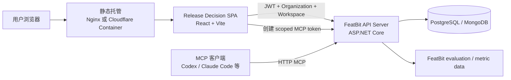
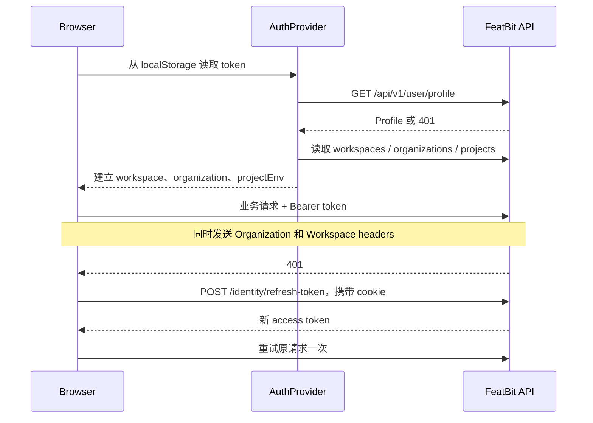

# front-end-rda-tempo 架构说明

> 分析基于 2026-08-27 的当前代码。本文描述实际运行路径，并将历史遗留文件与当前架构分开说明。

## 1. 结论摘要

`front-end-rda-tempo` 的产品应用是一个 **React 19 + Vite 的浏览器端 SPA**，提供 FeatBit Release Decision 的实验管理界面。它不拥有业务数据库，不执行服务端统计分析，也不提供前端自建的业务 API。

应用运行时依赖 FeatBit API Server：认证、工作区上下文、功能开关、实验、指标、互斥层、实验运行、分析以及 MCP 授权全部经 `/api/v1` 请求进入 `modules/back-end`。项目中的 Cloudflare Worker、Dockerfile 和 Nginx 只负责部署及托管构建后的静态资源，不构成业务后端。

因此，对“是不是纯前端”的准确回答是：

- **业务架构上是纯前端 SPA**。
- **仓库内容不只有浏览器代码**，还包含静态托管、Cloudflare Containers 包装和历史 Prisma 资料。
- **它不是独立应用**；缺少 FeatBit API 时只能加载静态界面，无法完成认证和实验操作。

## 2. 系统上下文



主要边界：

| 边界 | 责任 |
| --- | --- |
| 浏览器 SPA | 页面、表单、客户端路由、认证上下文、API 调用、分析结果展示 |
| FeatBit API | 授权、数据持久化、实验业务规则、分析执行、MCP 工具与令牌 |
| FeatBit 数据服务 | 功能开关曝光和指标事件的证据来源 |
| Nginx / Cloudflare | 提供静态资源和 SPA fallback，不处理实验业务 |
| Coding Agent | 通过 FeatBit MCP 读取或更新实验；并不嵌入 SPA 进程 |

## 3. 技术栈与构建产物

项目入口为 [`index.html`](./index.html) 和 [`src/main.tsx`](./src/main.tsx)。`main.tsx` 创建 React root，然后渲染 `App`。

核心技术：

- React 19、TypeScript、Vite 8。
- Tailwind CSS 4、shadcn/ui、Base UI、Lucide。
- `react-markdown` 与 `remark-gfm` 用于分析和说明内容。
- 没有 React Router、TanStack Query、Redux 或 Zustand；路由与远端状态同步均由项目自己实现。

主要命令来自 [`package.json`](./package.json)：

| 命令 | 用途 |
| --- | --- |
| `npm run dev` | 启动 Vite 开发服务器 |
| `npm run build` | TypeScript project build 后生成 Vite `dist` |
| `npm run preview` | 本地预览构建产物 |
| `npm run lint` | ESLint |
| `npm run deploy` | 通过 Wrangler 部署 Cloudflare 配置 |

当前没有 `test` 脚本，也没有纳入项目的单元测试或浏览器测试目录。架构变更主要依靠类型检查、lint、build 和人工验证。

## 4. 浏览器启动与组件根

运行时组合顺序如下：

```text
index.html
└── src/main.tsx
    └── App
        └── RootLayout
            ├── ThemeProvider
            ├── AuthProvider
            ├── RouterProvider
            │   └── Routes
            └── Toaster
```

[`src/app/layout.tsx`](./src/app/layout.tsx) 只是普通 React 组件，不是 Next.js root layout。它负责主题、认证上下文和 toast。

[`src/App.tsx`](./src/App.tsx) 是真正的页面装配点。它直接 import 各个页面组件，根据当前 pathname 选择要渲染的页面。

## 5. 路由架构

项目使用 [`src/lib/router.tsx`](./src/lib/router.tsx) 实现轻量客户端路由：

- 读取 `window.location.pathname`。
- 使用 `history.pushState` 和 `history.replaceState` 导航。
- 监听 `popstate`。
- 用自定义 `release-decision:navigate` 事件通知 React 更新。
- `Link` 只拦截站内、无修饰键的主按钮点击。

实际路由表：

| 路径 | 页面 | 作用 |
| --- | --- | --- |
| `/login` | `LoginPage` | 密码、SSO 或 OAuth 登录入口 |
| `/` | `ExperimentsPage` | 实验列表与筛选 |
| `/new` | `NewExperimentPage` | 创建实验 |
| `/:experimentId` | `ExperimentDetailClient` | 实验步骤、运行、设置和审计日志 |
| `/release-decision-metrics` | `MetricsPage` | 环境级指标注册表 |
| `/release-decision-layers` | `LayersPage` | 环境级互斥层注册表 |

兼容路径 `/experiments`、`/experiments/new`、`/experiments/:id`、`/metrics` 和 `/layers` 会被标准化到当前路径。

基础路径由 `VITE_BASE_PATH` 控制，默认是 `/release-decision/`。指标和互斥层路径被 [`src/lib/app-path.ts`](./src/lib/app-path.ts) 特殊处理为站点根路径；Nginx 和 Vite 开发中间件也为这两个路径提供 SPA fallback。这是有意的兼容行为，但会增加基础路径规则的维护成本。

## 6. 页面和功能模块

### 6.1 实验列表与创建

实验列表在 [`experiments-client.tsx`](<./src/app/(dashboard)/experiments/experiments-client.tsx>) 中维护本地筛选、加载和错误状态。筛选参数同时写入浏览器 URL；数据来自当前选中环境的实验接口。

新实验页面从认证上下文读取当前项目，创建完成后导航到 `/:experimentId`。项目和环境不是自由输入，而是由工作区切换器决定。

### 6.2 实验详情

[`experiment-detail-client.tsx`](<./src/app/(project)/experiments/[id]/experiment-detail-client.tsx>) 是详情数据所有者：

- 首次进入时读取实验详情。
- 环境切换后重新请求。
- 监听 `release-decision:experiment-updated`，接收本地写操作返回的最新实验对象。
- 资源不存在时返回实验列表。

[`experiment-detail-layout.tsx`](./src/components/experiment/experiment-detail-layout.tsx) 提供详情工作台：

- Steps：实验生命周期页面。
- Agent Setup Guide：为外部 coding agent 创建和展示 MCP 配置。
- Settings：实验设置。
- Audit log：服务端活动记录。
- 每 15 秒重新读取实验，以接收 MCP 或其他客户端产生的变更。

### 6.3 实验生命周期

UI 将实验过程表示为四个阶段：

| 持久化 stage | UI 名称 | 主要内容 |
| --- | --- | --- |
| `hypothesis` | Intent & Hypothesis | 目标、意图、变更、假设和约束 |
| `implementing` | Exposure | 绑定功能开关、变体、受众和回滚边界 |
| `measuring` | Measuring | 指标、护栏、运行窗口、流量范围和分析 |
| `learning` | Learning | 决策、结果解释和下一轮假设 |

历史 `intent` stage 在 UI 中被映射到 `hypothesis`。各阶段的指导文案和 agent prompt 位于 [`guided-experiment-steps.ts`](./src/lib/guided-experiment-steps.ts)。

### 6.4 实验运行和分析

运行相关 UI 集中在 `src/components/experiment/`：

- `experiment-run-table.tsx`：运行选择、创建、删除、窗口编辑、分析刷新和结果展示。
- `experiment-run-traffic-config.tsx`：方法、对照/候选变体、互斥层、bucket slice、受众过滤和分析采样。
- `analysis-markdown.tsx`：识别 Bayesian、Bandit 及旧版文本/JSON 结果并渲染。
- `traffic-pool-view.tsx`：展示多个 run 对流量池的占用。

分析不是在浏览器中计算。点击或定时刷新最终调用：

```text
POST /api/v1/envs/{envId}/experiments/{experimentId}/runs/{runId}/analyze
```

浏览器只提交 `forceFresh` 并展示服务端持久化后的 `analysisResult`。

### 6.5 指标与互斥层

Metrics 和 Layers 是环境级注册资源，不属于单个实验：

- Metrics 页面管理指标 key、类型、聚合方式和归档状态，并反查实验使用情况。
- Layers 页面管理 assignment unit 与 bucket slice，并将层和活动实验运行组合展示。

列表读取上限目前固定为 200 条，客户端再完成部分筛选与组合；数据量增长后需要改为真正的服务端分页或按需查询。

## 7. 认证与租户上下文

认证核心是 [`AuthProvider`](./src/lib/featbit-auth/auth-context.tsx) 和 [`apiRequest`](./src/lib/featbit-auth/http.ts)。



浏览器持久化内容：

- JWT：`localStorage.token`，与主 FeatBit UI 共享。
- Profile：`localStorage.auth`。
- workspace、organization、project/environment：按用户 ID 分区的 localStorage key。
- 当前环境还写入 `fb_env_id` cookie。
- 主题、Agent Setup 提示偏好和最近生成的 MCP token 也在 localStorage。

所有业务请求默认附加：

- `Authorization: Bearer <token>`
- `Organization: <organization id>`
- `Workspace: <workspace id>`
- `credentials: include`

`AuthGuard` 保护 dashboard；会话无效时保存当前地址并跳转到主 FeatBit 登录页。当前 `App` 仍保留本地 `/login` 页面，因此项目同时存在“嵌入主站登录流”和“独立登录页”两种入口。

安全边界：JWT 和 scoped MCP token 存放在 localStorage，意味着 XSS 会扩大为凭据泄露。项目必须保持严格的内容转义、依赖治理和 CSP；服务端仍必须执行完整 IAM、环境范围及 token 类型校验，不能依赖前端隐藏操作。

## 8. 数据访问层

数据访问分为四层：

```text
页面 / Feature Components
        ↓
actions.ts 或 release-decision-client-data.ts
        ↓
featbit-auth/http.ts::apiRequest
        ↓
FeatBit API /api/v1
```

### 8.1 `apiRequest`

统一处理 URL、query、JSON body、JWT、租户 headers、cookie、401 refresh、API envelope 和错误转换。

### 8.2 `release-decision-client-data.ts`

这是当前实验域的主要客户端 repository：

- 从当前 `authStorage.projectEnv.envId` 推导 API scope。
- 实现实验、run、metric、layer 的 CRUD 和 analyze 请求。
- 将 API 字符串日期转换为 `Date`。
- 兼容 `featBitEnvId`/`featbitEnvId` 等历史大小写差异。
- 写入成功后发布 `release-decision:experiment-updated`。

### 8.3 `actions.ts`

文件名沿用 server-action 风格，但这些函数实际在浏览器 bundle 中执行。它负责：

- 将 `FormData` 转为 API payload。
- 做少量输入标准化和边界限制。
- 组合多次 API 请求，例如写实验后追加 activity。

它不是权限边界，也不是事务边界；组合调用中间失败时可能产生部分成功。

### 8.4 `release-decision-api.ts`

该文件同时包含 API DTO/type 和另一套 API wrapper。当前运行调用主要由 `release-decision-client-data.ts` 直接完成；后者只从该文件导入类型。两套 wrapper 重复了 endpoint 组装逻辑，是需要后续收敛的架构债务。

## 9. 主要 API 契约

以下均位于 `VITE_FEATBIT_API_URL + /api/v1`：

| 资源 | 主要路径 |
| --- | --- |
| 登录与刷新 | `/identity/*`、`/sso/*`、`/social/*` |
| 用户上下文 | `/user/profile`、`/user/workspaces`、`/organizations`、`/projects` |
| 功能开关 | `/envs/{envId}/feature-flags` |
| 实验 | `/envs/{envId}/experiments` |
| 实验运行 | `/envs/{envId}/experiments/{id}/runs` |
| 服务端分析 | `/envs/{envId}/experiments/{id}/runs/{runId}/analyze` |
| 指标注册表 | `/envs/{envId}/experiment-metrics` |
| 互斥层注册表 | `/envs/{envId}/experiment-layers` |
| MCP token | `/envs/{envId}/mcp/oauth/token`、`/mcp/oauth/revoke` |

实验和运行的 canonical storage 由 FeatBit API 管理。前端不直接连接 PostgreSQL 或 MongoDB。

## 10. Coding Agent 与 MCP

SPA 不在浏览器内运行 agent。Agent Setup Guide 负责：

1. 请求与当前 environment 和 experiment 绑定的 scoped MCP token。
2. 生成 Codex、Claude Code、OpenCode、Copilot CLI 或通用 MCP 配置文本。
3. 生成包含 experiment id、stage 和可选 run id 的调用提示。
4. 外部 agent 通过 FeatBit MCP 调用后端。
5. SPA 依靠详情页 15 秒轮询看到外部变更。

该边界使 agent 与 UI 解耦，但目前同步模型是轮询，没有 WebSocket/SSE，也没有跨标签页的统一缓存失效协议。

## 11. 状态管理模型

项目没有统一 server-state 库，状态分散在：

| 状态类型 | 当前实现 |
| --- | --- |
| 认证和租户上下文 | React Context + localStorage |
| 页面远端数据 | `useState` + `useEffect` |
| URL 状态 | 自定义 Router + `history` API |
| 写后详情同步 | `release-decision:experiment-updated` CustomEvent |
| 外部 MCP 变更同步 | 详情页每 15 秒轮询 |
| 主题 | Theme Context + localStorage |
| Toast | Sonner |

优点是依赖少、行为直接；代价是请求去重、缓存、失效、并发更新和错误重试需要每个页面自行处理。

## 12. 部署架构

### 12.1 本地开发

- 单独运行：`npm run dev`，默认端口 3000。
- Aspire：根目录 `.aspire/AppHost.cs` 可将它作为 `release-decision-web` 启动，并注入 API 地址和 base path。

### 12.2 Docker / Nginx

[`Dockerfile`](./Dockerfile) 执行多阶段构建：

1. Node 安装依赖。
2. `npm run build` 生成 `dist`。
3. Nginx 提供 `/release-decision` 下的静态文件。

[`nginx.conf`](./nginx.conf) 为 SPA 路由回退到 `index.html`。

### 12.3 Cloudflare Containers

[`src/worker.ts`](./src/worker.ts) 是 Cloudflare Worker 入口，只把请求转发到单例 `WebContainer`。容器内部仍是 Nginx 静态站点。Worker 和 Durable Object 在此承担托管生命周期和路由职责，不拥有实验业务逻辑。

`src/worker.ts` 被主 `tsconfig.json` 排除，由 `tsconfig.worker.json` 独立检查。

## 13. 目录职责

| 路径 | 当前职责 |
| --- | --- |
| `src/main.tsx` | 浏览器入口 |
| `src/App.tsx` | 实际路由表和页面装配 |
| `src/app/` | 采用 Next 风格命名的页面组件，不是 Next App Router |
| `src/components/auth/` | 登录保护和登录 UI |
| `src/components/experiment/` | 实验详情、阶段、运行、分析和 agent setup |
| `src/components/ui/` | shadcn/Base UI primitives |
| `src/lib/featbit-auth/` | FeatBit 身份、上下文和基础 API 客户端 |
| `src/lib/release-decision-client-data.ts` | 实验域 repository 与 DTO mapping |
| `src/lib/actions.ts` | 浏览器端表单用例编排 |
| `src/lib/router.tsx` | 自定义 History API 路由器 |
| `prisma/` | 历史 schema；不参与当前运行时数据访问 |
| `docs/` | 旧实现历史和外部数据源设计资料，部分内容可能不再描述当前代码 |
| `src/worker.ts` | Cloudflare 托管代理 |

## 14. 历史遗留与架构漂移

以下内容容易造成误判：

1. **Next 风格目录仍存在**：`src/app/(dashboard)`、`page.tsx`、`layout.tsx` 和 `dynamic = "force-dynamic"` 来自旧结构；Vite 不解释这些约定，真正路由在 `src/App.tsx`。
2. **Prisma schema 仍存在**：它是历史数据库模型，不应生成客户端或执行 migration。当前 `package.json` 也没有 Prisma runtime dependency。
3. **文档引用旧服务端文件**：`AGENTS.md` 后半部分仍提到 `lib/data.ts`、Next API routes、Prisma 和 sandbox0 脚本，其中一些文件已不在当前目录。开发时应以当前 SPA 约束、FeatBit API controller 和实际 import graph 为准。
4. **重复 API wrapper**：`release-decision-api.ts` 与 `release-decision-client-data.ts` 都能组装实验 endpoint。
5. **失效的 Next 配置语义**：两个 layout 中的 `dynamic = "force-dynamic"` 在 Vite 中只是未被消费的导出。
6. **名称与目录不一致**：文件夹叫 `front-end-rda-tempo`，npm package 叫 `release-decision-web`，Cloudflare application name 又是 `featbit-web`。

## 15. 当前风险与改进方向

### 高优先级

1. **补充自动化测试**：至少覆盖认证 refresh、环境切换、路径 base、实验写后同步、run 分析状态和部署 fallback。
2. **收敛 API 层**：保留一套 endpoint builder、DTO 和 mapper，避免两个客户端实现漂移。
3. **明确凭据策略**：评估 JWT 和完整 MCP access token 存入 localStorage 的风险；至少增加 CSP、依赖审计和短期 token/明确清除策略。
4. **清理或隔离旧架构资料**：将 Prisma、旧 Next 路由说明和已失效 AGENTS 段落标记为 archive，避免新代码重新引入浏览器数据库访问。

### 中优先级

1. 引入统一 server-state 层，或至少建立共享的请求取消、缓存失效和错误重试约定。
2. 统一 base path，减少 metrics/layers 的根路径例外。
3. 将多请求 action 的部分成功行为写入明确的后端用例，尤其是“更新实体 + 添加 activity”。
4. 将列表改为服务端分页，避免固定读取 200 条后在浏览器组合。
5. 对 MCP 更新使用 SSE/WebSocket 或轻量版本检查，替代详情页固定 15 秒全量轮询。
6. 增加路由级代码拆分；当前生产构建的主 JavaScript chunk 约 635 kB（gzip 后约 188 kB），Vite 已报告 chunk size warning。

## 16. 架构约束

后续开发应保持以下边界：

- 不在该项目新增业务 API route、server action 或 SSR 数据访问。
- 不从浏览器直接连接数据库，不恢复 Prisma runtime。
- 新的服务端能力实现到 `modules/back-end`，再由 SPA 调用。
- environment id 必须来自当前认证上下文，并由服务端再次验证 Organization/Workspace/IAM scope。
- 统计分析结果由后端产生，浏览器只负责配置请求和展示。
- 功能开关、流量和 MCP token 等敏感操作必须由后端授权；前端 affordance 不是安全边界。
- 部署层可以更换，但静态托管层不得承载实验业务状态。
