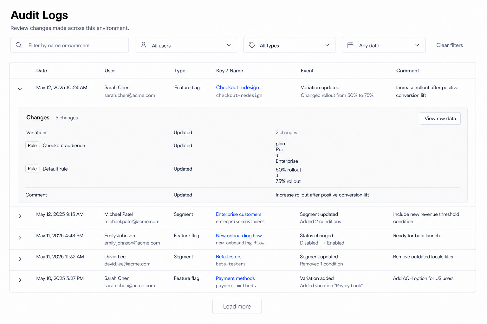

# Audit Logs Page Design

## Scope

This document defines the React redesign of the environment-level Audit Logs page in `front-end`.

Included:

- the Audit Logs page header and main-content layout;
- text, user, type, and date-range filters;
- the expandable audit-log table;
- Feature Flag and Segment identity, navigation, event, comment, and semantic change details;
- incremental loading, raw-data comparison, and all loading, empty, error, permission, and edge states.

Excluded:

- changes to the authenticated sidebar;
- changes to the organization/project/environment context bar;
- changes to Segment or Feature Flag detail-page headers;
- mobile-first layout work;
- implementation work of any kind.

The Angular implementation is the functional reference only. The React page must use the compact, neutral shadcn/Base UI and Tailwind workbench language established in `front-end`. It must not reproduce the Angular timeline or ng-zorro styling.

## Design Asset

The image is authoritative for the default light-theme hierarchy, table column order, and expanded-row topology. Sample users, objects, comments, and changes are illustrative; implementation must render API data.

## Finalized Design Direction

Use the existing Segment History table as the direct visual and interaction foundation:

- compact page header, one-line description, and a single filter row;
- one full-width bordered table with horizontal separators only;
- every record collapsed by default and expandable in place;
- the expanded section uses exactly the same `Changes` header, inline count, `View raw data` action, semantic ChangeLedger, and comment footer as Segment History;
- global Audit Logs adds `Type` and `Key / Name` columns to the shared history table;
- `Type` appears immediately after `User`;
- `Key / Name` appears immediately after `Type`;
- `Type` is plain localized text, not a Badge;
- object name is the primary identity and its key is secondary monospace text;
- no ambient card shadows, vertical table dividers, dashboard metrics, or timeline treatment.

The page begins inside the existing main content area. Do not draw, replace, or restyle the sidebar or context bar.

## Information Architecture

Content order:

1. Page title and description.
2. Filter toolbar.
3. Expandable audit-log table.
4. Centered incremental `Load more` action when additional results exist.
5. Raw-data comparison Dialog when explicitly opened.

## Page Header

Show:

- title: `Audit Logs`;
- description: `Review changes made across this environment.`

### Header copy contract

The approved English subtitle is:

`Review changes made across this environment.`

This is a durable page-level content contract:

- keep the subtitle resource-type-neutral;
- do not enumerate `Feature flag`, `Segment`, or any future auditable resource type in the subtitle;
- do not build the subtitle dynamically from the currently supported Type-filter options;
- adding a new auditable resource type must not require a header-copy change;
- let the Type filter and returned table rows communicate which resource types are currently available;
- use a concise, natural localized equivalent rather than translating an obsolete list of resource types. The intended Chinese meaning is `查看此环境中的变更记录。`.

Feature Flags and Segments are the currently returned types, not the conceptual boundary of the page. The subtitle describes the stable user task—reviewing changes in the selected environment—so it remains accurate as the audit domain expands.

Use the same React list-page rhythm as Segments, End Users, Access Tokens, Webhooks, and Relay Proxies:

- approximately 32px desktop page padding;
- 24px semibold title with normal tracking;
- one compact muted description below the title;
- no hero treatment, summary cards, count tiles, or decorative icon.

## Filter Toolbar

Use one left-aligned toolbar row immediately above the table. Controls use the standard 32-36px shadcn height and content-appropriate widths rather than four equal columns.

### Text search

- Search icon followed by placeholder `Filter by name or comment`.
- Preserve the Angular query contract.
- Search is case-insensitive according to server behavior and applies to object name/key and comment where supported by the API.
- Debounce the normalized value by approximately 350-400ms.
- Changing the query resets incremental loading to the first ten records.
- Do not clear the typed value while a request is pending or after an error.

### User filter

- Use a searchable Combobox with the default label `All users`.
- Do not use `All team members`.
- Search returned organization users by name or email with debounced server requests.
- A selected result shows the display name and email when both exist.
- Provide loading, empty, error, selected, and independently labelled clear states inside the same interaction.
- Clearing the user returns to `All users` and resets the audit results to the first ten records.

### Type filter

- Use a compact Select with the default label `All types`.
- Options are `Feature flag` and `Segment`.
- Selecting a type sends the existing `refType` filter and resets incremental loading.
- All Select items must use the project-required `SelectContent > SelectGroup > SelectItem` composition.
- The selected type is a filter value, not a status Badge.

### Date filter

- Use the Segment History date-range Popover and Calendar interaction.
- Default label: `Any date`.
- Select an inclusive start and end date.
- Keep range selection as a local draft until `Apply`.
- Disable `Apply` until both endpoints exist.
- `Clear` removes both endpoints together; `Cancel` restores the applied range.
- Send the start of the first date and the start of the day after the second date, preserving the Angular inclusive-range contract.
- The trigger displays the complete localized applied range and exposes it in its accessible name.

### Filter behavior

- Any applied filter resets the result list and page index before requesting data.
- Requests preserve every other applied filter.
- Keep a text-style `Clear filters` action visible at the far right of the toolbar in every filter state.
- Disable `Clear filters` with a clearly muted treatment when all four filters have their default values; enable it as soon as any non-default filter is applied.
- Activating `Clear filters` returns to the four default values without removing the page header or table shell.
- Keep the toolbar stable during loading; do not replace it with a spinner.

## Audit Table

Use the current React/shadcn table treatment from Segment History:

- one subtle rounded outer border;
- a single table-header bottom border and horizontal row separators;
- no vertical dividers;
- no additional Card around the table;
- every row is collapsed by default;
- the whole non-interactive row surface may toggle expansion, while links and buttons retain their own actions;
- the chevron button independently toggles the row without triggering navigation.

Column order is fixed:

| Column | Content | Behavior |
| --- | --- | --- |
| Expand | Chevron only | Toggles the inline semantic details and exposes expanded state. |
| `Date` | Localized date and time on one line | Use the current React locale and preserve the complete timestamp in constrained layouts. |
| `User` | Display name, with email below when available | Fall back to email, creator ID, then localized `System`. Truncated values remain recoverable. |
| `Type` | `Feature flag` or `Segment` as plain text | Never use a Badge or color as the only distinction. Unknown values use a safe localized fallback. |
| `Key / Name` | Linked human-readable name on the first line; muted monospace key on the second | Existing targets navigate to their targeting page. Removed targets remain visible but are not interactive. |
| `Event` | Localized event title and one muted semantic-summary line | Show at most two deterministic fragments plus a localized `{count} more` remainder. |
| `Comment` | User-authored change comment | Keep separate from generated Event text; truncate with a Tooltip when needed and show a muted dash when absent. |

### Key / Name identity rules

Derive the displayed object identity from the audit snapshot without changing the API contract:

- `Create`: use the current snapshot;
- `Remove`: use the previous snapshot;
- all other operations: prefer the current snapshot and fall back to the previous snapshot;
- Feature Flag navigation uses the complete returned key;
- Segment navigation uses the complete returned ID while displaying its name and key;
- preserve server-returned capitalization and punctuation;
- do not manufacture a key from the name;
- when name or key cannot be recovered, use the available `refId` as the secondary identity and show localized `Unavailable` for the missing primary value.

The name is the primary scanning target. The key uses the existing compact monospace treatment and remains fully recoverable through a Tooltip when truncated. Do not add a copy button to every row; this page is for audit review, not object management.

For removed objects:

- retain the previous name and key;
- use the restrained struck-through treatment established by Angular to communicate removal;
- do not render a navigation link;
- keep the complete audit event and change details available.

### Type rules

Map known values:

- `FeatureFlag` -> `Feature flag`;
- `Segment` -> `Segment`.

The Type filter and Type column use the same localized labels. Unknown server values remain reviewable through a safe plain-text fallback rather than disappearing.

### Event rules

Preserve all Angular operation meanings:

- `Create`;
- `Update`;
- `Archive`;
- `Restore`;
- `Remove`;
- `ApplyFlagChangeRequest`;
- `ApplyFlagSchedule`;
- unknown future operations.

Use concise object-aware titles such as `Created feature flag`, `Updated segment`, `Archived feature flag`, `Applied change request`, or `Applied schedule`. Update rows add the same deterministic semantic preview fragments used by Segment History. Do not treat raw instruction count as the affected-item count.

## Expanded Row

The expanded row must remain visually and structurally identical to the authoritative Segment History expanded-row design. Global Audit Logs must not introduce a second details pattern.

Required topology:

1. One expanded table row directly beneath its parent row.
2. One full-width quiet `muted/40` surface with medium radius, no border, and no shadow.
3. Header line with `Changes`, `{count} changes` immediately beside it, and `View raw data` at the far right when snapshot data exists.
4. The shared semantic ChangeLedger using the History layout.
5. A top divider followed by the `Comment` label and complete user-authored comment.

Ledger invariants:

- reuse the Segment History object/action/content column proportions;
- use the same neutral object Badges, non-interactive Added/Removed/Updated labels, vertical old-to-new values, user collection disclosure, and rule disclosure;
- show complete semantic instructions for Feature Flags and Segments;
- high-cardinality collections use the same bounded `Show N more` / `Show less` behavior as Segment History;
- large collections scroll inside the expanded muted surface without expanding the entire page indefinitely;
- do not add an inner `Field / Change / From / To` table header;
- do not render raw JSON inline;
- do not duplicate Type, Key, name, user, or timestamp inside the ledger;
- when no semantic changes can be derived, show the shared localized `No semantic changes available.` state while retaining comment and raw-data access.

Multiple records may remain expanded independently. Refetching the current query should preserve expansion only for records that still exist in the returned result set.

## Raw Data Dialog

Reuse the Segment History Raw data Dialog without visual divergence:

- open only from the explicit `View raw data` action;
- show `Raw data` title and a compact description containing Type, Date, User, and Key / Name context;
- compare Previous and Current in the shared bounded, read-only CodeMirror MergeView;
- label both sides clearly and preserve non-color change markers;
- collapse unchanged regions;
- keep both panes side by side at supported desktop widths;
- handle missing or invalid snapshots without crashing or hiding the audit record;
- close, Cancel-equivalent dismissal, and Escape return focus to the originating row action.

Hide `View raw data` only when neither previous nor current snapshot exists.

## Pagination

Preserve Angular incremental loading and match Segment History:

- request ten records initially;
- show centered outline `Load more` only when `items.length < totalCount`;
- append the next page to the current results;
- disable repeated activation while loading and show the shared compact pending indicator;
- a filter change discards appended pages and restarts from the first page;
- an append failure preserves all already loaded rows and provides a local retry path.

Do not replace this workflow with numbered pagination in this migration.

## States

Keep the header, toolbar, and table boundary stable in every state.

### Initial loading

- Render approximately five skeleton rows matching all seven table columns.
- Do not use a centered page spinner.
- Keep filters usable unless the required environment context is unavailable.

### Initial empty

- Title: `No audit logs yet`.
- Supporting text: `Changes to feature flags and segments in this environment will appear here.`
- Do not add a creation action; objects are created from their own pages.

### Filtered empty

- Title: `No audit logs match your filters`.
- Supporting text: `Try changing or clearing one or more filters.`
- Provide outline `Clear filters`.

### Load error

- Show a compact destructive-tinted message inside the table boundary: `Audit logs could not be loaded.`
- Provide outline `Retry`.
- Retry preserves the current filter state.

### User-filter error

- Keep the Combobox open with `Users could not be loaded.` and a local `Retry` action.
- Do not clear an already selected user.

### Partial/unknown audit data

- Preserve the row even if creator, object snapshot, operation, instructions, or comment is missing.
- Use explicit localized fallbacks and keep any available raw data accessible.
- A malformed single snapshot must not prevent other rows from rendering.

## Responsive Desktop Behavior

- Design target: desktop main-content widths from approximately 1024px upward.
- At normal widths, keep Date, User, Type, Key / Name, Event, and Comment visible together.
- Date and Type remain on one line.
- Give `Key / Name` enough width for a useful name and key before allowing Event or Comment to consume extra space.
- At constrained desktop widths, allow User, Key / Name, Event, and Comment to truncate with Tooltips.
- Use horizontal table scrolling before stacking cells or splitting the timestamp.
- Keep the expanded ChangeLedger proportions and disclosure behavior identical to Segment History.
- Keep the raw comparison side by side while both panes remain readable; otherwise use the shared unified read-only merge presentation.
- Do not introduce a mobile-specific page or card-per-record layout.

## Permissions and Environment Context

Audit Logs is a read-only review page:

- use the existing route and workspace/environment access rules;
- do not add page-level mutation actions;
- only render links for targets the current route context can open;
- a missing target, removed target, or inaccessible target retains plain identity text and its audit details;
- never hide persisted audit data merely because the current user can no longer edit the referenced object.

## Internationalization and Content

- Add all page, filter, table, event, state, disclosure, and raw-data strings to the centralized React i18n resources during implementation.
- Provide equivalent English and Chinese content.
- Preserve language-prefixed routes.
- Keep object names, keys, IDs, comments, emails, and raw snapshot values unchanged.
- Use plural-aware change counts and `{count} more` labels.
- Use the current localized date/time formatter consistently with Segment History.
- The approved default user-filter copy is exactly `All users` in English.

## Theme and Accessibility

- Use semantic shadcn tokens; do not hard-code the light mockup colors into feature code.
- Dark theme keeps the same hierarchy, density, and expansion topology.
- Preserve standard focus rings and keyboard behavior for every filter, row link, expansion control, disclosure, Load more action, and Dialog.
- The row chevron exposes expanded state and a localized expand/collapse label.
- Searchable user results follow Combobox keyboard semantics.
- Type Select follows the project-required grouped-option composition.
- Date selection and footer actions are fully keyboard operable.
- Truncated names, keys, emails, Event fragments, and comments remain recoverable.
- Color is never the only indicator of type, removal, change action, selection, error, or disabled state.
- Maintain WCAG AA contrast in light and dark themes.

## Shared History Contract

The React implementation should reuse one audit-history presentation across:

- environment-level Audit Logs;
- Segment History;
- Feature Flag History.

Context-specific differences:

| Surface | Type column | Key / Name column | Type filter | Object filter contract |
| --- | --- | --- | --- | --- |
| Global Audit Logs | Visible after User | Visible after Type | Visible | No fixed `refId` |
| Segment History | Hidden | Hidden | Hidden | Fixed Segment `refType` and `refId` |
| Feature Flag History | Hidden | Hidden | Hidden | Fixed Feature Flag `refType` and `refId` |

All three surfaces must share expansion, semantic ledger, comment, raw-data, error, empty, date, user-filter, and incremental-loading behavior unless the containing detail page supplies a narrower filter.

## Functional Invariants

The React migration must preserve:

- loading audit logs from the current environment;
- filtering by query, creator, reference type, and inclusive date range;
- zero-based API page requests while presenting an implementation-neutral UI;
- incremental `Load more` pagination;
- Feature Flag and Segment audit records;
- object name/key display derived from the correct previous/current snapshot;
- navigation to existing Feature Flag and Segment targeting pages;
- non-interactive removed-object identity;
- Create, Update, Archive, Restore, Remove, Apply Flag Change Request, and Apply Flag Schedule meanings;
- user-authored comments as data distinct from generated Event summaries;
- complete semantic instructions in the expanded row;
- previous/current raw-data comparison;
- stable loading, empty, filtered-empty, error, retry, partial-data, and unknown-operation handling.

## Acceptance Criteria

- Only the Audit Logs main page and its supporting filter popovers and Raw data Dialog are designed; sidebar and context bar remain unchanged.
- The page follows the current React/shadcn workbench style and does not clone the Angular timeline.
- The header subtitle is `Review changes made across this environment.` and remains unchanged when additional auditable resource types are introduced.
- The user-filter default text is `All users`.
- `Clear filters` remains visible at the far right of the toolbar, disabled only when every filter has its default value.
- The table columns are Expand, Date, User, Type, Key / Name, Event, and Comment in that order.
- Type is plain localized text and appears immediately after User.
- Key / Name shows a human-readable name above the complete recoverable key and appears immediately after Type.
- Removed objects remain reviewable but are not navigable.
- Every row is collapsed by default and expands inline.
- The expanded section is visually and structurally identical to Segment History: `Changes`, inline count, `View raw data`, shared semantic ChangeLedger, and comment footer.
- The expanded section has no alternate inner diff table, raw JSON, or unique global-Audit-Logs styling.
- Text, user, type, and inclusive date filters preserve Angular behavior and reset incremental loading correctly.
- `Load more` appends records and keeps already loaded results on append failure.
- Raw data uses the shared bounded read-only MergeView.
- Light and dark themes use semantic tokens, and English and Chinese content resolve through centralized feature resources.
- No React or Angular implementation file is changed as part of this design-only task.
