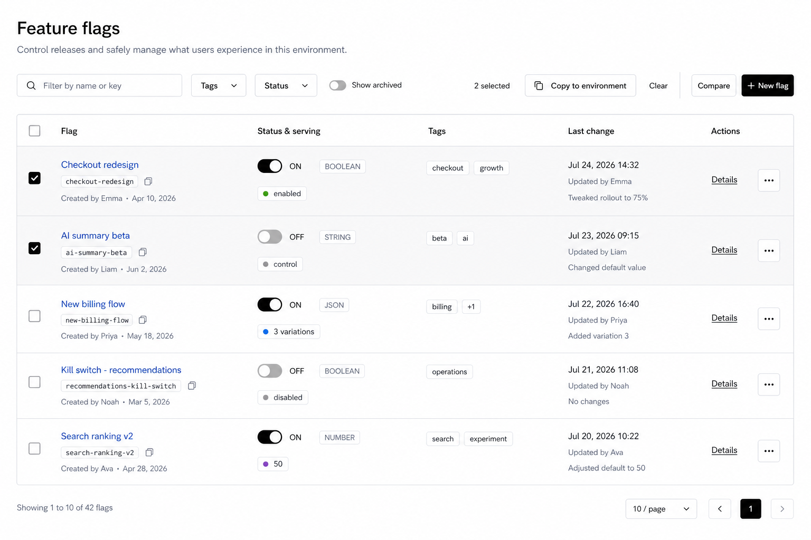
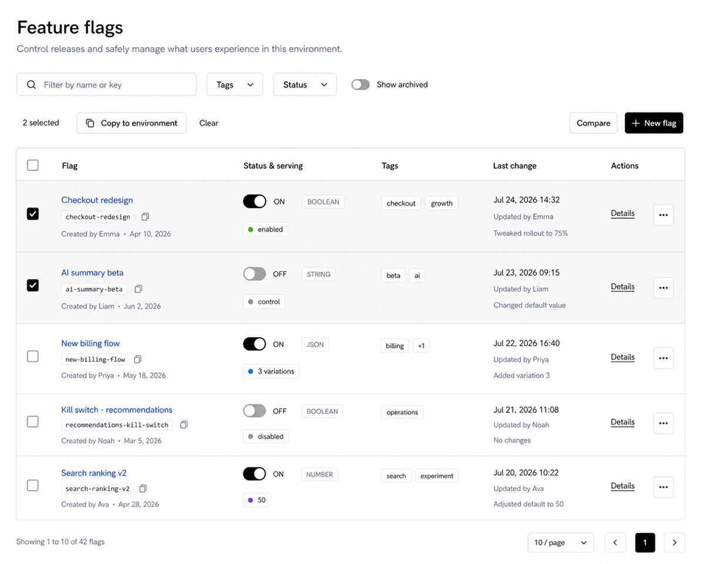
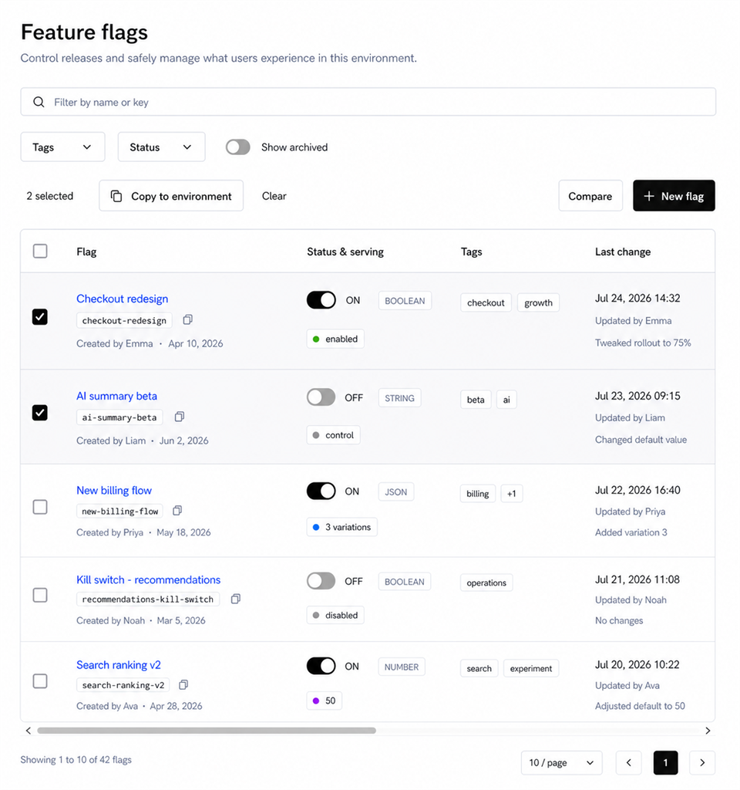
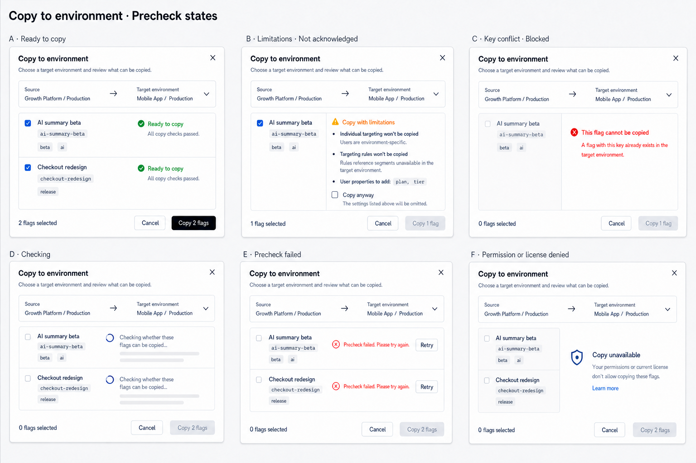

# Feature Flags Index Page Design

## 1. Scope

This document defines the React redesign of the **Feature Flags index page** in `front-end`.

The scope includes the index page and the supporting sheets/dialogs launched directly from it:

- list, search, filtering, URL state, selection, and pagination;
- flag status and serving summaries;
- create, toggle, copy, batch copy, clone, compare, archive, restore, and remove entry points;
- permission, license, change-comment, loading, error, and empty states.

The following are explicitly out of scope:

- the Feature Flag detail page and its tabs;
- the global sidebar;
- the context bar and environment switcher;
- any change to the authenticated application shell.

The Angular implementation is the functional source of truth, not a visual reference. The React Segments index implementation is the primary local reference for page spacing, toolbar density, bordered table treatment, copyable keys, row actions, empty states, and pagination.

## 2. Visual Reference

### Large desktop - 1536 x 1024

### Medium desktop - 1200 x 960

### Compact desktop - 960 x 1024

All three images show the selected-row state so the responsive placement of bulk-copy actions is visible. In the default state, the contextual selection group is absent; the filters, global actions, normal table header, and table geometry remain unchanged.

## 3. Product Intent

Feature Flags is an operational release surface. A user should be able to answer four questions without opening a detail page:

1. Which flag is this?
2. Is it currently on or off?
3. What value or set of variations is it serving?
4. Who changed it most recently, when, and why?

The design should feel like a compact release workbench: neutral, calm, and information-dense. It must not copy Angular/ng-zorro styling, use large green action surfaces, or distribute common actions across a long row of text links.

## 4. Page Structure

The main content uses the same page frame as the implemented Segments index:

- page canvas: `bg-background`;
- desktop page padding: `32px` horizontally and `24px` vertically;
- title: 24px, semibold, single line;
- subtitle: 14px muted text;
- title block bottom spacing: 32-40px;
- toolbar bottom spacing: 16-20px;
- table: one bordered, rounded container with no ambient shadow;
- pagination: separate from the table, aligned below it.

### Page header

- Title: **Feature flags**
- Subtitle: **Control releases and safely manage what users experience in this environment.**

Do not repeat organization, project, or environment names in the page header. That context belongs to the existing context bar and must not be duplicated or redesigned here.

## 5. Toolbar

The toolbar contains three semantic groups that reflow without changing the table:

1. filters: search, Tags, Status, and Show archived;
2. contextual selection actions, shown only when one or more rows are selected;
3. global page actions: Compare and New flag.

On a large desktop, all groups share one compact row. At narrower supported desktop widths, the groups wrap into two or three rows according to the responsive rules in section 8. The table header is never replaced or hidden by selection state.

### Left side

1. **Search**
   - 320px preferred width.
   - Search icon inside the field.
   - Placeholder: `Filter by name or key`.
   - Debounced server-side query.
   - Changing the query resets the page index to 1.

2. **Tags**
   - Outline filter button opening a searchable multi-select popover.
   - When inactive, label is `Tags`.
   - When active, show `Tags: <first>` for one selection and `Tags: <first> +N` for multiple selections.
   - Selected tags are removable from inside the popover.
   - Tag options show a loading state and a recoverable load-error state.

3. **Status**
   - Outline single-select filter with `All statuses`, `On`, and `Off`.
   - Active value is visible in the trigger.
   - This maps to the Angular `isEnabled` filter; it must not be a client-only filter.

4. **Show archived**
   - Outline toggle button with an Archive icon.
   - Active state uses the neutral accent background, matching the implemented Segments page.
   - Switching active/archived mode resets the page index to 1.

Do not add a variation-type filter unless the backend list contract gains that capability. The Angular API does not currently expose it as a list filter.

### Right side

1. **Compare**
   - Secondary outline button with a comparison icon.
   - Opens the existing cross-environment comparison page.

2. **New flag**
   - Primary button with a Plus icon.
   - Opens the creation sheet.
   - Disabled when permission or license checks fail; the reason is explained by tooltip instead of silently hiding the button.

Compare and New flag are global page actions. They remain visible and enabled according to their own permission state when rows are selected; row selection must not remove unrelated page capabilities.

`Batch Copy To` must not remain hidden in a page-level ellipsis menu. It becomes a contextual action when one or more rows are selected.

## 6. URL and List State

Preserve the Angular index behavior by serializing the list state into query parameters:

- search text;
- selected tags;
- status;
- archived mode;
- page index;
- page size.

Opening a shared URL or using browser Back/Forward must restore the same view. Search and filter changes reset the page to 1. Page-size changes also reset the page to 1. The server-side sort continues to follow the organization `flagSortedBy` setting; do not introduce a visual sort control unless the backend and product setting behavior are intentionally changed.

## 7. Table Design

Use the same table surface and component vocabulary as the implemented React Segments index. This is a fixed-layout shadcn table inside one `overflow-hidden rounded-md border bg-background` container. The desktop minimum width is approximately 1180px; below that, the main content may scroll horizontally rather than hiding important flag state.

The following styling rules are strict consistency requirements:

- one subtle outer border around the complete table surface;
- no vertical column dividers or spreadsheet-style grid lines;
- one horizontal divider below the header and between adjacent rows;
- white/`background` table header, not a tinted header band;
- header cells use the same semibold text and `px-5 py-4` rhythm as Segments;
- body cells use the same `px-5 py-4` base rhythm, expanding vertically only for Feature Flag metadata;
- rows remain flat with the shared subtle hover state and no individual cards or shadows;
- badges, key pills, action links, and ellipsis buttons reuse the same radius, border, and focus treatment as Segments.

| Column           | Preferred width | Content                                       |
| ---------------- | --------------: | --------------------------------------------- |
| Selection        |         48-56px | Page checkbox and row checkbox                |
| Flag             |             28% | Name, copyable key, creator and creation date |
| Status & serving |             23% | Switch, type badge, serving summary           |
| Tags             |             17% | Up to two visible tags and `+N` overflow      |
| Last change      |             20% | Time, actor, optional comment                 |
| Actions          |             12% | Visible Details action and overflow menu      |

Keep a minimum table width. Do not hide Tags at narrower desktop widths as Angular does; horizontal scrolling preserves the complete operational view.

### Selection

- The header checkbox selects or clears the current page.
- The indeterminate state is shown when only some current-page rows are selected.
- Selection may persist while paging and filtering, matching Angular's retained selection behavior.
- A selected count always reflects the full retained selection, not only visible rows.
- Archived flags may be selected only if the current bulk action can legally operate on them; otherwise selection controls are disabled with a reason.

### Flag column

- Name is semibold and links to `/:key/targeting`.
- Key is a compact monospace tonal pill with a visible Copy icon.
- Clicking the pill copies the exact key and shows a success toast.
- Long names and keys truncate with a tooltip exposing the full value.
- Creator metadata appears on the third line: `Created by <name/email> · <date>`.
- Missing creator data does not reserve a blank line.

### Status and serving column

The status column combines the release state with the serving result so the user does not need to interpret them separately.

- Use the shared compact `Switch` plus visible `ON` or `OFF` text.
- The variation type is a quiet outline badge: `BOOLEAN`, `STRING`, `NUMBER`, or `JSON`.
- Avoid saturated per-type colors. Type is metadata, not urgency.
- The serving summary is a small neutral tonal pill on the second line.
- One enabled variation: colored dot plus the variation name/value.
- Multiple enabled variations: grouped dots plus `<count> variations`; tooltip lists all values.
- Off state: muted dot plus the disabled variation value.
- Long values truncate and expose the full content in a tooltip.
- While toggling, disable the switch and show a small spinner adjacent to it; update the row only after the request succeeds.

Toggling behavior:

- turning off explains that all users receive the configured off variation;
- turning on explains that targeting and rules determine the served variation;
- when change comments are required, the confirmation dialog includes a required comment field;
- when comments are not required, use a concise confirmation popover/dialog;
- permission or license denial leaves the current state unchanged and explains why.

### Tags column

- Show at most two outline badges.
- Truncated tags have tooltips.
- Additional tags collapse into a `+N` button opening a small popover with all remaining tags.
- No tags is represented by a muted dash.

### Last change column

- First line: localized date and time.
- Second line: `Updated by <name/email>`.
- Third line: one-line truncated change comment with tooltip.
- When no change exists, show `No changes since creation` in muted text.

### Actions column

Keep **Details** visible because it is the most frequent navigation. It is the same lightweight underlined/text link used by the Segments table, not a bordered button. Use the same compact outlined icon-only ellipsis button as Segments for secondary actions.

Active flag menu:

1. Copy to environment
2. Clone
3. Compare
4. separator
5. Archive

Archived flag menu:

1. Copy to environment
2. Clone
3. Compare
4. separator
5. Restore
6. Remove permanently, using destructive text

Each menu item is permission- and license-aware. Unsupported actions remain visible but disabled with an explanatory tooltip/title so users can distinguish missing capability from a missing feature.

## 8. Contextual Selection Actions And Responsive Layout

Row selection adds a compact contextual group to the existing page toolbar. It does not add a strip inside the table, replace the column header, hide filters, or remove global page actions.

The contextual group contains:

- `<count> selected` in standard foreground text;
- outline button **Copy to environment**;
- ghost action **Clear**.

If any selected flag fails the permission/license check, Copy to environment is disabled and identifies the first incompatible flag. After a successful copy or when the user clicks Clear, clear retained selection. Selected rows also use a very subtle neutral background so the count has an immediate visual referent.

### Large desktop: 1280px and wider

- Use 32px horizontal page padding.
- Render one toolbar row.
- Order: filters, flexible spacer, contextual selection group, short vertical separator, Compare, New flag.
- If no rows are selected, remove the contextual group and separator without reserving empty space.

### Medium desktop: 960px to 1279px

- Use 24-32px horizontal page padding according to available main-content width.
- Render two toolbar rows.
- Row 1 contains search and all filters.
- Row 2 places the contextual selection group on the left and Compare/New flag on the right.
- Without selection, row 2 contains only the right-aligned global actions.
- Keep 8-12px between rows and 16-20px between the toolbar and table.

### Compact desktop: below 960px

- Use 24px horizontal page padding.
- Render three toolbar rows: full-width search; filter controls; then contextual and global actions.
- The final action row keeps the contextual group on the left and Compare/New flag on the right. It may wrap the two groups onto separate lines only when their complete labels no longer fit.
- Do not move actions into overflow or shorten labels beyond recognition.
- Keep the table in its desktop structure with a minimum content width of approximately 1180px.
- Place the table inside a horizontal scrolling region with a visible scrollbar. Do not hide columns or convert rows into cards.
- The table header remains visible at every width. At the initial scroll position, Selection, Flag, Status & serving, Tags, and the start of Last change are visible; the remaining content is reachable horizontally.
- Pagination may wrap its result count and controls onto separate lines, but remains outside the table border.

This makes batch copy discoverable only when relevant, removes the Angular page-level overflow menu, preserves the Segment-style table, and keeps Compare/New flag available throughout selection mode.

## 9. Pagination

Match the implemented Segments pagination pattern exactly. Pagination sits directly on the page canvas below the table; it has no enclosing border, card background, or full-width container outline:

- left: `Showing <from> to <to> of <total> flags`;
- right: page-size select with 10, 20, and 30;
- previous and next icon buttons;
- current page in a compact primary square;
- disable controls during an in-flight page fetch;
- hide pagination when the total is zero.

All shadcn/Base UI Select options must follow `SelectContent > SelectGroup > SelectItem`.

## 10. Supporting Index Surfaces

These surfaces are part of the index workflow even though the Feature Flag detail page is out of scope.

### Create feature flag sheet

- Right-side sheet, approximately 640px wide on desktop.
- Header: `New feature flag` plus concise helper copy.
- Sections:
  1. Basics: name, generated/editable key with async uniqueness validation, description, tags.
  2. Variation settings: immutable type choice; variation name/value rows; add/remove for non-boolean types; expanded CodeMirror editor for JSON/long structured values.
  3. Default rule: initial on/off state, variation served when on, variation served when off.
- Sticky footer: Cancel and Create flag.
- Preserve validation for required fields, key format, duplicate key, description length, and variation value type.
- Unsaved changes require discard confirmation.
- Success closes the sheet, refreshes the list, and navigates to the new flag's Targeting detail route. The destination detail UI is not designed here.

### Copy to environment dialog

Reuse one Dialog for the row-level `Copy to environment` action and the contextual multi-row action. The row entry supplies one flag; the contextual action supplies the complete retained selection, including selections from other pages.

The visual reference is a six-state board for one stable Dialog: Ready to copy, Limitations not acknowledged, Key conflict blocked, Checking, Precheck failed, and Permission or license denied. Source/target context, flag identity, list geometry, and footer placement remain stable while only result content and action availability change.

#### Dialog structure

- Centered Dialog, recommended width 700-760px and maximum height 85vh.
- Header:
  - title: `Copy to environment`;
  - description: `Choose a target environment and review what can be copied.`;
  - standard close button.
- Only the flag precheck list is scrollable when many flags are selected. Header, environment scope card, and footer remain fixed.
- Header and footer have no divider line. The footer also has no tinted or contrasting background.

#### Environment scope

- Use one compact source-to-target row:
  - `Source` is the current `Project / Environment` and is read-only;
  - ArrowRight communicates copy direction;
  - `Target environment` is a required searchable Select.
- Implement the scope card as a coordinated two-row grid: both labels share the first row, both environment values use the same 28 px-tall compact row, and the arrow is vertically centered on the value row.
- Prefix both selected environment values with the standard 16 px `Box` environment icon. Keep the icon, value text, and vertical alignment identical on both sides.
- Use a 20 px ArrowRight and bias the column split slightly toward the target so the direction indicator sits just left of the card's geometric center.
- Group target options by project and show `Project / Environment` labels.
- Exclude the current source environment.
- Follow the React Select composition rule: `SelectContent > SelectGroup > SelectItem`.
- Before a target is selected, show the selected flag identities but do not run prechecks; the primary action remains disabled.
- Changing the target clears stale results and immediately runs a new precheck for every supplied flag.

#### Precheck summary and list

- Do not add a section heading, selection summary, or header checkbox above the flag list.
- Render one compact bordered list with horizontal row separators rather than unrelated cards.
- Each row shows:
  - a left identity region with flag name and monospace key; tags are intentionally omitted from this Dialog;
  - show the row selection checkbox only for multi-flag actions; a single supplied flag is implicitly selected and does not show a redundant row checkbox;
  - a right result region separated by a vertical divider, containing status and supporting details;
  - the two regions stack only on narrow mobile widths where the desktop columns cannot remain readable.
- Safe result:
  - checked by default;
  - CheckCircle plus `Ready to copy`;
  - helper text `All copy checks passed.`.
- Copyable warning result:
  - leave the affected flag out of the copy selection by default;
  - AlertTriangle plus `Copy with limitations`;
  - show only relevant restrictions inline: Individual Targeting omission, incompatible Targeting Rules, and user properties that will be added to the target environment;
  - show one unchecked inclusion control labeled `Copy this flag without these settings`, with helper text `Leave unchecked to skip this flag.`;
  - checking this control directly adds the warning flag to the copy selection; leaving it unchecked skips only this flag and does not block copying safe flags.
- Key conflict:
  - disabled and unselected;
  - CircleX plus `This flag cannot be copied`;
  - helper text `A flag with this key already exists in the target environment.`;
  - does not offer a limitations acknowledgement.
- The existing Angular `keyCheck`, `targetUserCheck`, `targetRuleCheck`, `newProperties`, and `passed` outcomes remain the behavioral source of truth.
- The permanent Angular Restrictions banner is replaced by contextual details under affected flags; its business meaning is not removed.

#### Stable precheck states

- Ready to copy:
  - selected safe flags enable the primary action;
  - icon and text communicate success together.
- Limitations not acknowledged:
  - the warning flag does not contribute to the selected count;
  - safe selected flags can still be copied;
  - inclusion confirmation is scoped to that flag and target environment.
- Key conflict blocked:
  - disable the row checkbox and primary action when no other copyable flag is selected;
  - do not offer an acknowledgement for a non-bypassable conflict.
- Checking:
  - retain source, target, and every supplied flag identity;
  - show compact progress indicators and result-shaped skeleton lines;
  - disable selection changes and the primary action while keeping Cancel available.
- Precheck failed:
  - retain source, target, and flag identities;
  - show `Precheck failed. Please try again.` with a visible `Retry` action;
  - keep the primary action disabled until a retry succeeds.
- Permission or license denied:
  - retain the affected flag identities and keep the primary action visible but disabled;
  - keep the flag identity rows in the left column and show one shared unavailable state spanning the right column;
  - show `Copy unavailable` and name the actual permission or license reason when it is known;
  - show `Learn more` only when a relevant license destination exists.

#### Selection behavior

- Safe flags are selected automatically after a successful precheck; warning flags are not.
- A warning flag is added only through its `Copy this flag without these settings` control, which directly governs whether that flag is copied.
- A single warning flag therefore starts with `0 / 1 flags selected` and the primary action disabled until the inclusion control is checked.
- Leaving one warning flag unchecked does not prevent other selected safe flags from being copied.
- For a row-level copy, the same list renders one item without introducing a separate single-copy UI.

#### Footer and completion

- Left: `<selected> / <total> flags selected`, including `0 / <total> flags selected`.
- Right: outline `Cancel` and primary `Copy <selected count> flag(s)`; the button always uses the actual selected count, including `Copy 0 flags` when nothing is selected.
- Disable the primary action until a target is selected, precheck completes, at least one flag is selected, and every selected warning flag is acknowledged.
- During mutation, keep the Dialog open, disable target/selection changes, and show `Copying…`.
- Success closes the Dialog, shows a success toast, refreshes the Index list, and clears retained row selection.
- Failure preserves target, precheck results, and selection so the user can retry.
- Permission and license denial keep affected actions visible but disabled with an explanation.

### Clone feature flag dialog

- Explains that full targeting configuration is cloned.
- Shows the source flag.
- Fields: name, generated/editable unique key, description, tags.
- Preserve required, key-format, duplicate-key, and description-length validation.
- Success navigates to the cloned flag's Targeting route.

### Compare

- The page-level Compare button navigates to cross-environment comparison.
- The row-level `Compare` item in the three-dot menu opens the **same right-side detailed comparison Sheet** as the Compare page's `View differences` entry. Do not design or implement a second drawer, dialog, compact variant, or Angular-styled comparison surface for the index entry.
- Reuse the same Sheet frame, width, backdrop, header hierarchy, three-column settings table, row order, difference states, selection controls, append/overwrite modes, `After copy` previews, compatibility warnings, sticky footer, and `Copy settings` behavior defined in [feature-flags-compare-page-design.md](feature-flags-compare-page-design.md).
- The only entry-context difference is target selection. `View differences` already has a locked target environment from the selected matrix cell; Index `Compare` opens the same Sheet with the current environment locked as Source and a searchable Target environment selector in the same header position.
- Until a Target is selected, keep the shared Sheet header and direction layout visible, show `Select a target environment to view differences` in the comparison body, and keep `Copy settings` disabled. Do not render an empty settings grid or a separate target-selection step.
- After Target selection, load the comparison in place. From that point onward, the Index and Compare-page entries are visually and behaviorally identical. Changing Target clears stale selections and previews before loading the new comparison.
- Preserve the flag identity in the shared header: title `Compare <flag name>`, copyable key, Source, ArrowRight, Target, and close action. The selected flag is locked; there is no flag picker inside the Sheet.

#### Shared View differences visual reference

This existing Sheet is the visual source of truth for the Index three-dot `Compare` action. The dimmed page behind it changes according to the entry point; the Sheet itself does not.

### Archive, restore, and remove

- Archive confirmation explains the runtime consequence: code fallback is returned for all users and code references should be removed first.
- Restore confirmation returns the flag to the active list.
- Remove is available only in archived mode, is explicitly permanent, and uses destructive treatment.
- When environment settings require a change comment, the confirmation dialog requires it for archive, restore, and remove.
- During mutation, close controls are disabled and the initiating row shows progress.
- If the last item on a non-first page is removed from the current view, move to the previous page after success.

## 11. Loading, Error, and Empty States

### Loading

- Preserve the toolbar and table header.
- Render five skeleton rows matching the six-column structure.
- Do not clear the whole page during refetch; keep prior data visible with subtle progress where possible.

### List load error

- Show a compact destructive-tinted inline row above the table body.
- Copy: `Feature flags could not be loaded.`
- Include a visible Retry button.

### Empty states

1. **No flags yet**
   - `No feature flags yet`
   - Helper copy explaining that flags control releases without redeploying.
   - `New flag` action when permitted.

2. **No archived flags**
   - `No archived feature flags`
   - Helper: archived flags will appear here.

3. **No filter matches**
   - `No feature flags match the current filters.`
   - `Clear filters` action resets search, tags, and status but does not unexpectedly leave archived mode unless archived mode is part of the active filtering intent.

### Auxiliary failures

Tag-option, permissions, environment-list, and precheck failures are surfaced within the control or dialog that owns them and provide Retry where meaningful. A failed auxiliary request must not make already-loaded flags disappear.

## 12. Permission and License Behavior

Preserve the Angular permission/license gates for create, toggle, copy, clone, archive, restore, and remove.

- Evaluate permissions against the flag RN, including its tags.
- Evaluate create against the current environment flag wildcard RN.
- Disabled actions remain understandable through tooltip/title copy.
- Permission data loading is visually distinct from permission denial.
- Do not optimistically expose an enabled destructive action before policy data is ready.
- A denied mutation never changes local row state.

## 13. Theme, Density, and Accessibility

- Use shared shadcn/Base UI primitives and existing Tailwind tokens.
- Light and dark themes keep identical structure and information hierarchy.
- Use borders and tonal layers, not ambient shadows.
- Controls use the established 32px product height where practical.
- Table rows target 88-104px depending on metadata and comments; they should remain scannable rather than compressed into a single line.
- All icon-only actions have visible tooltips and accessible names.
- Switches are not the sole status indicator; visible ON/OFF text is always present.
- Color dots are supplemental; variation values and counts remain textual.
- Keyboard focus follows the shared component focus ring.
- Long keys, tags, variation values, names, and comments remain retrievable through tooltips.

## 14. Implementation Boundaries

The React implementation should be split by responsibility rather than built as one large page component. Expected ownership areas include page/query orchestration, responsive toolbar filters, contextual selection actions, table, status/serving cell, tags cell, pagination, create sheet, copy dialog, clone dialog, comparison entry point, and confirmation dialogs.

This is guidance for a future implementation only. This design task does not authorize code, test, configuration, dependency, route, sidebar, or context-bar changes.

## 15. Acceptance Checklist

- [ ] Only the Feature Flags index main content is redesigned.
- [ ] Sidebar and context bar are unchanged.
- [ ] Search supports name and key and is restored from the URL.
- [ ] Tags, Status, and Archived filters use server-side list parameters.
- [ ] Page index and page size are preserved in the URL.
- [ ] Organization `flagSortedBy` behavior is preserved.
- [ ] Name, copyable key, creator, status, variation type, serving value, tags, and last change remain visible.
- [ ] Toggle confirmations and required change comments are preserved.
- [ ] Details remains visible; secondary row actions move to overflow.
- [ ] Single and batch Copy To workflows preserve prechecks and restrictions.
- [ ] Index Copy to environment uses one shared Dialog with searchable project-grouped target selection and a retained-selection-aware flag list.
- [ ] Safe flags default selected; warning flags are copied only when their `Copy this flag without these settings` control is checked, and key-conflict flags remain blocked.
- [ ] Copy to environment preserves one stable layout across ready, unacknowledged limitation, blocked conflict, checking, retryable failure, and permission/license-denied states.
- [ ] Copy to environment Header and Footer have no divider, and the Footer has no contrasting background.
- [ ] Selection actions live in the responsive page toolbar, never inside or in place of the table header.
- [ ] Compare and New flag remain visible when rows are selected.
- [ ] Large, medium, and compact desktop layouts follow the three visual references.
- [ ] Compact desktop uses horizontal table scrolling without hiding columns or converting rows to cards.
- [ ] Clone and both Compare entry points are preserved.
- [ ] The Index three-dot Compare action reuses the Compare page's View differences Sheet instead of introducing another drawer or dialog.
- [ ] The shared Sheet differs only in Target context: Compare-page entry locks the matrix Target; Index entry selects Target in the same header position, then renders the identical comparison and copy UI.
- [ ] Archive, restore, and permanent remove behavior is preserved.
- [ ] Permission and license denial is visible and understandable.
- [ ] Loading, retryable error, first-use empty, archived empty, and filtered empty states are specified.
- [ ] Pagination matches the implemented React Segments index pattern.
- [ ] Create sheet preserves flag type, variations, default on/off serving, validation, and navigation behavior.
- [ ] No Feature Flag detail-page design is introduced.
