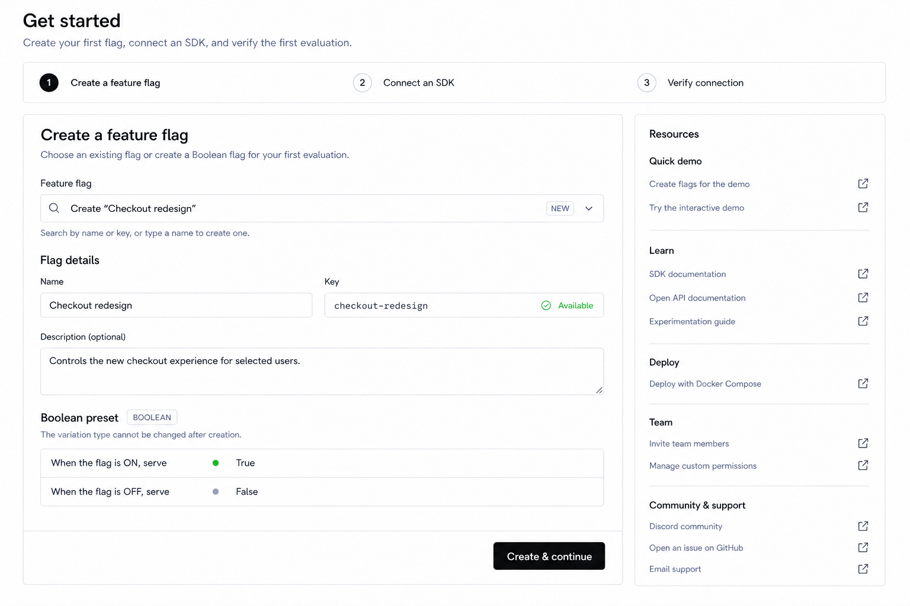
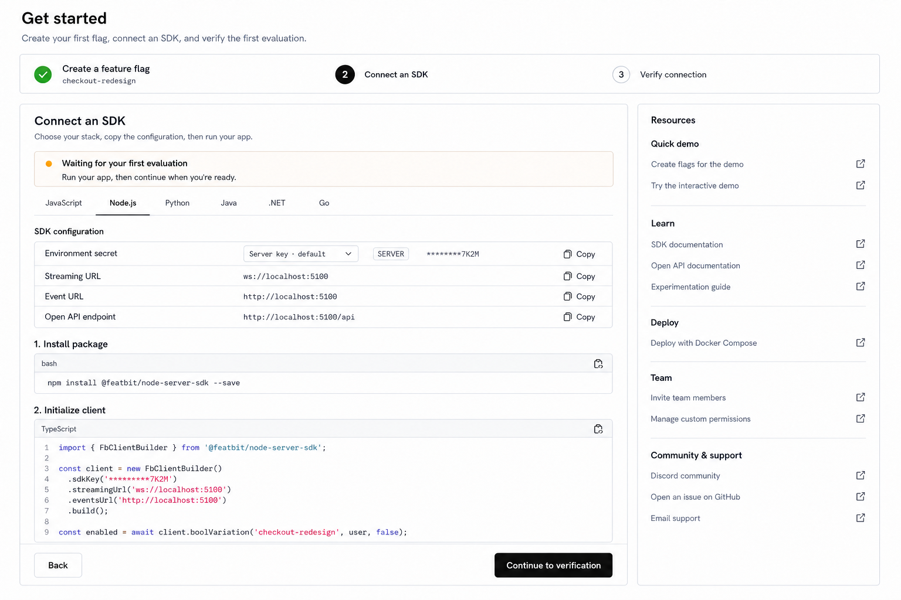
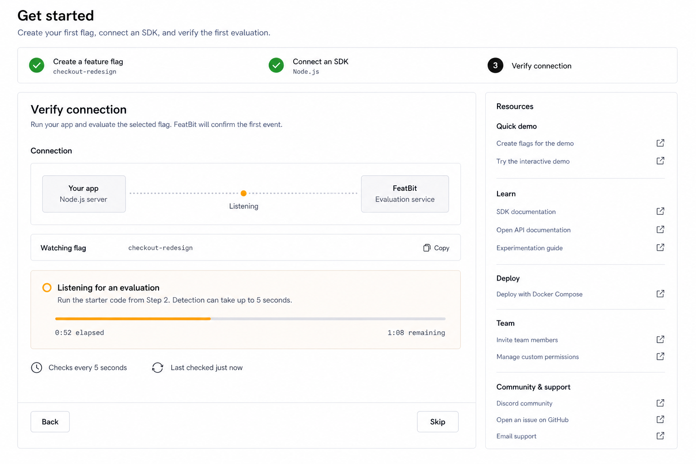

# Get Started Page Design

This document defines the React redesign of the authenticated **Get Started** page in `front-end`. The Angular page is the functional source of truth. The React application, `PRODUCT.md`, `DESIGN.md`, and the existing Feature Flags and settings surfaces are the visual source of truth.

This is a design-only contract. No React source, route, API, test, configuration, i18n resource, shared component, sidebar, or context-bar implementation is authorized by this document.

## 1. Scope and boundaries

The design covers only the Get Started main-content surface inside the existing authenticated shell:

- the three-step first-flag workflow;
- create or reuse Feature Flag behavior;
- SDK selection, environment configuration, secrets, endpoints, install commands, starter code, copy actions, and SDK documentation;
- live evaluation verification, success, timeout, retry, skip, and completion;
- the Documentation, Team, and Support links currently rendered by Angular's `guide` component;
- loading, error, empty, permission, and incomplete-configuration states.

The following are explicitly out of scope:

- the global sidebar and its navigation structure;
- the context bar, environment switcher, SDK configuration trigger, and subscription badge;
- changes to the authenticated shell or global page padding contract;
- onboarding organization/project creation;
- adding SDK languages that the Angular flow does not currently support;
- implementation code or backend changes.

The main-content design must assume the existing sidebar and context bar remain visible around it. They are intentionally excluded from the mockup.

## 2. Design assets

### Step 1 — Create a feature flag, large desktop, light theme



### Step 2 — Connect an SDK, large desktop, light theme



### Step 3 — Verify connection, large desktop, light theme



The three images form one continuous default path using the `checkout-redesign` Boolean flag and the Node.js SDK. Alternate, loading, validation, timeout, and error states remain specified in this document so implementation does not infer behavior from screenshots alone.

### Visual baseline contract

These three 1536 × 1024 images are the canonical large-desktop, light-theme references for the default path. They are design acceptance artifacts rather than illustrative mood boards.

| Asset | Canonical state | Persistent scenario | Visible actions |
| --- | --- | --- | --- |
| `get-started-create-feature-flag-light.png` | Step 1 active; create-new mode with valid fields | Create the Boolean flag `checkout-redesign`, with `True` for ON and `False` for OFF | `Create & continue` |
| `get-started-connect-sdk-light.png` | Step 1 complete; Step 2 active; Node.js selected | Configure the Node.js server SDK for `checkout-redesign`, including secret, endpoints, install command, and initialization code | `Back`, `Continue to verification` |
| `get-started-verify-connection-light.png` | Steps 1 and 2 complete; Step 3 active; listening state | Watch `checkout-redesign` from a Node.js application, poll every 5 seconds, and show progress through the 120-second window | `Back`, `Skip` |

Across all three baselines:

- the Get Started page title, helper text, progress strip, task-container geometry, and Resources rail keep the same position and width;
- completed, active, and upcoming steps change state without shifting the surrounding layout;
- the right rail contains the same five groups in the same order: Quick demo, Learn, Deploy, Team, and Community & support;
- the images show only the main-content surface; the existing sidebar and context bar remain outside the frame;
- secrets remain masked and all endpoint or secret values are non-production examples;
- the Step 3 image intentionally captures the listening state. Success, timeout, and request-error variants are governed by Sections 10 and 12.

## 3. Design read

**Reading this as:** a redesign-preserve migration of a first-run developer workflow for engineers, product engineers, and release operators, using FeatBit's restrained neutral workbench language and shadcn/Base UI component vocabulary.

- **Color strategy:** Restrained. Neutral product tokens carry the page. Green is limited to confirmed completion, amber to active event listening, and red to actionable failures.
- **Theme scene:** A developer is integrating FeatBit into an application during a normal work session on a desktop or laptop and needs to move from configuration to a verified evaluation without losing project or environment context.
- **Primary anchors:** the current React Feature Flags index, the current React Feature Flag settings surface, LaunchDarkly's adjacent SDK picker and instructions, and GrowthBook's explicit installation and setup sequence.
- **Design variance:** 3/10. The page should feel familiar and operational.
- **Motion intensity:** 2/10. Motion communicates state only.
- **Visual density:** 7/10. Code and configuration are dense, but grouping and spacing keep the flow calm.

The Taste guidance is used only as an anti-template check because this is a multi-step product workflow, not a marketing page. The authoritative component and layout language remains the FeatBit React product system.

## 4. Product intent

The page should help a user complete one concrete outcome:

> Create or select a boolean Feature Flag, evaluate it from one supported SDK, and confirm that FeatBit received the evaluation event.

The user should always be able to answer:

1. Which environment am I configuring?
2. Which flag will my application evaluate?
3. Which SDK and secret should I use?
4. What code must I run next?
5. Has FeatBit received the evaluation event?

The first answer remains owned by the unchanged context bar. The Get Started page must not duplicate project or environment selectors inside the page.

## 5. Verified Angular behavior to preserve

### Entry and completion marker

- Route: `/get-started` in Angular; the React route family should be `/:lang/get-started`.
- First entry is used after login or organization onboarding when the unscoped `get-started` local-storage marker is absent.
- Angular sets the marker to `true` when Step 1 initializes. React should preserve the same effective behavior so merely leaving the flow does not force it again on every login.
- `?status=init` may be present after onboarding. It must not create a second page layout or duplicate shell context.

### Step 1: Create a Feature Flag

- Load Feature Flags in the current environment.
- When flags exist, let the user select an existing flag or type a new name.
- Search is server-backed and debounced.
- If no exact name or key matches the typed value, offer a create-new result.
- When the environment has no flags, enter create mode directly.
- Creation fields:
  - Name, required.
  - Key, required, auto-generated from Name, editable, pattern-limited to letters, numbers, `.`, `_`, and `-`.
  - Key uniqueness, checked asynchronously.
  - Description, optional, maximum 512 characters for Angular parity.
  - Variation type, fixed to Boolean.
  - Default ON variation, `True`.
  - Default OFF variation, `False`.
- A created flag is initially disabled and is carried into Step 2.
- Selecting an existing flag carries that flag into Step 2 without creating another flag.

### Step 2: Connect an SDK

- Load the current environment and its secrets.
- Select a secret and rebuild all generated snippets whenever the secret changes.
- Resolve and expose:
  - Streaming URL;
  - Event URL;
  - Open API endpoint.
- Copy each endpoint and the selected secret.
- Preserve these SDKs and install mechanisms:

| SDK | Install instruction | Documentation |
| --- | --- | --- |
| JavaScript | `npm install featbit-js-client-sdk --save` | `https://github.com/featbit/featbit-js-client-sdk` |
| Node.js | `npm install @featbit/node-server-sdk --save` | `https://github.com/featbit/featbit-node-server-sdk` |
| Python | `pip install fb-python-sdk` | `https://github.com/featbit/featbit-python-sdk` |
| Java | Maven dependency or Gradle dependency | `https://github.com/featbit/featbit-java-sdk` |
| .NET | `dotnet add package FeatBit.ServerSdk` | `https://github.com/featbit/featbit-dotnet-sdk` |
| Go | `go get github.com/featbit/featbit-go-sdk` | `https://github.com/featbit/featbit-go-sdk` |

- Starter code is generated from the current flag key, selected secret, event URL, and streaming URL.
- Back returns to Step 1. Continue moves to verification.

### Step 3: Test the application

- Start a fresh monitoring window when the user enters verification.
- Poll Feature Flag Insights every 5 seconds for the selected flag.
- Treat any variation count greater than zero inside the monitoring window as a successful connection.
- Show progress across a 120-second timeout.
- Success offers completion and navigation to Feature Flags.
- Timeout explains that no event was detected and offers Retry.
- Back returns to SDK setup.
- Skip exits to Feature Flags without successful verification.
- Timers and polling stop when the user leaves the state or page.

### Resource links

Preserve every capability from Angular's `guide` surface:

- create Feature Flags for the quick demo;
- open the interactive demo with the current client secret and evaluation URL;
- deploy with Docker Compose;
- open SDK documentation;
- open Open API documentation;
- open Experimentation documentation;
- invite team members;
- manage custom permissions;
- join Discord;
- open a GitHub issue;
- contact premium support by Discord or email.

## 6. Core redesign decisions

### One page, three task states

Keep the workflow on one route and replace the large Angular navigation-step card with a compact progress strip. Only one step body is rendered at a time.

- Completed steps use a small green check and remain available for backward navigation.
- The current step uses a dark neutral filled number.
- Future steps use a neutral outlined number and are not directly clickable.
- Each step shows a short status value only when it helps continuity, such as the selected flag key under Step 1.

Do not use three equal feature cards, a large onboarding hero, a modal wizard, or a separate full-screen setup shell.

### Keep help adjacent but secondary

Retain Angular's right-side guide, but redesign it as one compact **Resources** rail. This keeps all support functions on the page without interrupting the primary task.

### Progressive disclosure for dense code

- Show all six SDK choices in one line-style tab row.
- Show the install command and the minimum runnable initialization example by default.
- Long examples scroll inside a bounded code block rather than growing the complete page indefinitely.
- Keep one documentation link near the selected SDK and the complete documentation set in Resources.

### Clearer actions

Use action labels that state the result:

- `Create & continue` when creating a flag;
- `Continue with flag` when reusing a flag;
- `Continue to verification` after SDK setup;
- `View feature flags` after success.

`Back`, `Skip`, and `Retry` remain explicit labeled actions. Do not rely on icon-only navigation.

## 7. Page anatomy

### Main-content frame

Follow the current authenticated-page contract:

- white `background` canvas inside the existing `bg-muted/30` shell;
- page padding: 32px horizontal and 24px vertical on large desktop;
- no page-level ambient shadow;
- title: 24px, semibold, normal tracking;
- subtitle: 14px muted text;
- title block bottom spacing: 16-20px because the progress strip immediately follows.

Exact page copy:

- Title: `Get started`
- Subtitle: `Create your first flag, connect an SDK, and verify the first evaluation.`

### Progress strip

- One bordered surface, 64-68px tall, 8-10px radius, no shadow.
- Three equal semantic regions connected by alignment, not decorative arrows.
- Internal horizontal padding: 20-24px.
- Step title: 14px medium.
- Optional supporting value: 12px monospace or muted text.
- Do not add a percentage or separate page-level progress bar.

Default labels:

1. `Create a feature flag`
2. `Connect an SDK`
3. `Verify connection`

### Work area

At a large desktop content width, use:

```text
minmax(0, 1fr)  270-288px
primary task     resources
gap: 20px
```

The primary task and Resources rail are each one flat bordered surface. Do not nest multiple decorative cards inside either surface. Code blocks and configuration rows are functional bounded regions, not additional cards.

### Primary task container

- 8-10px radius, thin neutral border, no ambient shadow.
- Header padding: 20px.
- Body padding: 20px.
- Repeated sections use 20-24px vertical separation.
- Bottom action row has a top divider, white background, 16px padding, and remains visible at the end of the active step.
- If the step body needs internal scrolling, the action row may be sticky within the task container, never across the global context bar.

## 8. Step 1 design: Create a feature flag

### Header

- Title: `Create a feature flag`
- Helper: `Choose an existing flag or create a Boolean flag for your first evaluation.`

### Existing-flag mode

Use a searchable combobox at the top of the step:

- Label: `Feature flag`
- Placeholder: `Select or create a feature flag`
- Search result displays flag name, key, and current ON/OFF state.
- An exact match appears as a normal result.
- A non-matching query appears as `Create "{query}"` with the generated key as muted supporting text.
- Selecting an existing flag collapses the creation form into a compact summary with Name, Key, Boolean badge, and serving status.
- Primary action: `Continue with flag`.

### Create mode

Render the form inline. Do not open the general Feature Flag creation sheet because the user must retain the current step context.

Layout:

- Row 1: Name and Key in two columns.
- Row 2: Description full width.
- Row 3: one muted preset summary titled `Boolean preset`.

The preset summary shows:

- `When ON, serve` with a green variation marker and `True`;
- `When OFF, serve` with a neutral variation marker and `False`;
- helper: `Variation type and default values can be changed later from the flag details page, except the variation type itself.`

The Variation type is visible as a `BOOLEAN` outline badge rather than a disabled input. This preserves the information while removing a misleading editable affordance.

Validation and feedback:

- Show key-format, duplicate-key, and validation-service failures inline below Key.
- Show description length below Description only when close to or beyond the limit.
- Disable `Create & continue` while required fields are invalid, key validation is pending, or creation is pending.
- Preserve entered values after a recoverable request error.
- Use a skeleton matching the combobox and field rows while the initial flag list loads.

### Permission behavior

React must respect existing Feature Flag permissions:

- A user without create permission may still choose an existing flag.
- Hide the create-new result when creation is not allowed and explain the restriction in compact helper text.
- If the environment has no flags and the user cannot create one, show a bounded blocked state with a link to contact an administrator. Do not present a disabled blank form.

## 9. Step 2 design: Connect an SDK

### Header and readiness row

- Title: `Connect an SDK`
- Helper: `Choose your stack, copy the configuration, then run your app.`

The compact readiness row in the mockup indicates that FeatBit is ready to detect an evaluation. It is not the 120-second timeout meter. The timed verification window starts only in Step 3.

- Default: `Waiting for your first evaluation`
- Helper: `Run your app, then continue when you're ready.`
- If a background preflight detects an event while the user is still on Step 2, the row may become a success preview. The Step 3 verification call remains the source of truth before completion.

### SDK tabs

Use line-style tabs in this exact order:

1. JavaScript
2. Node.js
3. Python
4. Java
5. .NET
6. Go

- Keep all labels visible on standard desktop widths.
- At narrower supported widths, allow horizontal scrolling inside the tab row instead of wrapping SDK names.
- Switching tabs changes the install command, code language, documentation URL, recommended secret type, and generated snippet.

### SDK configuration

Use one compact bordered list instead of Angular's description table.

Rows:

1. Environment secret
2. Streaming URL
3. Event URL
4. Open API endpoint

Secret behavior:

- Show secret name, `CLIENT` or `SERVER` badge, masked value, and labeled `Copy` action.
- Copy uses the complete value, never the masked text.
- JavaScript recommends a client secret.
- Node.js, Python, Java, .NET, and Go recommend a server secret.
- Users may switch to another available secret through a Select.
- Every `SelectItem` must be nested inside `SelectContent > SelectGroup` in any later implementation.
- Keep the value masked by default as `********{lastFour}`.
- A reveal action may expose the selected value for the current session, but it must not persist revealed state.
- Changing the selected secret regenerates the visible code immediately.
- If there are no secrets, replace the row with `No environment secrets` and a `Manage secrets` link. Disable copy and continuation until a usable secret exists, but keep SDK documentation accessible.

Endpoint behavior:

- Reuse the same runtime display/fallback resolution semantics as `resolveSdkEndpoints()`.
- Render endpoint values in 12px monospace.
- Truncate only visually; tooltip or focus reveals the full value.
- Each row has a labeled or clearly paired copy action with `Copied` feedback.
- A missing endpoint displays `Not configured` and disables its copy action.

### Installation and initialization

For the selected SDK, show:

1. `1. Install package`
2. `2. Initialize client`

Each code surface has:

- a compact toolbar with language label;
- a copy action;
- a 12-13px monospace body;
- line numbers only for multiline initialization code;
- horizontal scrolling for long lines;
- a maximum visible height with internal vertical scrolling for long Java or .NET examples;
- syntax color that works in light and dark themes without becoming a large saturated surface.

Do not show actual unmasked secrets in saved design assets, tests, logs, or screenshots. Runtime code may contain the selected value because copy-and-run behavior is the purpose of the flow.

The selected SDK documentation link appears directly below the initialization explanation as `View {SDK} SDK documentation` and opens in a new tab.

### Actions

- Secondary: `Back`
- Primary: `Continue to verification`

Continuation is enabled when a flag, SDK, secret, and required endpoints are available. A user may still use `Skip setup` as a low-emphasis text action if parity requires exiting before verification; it must navigate to Feature Flags and must not claim success.

## 10. Step 3 design: Verify connection

### Header

- Title: `Verify connection`
- Helper: `Run your app and evaluate the selected flag. FeatBit will confirm the first event.`

### Connection surface

Use one compact connection diagram inside the task panel:

```text
Your app                    FeatBit
{selected SDK}  -> status -> Evaluation service
```

This is product state, not a decorative illustration.

Show the selected flag directly below:

- Label: `Watching flag`
- Value: selected flag key in a monospace pill with Copy.

### Listening state

- Status: `Listening for an evaluation`
- Helper: `Run the starter code from Step 2. Detection can take up to 5 seconds after the event is sent.`
- Show a thin determinate 120-second progress indicator and a textual remaining-time value.
- The current status must remain readable without relying on color.
- Poll every 5 seconds using the same Insights behavior as Angular.
- Back remains available and stops the active timer.
- `Skip` remains a low-emphasis exit action.

### Success state

- Replace the active indicator with a green check.
- Title: `Connection verified`
- Helper: `FeatBit received an evaluation for {flagKey}.`
- Primary: `View feature flags`
- Secondary: `Back to SDK setup`
- Do not show both `Skip` and another action with the same destination after success.

### Timeout state

- Inline destructive alert: `No evaluation detected`
- Helper: `Check the secret, endpoints, and flag key, then run the application again.`
- Primary: `Retry`
- Secondary: `Back to SDK setup`
- Low-emphasis: `Skip`
- Retry starts a new 120-second window and new `from` timestamp.

### Request-error state

An Insights request failure must not instantly become a timeout:

- keep the monitoring window active;
- show `We could not check events. Retrying...` in the status area;
- continue the next scheduled poll;
- after the monitoring window ends, show the timeout state with a recoverable Retry action.

## 11. Resources rail

Use one bordered surface with five groups and neutral divider lines. Links are simple rows with an External Link icon. Do not use nested cards or large illustrations.

### Quick demo

- `Create flags for the demo` -> `https://docs.featbit.co/getting-started/create-two-feature-flags`
- `Try the interactive demo` -> dynamic demo URL using the current client secret and evaluation URL

### Learn

- `SDK documentation` -> `https://docs.featbit.co/getting-started/connect-an-sdk`
- `Open API documentation` -> `https://docs.featbit.co/api-docs/overview`
- `Experimentation guide` -> `https://docs.featbit.co/experimentation/understanding-experimentation`

### Deploy

- `Deploy with Docker Compose` -> `https://docs.featbit.co/installation/docker-compose`

### Team

- `Invite team members` -> `https://docs.featbit.co/iam/teams`
- `Manage custom permissions` -> `https://docs.featbit.co/iam/policies`

### Community and support

- `Discord community` -> `https://discord.gg/h9dVMsQH`
- `Open an issue on GitHub` -> `https://github.com/featbit/featbit`
- `Email support` -> `mailto:contact@featbit.com`

The dynamic demo link is disabled with helper text when no client secret is available. Do not silently substitute a server secret into a browser demo URL.

## 12. State matrix

| Area | State | Required treatment |
| --- | --- | --- |
| Page | Missing environment context | Compact blocking message that asks the user to select an accessible environment; do not render unusable setup controls. |
| Step 1 | Loading flags | Field-shaped skeletons. |
| Step 1 | Flag-list error | Inline load error with Retry. |
| Step 1 | No flags, can create | Open create mode directly. |
| Step 1 | No flags, cannot create | Permission-blocked explanation; no disabled form. |
| Step 1 | Key validation pending | Inline validating state beside or below Key. |
| Step 1 | Key duplicate or invalid | Inline field error; preserve other input. |
| Step 1 | Create failure | Keep form values, show contextual error and Retry through the same primary action. |
| Step 2 | Loading environment configuration | Row-shaped skeletons in the configuration list. |
| Step 2 | Environment load failure | Inline error with Retry; SDK docs remain usable. |
| Step 2 | No secret | `No environment secrets`, Manage secrets link, continuation disabled. |
| Step 2 | Missing endpoint | `Not configured`, copy disabled, continuation disabled when required by selected SDK. |
| Step 2 | Copy success | Replace Copy with Check + `Copied` for about 1.5 seconds. |
| Step 2 | Copy failure | Existing Sonner error toast; do not clear selection. |
| Step 3 | Listening | 120-second progress, next poll implied, Back and Skip available. |
| Step 3 | Temporary poll error | Keep listening and announce automatic retry. |
| Step 3 | Success | Green confirmed state and View feature flags. |
| Step 3 | Timeout | Explanation, Retry, Back, and Skip. |

## 13. Interaction and navigation model

- Step state stays on the single Get Started route.
- Users may navigate backward to any completed step by clicking the step or Back.
- Users cannot jump into a future step before its prerequisites exist.
- Returning from Step 2 to Step 1 retains the selected flag or creation result.
- Returning from Step 3 to Step 2 retains SDK and secret selection.
- Changing the flag after returning to Step 1 regenerates snippets and resets any prior verification result.
- Changing SDK or secret resets any prior verification result because the connection inputs changed.
- Leaving the page cancels polling and timers.
- Successful completion and Skip both navigate to the localized Feature Flags index. Only successful completion displays the verified success state first.
- All external resource links open in a new tab.

## 14. Visual language

- Use Inter Variable at the existing React scale.
- Use `bg-background`, `text-foreground`, `text-muted-foreground`, `border-border`, `bg-muted/30`, and the shared primary button treatment.
- Default control height: 32px.
- Standard radius: 8-10px for controls and task surfaces.
- Use thin borders and tonal fills instead of ambient shadows.
- Use lucide-react icons at 14-16px only where they improve recognition: Check, Copy, ExternalLink, ChevronDown, RotateCcw, ArrowLeft, ArrowRight, Eye, EyeOff, and AlertCircle.
- Do not add a large green brand field, blue primary actions, purple competitor accents, gradients, glass, glow, heavy shadows, giant type, decorative illustration, or a marketing hero.
- Do not visually copy Angular/ng-zorro steps, page headers, description tables, or Prism card styling.
- Keep light and dark themes structurally identical. Dark mode uses the existing neutral tokens rather than a separate visual composition.

## 15. Supported desktop widths

FeatBit's authenticated product is desktop-first.

### Large desktop, content width at least 1120px

- Task and Resources use the two-column layout shown in the mockup.
- SDK tabs remain one line.
- Configuration labels and values remain aligned in rows.

### Medium desktop, content width 880-1119px

- Resources moves below the primary task as a full-width grouped link surface.
- The task keeps its full code width.
- The progress strip remains horizontal.

### Compact desktop, content width below 880px

- Progress items keep one horizontal row with shortened supporting text or horizontal overflow.
- Step 1 field columns collapse to one column.
- Configuration rows stack label over value if necessary.
- Code blocks keep horizontal scrolling.
- No mobile-specific navigation or shell redesign is part of this task.

## 16. React component direction for later implementation

This section is implementation guidance only. It does not authorize source changes.

- Reuse shared `Button`, `Input`, `Textarea`, `Badge`, `Tabs`, `Tooltip`, `Skeleton`, `Alert`, `Select`, and `Separator` primitives.
- Compose feature-owned progress-step, configuration-row, code-block, and connection-status components under the future Get Started feature directory.
- Do not hand-edit native `src/components/ui/*` files.
- If an official shadcn primitive is missing, add it through the approved shadcn workflow only after implementation is authorized.
- Reuse `resolveSdkEndpoints()` for runtime endpoint display and fallback behavior.
- Reuse the current environment secret type and masking semantics from `EnvironmentSdkConfigurationPopover`.
- Reuse Feature Flag list/create/key-validation and Insights API contracts already present in `front-end` rather than duplicating parallel endpoints.
- Use TanStack Query for flag, environment, and Insights server state.
- Use React Hook Form and Zod for Step 1 creation validation.
- Use the current code-display decision from the React migration: Shiki or a lightweight composed CodeBlock, never Prism.
- Keep SDK definitions data-driven so tabs, commands, docs, secret compatibility, code language, and snippet builders share one source.

## 17. i18n and copy

- Add all Get Started copy to the global `react-i18next` resources only after implementation is authorized.
- English and Chinese resource shapes must stay aligned.
- Do not create a feature-local i18n instance.
- Preserve code, package names, flag keys, endpoints, secret names, and SDK names as non-translated technical values.
- Allow labels and helper text enough width for Chinese and for moderately longer future translations.

## 18. Acceptance criteria

- The page preserves create-or-select behavior for a Boolean Feature Flag.
- All six Angular SDKs, install commands, generated starter code, documentation links, endpoint values, secret selection, and copy actions remain available.
- Event verification retains 5-second polling, a 120-second window, success, timeout, Retry, Back, Skip, and Feature Flags completion navigation.
- All Angular guide links remain available in the redesigned Resources rail.
- Secrets are masked by default and copied as full values.
- The current project and environment remain owned by the unchanged context bar.
- The page uses the current React neutral shadcn/Base UI visual language and does not clone Angular or either competitor.
- The page is compact and legible at the supported desktop widths.
- Loading, error, empty, missing-secret, missing-endpoint, permission, listening, success, and timeout states have explicit recoverable treatments.
- The three default working states match the corresponding visual-baseline assets in Section 2, including step status, shared scenario data, action hierarchy, and Resources-rail structure.
- No sidebar, context bar, header, route, source, test, configuration, or i18n implementation changes are part of this design-only deliverable.

## 19. Implementation pause

Stop after this document and the three saved design images. React implementation requires a separate explicit authorization from the user.
