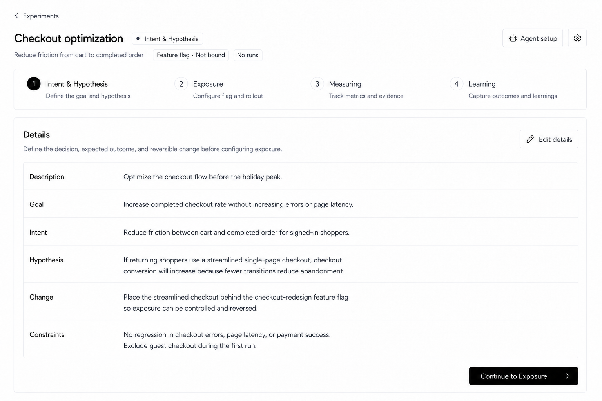
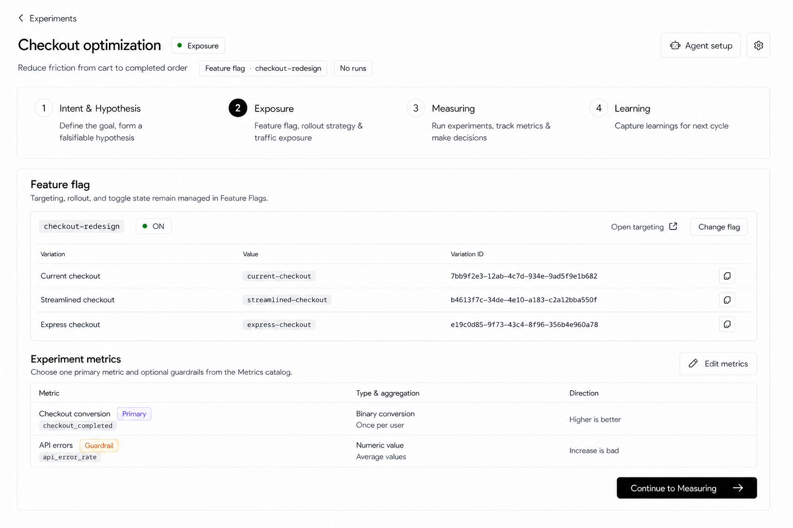
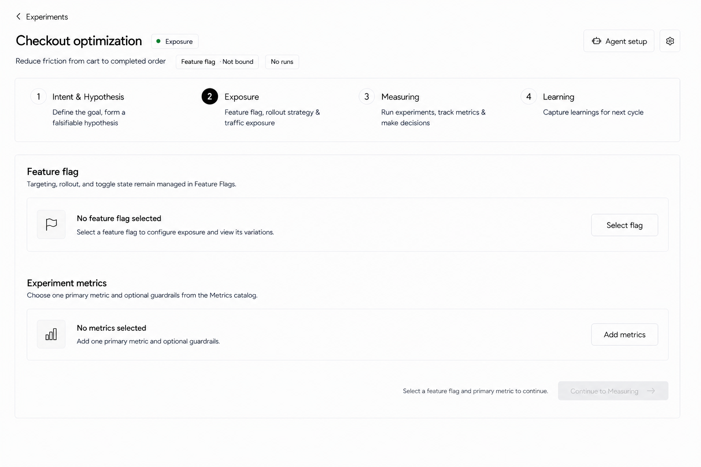
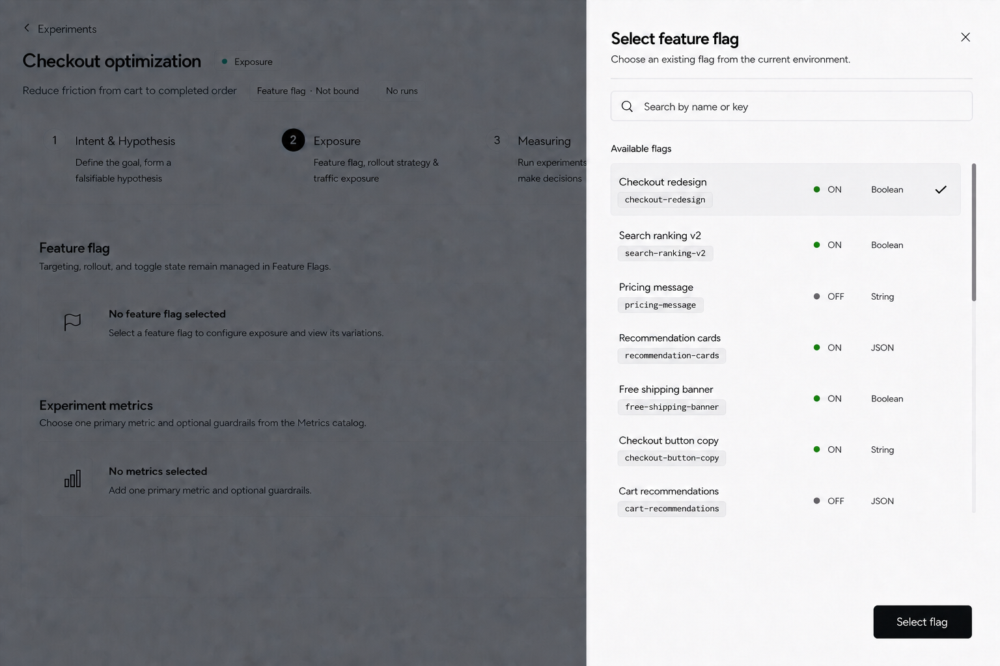
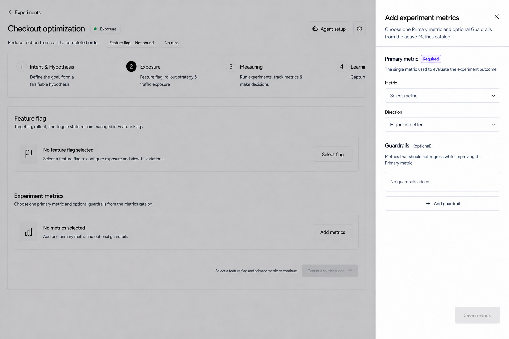
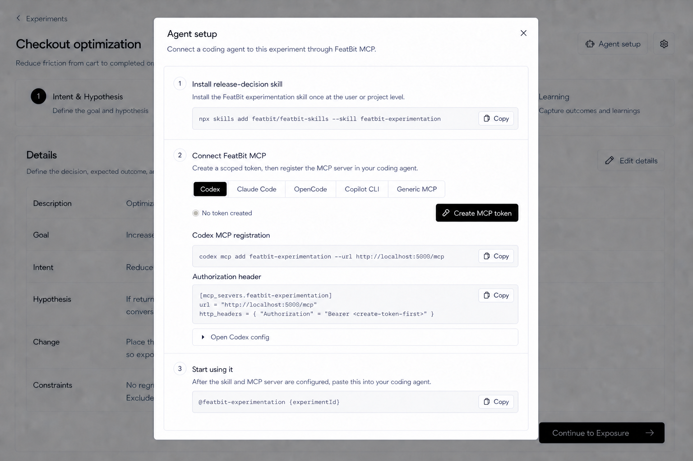
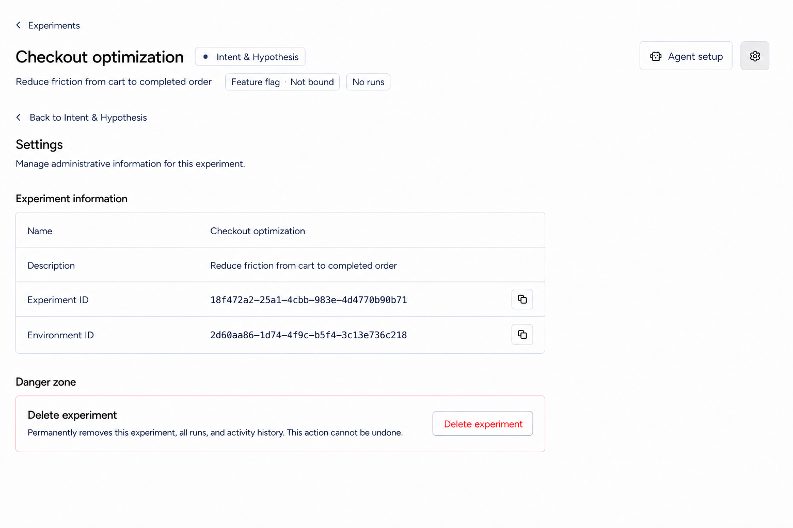

# Release Decision Experiment Details Page Design

## Scope

This document defines the approved React design for the **Experiment details** main page under **Release Decision** in `front-end`.

The approved visual scope currently includes:

- the Experiment detail header;
- the four-stage navigation;
- the **Intent & Hypothesis** stage;
- the **Exposure** stage;
- the read-only Details presentation and its edit entry;
- Feature Flag and Run summary states;
- the primary transition to **Exposure**;
- the Agent setup Dialog and Experiment settings entry;
- conditional conflict feedback.

Explicitly excluded:

- sidebar, context bar, Header, environment switcher, and authenticated-shell changes;
- Experiments, Metrics, and Layers list redesigns, which have already been migrated separately;
- final visual designs for the Measuring and Learning stage bodies;
- Audit log UI;
- React, route, API, backend, test, configuration, package, or i18n implementation.

`front-end-rda-tempo` remains the functional and semantic reference. It is not the visual reference. The current React application, especially the migrated Release Decision lists, is the visual and interaction reference.

## Approved Design Asset



### Exposure stage



#### Empty configuration state



##### Select Feature Flag Sheet



`Select flag` opens a right-side Sheet over the unchanged Exposure page. Use the current React **Attach policies** Sheet and its shared `CommandInput` / `SelectableCommandList` composition as the primary visual and interaction reference, adapted to a single Flag selection:

- use the same full-height Header, scrollable Body, and fixed Footer composition as the existing React Sheets; use the standard compact Header spacing and thin Header bottom border, while keeping the Footer free of a top divider;
- keep the Sheet scoped to the Experiment's current application environment; do not add Project or Environment selectors or duplicate the context bar;
- title it `Select feature flag` and explain that the list comes from the current environment;
- provide one compact `CommandInput` search field for Flag name or Key and an independently scrollable, progressively loaded list of non-archived Feature Flags;
- each selectable row shows the human-readable name, exact Key, ON/OFF state, and Variation type; do not show the Variation count;
- keep the list heading as `Available flags` without an inline total; do not show a total, pagination summary, page number, or previous/next controls;
- render candidates as compact, borderless Command items with small vertical gaps; do not use a rounded table container or full-width row separators;
- use strict single selection through the shared Command-item treatment rather than Radio or Checkbox controls; the complete row is the selection target, and the footer `Select flag` action remains disabled until one row is selected;
- when a row is selected, reuse the shared Command item's neutral `bg-accent` treatment and show one neutral near-black Check in a reserved trailing column, then enable `Select flag` with the standard primary button treatment; selecting another row moves the single Check without shifting row content, and the green ON status color is never reused for selection;
- use the available desktop Sheet height efficiently: at the 1536 × 1024 reference size, show seven compact rows before scrolling; load the next batch as the user approaches the bottom, following the Attach policies Sheet behavior;
- match the Attach policies Footer: show only one compact, default-size primary `Select flag` button aligned to the bottom-right with standard Sheet Footer padding and whitespace above it; do not add a Footer top border or horizontal divider;
- keep `Select flag` disabled until one candidate is selected, show a submitting state while binding, and prevent repeated confirmation;
- do not copy the Attach policies `Selected policies` summary, selected-item Badges, `All / Selected` tabs, `Clear all`, or multi-select behavior; retain the wider Flag metadata layout and trailing-Check single selection while reusing its progressive list loading and single-action Footer;
- close and Escape dismiss without changing the binding; confirmation binds the selected Flag, loads its real Variations, closes the Sheet, refreshes Exposure, and reports success;
- loading, no-results, initial load failure, load-more failure, and bind failure remain recoverable inside the Sheet. A load-more failure appears at the bottom of the retained results with `Retry`; a no-results state directs the user to create a Flag in Feature Flags rather than fabricating one here.

##### Add Experiment Metrics Sheet



`Add metrics` opens a right-side Sheet over the unchanged Exposure page:

- match the existing React Sheet frame, typography, control density, overlay, and full-height behavior;
- use a fixed Header with the standard compact `px-6 py-5 pr-12` spacing and a thin neutral bottom border; keep the title, explanatory subtitle, and close action inside this Header;
- use a scrollable Body and fixed Footer so multiple Guardrails can grow without turning the configuration into a tall centered Dialog; the Footer remains free of a top divider;
- title it `Add experiment metrics` and state that exactly one Primary metric is required while Guardrails are optional;
- the Primary group contains an active catalog Metric selector and a Direction selector with `Higher is better` and `Lower is better`;
- the Guardrails group begins with `No guardrails added`; `Add guardrail` creates a compact row containing Metric, `Alert if` direction, and Remove controls;
- allow multiple Guardrails, but do not allow the same Metric to be selected more than once or to be both Primary and Guardrail;
- use only active Metrics from the current environment; an empty catalog explains that Metrics must be created from the Metrics page;
- keep `Save metrics` disabled until a Primary metric is selected; close and Escape discard no persisted changes, while a dirty close uses the shared discard-changes confirmation;
- match the Attach policies Footer and the Select Feature Flag Sheet: show only one compact, default-size `Save metrics` button aligned to the bottom-right with standard Sheet Footer padding and whitespace above it; do not add a Footer top border or horizontal divider;
- while saving, show a submitting state and prevent repeated confirmation; keep the Sheet open on recoverable failure and, on success, close it, refresh Exposure, and report success.

When neither dependency has been configured, preserve the same continuous Exposure workspace and replace populated data regions with compact horizontal empty states:

- the identity metadata shows `Feature flag · Not bound` and `No runs`;
- Feature Flag shows `No feature flag selected`, explains that selecting one reveals its Variations, and provides the outline `Select flag` action;
- Experiment metrics shows `No metrics selected`, explains the Primary and optional Guardrail requirement, and provides the matching outline `Add metrics` action;
- `Select flag` and `Add metrics` have equal visual weight because both configure missing dependencies; reserve the primary button treatment for the enabled `Continue to Measuring` action;
- do not render empty Variation or metric table headers, placeholder rows, large illustrations, or oversized empty cards;
- do not render a full-width divider between Feature Flag and Experiment metrics; their headings, spacing, and compact bordered regions already provide sufficient separation;
- keep `Continue to Measuring` visible but disabled until a Feature Flag and Primary metric are configured; place `Select a feature flag and primary metric to continue.` beside it so the blocked requirement is explicit.

The Exposure content uses one continuous bordered workspace containing `Feature flag`, `Experiment metrics`, and the primary progression action. It begins directly with `Feature flag`; do not repeat the active-stage title or its purpose because both already appear in the four-stage navigation. Do not split Feature Flag and Experiment metrics into separate large cards. `Continue to Measuring` remains at the bottom-right inside the shared workspace.

The Feature Flag configuration uses one compact bordered group:

- the first row shows the exact Flag Key, toggle state, `Open targeting`, and `Change flag`;
- one horizontal divider separates the summary row from the Variation column headers and rows;
- do not render a `Variations`, `Variations (count)`, or equivalent title because the `Feature flag` section and `Variation` column already provide the context;
- the Variation table does not receive another rounded outer border; use only the shared configuration-group border and horizontal row separators.

The bound Feature Flag summary uses the real Variations returned by FeatBit. Present them as a compact list with separate `Variation`, `Value`, and `Variation ID` columns:

- `Variation` is the user-readable Variation name;
- `Value` is the served Variation value;
- `Variation ID` is the immutable technical identifier used for evaluation and experiment mapping;
- every Variation row has its own Copy icon action inside the `Variation ID` cell, visually associated with that row, and it copies only the complete Variation ID;
- a successful copy temporarily reports `Copied`; the default tooltip and accessible label are `Copy variation ID`;
- keep the complete ID visible on large desktop; when space is constrained, truncate visually and expose the complete value through Tooltip while copying the untruncated ID;
- do not label Variations as `Control`, `Treatment`, or `Treatment 2` before an Experiment Run assigns those roles. An Experiment with `No runs` has only Flag Variations, not experiment roles.

The `Experiment metrics` table must reuse the same metric-role Badge treatment as the Metrics page `Experiment runs` column. Do not create a details-page-specific role style:

- `Primary`: outline Badge with restrained violet border, light violet background, normal-weight violet text;
- `Guardrail`: outline Badge with restrained amber border, light amber background, normal-weight amber text;
- do not render a separate `Role` column; place the Badge immediately after the human-readable metric name in the `Metric` column, while the metric key remains on the second line;
- keep Badge height, padding, radius, and typography consistent with the shared Metrics-page role Badge in light and dark themes.

### Agent setup Dialog



### Settings page



The asset above supersedes `release-decision-experiment-settings-light.png` and `release-decision-experiment-settings-polished-light.png`. It preserves the compact information layout and adopts a GitHub-style single-row Danger zone treatment without copying repository-specific actions or terminology.

This image is the approved large-desktop, light-theme direction.

It supersedes `release-decision-experiment-details-intent-hypothesis-light.png`, which did not include stage subtitles. `release-decision-experiment-details-measure-light.png` is not an approved Measuring-stage specification and must not be treated as implementation guidance.

## Design Direction

Use the established React release workbench language:

- compact desktop layout;
- native shadcn/Base UI controls and tokens;
- neutral foreground and muted text colors;
- thin borders and restrained radii;
- no ambient shadows, gradients, decorative cards, or large empty presentation areas;
- semantic color only for warnings, errors, and meaningful status;
- no Angular/ng-zorro visual cloning;
- no blue body text or blue labels merely for emphasis.

The page must remain readable at a glance. The Experiment identity and current stage come first, followed by the four-stage workflow and the current stage content.

## Information Architecture

The main page is organized into three vertical regions:

1. Experiment identity and page actions;
2. four-stage navigation;
3. current-stage content.

The page must not introduce a secondary local sidebar. The four stages are represented directly in the horizontal stage navigation.

## Experiment Header

### Back navigation

- Show a back link labeled `Experiments`.
- It returns to the Experiments list while preserving the normal application shell.

### Identity block

Show:

- Experiment name as the page title;
- current-stage Badge beside the title;
- Experiment description as one muted subtitle line when present;
- Feature Flag binding summary;
- Run summary.

Approved examples:

- stage Badge: `Intent & Hypothesis`;
- unbound Feature Flag: `Feature flag · Not bound`;
- bound Feature Flag: `Feature flag · {flagKey}`;
- no Runs: `No runs`;
- existing Runs: `{count} run` or `{count} runs`.

The Feature Flag value is the Flag Key when a Flag is bound. A newly created Experiment has no Flag, so it must display `Feature flag · Not bound`; the page must not show an empty Badge, fabricated key, or placeholder such as `—`.

Long names, descriptions, and Flag Keys must truncate before they displace the stage Badge or page actions. Full values may be exposed through the shared tooltip pattern where needed.

### Header actions

Right-aligned actions are:

1. `Agent setup` — the single entry to the coding-agent setup flow;
2. Settings icon button — opens Experiment settings.

Do not add:

- a second `Open Agent setup` action at the bottom of the page;
- Audit log;
- an ellipsis menu;
- last-updated time;
- modified-by identity.

Agent setup is optional support functionality and must not compete visually with the primary stage action.

## Agent Setup Dialog

Clicking the header `Agent setup` action opens a large centered Dialog over the current Experiment detail page. It does not navigate away from the Experiment and does not introduce a local sidebar.

### Dialog frame

- width approximately `900–980px` on large desktop;
- maximum height constrained to the viewport;
- fixed header and scrollable body;
- standard translucent overlay with the current Experiment page preserved behind it;
- title: `Agent setup`;
- description: `Connect a coding agent to this experiment through FeatBit MCP.`;
- standard close icon in the top-right.

Begin the first setup step directly below the Dialog description. Do not add an Experiment/environment context row: the Dialog is already opened from the current Experiment and the environment is already owned by the application context bar. Do not show the sidebar or context bar inside the Dialog, and do not duplicate project/environment selectors.

### Step 1: Install release-decision skill

Show:

- title: `1. Install release-decision skill`;
- helper: `Install the FeatBit experimentation skill once at the user or project level.`;
- one copyable command:

```text
npx skills add featbit/featbit-skills --skill featbit-experimentation
```

The command block uses a compact muted monospace treatment with a direct `Copy` action.

### Step 2: Connect FeatBit MCP

Show:

- title: `2. Connect FeatBit MCP`;
- helper: `Create a scoped token, then register the MCP server in your coding agent.`;
- one segmented Agent selector;
- token status and token lifecycle action;
- Agent-specific registration and configuration snippets.

Agent selector options remain:

1. `Codex`;
2. `Claude Code`;
3. `OpenCode`;
4. `Copilot CLI`;
5. `Generic MCP`.

Use a neutral segmented control. The selected Agent uses the dark active treatment; inactive choices remain neutral. Switching Agent changes only the configuration help and snippets below it.

#### Token states

Before token creation:

- status: `No token created`;
- primary action: `Create MCP token`;
- configuration examples use `<create-token-first>` and never fabricate a credential.

During creation:

- disable repeated submission;
- label the action `Creating token...`;
- retain the selected Agent and visible instructions.

After creation:

- show the token creation and expiry information without displaying the complete token as ordinary page text;
- inject the token only into the copyable configuration value required by the current behavior;
- expose `Revoke saved token` as a destructive outline action;
- retain copy actions for each configuration block.

Expired token:

- show a compact warning that a new token is required;
- keep `Create MCP token` available;
- do not silently reuse the expired credential.

Creation or revocation error:

- show recoverable inline feedback inside Step 2;
- retain all previously selected configuration state;
- do not close the Dialog.

If the Experiment is not bound to a FeatBit environment, disable token creation and show:

`Bind a FeatBit environment before connecting an agent.`

#### Codex configuration

For Codex, provide these copyable groups:

1. `Codex MCP registration`;
2. `Authorization header`;
3. collapsible `Open Codex config` instructions.

Registration command:

```text
codex mcp add featbit-experimentation --url http://localhost:5000/mcp
```

Authorization configuration:

```toml
[mcp_servers.featbit-experimentation]
url = "http://localhost:5000/mcp"
http_headers = { "Authorization" = "Bearer <create-token-first>" }
```

`Open Codex config` is collapsed by default to keep the Dialog compact. Expanding it exposes the existing Windows PowerShell and macOS/Linux commands.

Claude Code, OpenCode, Copilot CLI, and Generic MCP retain their HTTP MCP JSON configuration. The design reuses the same configuration region rather than rendering five separate panels.

### Step 3: Start using it

Show:

- title: `3. Start using it`;
- helper: `After the skill and MCP server are configured, paste this into your coding agent.`;
- one copyable prompt containing the current Experiment ID:

```text
@featbit-experimentation {experimentId}
```

`{experimentId}` represents dynamic Experiment data. It is not literal production copy.

### Security and interaction rules

- create a token scoped to the current environment and Experiment;
- never place a real access token in a static design asset, log, helper sentence, or unmasked status label;
- all code and prompt blocks provide an explicit `Copy` action;
- a successful copy may temporarily replace `Copy` with `Copied`;
- keep keyboard focus trapped within the Dialog while open;
- closing the Dialog does not revoke a valid saved token;
- revocation requires an intentional click and must not be coupled to Dialog close;
- no `CF` numbers, Audit log, activity feed, stage readiness, or modified-by information appears in the Dialog.

## Four-Stage Navigation

The stage names are existing product terminology and must not be renamed:

| Step | Persisted stage | Title | Subtitle |
| --- | --- | --- | --- |
| 1 | `hypothesis` | `Intent & Hypothesis` | `Define the goal, form a falsifiable hypothesis` |
| 2 | `implementing` | `Exposure` | `Feature flag, rollout strategy & traffic exposure` |
| 3 | `measuring` | `Measuring` | `Run experiments, track metrics & make decisions` |
| 4 | `learning` | `Learning` | `Capture learnings for next cycle` |

Presentation rules:

- use four evenly distributed items inside one bordered horizontal container;
- show a numbered circle, title, and one-line subtitle for each stage;
- keep the active number circle black with white text;
- keep inactive stages neutral and readable;
- align each numbered circle with its two-line text block;
- allow the navigation height to grow only enough to contain the subtitle;
- use neutral text rather than stage-specific blue links.

Do not display `CF-01` through `CF-08`, skill names, or other internal framework identifiers. The RDA reference uses these as internal capability mappings; they are not Experiment IDs, Flag Keys, or user-facing product terminology.

## Intent & Hypothesis Content

### Section header

- Title: `Details`
- Helper text: `Define the decision, expected outcome, and reversible change before configuring exposure.`
- Right action: `Edit details` with a Pencil icon.

The title must be `Details`. Do not use `Experiment framing` or `Frame the decision`; neither label comes from the existing user-facing RDA workflow.

### Read-only fields

Render one compact bordered field group with horizontal separators. Keep labels in a stable left column and values in a flexible right column.

Display fields in this order:

| Field | Purpose |
| --- | --- |
| `Description` | Short summary of the Experiment |
| `Goal` | Measurable business outcome |
| `Intent` | Product or user outcome being pursued |
| `Hypothesis` | Falsifiable expected result and rationale |
| `Change` | Reversible treatment or behavior change |
| `Constraints` | Guardrails, limitations, and exclusions |

Field rules:

- use foreground text for labels and values;
- allow values to wrap naturally;
- preserve line breaks in multi-line content;
- do not color field values blue;
- do not put each field in a separate card;
- show a muted `Not provided` value for an empty field rather than collapsing the row;
- do not display `CF` labels or coding-agent skill hints inside the Details group.

### Edit details

`Edit details` preserves the existing ability to edit all six fields.

The future React implementation should use one compact shadcn Dialog consistent with the current product:

- title: `Edit details`;
- fields in the same order as the read-only view;
- Textarea controls sized according to expected content length;
- footer actions: outline `Cancel` and primary `Save`;
- keep entered values after a recoverable save failure;
- prevent repeated submission while saving;
- use the shared dirty-close confirmation when content has changed.

The Dialog is an interaction requirement; a separate visual asset has not yet been approved.

## Conflict Feedback

The normal no-conflict state does not need a success panel. When no conflict analysis is present, or when it reports no active conflict, keep the page clean and show no additional block.

When the backend reports an actual overlap, over-allocation, mixed assignment unit, or other relevant conflict:

- show one compact warning block below the Details field group;
- use an amber warning icon, border, and subtle background;
- title it `Experiment conflict`;
- show the server-provided explanation without rewriting its meaning;
- allow long details to wrap;
- do not prevent the user from editing Details;
- block or warn on progression only when the product rule actually requires it.

Do not permanently render an `Experiment conflict check` success message such as `No active experiment conflicts found`.

## Primary Stage Action

Place one primary action at the bottom-right of the Intent & Hypothesis content:

- label: `Continue to Exposure`;
- trailing Arrow Right icon;
- dark primary treatment consistent with the current React application.

The action advances the workflow to Exposure using the persisted stage value `implementing`. It is the only prominent page-level action in this stage.

Do not add a bottom Agent setup button or a duplicate stage action.

## Settings Boundary

The header Settings icon opens a dedicated Settings state within the Experiment details main content. It does not open a Sheet or Dialog and does not introduce an overflow menu.

While Settings is active:

- preserve the Experiment header and its identity metadata;
- give the Settings icon a subtle active neutral treatment;
- hide the four-stage navigation because Settings is not a release-decision stage;
- replace stage content with the Settings page;
- provide `Back to Intent & Hypothesis` so the user can return to the previously active stage;
- keep Agent setup available in the header without duplicating it in Settings.

The Settings content uses a left-aligned reading column approximately `1000–1080px` wide on large desktop. Do not stretch administrative rows across the complete viewport.

Keep the page compact: information rows are approximately `56–58px` high, technical Copy actions use the standard `32px` icon-button size, and major Settings sections use approximately `28–32px` separation.

### Settings header

- Title: `Settings`
- Subtitle: `Manage administrative information for this experiment.`

### Experiment information

Use one simple bordered field group with horizontal separators. All values are read-only.

Show these rows in order:

| Field | Presentation |
| --- | --- |
| `Name` | Experiment name in foreground text |
| `Description` | Experiment description with natural wrapping |
| `Experiment ID` | Complete ID in compact monospace text with Copy action |
| `Environment ID` | Complete environment ID in compact monospace text with Copy action when present |

Do not add Edit, Rename, Save, Feature Flag configuration, stage configuration, updated time, modified-by identity, or Audit log controls. Description remains editable from Intent & Hypothesis through `Edit details`, not from Settings.

If the Environment ID is absent, omit that row rather than displaying a fabricated value. The UUIDs in the design image are representative content only.

### Danger zone

Place one restrained destructive panel below Experiment information:

- section heading: `Danger zone`;
- action title: `Delete experiment`;
- helper: `Permanently removes this experiment, all runs, and activity history. This action cannot be undone.`;
- destructive outline action: `Delete experiment` without an icon.

Use one white-background bordered group containing a single compact horizontal row. Stack the action title and helper tightly on the left, place the destructive button on the right, and vertically center the button against the complete two-line text block. The helper must not flow underneath the button.

Use a thin, low-opacity destructive border around the white group. Do not tint the group background red. The button uses a neutral white or very light gray background, neutral border, and destructive red text. The section heading remains normal foreground text.

Clicking `Delete experiment` opens the existing confirmation Dialog; deletion must never happen directly from the Settings page button.

Settings owns:

- Experiment administrative information that is not part of stage content;
- permanent Experiment deletion and its confirmation.

Deletion must retain the lifecycle boundary already defined by the Experiments list design:

- explicitly name the Experiment in the confirmation;
- explain that the Experiment, its Runs, and activity history are permanently removed;
- prevent repeated submission;
- show recoverable error feedback;
- return to the Experiments list after success.

Settings must not reintroduce Audit log merely because the ellipsis menu was removed.

## States

### Loading

- preserve the header, stage navigation frame, section header, and Details group geometry;
- use field-row skeletons;
- do not replace the page with a centered spinner.

### Load error

- keep back navigation available;
- show a compact recoverable error in the content region;
- provide `Retry`;
- do not fabricate partial Experiment values.

### Empty fields

- retain all six rows;
- show `Not provided` for each missing value;
- keep `Edit details` available.

### Saving

- keep the current read-only page stable behind the Dialog;
- disable repeated Save and Dialog dismissal while the request is committed;
- on success, close the Dialog and refresh the displayed fields.

### Feature Flag binding

- before configuration: `Feature flag · Not bound`;
- after configuration: show the exact Flag Key;
- do not display a stale key while a binding change is pending or has failed.

## Responsive Behavior

### Large desktop: 1280px and wider

- use standard React page gutters;
- keep identity and actions on one header row;
- show all four stages in one row;
- keep the Details label column fixed and compact.

### Medium desktop: 960px to 1279px

- allow header metadata to wrap beneath the Experiment name;
- keep Agent setup and Settings together;
- retain four stage columns and truncate subtitles only when required;
- allow field values more vertical space rather than shrinking type.

### Compact desktop: below 960px

- keep the desktop information architecture;
- permit the stage navigation to scroll horizontally if four readable items cannot fit;
- do not collapse the stages into an unlabeled icon-only control;
- stack field labels above values when the two-column field group no longer reads comfortably;
- allow the primary action to use the available content width.

Mobile-specific redesign is outside scope.

## Accessibility

- stage items must expose current-step state semantically, not by color alone;
- icon-only Settings must have an accessible label and tooltip;
- numbered circles must not be the only source of stage meaning;
- muted subtitles must maintain readable contrast;
- focus order follows back navigation, header actions, stages, Edit details, then the primary stage action;
- warning feedback must include text and an icon, not color alone;
- all Dialog fields require visible labels and associated controls.

## Implementation Boundaries

Future implementation should separate detail-page orchestration, identity header, stage navigation, Details view, edit Dialog, conflict feedback, settings, and stage transition behavior by responsibility.

Use existing shared shadcn/Base UI components without modifying their generated source. All visible copy belongs in the existing global Release Decision i18n resource. Preserve the public Experiment detail route unless a route change is explicitly requested.

This document is design guidance only. It does not authorize React, API, backend, route, sidebar, context-bar, Header, test, package, configuration, or i18n changes.

## Acceptance Checklist

- [ ] Scope remains inside the Experiment details main content.
- [ ] Sidebar, context bar, Header, and authenticated shell remain unchanged.
- [ ] Experiment identity shows name, current stage, optional description, Feature Flag state, and Run summary.
- [ ] A newly created Experiment displays `Feature flag · Not bound`.
- [ ] Bound Experiments display the exact Flag Key.
- [ ] Agent setup has exactly one entry in the header.
- [ ] Settings remains available through the header icon.
- [ ] Settings hides the four-stage navigation and provides `Back to Intent & Hypothesis`.
- [ ] Settings shows read-only Name, Description, Experiment ID, and optional Environment ID only.
- [ ] Technical IDs have direct Copy actions.
- [ ] Settings does not add Edit, Rename, Save, Flag, stage, or Audit log controls.
- [ ] Delete experiment opens an explicit confirmation rather than deleting immediately.
- [ ] Audit log and the ellipsis menu are absent.
- [ ] Last-updated time and modified-by identity are absent.
- [ ] The four existing stage names remain unchanged.
- [ ] Every stage has the approved human-readable subtitle.
- [ ] No `CF` number or internal skill identifier appears.
- [ ] The current stage is identifiable without relying on color alone.
- [ ] The Intent & Hypothesis section is titled `Details`.
- [ ] `Experiment framing` and `Frame the decision` do not appear.
- [ ] Description, Goal, Intent, Hypothesis, Change, and Constraints appear in the approved order.
- [ ] Details labels and values use neutral foreground colors rather than blue.
- [ ] Edit details preserves editing of all six fields.
- [ ] The normal no-conflict state does not render a success panel.
- [ ] A real conflict renders compact conditional warning feedback.
- [ ] Stage readiness is not shown.
- [ ] `Continue to Exposure` is the only prominent bottom action.
- [ ] There is no duplicate bottom Agent setup action.
- [ ] Exposure, Measuring, and Learning body designs are not inferred from this Intent & Hypothesis asset.
- [ ] No implementation work is inferred from this design document.
