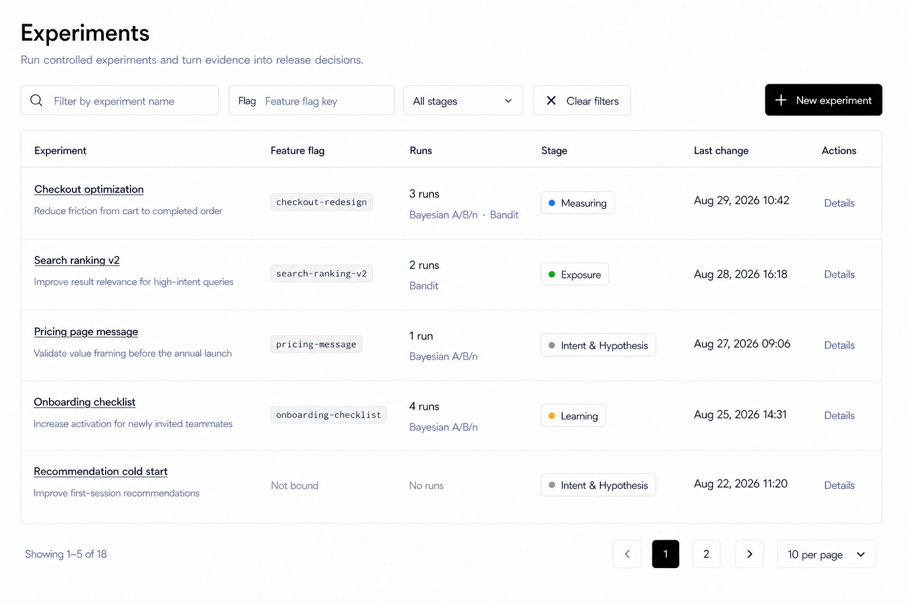
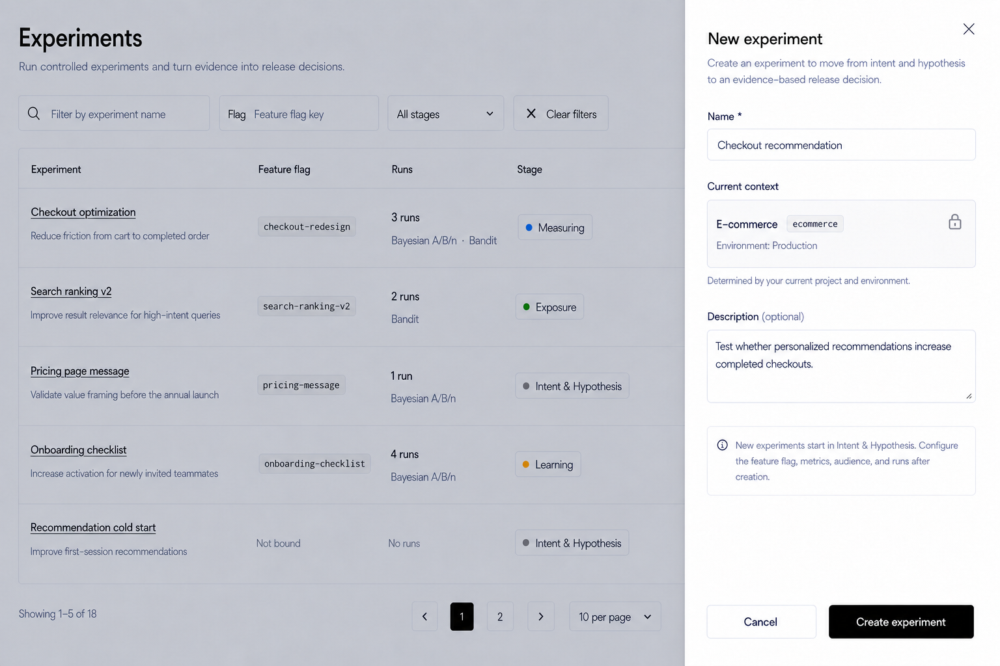

# Release Decision Experiments Page Design

## Scope

This document defines the React design for **Experiments** under **Release Decision** in `front-end`.

Included:

- the Experiments list page;
- name, Feature Flag Key, and stage filtering;
- server-side pagination and list states;
- Experiment identity, Feature Flag binding, Run summary, stage, last-change time, and row navigation;
- the New experiment Sheet;
- the delete-entry boundary required to preserve the existing Experiment lifecycle;
- current backend contracts and gaps that affect the approved design.

Explicitly excluded:

- Experiment detail-page redesign;
- Feature Flag, hypothesis, metric, audience, traffic, Run, analysis, decision, and learning configuration after creation;
- Layers and Metrics design;
- sidebar, context bar, Header, environment switcher, or authenticated-shell changes;
- React, route, API, backend, test, configuration, package, or i18n implementation.

`front-end-rda-tempo` is the functional and semantic reference. It is not the visual reference. The implemented React Layers, Metrics, and Feature Flags lists are the visual and interaction references.

## Design Assets

### Experiments list



### New experiment Sheet



The images show the approved large-desktop light-theme direction. They define the information hierarchy, density, toolbar, table, pagination, Sheet composition, and neutral status treatment.

## Product Model

An Experiment is an environment-scoped release-decision workspace. It moves through four stages:

1. `hypothesis` — **Intent & Hypothesis**;
2. `implementing` — **Exposure**;
3. `measuring` — **Measuring**;
4. `learning` — **Learning**.

An Experiment may contain multiple Runs. The analysis method belongs to each Run, not to the Experiment. One Experiment can therefore contain both:

- `bayesian_ab` — displayed as **Bayesian A/B/n**;
- `bandit` — displayed as **Bandit**.

The list summarizes all Run methods without implying that the complete Experiment has one method.

Experiment stage is not an archive status. The current Experiment lifecycle provides permanent deletion from the detail surface rather than an active/archived list mode.

## Design Direction

Use the established React release workbench:

- compact, professional desktop composition;
- neutral shadcn/Base UI controls and surfaces;
- Inter typography;
- thin borders and horizontal table separators;
- no ambient shadows, decorative cards, gradients, or large branded areas;
- muted code treatment for Feature Flag keys;
- semantic color only for Experiment stage;
- no Angular/ng-zorro visual cloning;
- no changes outside main content and the owned New experiment overlay.

## Main Page

### Header

- Title: `Experiments`
- Subtitle: `Run controlled experiments and turn evidence into release decisions.`
- Keep the title block aligned with Layers and Metrics.
- Do not repeat organization, project, or environment context in the page body.
- Do not add summary cards, totals, charts, or attention counters above the table.

### Toolbar

The toolbar has one left filter group and one right action.

Left:

1. Experiment-name search
   - Search icon.
   - Placeholder: `Filter by experiment name`.
   - Maps to the server `name` filter.

2. Feature Flag Key search
   - Visible `Flag` prefix.
   - Placeholder: `Feature flag key`.
   - Maps to the server `flagKey` filter.

3. Stage Select
   - Default: `All stages`.
   - Options: `Intent & Hypothesis`, `Exposure`, `Measuring`, and `Learning`.
   - Maps to the persisted stage keys.
   - Use `SelectContent > SelectGroup > SelectItem` in future implementation.

4. `Clear filters`
   - Ghost or subtle outline treatment with X icon.
   - Visible only when at least one filter is active.
   - Clears all three filters and returns pagination to page `1`.

Right:

5. `New experiment`
   - Primary button with Plus icon.
   - Opens the New experiment Sheet.

Changing any filter resets pagination to page `1`. Filter values should remain reflected in the URL so a filtered list can be revisited or shared.

## Experiments Table

Use one full-width bordered table with a restrained outer radius and horizontal row separators. Do not convert Experiments into cards.

| Column | Purpose | Presentation |
| --- | --- | --- |
| `Experiment` | Identity and intent | Linked name and optional one-line description |
| `Feature flag` | Current bound Feature Flag | Clickable/filterable monospace key or `Not bound` |
| `Runs` | Run count and method composition | Count plus normalized method summary |
| `Stage` | Current Experiment workflow stage | Compact outline Badge with semantic dot |
| `Last change` | Most recent Experiment update time | One date-time line only |
| `Actions` | Row navigation | Direct `Details` action |

### Experiment column

- Experiment name is a semibold foreground link to the Experiment detail page.
- Description is optional, muted, and limited to one line in the list.
- Long names and descriptions truncate without displacing later columns.
- Do not show an Experiment key because the current list model does not expose one as a user-facing identifier.

### Feature flag column

- When bound, show the exact Feature Flag Key in a compact muted monospace code control.
- Clicking the key applies that exact value to the Feature Flag filter.
- Use `Not bound` in muted text when no Feature Flag is assigned.
- Do not add a Feature Flag name unless the backend list read model explicitly supplies it.

### Runs column

Use a two-line block when Runs exist:

- first line: `{count} run` or `{count} runs`;
- second line: normalized method composition in muted text.

Approved display summaries:

| Run composition | Display |
| --- | --- |
| No Runs | `No runs` |
| Bayesian only | `Bayesian A/B/n` |
| Bandit only | `Bandit` |
| Both methods | `Bayesian A/B/n · Bandit` |

`Frequentist` must not appear. It is not a supported Run method in the current product.

The backend currently returns `RunCount` and `RunMethodSummary`. The frontend may map the current backend wording (`Bayesian`, `Bandit arms`, or `Bayesian + Bandit arms`) into the approved product labels above. It must not infer method composition from a separately capped Run request.

### Stage column

Use a compact outline Badge with a visible dot and text. Color is supplemental.

- Intent & Hypothesis: neutral gray;
- Exposure: green;
- Measuring: blue;
- Learning: amber.

Avoid saturated filled badges. Every stage remains readable without color.

### Last change column

Display only `UpdatedAt` from the Experiment list response.

- Format must match the Feature Flags list: abbreviated localized month, day, year, and 24-hour time on one line, for example `Aug 29, 2026 10:42`.
- Use the same shared date formatter and locale behavior as Feature Flags.
- Use tabular numerals where the shared formatter/component permits it.
- Do not display `Updated by`, an avatar, actor, or change comment.

The current list backend does not return a Feature-Flags-style `LastChange` object. Experiment detail Activities include actor and system-generated activity text, but the list does not load them and they are not equivalent to a user-supplied change comment. The UI must not fabricate this information.

### Actions column

- Show one direct text-only `Details` action.
- The Experiment name and `Details` navigate to the same detail destination.
- Do not add Edit, Archive, Restore, Delete, or an ellipsis menu to the list.

Permanent deletion remains supported from the Experiment detail surface. It is intentionally absent from the high-frequency list because it deletes the Experiment, all Runs, and activity history and cannot be undone.

## Pagination

Use the same pagination structure as Layers and Metrics outside the bordered table.

Left:

- `Showing {from}-{to} of {total}`

Right, in order:

1. previous-page outline icon button;
2. solid-primary square for the current page;
3. optional adjacent page button when useful;
4. next-page outline icon button;
5. page-size Select showing `10 per page`, `20 per page`, or `30 per page`.

Disable unavailable navigation rather than hiding it. Search, Flag Key, stage, and page-size changes reset to page `1`.

The backend already returns a paged result. Future React implementation must use the requested `pageIndex` and `pageSize`; it must not retain the functional reference's temporary fixed `pageSize: 200` client behavior.

## List States

### Loading

- Preserve header, toolbar, table frame, and column headers.
- Use row skeletons matching the six-column density.
- Do not replace the page with a centered spinner.

### Initial empty

- Message: `No experiments yet`
- Helper: `Create an experiment to turn a release question into measurable evidence.`
- Show an outline `New experiment` action in the empty state while retaining the toolbar action.

### Filtered empty

- Message: `No experiments match the current filters`
- Provide `Clear filters`.
- Keep active filter values visible.

### Load error

- Keep header and toolbar available.
- Show a compact inline error inside or above the table frame.
- Provide `Retry`.
- Preserve filters and pagination state.

### Refetch and navigation pending

- Keep existing rows visible when safe.
- Disable repeated pagination actions during the request.
- Do not block unrelated row navigation.

## New Experiment Sheet

`New experiment` opens a right-side Sheet over the Experiments list. The initial object is intentionally small; Feature Flag, hypothesis, metrics, audience, traffic, and Runs are configured after creation.

### Frame

- Desktop width approximately `460px`.
- Full viewport height.
- Standard translucent overlay with the Experiments list preserved behind it.
- White/background Sheet with a subtle left boundary.
- Fixed header, scrollable body, and fixed footer.
- Header divider may follow the shared Sheet component.
- Footer has no top divider and no contrasting tonal band.

### Header

- Title: `New experiment`
- Description: `Create an experiment to move from intent and hypothesis to an evidence-based release decision.`
- Standard close button in the top-right.

### Fields

1. `Name *`
   - Required.
   - Trim whitespace before submission.
   - Example: `Checkout recommendation`.
   - Inline required validation remains attached to this field.

2. `Current context`
   - One read-only neutral bordered panel, not a Select.
   - Show current Project name and compact monospace Project Key.
   - Show `Environment: {environment name}` on a muted second line.
   - Include a Lock icon.
   - Helper: `Determined by your current project and environment.`
   - The selected environment supplies `EnvId`; the current project supplies `FeatBitProjectKey`.
   - If either required context value is unavailable, disable creation and explain that the user must select a valid project/environment from the existing context bar. Do not duplicate the switcher inside the Sheet.

3. `Description (optional)`
   - Compact four-row Textarea.
   - Trim whitespace; submit `null` when empty.

Below the fields, show one compact neutral information panel:

`New experiments start in Intent & Hypothesis. Configure the feature flag, metrics, audience, and runs after creation.`

Do not add an Experiment Key, stage Select, Feature Flag picker, Metric picker, Run method, variants, traffic allocation, audience, or analysis configuration to this Sheet.

### Footer and submission

- Outline `Cancel`.
- Primary `Create experiment`.
- No icons inside footer buttons.
- No top divider.
- Disable submission until Name and current context are valid.
- During submission, disable close, cancel, and repeated submission; use the standard loading indicator without changing button width.
- On success, navigate directly to the new Experiment detail page so the user can continue with Intent & Hypothesis.
- On failure, retain entered values and show recoverable inline error feedback.
- Closing a dirty Sheet opens the shared discard-changes confirmation.

New Experiments are created with stage `hypothesis` and sandbox status `idle`. These are backend defaults, not editable creation fields.

## Delete Experiment Boundary

Deletion is required to preserve the existing product capability, but it does not belong on the list or inside New experiment.

The Experiment detail surface owns deletion:

- destructive `Delete` action;
- explicit confirmation naming the Experiment;
- explanation that the Experiment, all Runs, and activity history are permanently removed;
- disabled repeated submission while deletion is pending;
- recoverable error feedback;
- successful deletion returns to the Experiments list.

Do not reinterpret permanent deletion as Archive. No Experiment archive/restore contract currently exists.

## Data Contract

The current paged Experiment list read model supplies:

```ts
type ExperimentListItem = {
  id: string
  name: string
  description: string | null
  stage: "hypothesis" | "implementing" | "measuring" | "learning"
  flagKey: string | null
  featBitProjectKey: string | null
  featBitEnvId: string | null
  runCount: number
  runMethodSummary: string | null
  createdAt: string
  updatedAt: string
}

type PagedExperimentResult = {
  totalCount: number
  items: ExperimentListItem[]
}
```

The list endpoint already supports environment-scoped filtering by:

- `name` using contains semantics;
- `stage` using exact stage-key matching;
- `flagKey` using contains semantics;
- `pageIndex` and `pageSize`.

Results are ordered by `UpdatedAt` descending and then `CreatedAt` descending. Run count and method summary are composed server-side for the Experiments on the current page.

The creation request must remain narrowly scoped:

```ts
type CreateExperimentPayload = {
  name: string
  description: string | null
  featBitProjectKey: string
}
```

`EnvId` comes from the environment-scoped route/context. `FlagKey` is omitted during this creation flow and configured later. The backend must continue to assign the initial stage.

### Known list limitation

The list response has `UpdatedAt` but no complete `LastChange` object. Matching the Feature Flags date format is supported without backend work. Showing operator or comment would require a new server-composed list field and is not part of this approved design.

## Responsive Behavior

### Large desktop: 1280px and wider

- Use the standard page gutters.
- Keep filters and New experiment on one toolbar row.
- Render all six columns without clipping.
- Keep the Sheet at approximately `460px`.

### Medium desktop: 960px to 1279px

- Allow toolbar controls to wrap as complete controls.
- Keep New experiment right-aligned on its row.
- Preserve the six-column table through a horizontal scrolling region if required.

### Compact desktop: below 960px

- Keep the desktop information architecture.
- Do not hide Runs, Stage, Last change, or Actions.
- Do not convert rows into cards.
- Allow pagination summary and controls to wrap.
- The Sheet may use the available viewport width.

Mobile-specific redesign is outside scope.

## Implementation Boundaries

Future implementation should split page/query orchestration, toolbar, table, pagination, Run summary, stage presentation, and New experiment Sheet by responsibility.

Use existing shared shadcn/Base UI components without modifying their generated source. All visible copy belongs in the existing global Release Decision i18n resource. The public `/experiments` route remains unchanged.

This document is design guidance only. It does not authorize React, API, backend, route, sidebar, context-bar, Header, test, package, configuration, or i18n changes.

## Acceptance Checklist

- [ ] Scope remains within the Experiments list and its owned New experiment overlay.
- [ ] Sidebar, context bar, Header, and authenticated shell remain unchanged.
- [ ] Header uses the approved title and subtitle without summary cards.
- [ ] Toolbar provides Experiment name, Feature Flag Key, and stage filters.
- [ ] Clear filters appears only when filters are active.
- [ ] Filter changes reset pagination to page `1`.
- [ ] New experiment is the only primary toolbar action.
- [ ] The table has exactly Experiment, Feature flag, Runs, Stage, Last change, and Actions columns.
- [ ] Experiment name and Details navigate to the detail page.
- [ ] Feature Flag Key is filterable and `Not bound` is supported.
- [ ] Runs shows singular/plural count and complete method composition.
- [ ] Mixed Runs display `Bayesian A/B/n · Bandit`.
- [ ] `Frequentist` never appears.
- [ ] Stage uses the approved compact outline Badge and visible label.
- [ ] Last change shows only `UpdatedAt` in the Feature Flags date-time format.
- [ ] Last change does not fabricate actor or comment data.
- [ ] List Actions contains only Details and no destructive action or overflow menu.
- [ ] Pagination uses the backend paged result rather than a fixed 200-item client request.
- [ ] Loading, initial empty, filtered empty, error, and refetch states are covered.
- [ ] New experiment uses the approved right-side Sheet.
- [ ] Sheet fields are Name, read-only Current context, and optional Description only.
- [ ] New experiments start in Intent & Hypothesis.
- [ ] Feature Flag, Metrics, Audience, and Runs are configured after creation.
- [ ] Sheet footer has no divider line or tonal band.
- [ ] Dirty close uses the shared discard confirmation.
- [ ] Successful creation navigates to the new Experiment detail page.
- [ ] Permanent deletion remains available only from Experiment detail with explicit confirmation.
- [ ] No implementation work is inferred from this document.
