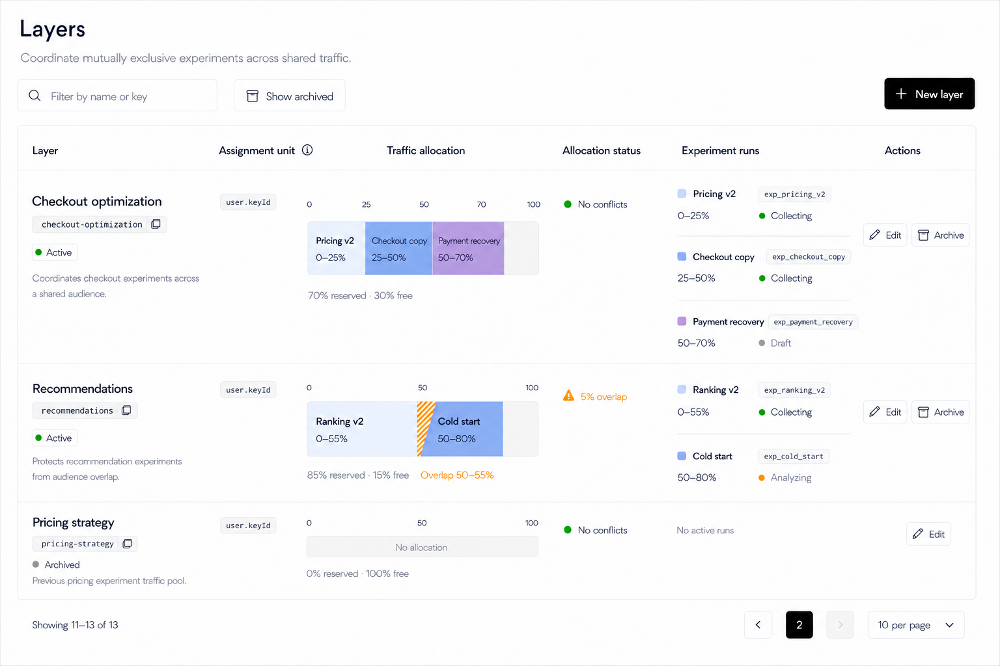
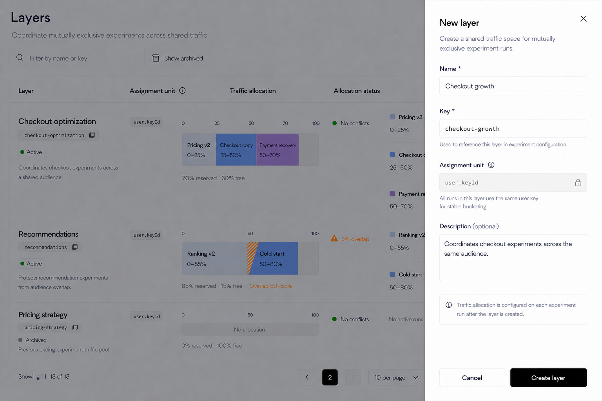

# Release Decision Layers Page Design

## Scope

This document defines the React design for the **Layers** workflow under **Release Decision** in `front-end`.

Included:

- the Layers list page;
- search, archived-state filtering, server pagination, and list states;
- Layer identity, assignment unit, traffic allocation, allocation health, and experiment-run presentation;
- direct row actions;
- the New layer Sheet;
- the corresponding Edit and Archive interaction rules needed by the list design;
- data-contract requirements and known backend gaps that affect the design.

Explicitly excluded:

- Metrics and Experiments page design;
- experiment-run creation and traffic-allocation editing;
- missing or unregistered Layer references discovered while configuring an Experiment;
- changes to the sidebar, context bar, environment switcher, Header, or authenticated application shell;
- implementation changes to React, routes, APIs, backend services, tests, configuration, or i18n.

`front-end-rda-tempo` is the functional and semantic reference for Layers. It is not the visual reference. The current React Feature Flags and Segments list pages are the visual and interaction references.

## Design Assets

### Layers list

### New layer Sheet

The images show the large desktop light-theme design at 1536 x 1024. They define the approved information hierarchy, density, alignment, color usage, toolbar, pagination, and Sheet composition.

## Product Model

A Layer is an environment-level registry entry that coordinates mutually exclusive Experiment runs in one shared `0-100` bucket space.

The page must keep three different concepts distinct:

1. **Layer lifecycle status**
   - Values: `active` or `archived`.
   - Belongs to the Layer record.
   - Controlled through `Show archived` and row actions.

2. **Allocation status**
   - Derived from all relevant runs assigned to the Layer.
   - Describes the Layer's complete allocation health, not one run.
   - Examples: `No conflicts`, `5% overlap`, mixed assignment units, or allocation above 100%.

3. **Experiment-run lifecycle status**
   - Belongs to each individual run.
   - Examples: `Draft`, `Collecting`, and `Analyzing`.
   - Displayed inside the Experiment runs column and never substituted for Allocation status.

The page contains only registered Layer records returned by the Layers API. It must not synthesize rows from Experiment runs that reference missing Layer keys. Missing references belong to Experiment configuration and validation, where the user can repair the source of the problem.

## Design Direction

Use the established React workbench language:

- compact professional desktop layout;
- neutral shadcn/Base UI surfaces and controls;
- Inter typography;
- thin borders, horizontal row separators, and no ambient card shadows;
- dark foreground text for names and actions;
- muted foreground text for descriptions, keys, summaries, empty values, and pagination;
- semantic color only for state and allocation visualization;
- no Angular/ng-zorro styling;
- no visual changes outside the main content.

Blue and purple are data-visualization colors in this page. They are reserved for Traffic allocation segments and their matching run markers. Ordinary links, descriptions, summaries, and actions must not be blue at rest.

## Main Page

### Header

- Title: `Layers`
- Subtitle: `Coordinate mutually exclusive experiments across shared traffic.`
- Keep the title block compact and aligned with Feature Flags and Segments.
- Do not repeat organization, project, or environment context in the page body.
- Do not show a Layer total or global attention total in the header or toolbar.

### Toolbar

The toolbar has two groups.

Left:

1. Search input
   - Search icon.
   - Placeholder: `Filter by name or key`.
   - Server-side search.
   - Changing the normalized query resets pagination to page `1`.

2. `Show archived`
   - Outline toggle with the standard Archive icon.
   - Unpressed: show active Layers.
   - Pressed: show archived Layers using the neutral selected treatment.
   - Changing the mode resets pagination to page `1`.

Right:

3. `New layer`
   - Primary button with Plus icon.
   - Opens the New layer Sheet.

Do not include a generic `Status` filter. The backend status represents `active / archived`, which duplicates `Show archived` and is ambiguous beside the `Allocation status` table column.

Do not relabel that control as `Allocation status`. The current backend does not provide server-side allocation-health filtering, so such a control would be incomplete or misleading with pagination.

## Layers Table

Use one full-width bordered table with a rounded outer container. Keep only horizontal separators. The table may grow vertically when a Layer has many runs; the design does not truncate or fold Experiment runs.

All cells use middle vertical alignment relative to the complete row. Multi-line content in a cell is treated as one grouped block and centered as a unit.

| Column | Purpose | Presentation |
| --- | --- | --- |
| `Layer` | Registry identity and lifecycle | Name, key, lifecycle badge, description |
| `Assignment unit` | Stable bucketing identity | Read-only code value with explanatory Info tooltip |
| `Traffic allocation` | Shared bucket occupancy | `0-100` scale, run segments, reserved/free summary, overlap treatment |
| `Allocation status` | Health of the complete Layer allocation | Normal or warning summary derived from all runs |
| `Experiment runs` | Every run assigned to the Layer | All runs shown directly as compact two-line groups |
| `Actions` | All valid row operations | Direct icon-and-label buttons on one line |

### Layer column

- Layer name uses semibold foreground text and is not a link.
- Key appears as a muted monospace code pill with Copy icon.
- Clicking the key control copies the exact key and shows standard success or failure feedback.
- Lifecycle appears as a compact status line:
  - green dot plus `Active`;
  - gray dot plus `Archived`.
- Description uses muted text and wraps naturally.
- Long names, keys, and descriptions truncate only when required by available width; the complete value remains recoverable through the shared tooltip pattern.

### Assignment unit column

- Display `user.keyId` as a muted, monospace code value.
- The header includes an Info icon.
- Tooltip copy: `The user attribute used to keep bucketing consistent. All runs in a layer must use the same assignment unit.`
- The value is vertically centered and is not styled as an editable control in the list.

### Traffic allocation column

The visualization represents one Layer's shared `0-100` bucket space.

- Show compact axis labels at `0`, `50`, and `100`; additional boundary labels may appear when they materially improve reading.
- Each run occupies its exact start/end range.
- A run's segment color matches the small square beside that run in Experiment runs.
- Unallocated traffic uses the neutral background.
- Text inside a segment shows the Experiment name and range when the segment is wide enough.
- Do not place critical information only inside a narrow segment; the Experiment runs column remains the complete textual source.

Below the bar:

- normal example: `70% reserved · 30% free`;
- no allocation: `0% reserved · 100% free`;
- overlap adds an explicit warning range, for example `Overlap 50-55%`.

Overlapping ranges use an amber diagonal hatch only over the conflicting interval. The hatch is not a generic warning decoration; it maps directly to a specific bucket range.

### Allocation status column

Allocation status belongs to the complete Layer.

Normal:

- green dot;
- label `No conflicts`.

Warning examples:

- amber warning icon plus `5% overlap`;
- mixed assignment units;
- total allocated range above 100%;
- invalid or otherwise conflicting ranges.

Warnings must identify the problem rather than using a generic label such as `Needs attention`. Allocation status does not display `Draft`, `Collecting`, or `Analyzing`; those are run states.

### Experiment runs column

Display **all runs directly**. Do not add `View all`, a collapsed counter, a Details button, a popover, or an overflow menu.

Each run is a compact two-line group:

First line:

- matching allocation-color square;
- Experiment name as a foreground link;
- run key in a muted monospace pill, for example `exp_pricing_v2`.

Second line:

- left: bucket range, for example `0-25%`;
- right: colored state dot and run lifecycle, for example `Collecting`.

Separate adjacent runs with a subtle horizontal divider. When there are no active runs, show `No active runs` in muted text.

Do not display a Feature Flag key in this column. Combining an Experiment run key and a Flag key without explicit labels creates unnecessary ambiguity, and the Flag is not required for the Layer-management task.

### Actions column

Show every valid action directly. Do not use a Details button or ellipsis menu.

Active Layer:

- pencil icon plus `Edit`;
- Archive icon plus `Archive`.

Archived Layer:

- pencil icon plus `Edit`.

Actions use compact shadcn button treatment, remain on one horizontal line, and are vertically centered in the complete row. They must not wrap into separate lines.

The page-level `New layer` action is the only create action. Never show `Create layer` as a row repair action.

## Pagination

Use the exact Feature Flags pagination pattern outside the bordered table, separated by approximately 16px.

Left:

- `Showing {from}-{to} of {total}`

Right, in order:

1. previous-page outline icon button;
2. one solid-primary square containing only the current page number;
3. next-page outline icon button;
4. page-size Select showing `10 per page`, `20 per page`, or `30 per page`.

Do not render a list of page-number buttons. Disable unavailable navigation rather than hiding it.

Search, archived-mode, and page-size changes reset to page `1`. Keep existing rows visible while fetching the next page when the query strategy supports it, and disable repeated pagination actions during the request.

## New Layer Sheet

`New layer` opens a right-side Sheet instead of navigating to a separate page or opening a centered Dialog. This matches the current React New flag and New segment workflows while preserving list context.

### Frame

- width approximately `430-480px` on desktop;
- full viewport height;
- standard translucent overlay;
- white/background Sheet surface with a subtle left boundary;
- fixed header, scrollable body, and fixed footer;
- header divider is retained;
- footer has no divider line or tonal band.

### Header

- Title: `New layer`
- Description: `Create a shared traffic space for mutually exclusive experiment runs.`
- Standard close button in the top-right.

### Fields

1. `Name *`
   - Required.
   - Maximum length: 256 characters.
   - Name initially generates the Key.

2. `Key *`
   - Required.
   - Editable monospace input.
   - Maximum length: 128 characters.
   - Allowed backend format: starts with an alphanumeric character, followed by alphanumeric characters, `.`, `_`, `:`, or `-`.
   - Helper: `Used to reference this layer in experiment configuration.`
   - Once the user edits Key directly, later Name edits must not overwrite it.

3. `Assignment unit`
   - Info icon beside the label.
   - Read-only muted input showing `user.keyId`.
   - Lock icon inside the input.
   - Helper: `All runs in this layer use the same user key for stable bucketing.`

4. `Description (optional)`
   - Compact three-row textarea.

Below the fields, show one compact neutral informational row:

`Traffic allocation is configured on each experiment run after the layer is created.`

Do not add Status, traffic percentage, bucket range, or Experiment selection to the creation form. New Layers are created as Active. Traffic is reserved later by individual Experiment runs.

### Footer and submission

- `Cancel`: outline button.
- `Create layer`: primary text-only button with no icon.
- Buttons share one row and are right-aligned.
- Footer has no top divider.
- Disable submission until required fields are valid.
- During submission, disable close/cancel/repeated submission and show the standard loading indicator without changing the button width.
- On success, close the Sheet, refresh the list, and show a success toast.
- On failure, keep the entered values and show recoverable error feedback.
- Closing a dirty Sheet opens the shared discard-changes confirmation.

## Edit And Archive Interactions

### Edit Layer

Use the same right-side Sheet frame as New layer.

- Title: `Edit layer`.
- Fields: Name, Key, read-only Assignment unit, and Description.
- Footer: `Cancel` and text-only `Save changes`.
- No footer divider.
- Archiving remains a separate row action rather than a status field inside the form.

The current backend permits Key updates. If product behavior later makes Layer keys immutable after runs reference them, the backend contract and Edit design must change together; do not enforce a UI-only immutability rule.

### Archive Layer

- `Archive` opens a confirmation; it never mutates immediately from the row.
- Confirmation names the Layer and explains that archived Layers are removed from the active list.
- Existing Experiment-run references must remain visible and must not be silently deleted.
- If archiving should be blocked while runs are active, enforce that invariant in the backend and expose the returned reason. Do not rely on a client-only check.

## States

### Loading

- Preserve the table frame and headers.
- Use row skeletons matching expected cell density.
- Do not replace the whole page with a centered spinner.

### Initial empty

- Message: `No layers yet`
- Helper: `Create a layer to coordinate mutually exclusive experiment runs.`
- Show one outline `New layer` action in the empty state while retaining the primary toolbar action.

### Filtered empty

- Message: `No layers match your search`
- Provide `Clear search`.
- Do not imply that no Layers exist in the environment.

### Archived empty

- Message: `No archived layers`
- Keep `Show archived` visibly selected so the reason is clear.

### Load error

- Keep the page header and toolbar available.
- Show an inline table error with `Retry`.
- Do not erase the user's current search, archived mode, or pagination state.

### Mutation pending and failure

- Disable only the affected action or form.
- Preserve other rows' usability.
- Use standard Sonner feedback for completion and failure.

## Color And Typography Contract

- Page and Layer titles: foreground.
- Layer and Experiment names: foreground, semibold; links are not blue at rest.
- Keys: muted monospace pills.
- Descriptions, summaries, empty values, and pagination: muted foreground.
- Normal actions: foreground.
- Green: active, healthy, or collecting state dots only.
- Amber: overlap, analyzing, or other allocation warnings only.
- Gray: archived or draft state dots.
- Blue and purple: allocation segments and matching run markers only.
- No decorative gradients, colored card borders, or ambient shadows.

## Data Contract And Backend Requirements

### Already supported

The current Layers API supports:

- environment-scoped Layer records;
- `name`, `key`, `description`, `assignmentUnitSelector`, and `status`;
- paged list responses with `totalCount`;
- `pageIndex` and `pageSize`;
- active/archived status values;
- create and update operations.

### Required for a reliable production list

The visual table requires richer server data than the current Layer list item provides. With server pagination, the browser must not infer global Layer allocation from a separately capped Experiment list.

Prefer a server-composed Layer list/read model that returns, for every Layer item:

- complete assigned run summaries;
- active run ranges and lifecycle states;
- reserved percentage;
- free percentage;
- overlapping ranges;
- whole-Layer allocation status;
- assignment-unit consistency result.

The API may expose this through an enriched list response or a dedicated per-Layer summary endpoint, but the result must remain correct beyond the current page and beyond any arbitrary Experiment fetch cap.

### Known gaps affecting this design

1. **Unified name/key search**
   - The current filter exposes separate `Name` and `Key` fields and combines populated filters.
   - The approved single input needs an OR-style `searchText` query or equivalent backend behavior.
   - Do not implement it as current-page-only filtering.

2. **Allocation-status filtering**
   - Not currently supported server-side.
   - Therefore the design has no Allocation status filter.

3. **Global attention count**
   - The paged response supplies Layer `totalCount`, not a cross-page allocation-warning count.
   - Therefore the design has no `x layers need attention` summary or shortcut.
   - If restored later, the backend must return a global `attentionCount` and support the corresponding server-side filter.

4. **Layer Key uniqueness**
   - The current validator checks required value, length, and format but does not establish an environment-level uniqueness contract.
   - Product and backend ownership must define whether Layer keys are unique before the UI promises duplicate validation.

5. **Archive safety**
   - Any rule blocking archive while runs are active must be enforced by the backend.

## Rejected Alternatives

- Generic `Status` filter: ambiguous and duplicates `Show archived`.
- Client-only Allocation status filter: incorrect across server pages.
- Global `x layers need attention`: no reliable current backend source.
- Synthetic unregistered-Layer rows: data originates from Experiment configuration, not the Layer registry.
- `Details` button or ellipsis menu: redundant because all runs and valid actions are already visible.
- Flag key in Experiment runs: unnecessary for Layer management and ambiguous beside the run key.
- Collapsed runs or `View all`: conflicts with the requirement to display every run directly.
- Create-Layer row action: duplicates the page-level `New layer` action.
- Traffic allocation fields in New layer: allocation belongs to each Experiment run.
- Centered New layer modal: loses list context and diverges from current React create workflows.
- Footer divider in the Sheet: adds visual separation without improving task structure.

## Acceptance Criteria For Later Implementation

- Only registered Layer records appear as rows.
- The toolbar contains Search, Show archived, and New layer; no Status filter is present.
- No Layer total or global attention summary appears above the table.
- Pagination matches Feature Flags exactly and uses server `totalCount`.
- Every table cell is vertically centered relative to its complete row.
- Layer and Experiment names use foreground styling rather than default blue links.
- All runs are visible directly, with Experiment name, run key, range, and run lifecycle.
- Allocation status describes the complete Layer and is visually separate from run lifecycle.
- Overlap hatching maps to an exact bucket interval and has explicit text.
- Actions remain on one horizontal line and use icons plus labels.
- New layer opens a right Sheet with only Name, Key, Assignment unit, and Description.
- Assignment unit is visibly read-only and explained.
- Create layer is a text-only primary button.
- The Sheet footer has no divider.
- Sidebar, context bar, Header, Metrics, and Experiments remain unchanged.

