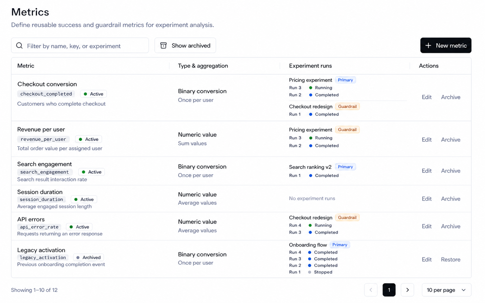
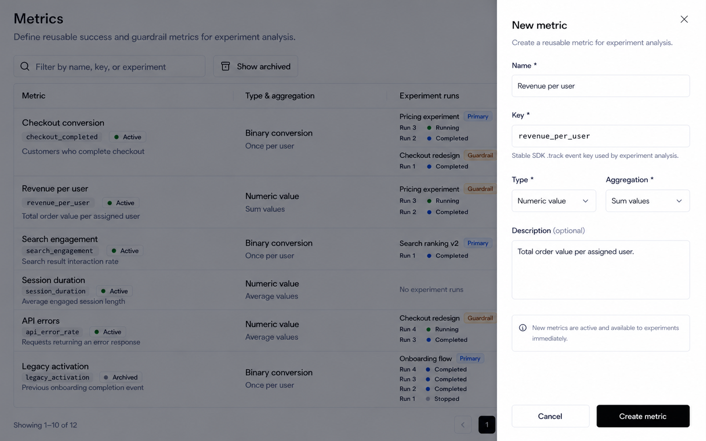
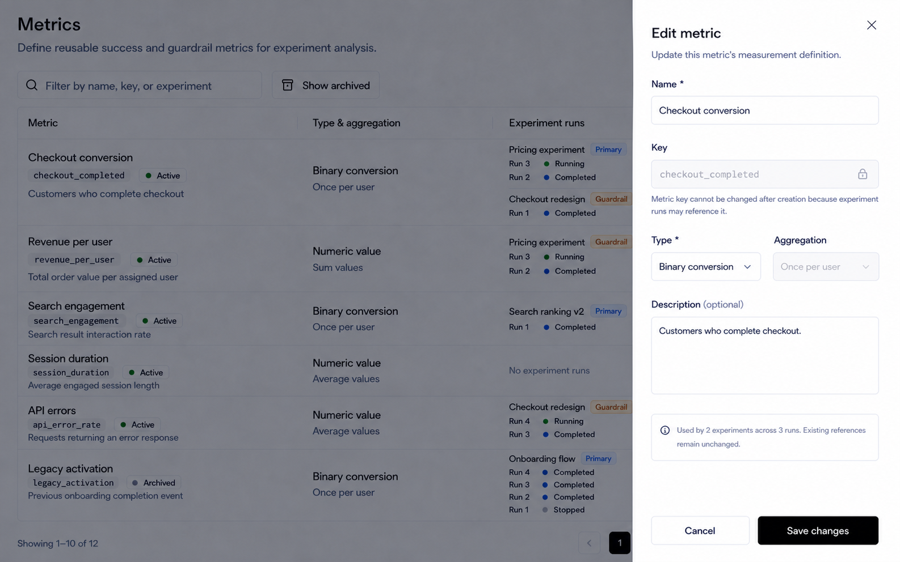
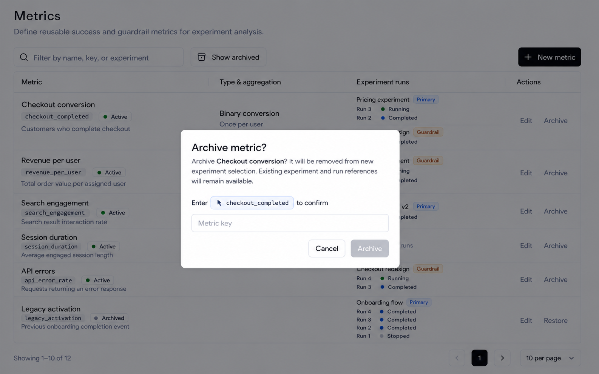

# Release Decision Metrics Page Design

## Scope

This document defines the React design for the **Metrics** list page under **Release Decision** in `front-end`.

Included:

- the Metrics main-content list page;
- search, active/archived switching, server pagination, and list states;
- Metric identity, lifecycle status, type, aggregation, Experiment usage, and individual Experiment-run presentation;
- direct row actions;
- the New metric and Edit metric right-side Sheets;
- Archive confirmation and Restore behavior;
- the functional boundaries that the list actions must preserve.

Explicitly excluded:

- Experiments page design;
- Layers page changes;
- Metric detail or analysis pages;
- a separate visual design for discard-changes confirmation;
- changes to the sidebar, context bar, environment switcher, Header, or authenticated application shell;
- implementation changes to React, routes, APIs, backend services, tests, configuration, packages, or i18n.

`front-end-rda-tempo` is the functional and semantic reference for Metrics. It is not the visual reference. The implemented React Layers page is the primary visual and interaction reference. Feature Flags and Segments remain supporting references for list density and shared controls.

## Design Assets

### Metrics list



### New metric Sheet



### Edit metric Sheet



### Archive metric confirmation



The images show the approved large-desktop light-theme designs. They define the information hierarchy, toolbar, table columns, status treatment, direct Experiment-run presentation, row actions, pagination, Sheet composition, form density, and Archive confirmation.

The image is a design reference rather than literal production data. Run names and lifecycle examples illustrate the required presentation. The implementation must render the actual records returned for the selected environment.

## Product Model

A Metric is an environment-level reusable measurement definition for Experiment analysis.

Each Metric has four distinct concerns:

1. **Identity**
   - Name and stable event Key.
   - The Key maps to the event identifier used by SDK tracking and Experiment analysis.

2. **Catalog lifecycle**
   - Values: `active` or `archived`.
   - Active Metrics may be selected by new Experiments.
   - Archived Metrics remain visible for historical references and prior Runs.

3. **Measurement behavior**
   - Type: Binary conversion or Numeric value.
   - Aggregation: Once per user, Count all, Sum values, or Average values.
   - Binary conversion always uses Once per user.

4. **Experiment usage**
   - A Metric may be used as a Primary metric or Guardrail.
   - Usage must identify the Experiment and every individual Run that references the Metric.
   - Run lifecycle is separate from Metric catalog lifecycle.

Do not collapse these concepts into one generic Status. Metric lifecycle belongs in the Metric column; Run lifecycle belongs beside each Run in Experiment runs.

### Current rda-demo lifecycle behavior and migration decision

The current rda-demo Catalog status control and the Archive action operate on the same Metric `status` field; they are not separate pieces of lifecycle data.

- Edit submits Catalog status through the generic Metric update request.
- Archive calls the Metric delete route, but the backend behavior is a soft archive that writes `status = "archived"`; it does not physically delete the Metric.
- The existing update normalization accepts `archived` but does not transition an already archived Metric back to `active`. Therefore, changing Catalog status to Active is not a dependable restore path.
- This also means the Catalog status selector duplicates the Archive action while bypassing the approved Key-confirmation interaction.

The React migration must use one explicit lifecycle path per transition:

- New and Edit do not expose Catalog status.
- Archive is initiated only by the confirmed Archive action and preserves historical Experiment and Run references.
- Restore is initiated only by the direct Restore action and calls a dedicated Restore endpoint.
- The frontend must not simulate Restore by sending `status: "active"` through the generic update endpoint.

## Design Direction

Use the established React workbench language:

- compact professional desktop layout;
- neutral shadcn/Base UI surfaces and controls;
- Inter typography;
- thin borders and horizontal row separators;
- no ambient card shadows;
- dark foreground text for names, headings, and actions;
- muted foreground text for descriptions, aggregation details, empty values, and pagination;
- semantic color only for lifecycle dots and Primary/Guardrail roles;
- no Angular/ng-zorro styling;
- no visual changes outside the main content.

The page is a catalog and relationship workbench, not an analytics dashboard. Do not add KPI cards, charts, summary tiles, decorative illustrations, or a page-level total.

## Main Page

### Header

- Title: `Metrics`
- Subtitle: `Define reusable success and guardrail metrics for experiment analysis.`
- Keep the title block compact and aligned with Layers.
- Do not repeat organization, project, or environment context in the page body.
- Do not display a Metric total in the header or toolbar.

### Toolbar

The toolbar has two groups.

Left:

1. Search input
   - Search icon.
   - Placeholder: `Filter by name, key, or experiment`.
   - Searches Metric name, Metric Key, description, type, aggregation, lifecycle, and associated Experiment name.
   - Search must be server-side when the list is paginated.
   - Changing the normalized query resets pagination to page `1`.

2. `Show archived`
   - Outline toggle with the same Archive icon and selected treatment as Layers.
   - Unpressed: show active Metrics.
   - Pressed: show archived Metrics.
   - Changing the mode resets pagination to page `1`.

Right:

3. `New metric`
   - Primary button with Plus icon.
   - Right-aligned with flexible space between the filter and action groups.
   - Opens the New metric creation surface when that surface is implemented.

Do not show `12 metrics`, another total, or a generic Status filter in the toolbar. Result totals belong only in pagination.

## Metrics Table

Use one full-width bordered table with a rounded outer container. Keep only horizontal row separators and no ambient shadow. Rows may grow vertically to show every associated Run.

Recommended large-desktop proportions:

| Column | Width | Purpose |
| --- | ---: | --- |
| `Metric` | 34% | Identity, lifecycle, and description |
| `Type & aggregation` | 22% | Measurement behavior |
| `Experiment runs` | 31% | Experiment role and every individual Run |
| `Actions` | 13% | Valid row operations shown directly |

The table should retain a practical minimum width around `1100-1180px`. On narrower desktop content areas, use horizontal scrolling rather than hiding columns or converting rows into cards.

### Metric column

Display the following as one grouped block:

1. Metric name in semibold foreground text.
2. One compact metadata line containing:
   - the stable Key as a muted monospace pill;
   - the lifecycle Badge.
3. Description in muted text.

The lifecycle Badge must match Layers:

- transparent/background surface;
- thin neutral outline;
- normal-weight text;
- small circular state dot;
- green dot plus `Active`;
- zinc-gray dot plus `Archived`.

Do not use a green-tinted Badge background. Do not create a separate Status column.

The Key should use the existing copyable-key pattern when implementation begins. Copy feedback uses the shared success/failure toast behavior.

### Type & aggregation column

Use a compact two-line block:

- first line: `Binary conversion` or `Numeric value` in foreground text;
- second line: `Once per user`, `Count all`, `Sum values`, or `Average values` in muted text.

Binary conversion always displays `Once per user`. Do not expose a contradictory aggregation value.

### Experiment runs column

Display **all associated Runs directly**. Do not replace them with a count, `View all`, `+N more`, a Details button, a popover, an ellipsis menu, or another hidden surface.

Group Runs by Experiment.

Experiment group header:

- Experiment name as a foreground link;
- compact role Badge: `Primary` or `Guardrail`;
- Primary uses a restrained violet treatment;
- Guardrail uses a restrained amber treatment.

Run line:

- stable Run display identifier or key in compact monospace text;
- small lifecycle dot;
- visible lifecycle label such as `Running`, `Completed`, or `Stopped`;
- the Run identifier links to the corresponding Experiment Run when a routable destination exists.

Run-state color follows the same semantic mapping used by Layers. Color is supplemental; the visible status text is required.

When adjacent Experiment groups exist, separate them with a subtle horizontal divider. Run lines target approximately `20-22px` height so the relationship remains dense but readable.

If one Metric is used with different roles across historical Runs, do not incorrectly assign one role to the complete Experiment group. Show the role at Run level or split the group so every displayed relationship remains accurate.

When there are no associated Runs, display `No experiment runs` in muted text.

### Actions column

The header must visibly read `Actions`.

Show every valid action directly. Match Layers and do not use a three-dot or other overflow menu.

Active Metric:

- text-only `Edit`;
- text-only `Archive`.

Archived Metric:

- text-only `Edit`;
- text-only `Restore`.

Actions use compact ghost-button treatment, remain on one horizontal line, and are vertically centered in the complete row. They must not wrap or collapse into icons.

## Pagination

Use the exact implemented Layers pagination pattern outside the bordered table, separated by approximately `16px`.

Left:

- `Showing {from}-{to} of {total}`

Right, in order:

1. previous-page outline icon button containing only ChevronLeft;
2. one solid-primary square containing only the current page number;
3. next-page outline icon button containing only ChevronRight;
4. page-size Select displaying `10 per page`, `20 per page`, or `30 per page`.

Do not render `Previous` or `Next` text buttons. Do not render a list of page-number buttons. Disable unavailable navigation rather than hiding it.

Search, archived mode, and page-size changes reset to page `1`. Keep existing rows visible while fetching the next page when the query strategy supports it, and disable repeated pagination actions during the request.

Follow the project Select composition rule: `SelectContent > SelectGroup > SelectItem`.

## List States

### Loading

- Preserve the page header, toolbar, table frame, and table headers.
- Render row skeletons matching the four-column structure and variable run density.
- Do not replace the whole page with a centered spinner.
- During refetch, keep existing rows visible when safe.

### Initial empty

- Message: `No metrics yet`
- Helper: `Create a reusable metric for experiment analysis.`
- Show one outline `New metric` action in the empty state while retaining the primary toolbar action.

### Filtered empty

- Message: `No metrics match your search`
- Provide `Clear search`.
- Do not imply that the environment contains no Metrics.

### Archived empty

- Message: `No archived metrics`
- Keep `Show archived` visibly selected so the reason is clear.

### Load error

- Keep the page header and toolbar available.
- Show a compact inline error inside or above the table frame.
- Provide `Retry`.
- Preserve search, archived mode, page index, and page size.

### Mutation pending and failure

- Disable only the affected row action or form.
- Preserve all other rows' usability.
- Use standard Sonner feedback for completion and failure.

## New Metric Sheet

`New metric` opens a right-side Sheet and preserves the Metrics list behind the standard translucent overlay. Do not use the centered Dialog from `front-end-rda-tempo`.

### Frame

- Desktop width: approximately `460px`.
- Full viewport height.
- Fixed header with bottom border.
- Scrollable body with `24px` horizontal padding.
- Fixed footer with no top divider or contrasting tonal band.
- Standard close button in the top-right.

### Header

- Title: `New metric`
- Description: `Create a reusable metric for experiment analysis.`

### Fields

1. `Name *`
   - Required.
   - Name initially generates the normalized Key.

2. `Key *`
   - Required and editable during creation.
   - Monospace input.
   - Helper: `Stable SDK .track event key used by experiment analysis.`
   - Allowed normalization follows the functional reference: lowercase letters, numbers, `.`, `_`, `:`, and `-`, with unsupported separators converted to `_`.
   - Once the user edits Key directly, later Name edits must not overwrite it.

3. `Type *`
   - shadcn Select.
   - Options: `Binary conversion` and `Numeric value`.

4. `Aggregation *`
   - shadcn Select beside Type on large desktop.
   - Options: `Once per user`, `Count all`, `Sum values`, and `Average values`.
   - Binary conversion forces `Once per user` and disables this Select.

5. `Description (optional)`
   - Compact three-row Textarea.

Below the fields, show one compact neutral information row:

`New metrics are active and available to experiments immediately.`

Do not include Catalog status, Experiment selection, Run selection, chart configuration, or analysis configuration. New Metrics are created as Active. Lifecycle changes belong to Archive and Restore.

### Footer and submission

- Outline `Cancel`.
- Primary `Create metric`.
- No icons inside footer buttons.
- Disable submission until required fields are valid.
- During submission, disable close, cancel, and repeated submission, and show the standard loading indicator without changing button width.
- Success closes the Sheet, refreshes the list, and shows a success toast.
- Failure keeps entered values and provides recoverable feedback.
- Closing a dirty Sheet opens the shared discard-changes confirmation.

## Edit Metric Sheet

`Edit` opens the same right-side Sheet frame as New metric.

### Header

- Title: `Edit metric`
- Description: `Update this metric's measurement definition.`

### Fields

1. `Name *`
   - Editable.

2. `Key`
   - Read-only muted monospace input with Lock icon.
   - Helper: `Metric key cannot be changed after creation because experiment runs may reference it.`
   - Key immutability must be enforced by the server as well as the client. The Update request must not contain `key`, and the backend must not bind or persist a replacement Key.

3. `Type *`
   - Editable Select.

4. `Aggregation`
   - Editable for Numeric value.
   - Disabled and fixed to `Once per user` for Binary conversion.

5. `Description (optional)`
   - Editable compact Textarea.

Below the fields, show a neutral usage summary when references exist, for example:

`Used by 2 experiments across 3 runs. Existing references remain unchanged.`

The summary uses actual relationship totals. It is informational, not a link or an additional usage-management control.

Do not include Catalog status. Archive and Restore remain explicit list actions with their own behavior.

The generic Metric Update operation is definition-only. It may update Name, Type, Aggregation, and Description, but it must never update `key` or `status`. Key is immutable after creation; lifecycle status can change only through the dedicated Archive and Restore operations.

### Footer and submission

- Outline `Cancel`.
- Primary `Save changes`.
- Preserve the same disabled, loading, success, failure, and dirty-close behavior as New metric.
- Existing Run analysis must retain the Metric type and aggregation snapshot used by that Run. Editing the catalog definition affects future selection and future Runs, not historical results.

## Archive Metric Confirmation

`Archive` opens an Alert Dialog and must never mutate immediately from the row. The interaction matches Layers.

### Dialog content

- Title: `Archive metric?`
- Description: `Archive {metric name}? It will be removed from new experiment selection. Existing experiment and run references will remain available.`
- Render the Metric name with semibold foreground emphasis inside the sentence.

Require exact Key confirmation:

1. Show `Enter`.
2. Show the Metric Key as a small clickable outline code button with the MousePointerClick icon.
3. Show `to confirm`.
4. Below the prompt, show an empty input with placeholder `Metric key`.
5. Clicking the Key shortcut fills the input.
6. Enable Archive only when the entered value exactly equals the Metric Key.

### Footer and completion

- No divider or tinted footer.
- Outline `Cancel`.
- Primary `Archive`; disabled until Key confirmation matches.
- Match Layers and do not introduce a red destructive fill or warning illustration.
- During submission, disable close, cancel, input, shortcut, and repeated submission.
- Success closes the Dialog, refreshes the active list, and shows a success toast.
- Failure keeps the Dialog and entered Key available for retry.
- Archiving must not remove or rewrite existing Experiment and Run references.

## Restore Metric

Restore follows the implemented Layers pattern and does not require a confirmation Dialog. Metrics require a new dedicated backend endpoint for this transition:

```http
PUT /api/v1/envs/{envId}/experiment-metrics/{metricId}/restore
```

- `Restore` returns the Metric to the active catalog.
- The endpoint sets the persisted Metric lifecycle status to `active` and updates its modification timestamp.
- The endpoint is environment-scoped and must not restore a Metric belonging to another environment.
- Repeating Restore for an already active Metric should be safe and leave it active.
- The response should follow the Layers mutation convention; a successful boolean result is sufficient because the list is refreshed afterward.
- Disable the affected action while the mutation is pending.
- On success, refresh the archived list and show standard feedback.
- On failure, retain the row and show recoverable feedback.
- Do not route Restore through generic Metric update or expose `status` in the Edit payload solely to support this action.

## Form Behavior Requirements

- All Selects use `SelectContent > SelectGroup > SelectItem`.
- Forms use React Hook Form and Zod in future implementation.
- Name and Key validation appears directly below the owning field.
- Form-level API failure does not erase valid input.
- Keyboard focus follows the shared component focus ring.
- Light and dark themes keep identical form structure and state meaning.

## Color And Typography Contract

- Page title: foreground, `24px`, semibold.
- Subtitle, descriptions, aggregation details, empty values, and pagination: muted foreground.
- Metric and Experiment names: foreground; Experiment names may underline on hover but are not blue at rest.
- Keys and Run identifiers: muted monospace treatment.
- Normal actions: foreground ghost buttons.
- Green dot: active Metric or actively running Run.
- Blue dot: completed Run in the approved reference.
- Gray dot: archived Metric or stopped/inactive Run.
- Violet Badge: Primary role only.
- Amber Badge: Guardrail role only.
- No decorative gradients, colored card borders, tinted status surfaces, or ambient shadows.

Light and dark themes must keep identical structure and information hierarchy. The supplied image defines the light-theme reference; dark theme should derive from existing tokens rather than introducing a separate layout.

## Responsive Behavior

### Large desktop: 1280px and wider

- Use the standard `32px` page padding.
- Keep filters and New metric on one toolbar row.
- Render all four columns without clipping.

### Medium desktop: 960px to 1279px

- Preserve the four-column table.
- Allow toolbar groups to wrap only when their complete labels no longer fit.
- Keep New metric right-aligned on its toolbar row.

### Compact desktop: below 960px

- Keep the table's desktop information architecture.
- Use a horizontal scrolling region with a visible scrollbar.
- Do not hide Experiment runs or Actions.
- Do not convert rows into cards.
- Pagination may wrap its left summary and right controls onto separate lines.

Mobile-specific redesign is outside scope.

## Data Contract Requirements

The approved list requires a server-composed, paged Metric read model. The frontend must not fetch a separately capped Experiment list, request every Experiment detail individually, and reconstruct global usage after pagination.

The paged Metrics response should provide:

- Metric identity and lifecycle fields;
- `totalCount` for the active server-side filters;
- all Experiment relationships for every returned Metric;
- every Run that references the Metric, including its stable identifier, lifecycle, and role.

Metric pagination applies only to the outer Metric collection. Nested Experiment and Run usage must not be silently truncated by Metric page size.

The transport naming may follow backend conventions, but the read model should be semantically equivalent to:

```ts
type PagedMetricResult = {
  totalCount: number
  items: Array<{
    id: string
    featBitEnvId: string
    name: string
    key: string
    description: string | null
    metricType: "binary" | "continuous"
    metricAgg: "once" | "count" | "sum" | "average"
    status: "active" | "archived"
    createdAt: string
    updatedAt: string
    experimentUsage: Array<{
      experimentId: string
      experimentName: string
      roles: Array<"primary" | "guardrail">
      runs: Array<{
        id: string
        key: string
        status: string
        role: "primary" | "guardrail"
      }>
    }>
  }>
}
```

Search should support one normalized server parameter, such as `searchText`, with OR semantics across Metric name, Key, description, and associated Experiment name. Separate name/key filters do not fully satisfy the approved single search field.

Usage resolution must be scoped to the selected environment. A Metric must never display Experiments or Runs from another environment because an event Key happens to match.

### Lifecycle mutation contract

Metric lifecycle mutations must remain soft transitions over the same persisted `status` field:

| Transition | Required API behavior | Result |
| --- | --- | --- |
| Archive | Use the existing archive mutation and preserve all references | `status = "archived"` |
| Restore | Add `PUT /api/v1/envs/{envId}/experiment-metrics/{metricId}/restore` | `status = "active"` |

The Restore route must have its own backend handler and service operation, equivalent in responsibility to Layers `RestoreAsync`. Authorization and environment ownership checks must match the other Metric mutations. A missing Metric, cross-environment Metric, or rejected transition must return the project's standard API error rather than reporting success without changing data.

The frontend lifecycle contract is intentionally narrow: New/Edit own definition fields; Archive/Restore own lifecycle status. Generic Metric update must not be treated as a lifecycle endpoint.

### Metric update contract

The Metric Update request must use a dedicated allowlist rather than submitting or spreading the complete Metric read model. Its writable shape is semantically equivalent to:

```ts
type UpdateMetricPayload = {
  name: string
  description: string | null
  metricType: "binary" | "continuous"
  metricAgg: "once" | "count" | "sum" | "average"
}
```

`key` and `status` are intentionally absent:

- `key` is immutable after Metric creation.
- `status` is writable only through Archive and Restore lifecycle endpoints.
- The React form must not include either field in its Update payload, including hidden or unchanged values copied from the read model.
- The backend Update command/DTO and persistence mapping must allowlist only the writable definition fields.
- If a client attempts to include or change `key` or `status` through Update, the API must reject the request with the project's standard validation error; it must not silently apply either value.
- A successful Update must preserve the currently persisted Key and lifecycle status exactly.

## Implementation Boundaries

Future implementation should split page/query orchestration, toolbar, table, Metric cell, Experiment runs cell, pagination, mutation confirmations, and creation/editing surfaces by responsibility.

Use existing shared shadcn/Base UI components without modifying their generated source. All user-visible copy belongs in the existing global Release Decision i18n resource.

This document is design guidance only. It does not authorize React, API, backend, route, sidebar, context-bar, test, package, configuration, or i18n changes.

## Acceptance Checklist

- [ ] Scope stays within the Metrics list and its owned New, Edit, and Archive overlays.
- [ ] Sidebar, context bar, Header, and authenticated shell remain unchanged.
- [ ] Header uses the approved title and subtitle.
- [ ] No total appears in the header or toolbar.
- [ ] Search covers Metric name, Key, and associated Experiment with server-side OR semantics.
- [ ] Show archived switches between active and archived Metrics.
- [ ] New metric remains the single right-aligned primary toolbar action.
- [ ] The table has exactly Metric, Type & aggregation, Experiment runs, and Actions columns.
- [ ] Metric lifecycle appears inside the Metric column using the Layers outline Badge and colored dot treatment.
- [ ] There is no standalone Status column.
- [ ] Type and aggregation remain visible as a compact two-line block.
- [ ] Every Experiment and Run reference is shown directly without counts, truncation, popovers, or overflow menus.
- [ ] Primary and Guardrail roles remain visible and accurate.
- [ ] Every Run has a visible identifier and lifecycle label.
- [ ] `No experiment runs` is shown for unused Metrics.
- [ ] Actions has a visible column title.
- [ ] Active rows show Edit and Archive directly.
- [ ] Archived rows show Edit and Restore directly.
- [ ] No three-dot action menu is used.
- [ ] Pagination exactly matches Layers, including icon navigation, current-page square, and page-size Select.
- [ ] Loading, initial empty, filtered empty, archived empty, error, and mutation states are covered.
- [ ] The server supplies complete nested usage for each paged Metric row.
- [ ] Compact desktop uses horizontal table scrolling without hiding columns or converting rows to cards.
- [ ] New metric uses the approved right-side Sheet and defaults to Active without a Catalog status field.
- [ ] New metric Name generates Key until Key is edited directly.
- [ ] Edit metric uses the same Sheet, keeps Key read-only, and omits Catalog status.
- [ ] Metric Update payload and backend Update DTO exclude both `key` and `status`.
- [ ] The backend rejects attempts to update `key` or `status` through the generic Update endpoint.
- [ ] A successful definition Update preserves the persisted Key and lifecycle status.
- [ ] Catalog status and Archive are treated as controls over the same persisted lifecycle field, not as independent data.
- [ ] Binary conversion fixes Aggregation to Once per user.
- [ ] New/Edit dirty close uses the shared discard-changes confirmation.
- [ ] Archive opens the approved Key-confirmation Alert Dialog and does not mutate immediately.
- [ ] Archive remains disabled until the exact Metric Key is entered.
- [ ] Existing Experiment and Run references survive Archive and Edit operations.
- [ ] A dedicated `PUT /api/v1/envs/{envId}/experiment-metrics/{metricId}/restore` endpoint restores the Metric to Active.
- [ ] Restore follows Layers and mutates directly with pending and feedback states.
- [ ] Restore never sends `status: "active"` through the generic Metric update endpoint.
- [ ] No implementation work is inferred from this design document.
