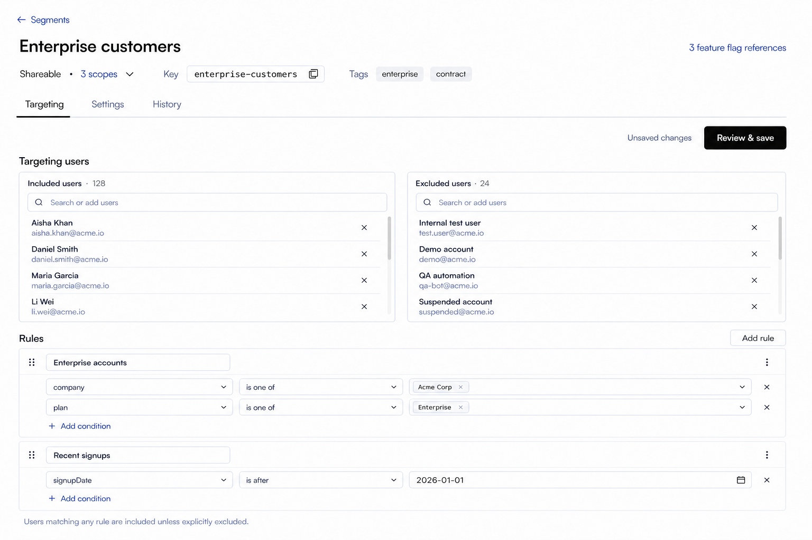
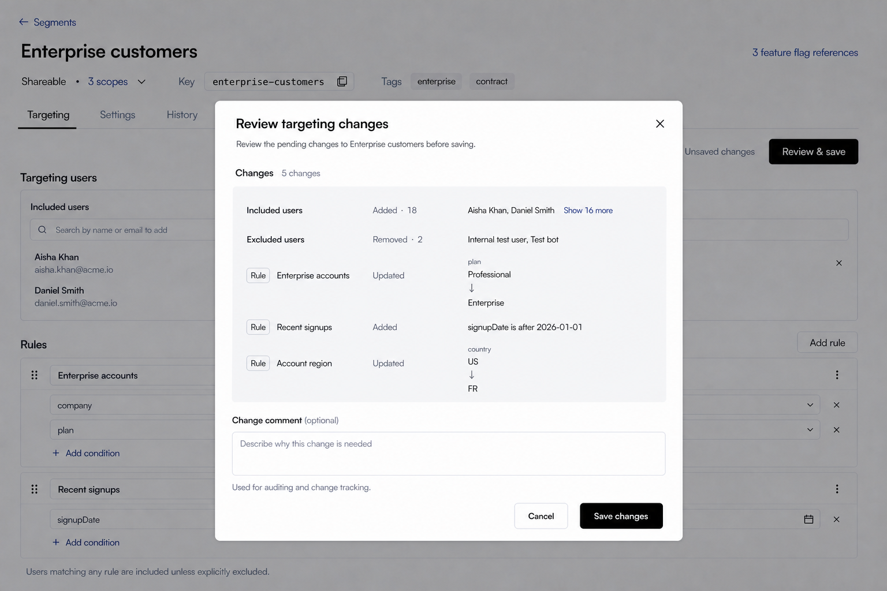
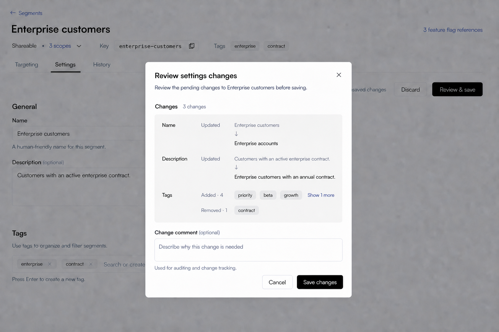
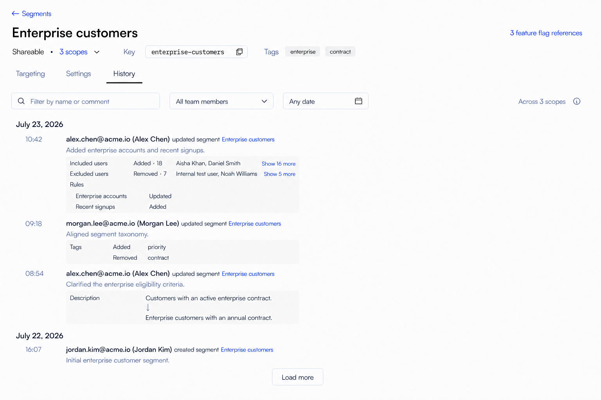
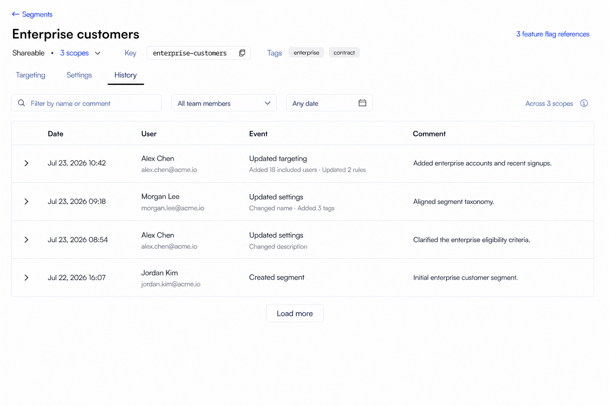
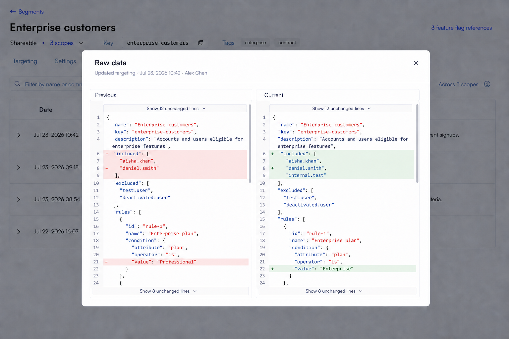
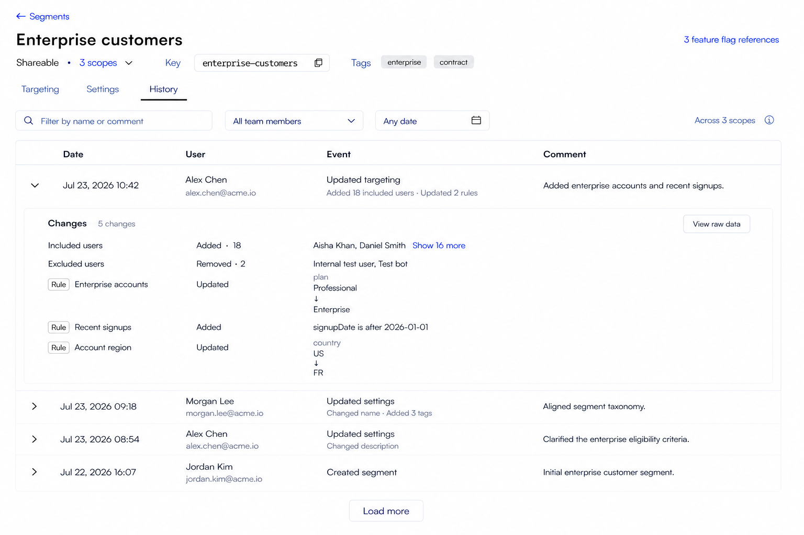

# Segments Details Page Design

## Scope

This document defines the React redesign of the Segment details workflow in `front-end`.

Included:

- the Segment summary header;
- the `Targeting`, `Settings`, and `History` tabs;
- included and excluded user selection;
- targeting-rule creation, editing, removal, and ordering;
- change review and required change comments;
- Segment name, description, tags, key, type, and scope disclosure;
- Feature Flag references;
- permission, loading, empty, dirty, saving, and error states.

Excluded:

- the Segments index workflow, which remains defined by `segments-page-design.md`;
- changes to the authenticated sidebar;
- changes to the organization/project/environment context bar;
- mobile-first layout work.

The Angular page is the functional reference only. The React page must use the compact, neutral shadcn/Base UI and Tailwind patterns established in `front-end`; it must not reproduce the Angular/ng-zorro visual structure.

## Design Asset

The default Targeting and many-users images define the accepted editor hierarchy. `segments-details-targeting-review-v2-light.png` is the authoritative Targeting Review design and supersedes its earlier review image. The Settings page image defines the form and dirty state; `segments-details-settings-review-v2-light.png` is the authoritative Settings Review design and supersedes its earlier review image. The former History stream image remains a reference only for muted semantic-detail treatment; its layout is superseded. The History table v2, expanded ledger v2, and Raw data images are authoritative for the current History workflow. Sample Segment, user, tag, scope, and rule values are illustrative; implementation must render API data.

## Finalized Design Direction

Use the selected **Focused workbench** direction:

- keep Segment identity and operational context in one compact header;
- use route-backed line tabs for `Targeting`, `Settings`, and `History`;
- place included and excluded users side by side at normal desktop widths;
- give rules the full content width so conditions remain readable;
- keep save state visible near the tab content without turning the page into a dashboard;
- use thin borders and quiet tonal surfaces, not nested cards or ambient shadows;
- present History as a compact expandable React table with one-line timestamps, no vertical dividers, and complete details on demand;
- keep the page information-dense but preserve 32-36px interactive controls and clear section spacing.

The page starts inside the existing main content area. Do not draw, replace, or restyle the sidebar or context bar.

## Information Architecture

Content order:

1. Back link to `Segments`.
2. Segment summary header.
3. `Targeting`, `Settings`, and `History` tabs.
4. Active-tab content.

The Angular implementation renders editable settings above its tabs. React separates those responsibilities: identity and frequently needed metadata remain visible in the summary header, while editable descriptive fields move into the `Settings` tab. This reduces repeated vertical weight on the main targeting workflow without removing functionality.

Routes should preserve the existing localized route prefix and use explicit detail-tab paths:

- `/segments/:id/targeting`;
- `/segments/:id/settings`;
- `/segments/:id/history`.

Opening a Segment from the index page continues to navigate to `targeting`. An unknown or omitted tab resolves to `targeting` rather than rendering an empty page.

## Segment Summary Header

Use the same compact detail-header rhythm as current React IAM detail pages.

### Back link

Show an Arrow Left icon and `Segments`. It returns to the index route and should preserve any index state already retained by the router/query layer.

### Primary row

- Render the Segment name as the page title.
- Keep the title to one line and truncate only when necessary.
- The Feature Flag reference affordance sits at the far right of the title row and is vertically centered with the title.
- Show the shorter pluralized link `{count} feature flag reference(s)` when references exist, for example `3 feature flag references`.
- Use quiet link color without a permanent underline; show the underline on hover/focus.
- Show `No feature flag references` as muted, non-interactive text when the count is zero.

### Metadata row

Use one compact, single-baseline metadata row beneath the title:

- For a Shareable Segment, combine type and scope count into one semantic group: plain text `Shareable`, a muted middle dot, then the clickable `3 scopes` value with a small Chevron Down. Do not use a `Type` or `Scopes` label, Badge, border, or filled background for this group.
- For a Current-environment Segment, show only the plain text `Current environment`; do not render a scope count or chevron.
- Show a small muted inline `Key` label followed on the same baseline by a compact monospace surface and Copy icon.
- Show a small muted inline `Tags` label followed on the same baseline by quiet neutral filled chips. Show a compact subset followed by `+N` when necessary.
- Separate the semantic groups with approximately 24px of whitespace. Do not add vertical separators or a containing metadata card.

The key copy action copies the complete value and shows `Copied`. Truncated keys and tags must remain recoverable through a tooltip.

The Shareable scope count is a lightweight Popover trigger:

- clicking `3 scopes` or its chevron opens the Popover;
- the chevron points upward while expanded;
- group the complete scope list by project;
- use the same project and environment icons established by onboarding and the Segments scope picker;
- show complete scope names and use a tooltip only when a value still requires truncation;
- keep the Popover read-only; Segment scopes are not edited from the details page;
- use an internally scrolling list when the scope list exceeds the Popover's maximum height.

The header is a summary, not an editing surface. Name, description, and tags are edited under `Settings`.

## Tab Navigation

Use shadcn line tabs on a single bottom border, matching current React detail pages.

- `Targeting` is the default tab.
- `Settings` contains descriptive and classification fields.
- `History` contains Segment audit records.
- Tab selection is represented in the URL so refresh, deep links, and browser navigation behave predictably.
- Switching tabs with unsaved changes must ask the user to discard or remain on the current tab. Do not silently lose a targeting or settings draft.

Do not place counts in the three tab labels. Counts belong near the content they describe.

## Targeting Tab

### Command row

Place a compact command row immediately below the tabs.

- When the draft equals the last loaded Segment, omit `Unsaved changes` and disable `Review & save`.
- When anything changes, show `Unsaved changes` and enable the primary `Review & save` button.
- While saving, disable editing and show the standard pending state on the primary action.
- On success, update the local/server cache, clear the dirty state, and show the shared success toast.
- On failure, retain the complete draft and show a recoverable error message.

The button opens change review; it does not save directly.

### Targeting users

Use one section titled `Targeting users`, followed by two equal-width bordered panels:

- `Included users`;
- `Excluded users`.

Each panel contains:

- a heading with the complete selected-user count rendered as small ordinary muted text, not a Badge;
- a compact `Search or add users` combobox;
- one selected user per row, with display name, secondary key, and Remove action; do not show an avatar or user icon, and do not place two users on the same row;
- an inline empty state when no users are selected.

Keep each panel at a stable bounded height when many users are selected:

- keep the panel heading and search field fixed;
- show approximately four to five complete compact rows before scrolling;
- scroll only the selected-user list inside the panel;
- show a subtle native/customized scrollbar when content overflows;
- let Included and Excluded lists scroll independently so one collection cannot increase the other panel's height;
- use list virtualization for very large collections without changing the visible interaction model;
- do not collapse selected users into a `+N more` summary or paginate the panel.

The combobox query searches both selected and available users. Matching selected users appear first with a visible `Selected` state and remain removable; available results follow and remain addable. This lets users locate an existing member without adding a second filter control.

Results must support the Angular search behavior and user creation capability. A user already selected in either collection must not be duplicated in the same collection. If the same user moves between included and excluded, resolve the conflict explicitly rather than allowing contradictory targeting.

For Shareable Segments:

- search and selection use global users only;
- creation of environment-local users is unavailable;
- selected global users remain visible even when they cannot be found in a later result page;
- the UI explains the global-user restriction beside the chooser, not in a large banner.

At narrower desktop widths, stack the two panels. Do not optimize a separate phone layout.

### Rules

Rules use the full content width beneath Targeting users.

The section header contains:

- title `Rules`;
- an outline `Add rule` button aligned right;
- a compact permission explanation when rule editing is unavailable.

Each rule is one flat bordered block with:

- drag handle;
- editable rule name;
- overflow menu containing `Remove rule`;
- ordered condition rows;
- `Add condition` as a lightweight action.

`Add rule` appends the new rule to the end of the ordered rule list, preserving the Angular behavior and the position of existing rules. After insertion, scroll the new rule into view and move focus to its name field so the result of the action is immediately visible. Do not prepend a new rule or shift the existing rules downward.

Each condition retains the Angular model and supported behavior:

- user property selection, including adding a property when supported;
- operator selection appropriate to the property/value type;
- one or more values where the operator requires them;
- condition removal;
- validation before review or save.

Use inline 32-36px controls. Attribute, operator, and value receive progressively more width. Do not use vertical separators between fields. Keep `AND` visible between multiple conditions so the match logic is understandable without extra prose.

Rules are reorderable by their handle only. Reordering marks the draft dirty. Keyboard and pointer interactions use the chosen drag-and-drop primitive's native focus and announcement behavior.

When there are no rules, show a compact inline empty state with `Add rule`; do not add illustration art or a large empty card.

### Match explanation

At the bottom of the editor, show muted copy:

`Users matching any rule are included unless explicitly excluded.`

This copy clarifies precedence without adding another configuration control.

## Review And Save Dialog

`Review & save` opens a centered shadcn Dialog, approximately 700-740px wide, that preserves the Angular targeting change-review workflow while replacing its generic diff presentation with a readable domain summary.

Header:

- title `Review targeting changes`;
- description `Review the pending changes to {segmentName} before saving.`;
- standard Close action, disabled while saving.

### Targeting change list

Show one heading row with `Changes` followed immediately by ordinary small muted `{count} changes`. The count represents the complete deterministic set of semantic targeting changes and is not a Badge. Do not right-align the count. Targeting Review is a pre-save draft review and therefore does not expose History's `View raw data` action.

Put Targeting users and Rules on one continuous neutral surface equivalent to the History `bg-muted/60` treatment:

- use the current React semantic `muted` token so the surface adapts to light and dark themes;
- use `rounded-md`, approximately 14-16px padding, no border, no shadow, and no horizontal separators;
- use one compact three-column ledger independent of the page/editor grid: object `minmax(170px, 190px)`, operation `96px`, and flexible content `minmax(0, 1fr)`, with a consistent 16px column gap;
- use typography, indentation, and approximately 10-12px vertical whitespace instead of section or rule dividers;
- do not create independent cards or nested backgrounds for groups, users, rules, or conditions;
- keep the Dialog header, Changes heading, Change comment, and footer outside this surface.

Targeting users:

- do not show a separate `Targeting users` group heading;
- render `Included users` and `Excluded users` directly as aligned ledger rows;
- use the shared three columns for collection label, neutral operation/count, and affected identities;
- within each collection, render Added and Removed as separate rows and include the affected count, for example `Added · 2`;
- render affected users as plain inline identities that wrap within the value column. Do not use avatars, chips, status Badges, or colored operation text;
- prefer display name, then email, then key, and expose the complete stable key through a Tooltip when the visible identity is not the key;
- when a user operation affects more than two identities, show the first two in stable diff order and place inline `Show {remaining} more` immediately after them with approximately 8px gap; expansion reveals every remaining identity inside the same bounded Changes surface and changes the control to `Show less`;
- preserve every affected identity in deterministic diff order; preview disclosure must never discard or silently truncate a high-cardinality collection;
- omit unchanged collections and empty Added/Removed subrows.

Rules:

- do not show a separate `Rules` group heading;
- identify every changed rule with a compact neutral outline `Rule` Badge immediately before its ordinary-text name in the object column; the Badge represents object type only;
- show the rule's Added, Removed, Updated, or Moved operation as ordinary neutral text in the operation column, never as a Badge;
- separate changed rules with approximately 10-12px of whitespace and no nested rule card;
- added rule: show `Added` and its complete readable condition summary beneath the header;
- removed rule: show `Removed` and its complete previous condition summary beneath the header;
- renamed rule: show the old muted name, a neutral down arrow on its own compact line, and the new foreground name;
- when the same rule changes both its name and one or more conditions, group the content column into explicitly labelled `Name` and `Conditions` sections; keep the current rule name in the object column as its identity, show only genuinely changed conditions in the Conditions section, and do not repeat unchanged conditions;
- edited condition: show the complete previous muted attribute/operator/value expression, a neutral down arrow on its own compact line, and the complete new foreground expression;
- added or removed condition: label the operation and show the complete expression;
- reordered rule: show `Moved from position {before} to {after}`;
- use neutral text treatments for Added, Removed, Updated, and Moved; do not rely on green/red status colors.

The complete muted Changes surface has `max-height: 360px` and `overflow-y: auto` when content exceeds that height. It is the only inner vertical scrollbar in the Dialog; expanded user and rule disclosures grow inside this surface and do not create nested scrollbars. Use `scrollbar-gutter: stable` and `overscroll-behavior: contain`; keep the surface keyboard focusable and label it from the visible Changes heading and count. Do not show raw JSON, endpoint names, IAM permission names, technical IDs, or request payloads.

### Targeting diff completeness requirement

The implementation must produce a complete semantic diff from the full saved targeting model and the full current draft. The design image is illustrative only; it is not an allowed implementation fixture or the complete set of supported operations. Do not implement the Review Dialog by recognizing only the example users, rule names, attributes, operators, or values shown in the image.

The diff implementation and automated tests must cover at least:

- no changes and structurally equivalent drafts;
- one or many users added to or removed from Included users;
- one or many users added to or removed from Excluded users;
- a user moved between Included and Excluded in the same draft without reporting contradictory duplicate operations;
- users that have no display name, cannot be resolved by the current user result page, or are represented only by a key;
- duplicate or repeated user keys in malformed input without producing duplicate review rows;
- one or many rules added or removed;
- rule rename, reorder, condition edits, and deletion/addition occurring together in one rule;
- multiple rules changed in the same draft, including rules with identical names;
- rule matching by stable rule identity rather than display name or array position;
- a rule moved while its name or conditions also change;
- zero, one, or many conditions in a rule;
- condition addition, removal, attribute change, operator change, value change, and combinations of those changes;
- empty, null-like, boolean, numeric, date/time, string, and multi-value operands supported by the rule model;
- values containing long text, Unicode, punctuation, duplicate-looking labels, or values that require wrapping;
- multi-value additions and removals without treating a semantically irrelevant ordering change as a value replacement, unless value order is meaningful for that operator;
- complete readable formatting for every supported targeting operator, including operators that accept no value;
- deterministic display order and a stable atomic `Changes` count across repeated renders of the same before/after data;
- large diffs that require bounded scrolling without dropping, truncating beyond recovery, or silently collapsing operations;
- permission or data refresh occurring while the Review Dialog is open;
- failed save followed by retry without recomputing against a partially mutated saved baseline.

Diff calculation must be pure: it must not mutate the saved Segment, current draft, rule order, condition arrays, or user collections. Every operation shown in Review must be derivable from the exact payload that will be submitted, and every submitted targeting change must have a readable representation in Review. If an unknown future operator or value type cannot be formatted semantically, show a safe structured fallback rather than omitting the change.

### Targeting change comment

Use the current environment's `Require change comment` setting (`requireChangeComment`) as the only source of required state:

- when enabled, render the visible label `Change comment *`, with the `*` immediately after the label in the standard destructive/error color; require a non-empty trimmed comment and disable submission while invalid;
- when not enabled, show `(optional)` inline with `Change comment` and allow an empty value;
- use placeholder `Describe why this change is needed`;
- show helper text `Used for auditing and change tracking.`

The Targeting review design image shows the optional state. Do not infer required state from the type or number of targeting changes.

### Targeting submission

The footer contains outline `Cancel` and primary `Save changes`, without a tinted footer background. Closing or canceling returns to the intact draft.

Saving submits included keys, excluded keys, the complete ordered rules collection, and the normalized optional/required comment through the single existing targeting endpoint. Targeting save is therefore one request, unlike the independently submitted Settings operations:

- disable the Dialog and editor actions while the request is pending;
- on success, update the saved baseline/cache, close the Dialog, clear dirty state, and show success feedback;
- on failure, keep the Dialog open, preserve the entire draft and comment, show one recoverable inline error, and allow `Save changes` to retry;
- do not display Settings-style partial-success results for Targeting.

## Feature Flag References Dialog

Clicking the header reference link opens the same reference-dialog pattern used by the Segments index archive flow.

- Title: `Feature flag references`.
- Description names the current Segment in bold.
- Render one compact bordered list; rows should not become tall cards.
- Each row shows Feature Flag name and key.
- A reference in the current environment is clickable and opens that flag's targeting page.
- A cross-environment reference remains visible but is disabled and labeled `Not in this environment`.
- If references become empty between load and open, show the inline empty state.

## Settings Tab

Settings uses one left-aligned focused form column, approximately 720-780px wide. Do not center the form or stretch its controls across the full main-content width. Use whitespace rather than section dividers or independent cards.

The persistent Segment summary header remains the authoritative read-only surface for:

- Key and its Copy action;
- Current-environment or Shareable type;
- the Shareable scope count and scope Popover;
- the last successfully saved tags.

Do not repeat Key, Type, or Scopes as disabled fields in the Settings body. Their Angular functionality remains available in the persistent header while the Settings form stays focused on editable values. The header continues to show last-saved values while a draft is dirty and updates only after the relevant save operation succeeds.

### Command row

Use the same compact command row immediately below the tabs:

- when the form is clean, omit `Unsaved changes` and disable or omit `Discard` and `Review & save` according to the shared detail-page action pattern;
- when any permitted field differs from its last-saved value, show `Unsaved changes`, an outline `Discard` button, and the primary `Review & save` button;
- `Discard` resets every Settings draft field to the last confirmed server value without affecting Targeting;
- `Review & save` validates the form and opens the Settings change-review Dialog; it does not submit directly;
- while mutations are pending, disable form controls and both actions and show the standard pending state on the primary action.

### General

Use normal labeled form controls instead of Angular's inline pencil, cancel, and save icons.

Fields:

- `Name`: required, trimmed, standard-height text input, editable only with `UpdateSegmentName`; helper text is `A human-friendly name for this segment.`;
- `Description`: optional compact multiline textarea, editable only with `UpdateSegmentDescription`; show `(optional)` inline with the label rather than as placeholder text.

Keep approximately 16px between each label/control/helper group. Do not add character counts or limits unless the backend contract defines them. Preserve the separate name and description backend updates and their independent permission checks. Review submits only fields that actually changed.

### Tags

Separate Tags from General with approximately 36-40px of clean vertical whitespace and a normal section heading. Do not render a horizontal rule, border, background band, or card between the sections. Show helper copy `Use tags to organize and filter segments.`

Provide one combined searchable multi-value field that:

- loads existing workspace/environment tag suggestions;
- excludes already-selected values from results;
- allows creation when no matching tag exists;
- supports removing pending tags;
- renders selected tags as quiet removable neutral chips inside the field;
- uses the placeholder `Search or create tag` after the selected chips;
- shows `Press Enter to create a new tag.` as helper text;
- keeps changes local until review and save;
- respects `UpdateSegmentTags` independently of name and description permissions.

The field grows vertically only when selected tags wrap; do not render a separate selected-tag card above it. Selected tags use the shared neutral Badge/combobox treatment. Do not use tag color as operational status.

### Settings save behavior

When multiple settings fields are edited, the review Dialog lists each pending operation. Because the backend preserves separate name, description, and tag endpoints, implementation may submit them sequentially or as coordinated mutations, but must:

- retain unsaved values if any operation fails;
- identify the failed field;
- refresh the Segment summary only from confirmed saved data;
- include the required change comment with every operation that requires it.

The review summary must distinguish `Name`, `Description`, and `Tags` changes and omit unchanged operations. Canceling review returns to the intact draft. A successful save clears the dirty state and leaves the user on the Settings tab.

### Settings review Dialog

Use a centered shadcn Dialog, approximately 640-680px wide.

Header:

- title `Review settings changes`;
- description `Review the pending changes to {segmentName} before saving.`;
- standard Close button, disabled while saving.

The `Changes` heading row shows `Changes` followed immediately by ordinary small muted `{count} changes`; do not right-align the count or use a Badge. For Settings, the count is the number of dirty, permitted field operations (`Name`, `Description`, and/or `Tags`), matching the independently authorized and submitted endpoints rather than counting individual tag values. Settings Review is a pre-save draft review and does not expose History's `View raw data` action.

Put the complete field-level diff on one neutral tonal surface equivalent to the History `bg-muted/60` treatment:

- use the current React semantic `muted` token so the surface adapts to light and dark themes;
- use `rounded-md`, approximately 12-16px padding, no border, no shadow, and no horizontal separators between fields;
- use one continuous surface rather than a card per field;
- use a compact three-column ledger: field `110px`, operation `90px`, and flexible content `minmax(0, 1fr)`, with a consistent 16px column gap;
- separate field groups with approximately 16-20px of whitespace;
- keep endpoint names, IAM action names, JSON, and request payloads out of the UI.

Render only dirty fields that the user is currently permitted to update:

- `Name`: show `Name` in the field column, neutral `Updated` in the operation column, then the old muted value, a neutral down arrow on its own compact line, and the new foreground value in the content column. Do not switch to a horizontal arrow for short names; Name and Description use the same vertical reading direction.
- `Description`: show `Description`, neutral `Updated`, and the old-arrow-new values through the same three columns so long text remains readable.
- `Tags`: treat Tags as one field-level change for count and permission purposes, while showing separate `Added · {count}` and `Removed · {count}` operation subrows with quiet neutral chips in the content column; omit either subrow when empty. Added and Removed are neutral non-interactive labels, not colored statuses or links.

#### High-cardinality Tags review

Large Added and Removed tag collections use compact previews and local disclosure without creating independent cards or independent scrollbars.

- When an Added or Removed collection contains three or fewer tags, show every chip and omit its disclosure action.
- When a collection contains more than three tags, show the first three in stable diff order, include the total with the operation label such as `Added · 12`, and place the inline text button `Show {remaining} more` immediately after the visible chips with approximately 8px gap; never push it to the far edge of the surface.
- Added and Removed expand independently. Expanding one does not expand the other and changes only its control to `Show less`.
- Keep the preview chips in the summary subrow and reveal only the remaining chips beneath it.
- Let expanded chips wrap naturally within the value column. Do not add avatars, another background, a nested card, a horizontal divider, or a Badge representing the remaining count.
- Long tag values truncate only when necessary and expose the complete value through a Tooltip.
- The entire Changes muted surface, not each tag collection, has `max-height: 320px` and `overflow-y: auto` when expanded content exceeds that height. This is the only inner vertical scrollbar in the Dialog.
- Use `scrollbar-gutter: stable` and `overscroll-behavior: contain` so disclosure does not shift the grid or unexpectedly scroll the page behind the Dialog.
- Keep the Dialog header, `Changes` heading, Change comment, and footer outside the Changes scroll region so they remain reachable.
- Tag disclosure triggers use `aria-expanded` and `aria-controls`, retain focus after expansion/collapse, and remain outside any clipped chip content.

Below the Changes surface, show one `Change comment` textarea:

- read the current environment's `Require change comment` setting (`requireChangeComment`) as the only source of whether the field is mandatory;
- when `Require change comment` is enabled, render the visible label `Change comment *`, with the `*` immediately after the label in the standard destructive/error color; require a non-empty trimmed value and disable submission while invalid;
- when `Require change comment` is not enabled, show `(optional)` inline with the label, allow an empty value, and do not show required validation;
- use placeholder `Describe why this change is needed`;
- show helper text `Used for auditing and change tracking.`;
- pass the same normalized comment to every dirty operation that is submitted.

The Settings review design image shows the optional state where `Require change comment` is not enabled. Do not infer required state from the number or type of pending operations.

The footer has outline `Cancel` and primary `Save changes`. It has no tinted background or decorative divider. Disable `Save changes` when the required comment is invalid or while requests are pending.

The single action is a UI-level change set, not an atomic backend transaction. Name, Description, and Tags remain independently authorized and independently submitted:

- call only endpoints for dirty, permitted fields;
- record each result separately, using `allSettled` or equivalent coordination;
- update the header/cache and saved baseline for each successful field;
- retain the draft and dirty state only for failed fields;
- never show a generic all-success message after partial success.

If any operation fails, keep the Dialog open and replace the change presentation with per-field results, for example `Saved`, `Failed`, or `Permission is no longer available`. The footer becomes `Close` and primary `Retry failed`. Retrying calls only the remaining failed operations and retains the existing comment. If permissions changed while the Dialog was open, reload permission state and prevent further edits to the denied field.

## History Tab

History is a read-only audit table built as a reusable audit-history component. It does not use the Targeting or Settings Review Dialog layout. Keep the persistent Segment summary header visible so the audited resource remains unambiguous.

### History query contract

- Always filter by Segment reference type and the current Segment ID.
- For a Shareable Segment, set `crossEnvironment=true` exactly as Angular does so records from every shared scope are included.
- For a Current-environment Segment, keep history environment-scoped and do not show a cross-scope indicator.
- Load the newest records first, using the existing audit-log page size of 10 unless the shared API contract changes.
- Preserve the API total count and append later pages through `Load more`; do not replace the loaded records when loading the next page.

### History toolbar

Use one compact toolbar row directly above the audit table:

- search input with Search icon and placeholder `Filter by name or comment`;
- searchable team-member Combobox with default label `All team members`;
- date-range Popover with Calendar icon and default label `Any date`;
- for a Shareable Segment only, right-aligned muted text `Across {count} scopes` with an Info tooltip explaining that history includes every shared scope.

The embedded Segment and Feature Flag History pages do not show the global Audit Logs `Filter by type` control because both reference type and reference ID are fixed by their routes. The global Audit Logs page retains its type filter.

Debounce the text query by 400ms. Search team members server-side with the existing 500ms debounce. Changing query, creator, or date range resets the audit-log page index to the first page and replaces the previously accumulated result set. Clearing a filter restores the unfiltered Segment history.

#### Searchable member filter

Use the established React `Popover + Command` creator-filter pattern rather than a non-searchable Select:

- The trigger uses `role="combobox"`, exposes expanded state, and shows `All team members` when no member is selected.
- When selected, show the member's display name, then email, then ID as the trigger-label fallback. Truncate the visible trigger label without losing the full identity from the open result.
- Opening the Popover reveals a `CommandInput` with placeholder `Search team members by name or email`.
- Send the debounced search value to the existing server-side team-member query. Do not rely on filtering only the currently loaded page in the browser.
- Result rows show display name and a smaller email when both exist; fall back safely to email or ID. Do not add avatars.
- Mark the selected result with the standard Check icon and close the Popover after selection.
- Show a compact loading state while searching, `No team members found` for a successful empty result, and a recoverable inline error with `Retry` when the query fails.
- When a member is active, expose a separately labelled Clear action without requiring the user to reopen the Popover.
- Clearing the filter returns the trigger to `All team members`, resets History pagination, and reloads the unfiltered creator result.
- Preserve the search query while the Popover remains open; clearing or closing behavior must follow the existing shared creator-filter convention.

#### Date range filter

The date control is a true inclusive start/end range filter, not a single-date picker:

- The closed trigger shows a Calendar icon and `Any date` when empty.
- When active, format the localized range as `{start date} – {end date}`. Use a compact date format in the trigger and expose the complete localized range through its accessible name and Tooltip if the visible value truncates.
- Open a Popover containing the official shadcn Calendar configured for range selection. Show two months side by side at normal desktop widths and one month when constrained.
- Keep the current applied range as the initial draft whenever the Popover opens.
- Selecting only a start date shows `Select an end date` and keeps `Apply` disabled.
- The Popover footer contains quiet `Clear` and outline `Cancel` actions plus primary `Apply`. It has no tinted background or decorative top divider.
- `Cancel`, outside click, or Escape closes the Popover without changing the applied filter.
- `Apply` commits only a complete start/end range, closes the Popover, resets History pagination, and issues one refreshed query. Do not refresh once for the start date and again for the end date.
- `Clear` removes both endpoints, closes the Popover, resets the trigger to `Any date`, and reloads unfiltered dates.
- Treat both selected calendar days as inclusive in the user's display timezone and convert them through the shared API date helper so records on the end date are not accidentally excluded.
- Prevent or normalize an end date earlier than the start date through the range-selection primitive; do not show an impossible range.
- During implementation, if Calendar is still absent from `front-end/src/components/ui`, add it from the official shadcn source/CLI for the current setup and do not hand-edit the generated primitive.

### Reusable audit table

Use the same neutral shadcn/TanStack table language as the current React Team page: one outer border, a quiet header row, horizontal row boundaries, compact cells, and no vertical column dividers. Every audit row is collapsed by default, including the first row. A leading Chevron disclosure button expands only that record and exposes its field-level details directly beneath the summary row.

The shared component supports these columns:

| Column | Segment / Feature Flag details | Global Audit Logs | Content |
| --- | --- | --- | --- |
| Disclosure | Show | Show | Unlabelled visual column with an accessible `Expand event` / `Collapse event` name. |
| Date | Show | Show | Complete localized date and time on one line, for example `Jul 23, 2026 10:42`. Do not split the date and time across lines. |
| User | Show | Show | Display name with email as secondary text; fall back safely to email, access-token name, `System`, or creator ID. Do not show avatars. |
| Type | Hide | Show | Plain localized text derived from `refType`: `Segment` or `Feature flag`. Do not use a Badge. Unknown future reference types use a readable fallback rather than disappearing. |
| Event | Show | Show | Concise localized event summary derived from `operation` and, for updates, `instructions`. |
| Comment | Show | Show | One-line preview of the optional comment; truncate with a Tooltip and use an em dash when absent. |

Column order is fixed:

- Segment and Feature Flag details: `Date | User | Event | Comment` after the disclosure control.
- Global Audit Logs: `Date | User | Type | Event | Comment` after the disclosure control.
- Insert `Type` immediately after `User` on the global page so resource classification is visible before interpreting the event.

The component must receive an explicit page-context or column-visibility configuration; it must not infer whether to show `Type` from incidental filter state. `Type` comes directly from the audit record's `refType`. Only the two currently supported values, Segment and Feature Flag, require first-class localized copy.

`Event` is a UI summary rather than a backend field. Map Create, Archive, Restore, and Remove from `operation`. For Update records, derive `Updated settings` from name/description/tag instructions and `Updated targeting` from target-user/rule instructions. If one record contains both categories, contains no instructions, or contains an unknown instruction kind, fall back safely to `Updated segment` or `Updated feature flag`; never infer an event from free-form comment text. Unknown future operations use a readable localized fallback.

Make Event a compact two-line cell when semantic instructions are available:

- The first line is the Event title, for example `Updated targeting`.
- The second line is a system-generated, muted summary of the actual instructions, for example `Added 18 included users · Updated 2 rules` or `Changed name · Added 3 tags`.
- Generate summary fragments from semantic instruction kinds and values, never from the free-form comment or raw JSON diff.
- Show at most two fragments in the row. When additional distinct fragments exist, append localized `· {count} more`; the complete semantic diff remains available after expansion.
- Count affected domain items rather than instruction objects: one instruction containing 18 users is summarized as `Added 18 included users`, not `1 change`.
- Preserve deterministic category order and localized whole-message grammar. If an instruction cannot be summarized safely, omit only that preview fragment and retain it in the expanded semantic fallback and Raw data view.
- Events without semantic instructions remain a one-line Event cell.

Do not add a `Changes` summary column. The semantic instruction count does not reliably represent the number of user-perceived changes, and the disclosure control already communicates whether details are available. Keep summary rows single-line at normal desktop widths. Date and Type never wrap. User, Event, and Comment may truncate only with a Tooltip containing their complete value. Use neutral historical styling rather than green/red operation colors. The entire row may not masquerade as a navigation link; only the disclosure control and genuine resource links are interactive.

### Visible change details

Render field-level change instructions only inside the expanded table row. The summary row remains compact and scannable; expansion is the explicit way to inspect one event's complete diff. Begin the expanded content with one heading row: `Changes` followed immediately by ordinary small muted `{count} changes` when semantic changes exist, and a compact outline `View raw data` button at the far right when `dataChange.previous` or `dataChange.current` exists. The count is not a Badge and is omitted when no semantic changes exist.

The count represents the complete deterministic set of semantic ledger entries rendered for the event, not the raw backend `instructions.length` and not the number of affected collection members. For example, one Included-users entry that adds 18 users contributes one change, while two independently changed rule conditions contribute two changes. Unknown instructions represented by a structured fallback still contribute to the count.

- The expanded cell spans every visible column and contains only the concrete field-level diff on one neutral tonal surface equivalent to `bg-muted/60`.
- Use the current React semantic `muted` token rather than a hard-coded blue-gray, lavender, or warm tint. The surface must adapt to light and dark themes.
- Use the shared medium radius (`rounded-md`), approximately 10-12px vertical padding and 12-16px horizontal padding, no border, and no shadow.
- Use one compact inner three-column ledger independent of the outer table columns: object `minmax(180px, 220px)`, operation `100px`, and flexible content `minmax(0, 1fr)`, with a consistent 16px column gap. Do not use equal fractional columns, `space-between`, or any layout that stretches empty space between the three values.
- Do not create nested background cards for individual fields, users, rules, or instructions.
- Render Added, Removed, Updated, and Moved as neutral non-interactive text. Only genuine navigation and disclosure controls use link styling.
- Identify each rule by placing a compact neutral outline `Rule` Badge immediately before its ordinary-text rule name in the object column. The Badge communicates object type only; never use a Badge for Added, Removed, Updated, or Moved.
- Preserve the audit record's complete instruction list with History-specific compact rows for users, rules, conditions, name, description, tags, and every other Segment instruction returned by the API.
- Description and other before/after scalar values use a clear vertical old-to-new reading order inside the same surface.
- Long values wrap when practical or truncate only with a recoverable Tooltip; no instruction or value may disappear beyond recovery.
- Show the row disclosure when semantic instructions or raw `dataChange` are available. If only raw data exists, the expanded row shows concise muted text `No structured changes available` and the `View raw data` action; it does not render an empty muted surface.

### Raw data JSON diff

`View raw data` opens a wide shadcn Dialog containing a read-only, side-by-side JSON comparison. This is an advanced audit and troubleshooting view; the semantic Changes presentation remains the default and the Dialog must never open automatically.

- Dialog title: `Raw data`.
- Beneath the title, show one compact metadata line containing the localized Event, complete timestamp, and User. On the global Audit Logs page, include Type. Do not add an avatar or repeat the complete table row as a card.
- Label the panes `Previous` and `Current`. For Create, identify the absent previous side as `No previous data`; for Remove, identify the absent current side as `No current data`.
- Use CodeMirror 6 `MergeView` from `@codemirror/merge`, with `a` bound to `dataChange.previous` and `b` bound to `dataChange.current`.
- Configure both editor states with `@codemirror/lang-json`, `EditorState.readOnly.of(true)`, and `EditorView.editable.of(false)`. Disable accept/reject merge controls; this view never mutates audit data.
- Enable line numbers, change gutters, changed-range highlighting, synchronized vertical alignment, and inline character highlighting where CodeMirror can calculate it reliably.
- Collapse long unchanged regions with a small context margin and allow each collapsed region to be expanded. Keep visible text such as `Show {count} unchanged lines`; do not rely only on a fold icon.
- Parse and pretty-print valid JSON with consistent two-space indentation before comparison. Preserve array order and serialized object-key order. If one side is missing, compare against an empty document. If parsing fails, show the original string as read-only text and a quiet `Invalid JSON snapshot` notice without preventing comparison of the other side.
- The MergeView occupies the Dialog body at a bounded height of approximately `min(65vh, 720px)` and scrolls internally. Keep the Dialog header and pane labels visible; do not let a large snapshot make the page or Dialog grow without bound.
- Use restrained addition/removal background tints that work in light and dark themes, together with `+`/`−` gutter markers and pane labels so color is never the only difference indicator. Do not reuse destructive button styling for removed JSON.
- Preserve native text selection, copy, and CodeMirror search. Pane-level Copy actions may copy the complete normalized Previous or Current snapshot and must report success or failure through the existing toast pattern.
- Mount MergeView only after the Dialog opens and call `destroy()` when it closes. Configure a bounded diff scan/timeout so very large or highly divergent snapshots fall back to a coarser diff rather than freezing the page.
- If neither snapshot exists, hide `View raw data`; never open an empty Dialog.

The project already uses CodeMirror 6 and `@codemirror/lang-json`, but does not currently include `@codemirror/merge`. During implementation, add the compatible official `@codemirror/merge` package as a normal dependency; do not copy its source or build a custom diff engine.

### High-cardinality Included and Excluded users

Included and Excluded are separate ledger rows inside the same event diff surface. Do not turn them into side-by-side comparison panels, nested cards, avatar lists, Badge collections, or comma-separated unbounded text.

Default collapsed row:

- Use the shared three-column ledger for collection label, neutral operation/count, and compact user content.
- Copy follows `{collection} | {operation} · {total} | {preview users} Show {remaining} more`, for example `Included users | Added · 18 | Aisha Khan, Daniel Smith Show 16 more`.
- When the collection contains one or two users, show all names and omit the disclosure action.
- When it contains more than two users, show the first two names in stable API order and omit email addresses from the collapsed preview.
- Truncate an unusually long preview only when necessary and provide a Tooltip containing the complete previewed identities.
- `Show {remaining} more` is an inline text button immediately following the preview identities with approximately 8px of gap. It is not a separate right-aligned action column, Badge, or bordered button; when wrapping is necessary it remains adjacent to the preview flow.

Expanded row:

- Expanding Included affects only Included; expanding Excluded affects only Excluded. Both may be open independently.
- Keep the first two preview names in the summary row and reveal only the remaining users beneath it.
- Align the expanded collection with the preview/value column rather than the left edge of the entire diff surface.
- Show a compact two-column user grid at normal desktop widths and one column when constrained.
- Each expanded user shows a medium-weight display name and a smaller muted email or unique identifier beneath it. Do not show avatars.
- Do not add another background, border, divider, or card around the expanded collection.
- Limit each expanded Included or Excluded collection to `max-height: 240px`; use `overflow-y: auto` only when content exceeds that height.
- Use `scrollbar-gutter: stable` so the content does not shift when the vertical scrollbar appears, and `overscroll-behavior: contain` so reaching the collection boundary does not unexpectedly scroll the page.
- Keep `Show less` in the summary row outside the scroll container so it remains visible.
- The scrollable region must be keyboard focusable and have an accessible name identifying the collection and operation.
- The trigger uses `aria-expanded` and `aria-controls`; expanding or collapsing retains focus on the trigger.

### High-cardinality Rules changes

Rules use the same continuous three-column ledger without a separate `Rules` group heading. Every visible rule begins with the neutral outline `Rule` Badge and its name in the object column, its operation in the operation column, and its complete condition summary or vertical old-arrow-new diff in the content column.

- When there are three or fewer rule changes, show every rule and omit disclosure controls.
- When there are more than three changes, show the first two in stable API order and place an inline text button `Show {remaining} more` after the second visible rule content.
- Expanding Rules reveals the remaining rule ledger rows inline within the same event diff surface and changes the control to `Show less`.
- Each expanded rule shows condition-level attribute, operator, and before/after value changes with compact indentation in the content column.
- Limit expanded Rules content to `max-height: 320px`; use an independent vertical scrollbar beyond that height, with stable scrollbar gutter and contained overscroll behavior.
- Rules, Included users, and Excluded users expand and scroll independently.
- Do not add an event-level accordion around these local disclosures and do not silently omit rule or condition instructions.

### History instruction completeness requirement

The History renderer must be driven by the complete audit instruction payload, not by the fields and sample values visible in the design asset. Implementation and automated tests must cover at least:

- one or many users added to or removed from Included users;
- one or many users added to or removed from Excluded users;
- Included and Excluded changes occurring together, including a user moving between the two collections;
- users with display name and email, display name only, email/key only, duplicate-looking names, long Unicode identities, and unresolved identities;
- counts at, below, and above the collapsed-preview threshold;
- expanded user collections below and above the 240px scrolling threshold;
- name and description creation, replacement, clearing, long wrapping values, and null-like values;
- one or many tags added and removed in the same event;
- rules added, removed, renamed, reordered, or edited;
- condition addition, removal, attribute/operator/value replacement, multi-value changes, and rules with zero conditions;
- Rules collections at, below, and above the disclosure threshold and 320px scrolling threshold;
- events containing several instruction categories at once without changing their API order or dropping a category;
- Event preview summaries containing zero, one, two, and more than two fragments, including instructions whose value contains many affected users, tags, rules, or conditions;
- Create, Update, Archive, Restore, Remove, events with no instructions, and unknown future operations or instruction types;
- valid Previous/Current JSON, one missing snapshot, both missing snapshots, invalid JSON on either side, identical snapshots, very large snapshots, highly divergent snapshots, long lines, Unicode values, light/dark themes, and opening and closing Raw data repeatedly without leaking editor instances.

Use a safe readable structured fallback for an unknown instruction rather than hiding it or injecting raw unbounded JSON into the semantic Changes surface. Raw snapshots remain recoverable through the explicit bounded Raw data Dialog. Counts, collapsed previews, disclosure labels, and expanded collections must remain deterministic across repeated renders of the same record.

### History pagination

Center one outline `Load more` button below the table while `loaded < total`. A pending state on `Load more` must not replace or dim records already loaded.

Hide `Load more` when all records are loaded. Do not use numbered pagination for this embedded history workflow.

### History states

- Initial loading uses toolbar and table-row skeletons; keep the header and History tab visible.
- Filter changes keep the toolbar interactive and replace the list with compact loading rows.
- Initial empty state: `No history yet` with concise text explaining that future Segment changes appear here.
- Filtered empty state: `No changes match these filters` with `Clear filters`.
- Load failure keeps current filters and shows a compact error row with `Retry`.
- Failure while loading more preserves existing records and retries only the failed next page.

## Permissions And Read-Only Behavior

Evaluate permissions independently for each capability:

| Area | Permission | Denied behavior |
| --- | --- | --- |
| Included/excluded users | `UpdateSegmentTargetingUsers` | Keep data visible; disable chooser and removal controls; show the shared permission explanation. |
| Rules | `UpdateSegmentRules` | Keep rules readable; disable add, edit, delete, and drag controls. |
| Name | `UpdateSegmentName` | Render the current value in a disabled/read-only field. |
| Description | `UpdateSegmentDescription` | Render the current value in a disabled/read-only field. |
| Tags | `UpdateSegmentTags` | Keep tags visible; disable add and remove. |

Do not hide saved data because the user cannot edit it. Do not show a page-wide permission banner when only one subsection is restricted. The review/save action considers only operations the user is allowed to perform.

If a capability is unavailable because of licensing, use the shared license explanation near the affected control. Persisted Shareable Segment data remains visible even if the current license no longer grants new Shareable edits.

## States

### Initial loading

Show skeletons matching the final geometry:

- back link and header metadata;
- tab line;
- two user panels;
- two rule blocks or the active tab's equivalent content.

Avoid a full-page spinner that removes context.

### Load failure

Keep the back link visible. Replace the header/content with one compact destructive-toned error row containing `Segment could not be loaded` and `Retry`.

### Missing Segment

Use the shared not-found treatment and a return action to Segments. Do not render an empty editor.

### Empty targeting

Show compact, actionable empty states inside Included users, Excluded users, and Rules. The page remains structurally stable.

### Dirty navigation

Intercept tab changes, back navigation, and route changes while a draft is dirty. Use a confirmation Dialog with `Keep editing` and destructive/secondary `Discard changes` actions. Browser refresh protection may use the standard browser prompt.

### Validation

Do not show errors before a field is interacted with or the user requests review. Focus the first invalid targeting condition or settings field after failed validation.

## Internationalization And Content

- Add all details-page strings to the centralized Segments feature resources under `front-end/src/lib/i18n/resources` during implementation.
- Register resources through the existing global i18n composition; do not register a bundle from the page component.
- Provide English and Simplified Chinese values together.
- Use `Shareable` in English and `共享` in Chinese.
- Parameterize Segment names, Feature Flag counts, scope counts, user counts, and operation summaries.
- Localize History date/time formatting, the `Type` values `Segment` and `Feature flag`, Event titles and preview summaries, `· {count} more`, `{count} changes`, `{count} users`, `Show {remaining} more`, `Show less`, and the accessible names for row disclosures and Included, Excluded, and Rules scroll regions.
- Localize `View raw data`, `Raw data`, `Previous`, `Current`, `No previous data`, `No current data`, `No structured changes available`, `Invalid JSON snapshot`, `Show {count} unchanged lines`, pane Copy actions, and copy feedback.
- Localize the member-search placeholder/empty/error states, `Any date`, the applied date-range label, `Select an end date`, `Clear`, `Cancel`, and `Apply`.
- Localize the Settings Review `{count} changes`, Added/Removed tag counts, `Show {remaining} more`, `Show less`, and the accessible name for the bounded Changes region.
- Localize the Targeting Review `{count} changes`, Targeting users/Rules headings, Included/Excluded operation counts, rule operations, move summaries, and the accessible name for its bounded Changes region.
- Treat Added, Removed, Updated, Moved, and operation summaries as complete localized messages rather than concatenating translated fragments around a number or resource name.
- Do not assemble translated sentences from fragments.

## Accessibility And Interaction

- Use semantic headings and route-backed Tabs.
- Keep visible labels for user collections, rule names, fields, and Dialogs.
- Entire user result rows and permitted rule controls receive pointer cursors.
- Icon-only actions require accessible names and tooltips where their meaning is not visible.
- Each History disclosure button exposes `aria-expanded`, controls the corresponding detail row/region, and has an event-specific accessible name. A row is expandable when semantic instructions or raw snapshots exist; rows with neither do not expose a misleading control.
- The Raw data Dialog has a visible title, returns focus to its `View raw data` trigger on close, keeps both pane labels programmatically associated with their read-only editors, and preserves keyboard access to collapsed unchanged regions, search, scrolling, selection, and Copy actions.
- Use the standard shadcn focus ring; keep focus visible on complete clickable rows and drag handles.
- History high-cardinality disclosures use native buttons with `aria-expanded` and `aria-controls`; the corresponding bounded scroll regions are keyboard focusable and have collection-specific accessible names.
- Expanding or collapsing a History user/rule collection retains focus on its trigger and never moves focus into the scroll region automatically.
- Interactive `Show N more`/`Show less` text must remain visually distinguishable from neutral Added, Removed, Updated, and Moved audit labels.
- Settings Review tag disclosures use native buttons with `aria-expanded` and `aria-controls`; expanding or collapsing Added/Removed tags retains focus on the trigger.
- When the Settings Review Changes surface becomes scrollable, make it keyboard focusable and label it from the visible `Changes` heading and count.
- When the Targeting Review Changes surface becomes scrollable, make it keyboard focusable, label it from the visible Changes heading/count, and keep comment and footer actions outside the scrolling region.
- The History member filter follows Combobox keyboard semantics, exposes its expanded state, announces loading/empty/error results, and provides an independently labelled Clear action.
- The History date trigger exposes the complete applied range in its accessible name. Range Calendar days, draft range, disabled Apply state, and footer actions remain fully keyboard operable.
- Color is never the only indicator of active, invalid, dirty, disabled, or permission-denied state.
- Maintain WCAG AA contrast in light and dark themes.

## Responsive Desktop Behavior

- Design target: desktop main-content widths from approximately 1024px upward.
- At wide widths, Included and Excluded users are equal columns and rules span both.
- Below the space needed for two usable user panels, stack them without changing their order.
- Metadata and command rows may wrap, but the primary action remains easy to locate.
- Condition rows may wrap their value control below attribute/operator on constrained desktop widths.
- History keeps Date on one line. At constrained desktop widths, preserve Date and Type, then allow User, Event, and Comment to truncate with recoverable Tooltips; use horizontal table scrolling before stacking cells or splitting the timestamp.
- The Event cell retains its title and one-line muted preview. Truncate the preview with a Tooltip only when the available table width cannot contain its two fragments and `{count} more` disclosure.
- Keep the Raw data comparison side by side at supported desktop widths. If the Dialog is constrained below two readable panes, switch to CodeMirror's unified read-only merge view rather than compressing either pane into illegibility.
- Expanded History user collections use two columns when space allows and one column when constrained; the 240px maximum height and vertical-scroll behavior remain unchanged.
- Expanded History diff rows may wrap their preview and action without changing the order label, operation/count, value, then local disclosure.
- Settings Review keeps its field-label/value grid at the accepted Dialog width. If the Dialog is constrained, place the field label above its value without changing the old-arrow-new reading order.
- Tags wrap inside the Settings Review value column; the Changes surface remains capped at 320px and scrolls independently while comment and footer actions remain visible.
- Targeting Review keeps its three-column user rows at the accepted Dialog width. When constrained, operation/count stays with the collection label and identities wrap beneath without changing their semantic order.
- Targeting Review rule expressions remain vertical old-arrow-new; its Changes surface stays capped at 360px and scrolls independently while comment and footer actions remain visible.
- Do not introduce a separate mobile navigation or phone-specific details experience.

## Functional Invariants

The React migration must preserve:

- loading the Segment and its Feature Flag references by ID;
- copying the complete Segment key;
- displaying Current-environment and Shareable Segment metadata and scopes;
- editing name, description, and tags through their existing contracts;
- searching, selecting, creating where allowed, including, and excluding users;
- restricting Shareable Segments to global-user selection;
- adding, renaming, deleting, and reordering rules;
- adding, editing, and removing rule conditions and values;
- reviewing before/after targeting changes;
- optional and required change comments;
- independent permission checks for targeting users, rules, name, description, and tags;
- opening current-environment Feature Flag references while disclosing inaccessible cross-environment references;
- Segment audit logs filtered by reference type and ID;
- cross-environment History for Shareable Segments;
- reuse one audit-table component across Segment History, Feature Flag History, and global Audit Logs, with context-controlled Type-column visibility;
- derive deterministic Event preview summaries from semantic instructions without treating instruction count as affected-item count;
- expose previous/current audit snapshots through an explicitly opened, bounded, read-only CodeMirror MergeView;
- complete History instruction rendering with bounded, independently expandable high-cardinality user and rule collections;
- loading, success, error, empty, validation, and dirty-navigation feedback.

## Acceptance Criteria

- Only the Segment details main content and its supporting Dialogs/popovers are designed; sidebar and context bar remain unchanged.
- `Targeting`, `Settings`, and `History` are distinct route-backed tabs, with `Targeting` as default.
- The compact header exposes Segment identity, type, key, scopes, tags, and Feature Flag references without duplicating the old Angular settings block.
- Included and Excluded users are side by side at normal desktop widths and remain independently operable.
- Rules are full-width, compact, reorderable, and expose every Angular condition operation.
- Targeting Review produces a complete, deterministic, non-mutating semantic diff for every supported user, rule, condition, operator, value, and combined-change edge case listed in the Targeting diff completeness requirement; automated tests cover the full matrix rather than only the design-image examples.
- Targeting Review uses one borderless semantic muted Changes surface with a compact three-column ledger, inline user disclosures, neutral `Rule` object Badges, vertical condition diffs, an inline Changes count, and one bounded 360px scrollbar without dropping any atomic change. It has no intermediate Targeting-users or Rules group headings and no Raw data action.
- Unsaved changes are explicit and saving always passes through review/change-comment behavior.
- Settings preserves independent name, description, and tags permissions and backend operations.
- Settings Review uses one borderless semantic muted Changes surface with a compact field/operation/content ledger, an inline dirty-field count, the same vertical old-to-new pattern for Name and Description, and neutral non-interactive Added/Removed tag labels. It has no Raw data action.
- Settings Review shows at most three Added/Removed tag chips by default; larger collections expand independently inside the single bounded 320px Changes scroll region without hiding any tag.
- History preserves Segment filtering, member/date/text filters, Shareable cross-environment behavior, complete expandable instructions, and incremental centered `Load more` pagination without adopting either Review Dialog design.
- The History member filter performs debounced server-side name/email search with loading, empty, error, selected, and clear states; it is not a non-searchable Select.
- The History date filter selects an inclusive start/end range, keeps selection as a local draft until Apply, formats the applied range in the trigger, and clears both endpoints together.
- History uses the current React table style with no vertical dividers. Every row is collapsed by default; Date remains on one line, the column is named `Event`, not `Activity`, and there is no `Changes` summary column.
- The reusable component hides `Type` on Segment and Feature Flag details pages and shows it immediately after User on the global Audit Logs page. Type is plain localized text derived from `refType`, not a Badge.
- Event summaries are deterministically derived from `operation` and instruction categories, with a safe generic fallback for mixed, empty, or unknown update instructions.
- Event cells add at most two muted system-generated change-summary fragments plus a localized `{count} more` remainder, while Comment remains independent user-authored context.
- Expanded field-level History diffs use the React semantic muted surface with uniform width, medium radius, no border, and no shadow; non-interactive operation labels do not look like links.
- Expanded History details use the compact object/operation/content ledger, place `{count} changes` immediately after `Changes`, keep `View raw data` at the far right, put user `Show more` controls directly after the preview, and mark rule objects with neutral outline `Rule` Badges.
- Expanded rows expose `View raw data` only when a snapshot exists. It opens a bounded, read-only CodeMirror 6 JSON MergeView with Previous/Current labels, collapsed unchanged regions, accessible non-color diff markers, invalid/missing snapshot handling, and large-input safeguards.
- Included and Excluded History changes show at most two preview names by default, expand independently to bounded 240px two-column user lists with vertical scrolling, and keep `Show less` outside the scroll region.
- Rules History changes remain visible when small; large groups show two changes by default and expand independently inside a bounded 320px vertically scrollable region without dropping condition-level details.
- Permission or license denial disables mutation without hiding persisted data.
- The design uses current React/shadcn hierarchy, has no ambient card shadows, and does not copy Angular/ng-zorro styling.
- No React or Angular implementation file is changed as part of this design-only task.
