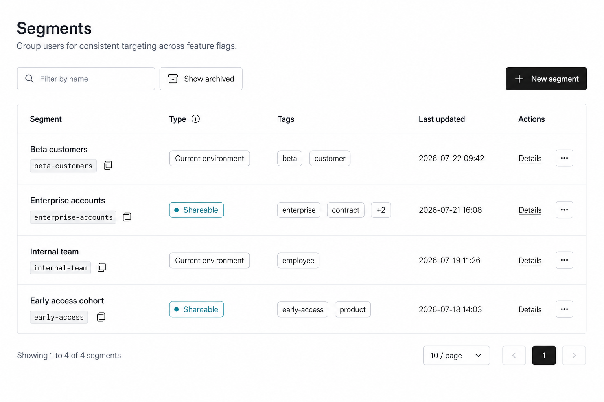

# Segments Index Page Design

## Scope

This document defines the React redesign of the Segments index workflow in `front-end`.

Included:

- the Segments list page;
- search, archived-state filtering, server pagination, and list states;
- row navigation, key copying, type/scope disclosure, and tags;
- archive, restore, and permanent removal flows;
- the New segment Sheet and its scope picker;
- the archive-blocked references Dialog;
- permission, license, and required-change-comment behavior used by this index workflow.

Excluded for now:

- Segment targeting, settings, and audit-log detail pages;
- changes to the authenticated sidebar;
- changes to the organization/project/environment context bar;
- mobile-first layout work.

The Angular implementation is the functional reference only. The React page must use the existing shadcn/Base UI, Tailwind, TanStack Query, TanStack Table, React Hook Form, Zod, `react-i18next`, Lucide, and Sonner patterns already established in `front-end`.

## Design Direction

Use the existing React product language: a compact, neutral desktop workbench with thin borders, calm spacing, and familiar controls. Do not reproduce the Angular/ng-zorro green action styling, table spacing, modal treatment, or inline divider-heavy action column.

The page should feel adjacent to the React End Users, Access Tokens, Webhooks, and Relay Proxies list pages:

- 32px page padding on desktop;
- restrained 30-32px page title and one-line muted description;
- one compact toolbar above a bordered table, following the React Team page table treatment;
- no ambient card shadows;
- 32-36px controls with standard shadcn focus treatment;
- compact rows with every cell vertically centered;
- semantic tokens for both light and dark themes;
- no changes outside the main content area.

## Main Page

### Header

Show:

- title: `Segments`;
- description: `Group users for consistent targeting across feature flags.`

Keep the header compact. It is product context, not a hero section.

### Toolbar

Use a single toolbar row, wrapping only when the available desktop width becomes unusually narrow.

Left group:

- search input with Search icon and placeholder `Filter by name`;
- outline toggle button with Archive icon and label `Show archived`.

Right group:

- primary action with Plus icon and label `New segment`.

The archived control is a two-state filter, not a bulk action:

- unpressed: request active segments with `isArchived=false`;
- pressed: request archived segments with `isArchived=true` and retain the label `Show archived` while using the standard pressed/selected treatment;
- changing the archived state resets the page index to `1`;
- the current search text continues to apply in either state.

Debounce name search by 400ms and reset the page index to `1` whenever the normalized query changes. Do not clear the input while a request is pending.

### Table

Use one full-width bordered table. Do not wrap the table in an additional card. Match the React Team page: keep the subtle outer border, the table-header bottom border, and horizontal row separators only. Do not render vertical borders between columns. Retain server-side data and the Angular information hierarchy while tightening the presentation.

| Column | Content | Behavior |
| --- | --- | --- |
| `Segment` | Name on the first line; key in a compact monospace value on the second line | Name opens the targeting detail route. Clicking the key or its Copy icon copies the complete key and shows `Copied`. |
| `Type` | `Current environment` or `Shareable` neutral badge | Header Info icon explains the two types. Shared badge opens a scope popover containing the complete returned scope list. |
| `Tags` | Up to two neutral tags, followed by `+N` when needed | Truncated tags and the `+N` affordance reveal complete values in a tooltip/popover. No tag value may become unrecoverable. |
| `Last updated` | Localized date and time | Keep the timestamp on one line at normal desktop widths. |
| `Actions` | Direct `Details` link and an ellipsis menu | Keep the column right-aligned or consistently aligned with other React list pages and vertically center every row action. |

Use approximately 68-72px rows so the two-line identity cell remains legible without making the table loose. The Segment column gets the most resilient width, Tags can compress, and Actions must remain visible at the right edge when horizontal scrolling is necessary.

#### Type disclosure

The Type header Info tooltip says:

`Shareable segments can be used across multiple environments. Current environment segments can only be used in this environment.`

For `Current environment`, use a neutral outline badge. Its tooltip says `Available only in the current environment.`

For `Shareable`, use a restrained teal-tinted outline/dot treatment. This is a semantic distinction, not a brand surface. Activating the badge opens a compact popover:

- heading: `Shared scopes`;
- one full scope path per row;
- vertical scrolling after a practical maximum height;
- returned scope values remain unmodified;
- empty or missing scope data uses `No shared scopes returned.` rather than an empty popover.

### Row actions

`Details` is the only direct text action because it is frequent, safe, and available in both active and archived views. The Segment name provides the same destination.

The icon-only ellipsis button opens a right-aligned row `DropdownMenu`. Give the trigger the accessible name `More actions for {segmentName}`. The menu contains only actions valid for the current list state:

- active list: `Archive`;
- archived list: `Restore`, separator, destructive `Remove permanently`.

| Current list | Menu item | Style | Result |
| --- | --- | --- | --- |
| Active | `Archive` | Standard menu item with Archive icon | First checks Feature Flag references, then opens the appropriate blocked-references or archive-confirmation Dialog. |
| Archived | `Restore` | Standard menu item with RotateCcw/restore icon | Opens the restore confirmation or required-change-comment confirmation. |
| Archived | `Remove permanently` | Destructive text with Trash icon, separated from Restore | Opens the permanent-removal confirmation. It never removes immediately from the menu. |

Do not show Archive beside every row as a second direct link. Restore and permanent removal also remain in the menu so the default table stays calm.

Do not duplicate `Details` inside the ellipsis menu. Do not mix active and archived actions: an active row never shows Restore or Remove permanently, and an archived row never shows Archive.

Permission and pending behavior:

- keep a state-valid menu item visible when the user lacks its permission, but render it disabled and expose the shared permission explanation;
- permission denial never opens a confirmation and never sends a prerequisite or mutation request;
- while an action's confirmation or mutation is pending, disable repeated activation for that row;
- while Archive is loading Feature Flag references, replace its Archive icon with the shared compact spinner and keep the menu available only as needed to communicate the pending state;
- keep actions on every other row usable;
- closing the menu without selecting an item has no side effects.

## Pagination

Preserve server pagination and page sizes `10`, `20`, and `30`.

- Left: `Showing X to Y of Z segments`.
- Right: page-size Select followed by compact previous/current/next controls, matching the newer React list pages.
- Reset to page `1` when the search query, archived filter, or page size changes.
- Disable unavailable navigation rather than hiding it.
- Keep the toolbar and table shell stable while navigating.

## New Segment Sheet

`New segment` opens a right-side Sheet rather than reproducing the Angular centered modal. The form contains enough conditional and hierarchical content that a Sheet gives it a more stable desktop workspace while keeping the index visible behind it.

Use a width around 560-640px, standard Sheet header, scrollable body, and sticky footer.

### Header and type

- title: `New segment`;
- description: `Create a reusable group of users for feature targeting.`;
- two-option segmented control: `Current environment` and `Shareable`;
- adjacent Info tooltip uses the same type explanation as the table.

Default to `Current environment`.

Switching type retains Name and Description, revalidates Key against the selected type, and switches the visible scope controls. This improves the Angular reset behavior without changing any backend capability. Do not submit stale key-validation results from the previous type.

### Common fields

Use React Hook Form and Zod with visible labels:

- required `Name`, placeholder `A human-friendly name`;
- required `Key`, placeholder `Key is generated from the name`;
- optional `Description`, compact textarea.

Name generates a slug key while the key is still auto-managed. Once the user edits Key directly, later Name edits must not overwrite the explicit value.

Key rules:

- allow only letters, numbers, `.`, `_`, and `-`;
- debounce duplicate validation by approximately 300ms;
- validate uniqueness against the selected Segment type;
- show `This key has already been used.` for a duplicate;
- show `Key validation failed. Try again.` for an unknown validation result;
- prevent submission while validation is pending or unsuccessful.

### Current environment type

Show one compact read-only scope summary:

- label: `Scope`;
- current `Organization / Project / Environment` path;
- helper: `This segment is available only in the current environment.`

Do not present a removable chip or scope picker.

### Shareable type

When the Shareable Segment license feature is granted, show:

- label: `Scopes`;
- helper: `Choose the organizations, projects, or environments where this segment can be used.`;
- selected scope groups using full readable paths;
- the current environment as visibly included and non-removable;
- outline action `Choose scopes`.

Selected scopes must support organization, project, and environment resources, matching the Angular resource-space behavior. When a broader selected scope already includes the current environment, the request payload may omit the redundant current-environment RN exactly as the Angular implementation does.

When the license is not granted:

- keep the `Shareable` type visible so the capability remains discoverable;
- replace the form body with a compact neutral information panel explaining that shareable segments can cross environments, projects, and organizations;
- state that the current license does not grant the feature and direct the user to contact the FeatBit team;
- do not show a usable Save action for the gated type;
- switching back to `Current environment` restores the normal form.

### Choose Scopes Dialog

Open a centered Dialog above the Sheet. Reuse the interaction vocabulary of the React environment/resource pickers rather than porting the Angular resource finder.

- Search by resource name or full path.
- Present a hierarchical, scrollable organization -> project -> environment result list.
- Clearly distinguish organization, project, and environment rows with labels/icons from the established Lucide set.
- Keep an always-visible `Selected scopes` summary with exact count and removable full-path chips.
- The current environment is selected, marked `Current`, and cannot be removed.
- Selecting an ancestor and a child is allowed in the temporary UI, but normalize redundant child RNs before submission.
- Search never hides selected chips from the summary.
- `Cancel`, close, and Escape discard temporary changes.
- `Apply scopes ({count})` commits the temporary snapshot to the parent Sheet only; it does not create the Segment.

### Footer and submission

Use `Cancel` and primary `Create segment`.

- Disable Create when required fields are invalid, key validation is pending/failed, the selected type is license-gated, or a request is already pending.
- Pending label: `Creating...`.
- Keep values and the Sheet open on failure; use the standard error toast.
- On success, close the Sheet, refresh/invalidate the list, and navigate to the new Segment targeting route, preserving the Angular post-create destination.
- If dismissal is attempted after changes, use the shared discard-changes confirmation.

## Archive, Restore, and Remove

### Archive prerequisite check

Archive first requests the selected Segment's Feature Flag references.

While loading:

- show a spinner beside `Archive` in the row menu or replace the menu item's icon with a spinner;
- disable that row's Archive action;
- do not clear the current list.

If the reference request fails, keep the Segment active and show:

`Feature flag references could not be loaded. Try again.`

No archive request may be sent when reference state is unknown.

### Archive blocked by references

When references exist, open a centered Dialog around 480px wide:

- title: `Segment is in use`;
- description: `This segment cannot be archived because it is referenced by the following feature flags.`;
- compact bordered list of flag name and key;
- references in the current environment are links to the corresponding Feature Flag page;
- references outside the current environment are visibly non-interactive and labeled `Not in this environment`;
- footer action: `Close`.

Do not offer a force-archive action.

### Archive confirmation

When there are no references, confirm:

- title: `Archive segment?`;
- body: `This segment is not referenced by any feature flag and can be safely archived.`;
- actions: `Cancel` and `Archive segment`.

If the environment requires a change comment, use the shared change-comment confirmation instead and require the comment before Archive can continue.

### Restore confirmation

Confirm `Restore segment?` before restoring. When change comments are required, collect the required comment in the same confirmation. On success, remove the row from the archived result set and correct pagination if the page becomes empty.

### Permanent removal

Use a destructive confirmation:

- title: `Remove segment permanently?`;
- body names the Segment and says `This action cannot be undone.`;
- actions: `Cancel` and destructive `Remove permanently`;
- require a change comment when the environment setting requires one.

Keep the Dialog open on failure. On success, close it, show success feedback, refresh the archived list, and correct pagination when necessary.

## Permissions and Licensing

Build the Segment resource RN from the current environment prefix, Segment key, and tags, matching Angular behavior. Continue to respect Segment-all-actions fallback and fine-grained license rules through the shared permission/license layer.

| Capability | Check | Presentation |
| --- | --- | --- |
| Create | `${currentEnvRN}:segment/*` + `CreateSegment` | Keep `New segment` visible. Disable it with the shared permission explanation when denied; never open an editable Sheet. |
| Details | Route/list availability | Always retain the navigation entry for returned rows. Detail-page editing permissions are outside this document. |
| Archive | Segment RN + `ArchiveSegment` | Disabled menu item with permission explanation when denied. Reference lookup starts only after permission passes. |
| Restore | Segment RN + `RestoreSegment` | Disabled menu item with permission explanation when denied. |
| Permanent remove | Segment RN + `DeleteSegment` | Disabled destructive menu item with permission explanation when denied. |
| Shareable type | `ShareableSegment` license feature | Type remains discoverable but the gated explanation replaces its form. |

Permission denial never sends the mutation request. Preserve the existing generic denied feedback channel for any race where capability changes between render and activation.

## States

Keep the page header and toolbar stable in every state.

### Loading

Render five compact skeleton rows inside the existing table boundary. Match the final column structure and do not use a centered page spinner.

### Initial empty

Active list:

- title: `No segments yet`;
- supporting text: `Create a segment to group users for consistent feature targeting.`;
- outline `New segment` action only when creation is permitted.

Archived list:

- title: `No archived segments`;
- supporting text: `Archived segments will appear here.`

### Filtered empty

Show `No segments match "{query}".` with outline action `Clear search`. Retain the current active/archived filter.

### Load error

Render a compact destructive-tinted message inside the table boundary:

- `Segments could not be loaded.`;
- outline `Retry` action.

Retry preserves query, archived state, page, and page size.

### Mutation feedback

Use Sonner success/error toasts for copy, create, archive, restore, permanent removal, and recoverable request failures. Avoid global page blocking. Pending state belongs to the Sheet, Dialog, or affected row that initiated the request.

## Internationalization and Content

- Add a Segments feature resource with English and Chinese strings.
- Preserve the language-prefixed route.
- Keep API keys, tags, scope RNs/paths, and Feature Flag reference values unchanged.
- Use the existing localized date/time approach consistently across the React app.
- Use plural-aware result count copy.
- Provide full values through tooltip/popover when compact presentation truncates keys, tags, paths, or names.

## Theme and Accessibility

- Use semantic shadcn tokens; do not hard-code the light design's white, zinc, or teal values into feature code.
- Dark theme keeps the same hierarchy and density with neutral dark surfaces and visible borders.
- Preserve standard focus rings and keyboard behavior for search, toggle, table links, menus, Sheet, and Dialogs.
- The archived toggle exposes pressed/selected state through its button primitive; color is not the only cue.
- Every icon-only Copy, Info, ellipsis, close, and pagination control has an accessible name.
- Menus, Sheet, and Dialogs contain and restore focus through the shared primitives.
- Scope and type distinctions use text labels in addition to tint.
- Maintain WCAG AA contrast, including muted text on tinted information/error surfaces.
- Motion is limited to shared 150-250ms state transitions and respects reduced-motion behavior.

## Functional Invariants

The React migration must preserve these index-level contracts:

- load Segments from the current environment with name, archived state, zero-based API page index, and page size;
- preserve server-returned name, key, type, scopes, tags, update timestamp, archived state, and total count;
- preserve 400ms debounced name filtering and active/archived list switching;
- preserve page sizes `10`, `20`, and `30`;
- copy the complete Segment key;
- navigate Details and successful creation to the targeting route;
- create both current-environment and shareable Segments with Name, Key, Description, Type, and Scopes;
- preserve async type-aware key uniqueness validation and its failure state;
- preserve current environment as an unremovable shareable scope and support organization/project/environment selection;
- preserve Shareable Segment license gating;
- preserve per-resource Create, Archive, Restore, and Delete permission/license checks;
- block archive when any Feature Flag reference exists and preserve in-environment reference navigation;
- never archive if the reference lookup fails;
- preserve required change comments for archive, restore, and permanent removal;
- refresh the current filtered list after successful mutations without unnecessarily discarding search or archived state;
- provide stable loading, initial-empty, archived-empty, filtered-empty, error, and pending-mutation states.

## Acceptance Criteria

- Only the Segments index workflow and its supporting overlays are designed; sidebar, context bar, and Segment details remain unchanged/out of scope.
- The delivered light design matches the current React list-page rhythm and does not clone Angular/ng-zorro styling.
- The table exposes Segment identity, type, shareable scopes, tags, update time, Details, and state-appropriate actions in a compact layout.
- Details remains direct; state-changing/destructive row actions use the overflow menu.
- Search, active/archived filtering, copying, server pagination, creation, archive blocking, archive, restore, removal, permissions, license gating, and change comments all have explicit behavior.
- Shared type and selected scopes are understandable without relying on color or truncated paths.
- Default, loading, empty, filtered-empty, error, permission-denied, license-gated, and pending states are specified.
- Light and dark themes use semantic React design-system tokens, and English and Chinese routes use translated content.
