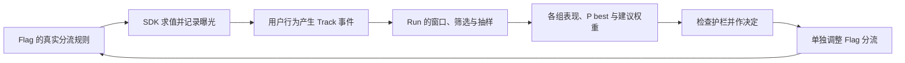

# FeatBit Bandit 四组实验模拟器

这是一个被根目录 `.gitignore` 忽略的 .NET 10 临时项目，使用 **FeatBit.ServerSdk 1.2.11**。
它针对本机 Aspire 中的 `bandit arms` 实验：

- Flag：`rd-onboarding-flow-ui-e2e-20260904-1417`
- Experiment：`ae156aa0-01d1-4b29-85e1-1cf85fded728`
- Run：`3d63eed8-2b49-4c6a-a29a-0086f44c3b9e`
- 主指标：`bandit_arms_metric_1`，`binary / once`，越高越好。
- 护栏：`bandit_arms_metric_2`，`numeric / count`，下降表示坏信号。

所有生成数据都是合成数据，只用于观察页面和验证采集、归因、分析链路，不能据此做真实业务决策。

## 运行

在仓库根目录打开 PowerShell。已运行的 Aspire 需要包含 `api-server`、`evaluation-server`、PostgreSQL 和 Redis；参考根目录 `.aspire/README.md`。

```powershell
# 已配置模拟用户规则后，生成 4000 个新用户，验证服务端计数，并重新分析当前 Run
./tempo/bandit-sdk-simulator/run-local.ps1

# 换一个规模和随机种子；每次调用都会使用新的用户 key
./tempo/bandit-sdk-simulator/run-local.ps1 -Users 8000 -Seed 42

# 仅验证配置并打印模拟计划，完全不连接 SDK
dotnet run --project tempo/bandit-sdk-simulator/BanditSimulator.csproj -- --dry-run

# 读取本地配置并保存拟议的 Flag targeting JSON，不修改 Flag、不生成数据
./tempo/bandit-sdk-simulator/run-local.ps1 -PlanOnly

# 首次使用或模拟规则被移除后：添加规则，然后生成数据并验证
./tempo/bandit-sdk-simulator/run-local.ps1 -PrepareTraffic
```

`run-local.ps1` 每次通过 `aspire describe` 发现当前服务地址，并通过 `aspire wait` 确认就绪。它仅接受 loopback 服务，使用 `.aspire/README.md` 中的本地种子测试账号；如需替换本地账号，可设置 `FEATBIT_SIM_LOGIN_EMAIL` 和 `FEATBIT_SIM_LOGIN_PASSWORD`。SDK key 从当前环境的 Server Key 读取，只临时放入子进程环境变量，退出后恢复原变量，不写入文件或日志。

单独运行 SDK 程序时：

```powershell
$env:FEATBIT_SIM_SDK_KEY = '<当前环境的 Server SDK key>'
dotnet run --project tempo/bandit-sdk-simulator/BanditSimulator.csproj -- `
  --config tempo/bandit-sdk-simulator/simulation.json `
  --users 4000 --seed 42 `
  --output-dir tempo/bandit-sdk-simulator/results
```

独立程序只负责 SDK 求值和发送事件；管理 API 的规则准备、归因核对和 Analyze 由 PowerShell 脚本完成。

## 数据如何生成

`simulation.json` 可调整每个 Arm 的结果分布、用户数、批大小、发送间隔和随机种子。概率单位为 `0..1`：

| UI 名称 | SDK 返回值 | 模拟转化概率 | 护栏平均事件次数/用户 |
|---|---|---:|---:|
| control-updated | classic | 12% | 3.2 |
| candidate-1-updated | guided | 22% | 3.4 |
| candidate-2-updated | compact | 17% | 3.1 |
| candidate-updated | candidate | 9% | 2.2 |

这是生成器设定的总体分布，实际样本率会随机波动。SDK 使用 Flag 的真实分流规则分配用户，模拟器根据 **SDK 返回的 value 和 variation ID** 生成该用户的结果，不自行轮流指定 Arm。

每个新用户只求值一次，先发送曝光，再发送主指标/护栏事件：

```csharp
var detail = client.StringVariationDetail(flagKey, user, "__sdk_fallback__");
// 根据 detail.Value / detail.ValueId 找到对应 Arm 的概率配置。
if (converted)
    client.Track(user, "bandit_arms_metric_1", 1d);
for (var i = 0; i < guardrailCount; i++)
    client.Track(user, "bandit_arms_metric_2", 1d);
```

- 未转化用户不发主指标事件。对 binary/once 指标调用 `Track(..., 0)` 仍可能被视为发生过一次转化，因此不能这样表示失败。
- 护栏是 `count`，发送 N 次事件才计为 N；一次 `Track(..., N)` 只算一次。要衡量金额或总时长，应换用对应的 `sum` 指标和模拟逻辑。
- 护栏次数来自 Poisson 分布，包含零次事件的用户；这些曝光用户仍在分母里。
- 每批先 `FlushAndWait` 曝光，等待结果延迟，再发送并 flush 指标；退出调用 `CloseAsync`。
- 每次运行生成新的 `bandit-sim-{batchId}-{序号}` 用户，附带 `expt_simulator=bandit-sdk-v1` 和 `simulation_batch` 属性。重复使用老用户 key 会被去重，不会增加独立样本。
- 随机种子控制结果生成序列；新的 batchId 会改变分流哈希，因此相同 seed 的两次运行不保证逐组计数完全相同。
- 默认 4000 人、每批 200 人。每组至少 100 个有效用户才满足当前 Bandit 的 burn-in 条件；这只是最低计算门槛，不是充分样本量保证。

官方 SDK 用法：[FeatBit .NET Server SDK](https://github.com/featbit/featbit-dotnet-sdk#experiments-abn-testing)。

## 模拟用户规则与清理

原 Flag 的已有规则和默认规则都只返回 `classic`，因此单纯发送新用户只能给 Baseline 添数据。`-PrepareTraffic` 会在该本地 Flag 的规则首位加入：

```text
规则：Temporary .NET Bandit simulator
条件：expt_simulator IsOneOf ["bandit-sdk-v1"]
分流：classic / guided / compact / candidate，各 25%
实验采集：开启
```

规则只匹配模拟器附带的专用属性；其他用户继续沿原有规则求值。脚本使用最新 revision 做并发保护，并在 `results/targeting-before-*.json` 保存原 targeting。它不会应用 Bandit 推荐权重。

不再需要模拟器时，可在该 Flag 的 Targeting 页面移除 `Temporary .NET Bandit simulator` 这一条规则。已发送的历史合成数据仍保留；真实实验应使用独立环境/Flag，或开始不包含模拟时间段的新 Run。仅删本地项目不会删除服务端数据。

## 验证与输出

脚本先读取主指标和护栏的服务端统计，再运行 SDK，随后最多等待 60 秒，逐 Arm 比较增量：

1. 曝光用户数 = 本次模拟用户数。
2. 主指标转化用户数 = 本次成功发送的转化数。
3. 护栏事件总数 = 本次多次 `Track` 的总次数。

三项都一致后，脚本调用当前 Run 的 Analyze，并保存服务端原始分析。若有其他客户端同时写入相同实验，精确增量校验可能失败；失败会明确报告，不会当作成功验证。SDK flush 完成不能替代服务端核对。

输出都在 `results/`：

- `latest.json`：本次 SDK 计数与状态。
- `latest-verified.json`：通过归因核对的统计与 Bandit 分析。
- `{batchId}.users.jsonl`：逐用户返回版本、转化结果、护栏次数。
- `{batchId}.json` / `{batchId}.verified.json`：保留每次运行的报告。
- `targeting-plan.json` / `targeting-before-*.json`：规则计划和修改前备份。

中断或失败时，已发送的事件不会回滚；检查报告后使用新 batchId 补充数据。旧的 `latest-verified.json` 可能来自前一次成功运行，请核对 batchId 和时间。

## Bandit Arms 的实践方式

Baseline 是比较参考，其他 Arms 是候选方案。创建实验里的 Arm 列表不会替应用分流；服务端 SDK 按 Feature Flag 实际求值，曝光和指标必须使用同一个稳定用户 key。



建议先固定四组各 25%，每组积累有效用户，确认指标与护栏正常，再按节奏查看分析和决定下一阶段分流。`Analysis sampling = 100%` 表示保留各组已发生曝光的全部分析样本，不是给每组分配 100% 流量。Layer 和 Run 配置用于界定分析人群；应用的实际曝光仍由 Flag 控制。

这份工作区当前后端实现的要点（2026-09-07）：

- `P(best)` 是在当前数据和模型下成为所有候选中最佳方案的概率，不是转化率，也不是相对 Baseline 的提升幅度。
- 算法名称为 `thompson_sampling_top_two`：从各 Arm 后验做 10000 次抽样，以第一名频率计算 P(best)，以前两名入选频率生成建议权重。因此 P(best) 接近 100% 的方案，建议权重也可能只有约 49%。
- 权重先按 0.01 做下限，再统一归一化，所以最终数字可能略低于 1%；Baseline 也参与权重计算，没有特殊的固定保留比例。
- 停止提示使用 `P(best) >= 95%`，仍需要结合护栏、采集完整性和实验设计作决定。
- Analyze 只保存分析结果，不自动改 Flag，不自动下发新比例给 SDK，不会仅因停止提示而关闭实验。
- 当前 SRM 使用“各组等量”的期望。一旦采用不等比或动态流量，SRM 红色提示不能直接解释为分流故障，需要按实际分配计划另行判断。
- 当前服务端按窗口内用户第一次曝光做归因。改变分流比例可能让已有用户的后续 Flag 值改变，不能把“相同 key”当成调整比例后的永久锁组保证；应做好业务侧粘性分组、独立 holdout 或分阶段 Run 设计。

截图中的 `No evaluable data` 表示尚无足够的有效样本；此时的 0% / <0.1% 不代表已经判定哪个 Arm 输了。页面 `need ≥0 users per arm` 来自 `run.minimumSample` 缺省为 0 的显示逻辑，后端动态权重门槛实际固定为每组 100 人。这个既有显示差异不由本临时项目修改。

首次真实链路验证已完成：2026-09-07 20:58（北京时间），4000 个合成用户全部进入分析，SRM p=0.5222。四组人数为 1019 / 1021 / 962 / 998，转化人数为 122 / 252 / 165 / 105；`guided` 的 P(best)=99.99%，建议权重约 49.03%。完整服务端证据见 `results/20260907T125757437Z-98c49a41b90b46c593bf93ec7583778c.verified.json`。后续运行会产生新数据与新结果。

如果主要目的是回答“新方案相对旧方案提升多少”，优先用固定分流的 Bayesian A/B/n Run；如果主要目的是逐步把更多新流量分给较好方案，再采用 Bandit 推荐和显式调整分流的循环。

实现入口：`modules/back-end/src/Infrastructure/Services/EntityFrameworkCore/ExperimentService.cs` 的 `AnalyzeRunAsync`、`BuildBanditAnalysisJson`、`ComputeBanditWeights`、`SrmCheck`；用户归因见同目录的 `ExperimentStatsService.cs`。
