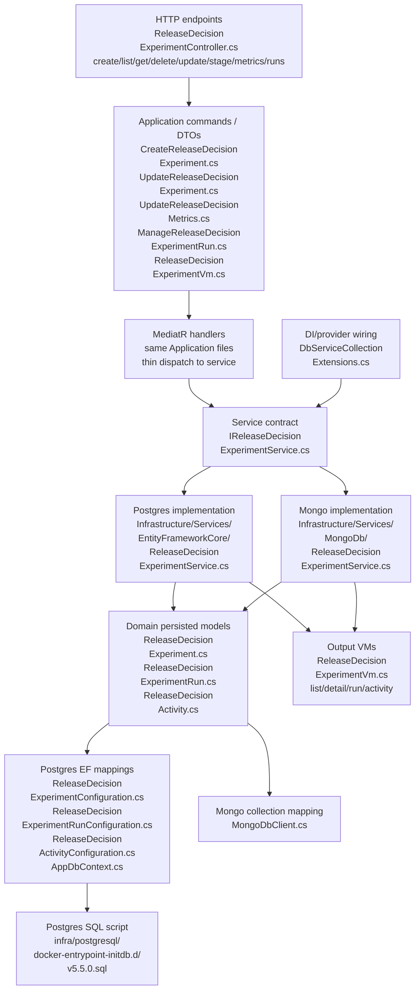
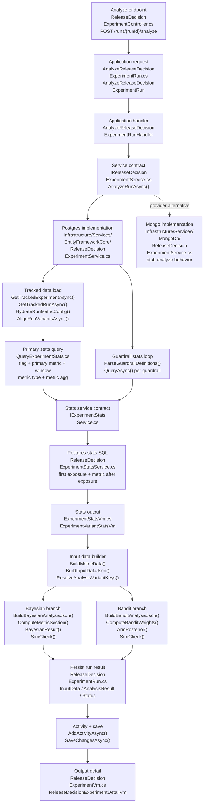
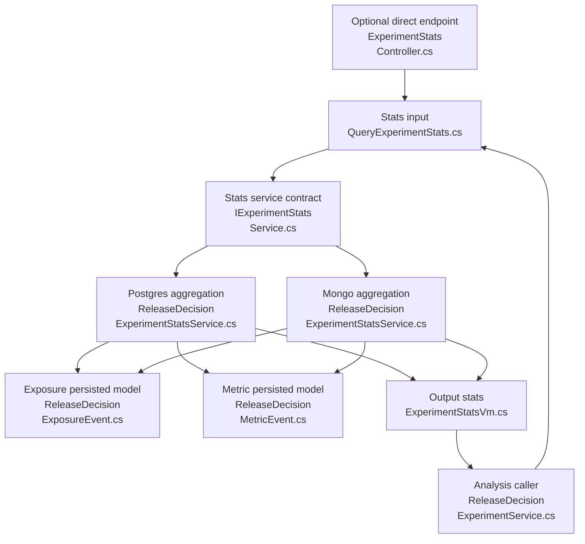
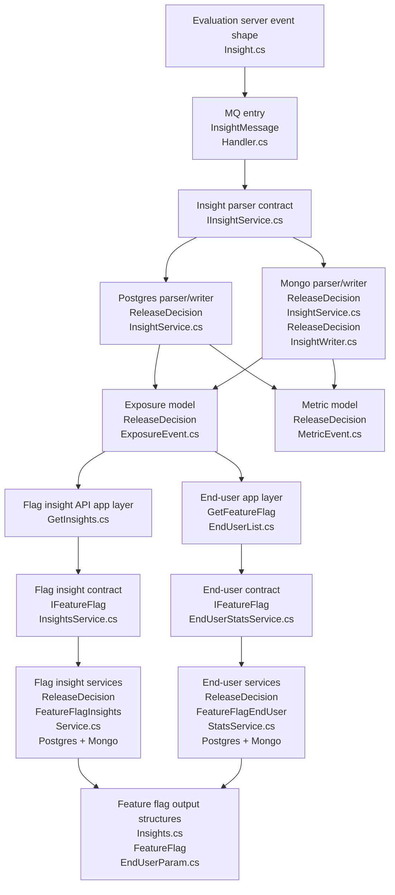
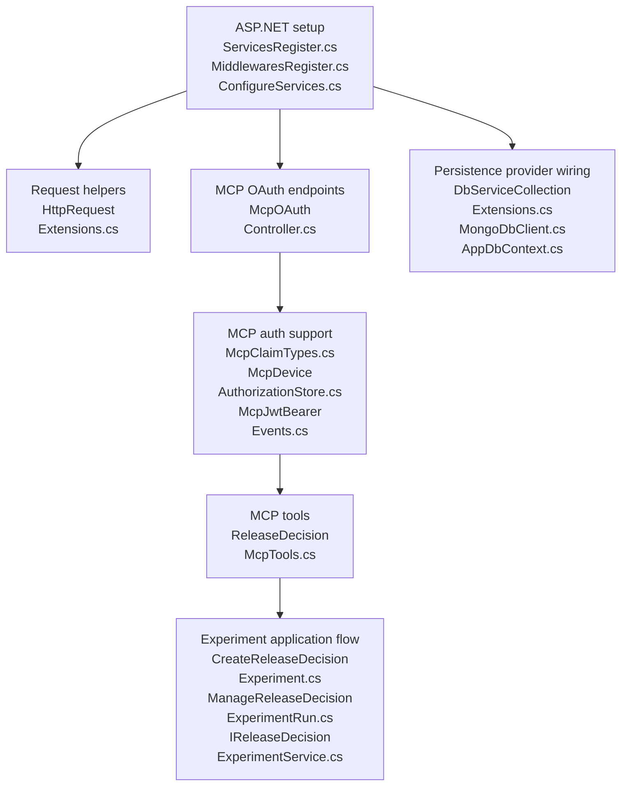

# v5.5.0 PR Review - API / eval C# flow

Scope: `featbit/featbit#921`, `main` -> `release-decision`.

Confirmed base/head:

- base `main`: `5b9d6a74fd927e5f4012235521dbc09eb3afbc99`
- head `release-decision`: `76639eefa705019925a71cc89a5a2af120878860`

This version only reviews added / modified / renamed C# files under:

- `modules/back-end/src`
- `modules/evaluation-server/src`

Frontend, SQL, JSON, Docker, Aspire, and deleted old files are not expanded here except where needed to explain the C# runtime flow.

Mermaid diagrams wrap long C# filenames across multiple lines to avoid renderer clipping. Concatenate the lines inside one node to get the full `.cs` filename.

## 1. Experiment CRUD / Run Management

This is the core release-decision workspace flow after native agent conversation storage was removed: create experiment, update decision state, configure metrics, create/update/delete runs, and read detail/list output. Server-side run analysis is only shown as a boundary here; its algorithm is expanded in section 2.



Serial review method:

1. Start at `modules/back-end/src/Api/Controllers/ReleaseDecisionExperimentController.cs`. Verify the HTTP surface only exposes the current workspace operations: create, list, get, delete, update, stage update, metrics update, run create/delete/update/audience/window, and run analyze boundary. Confirm there is no `/messages` endpoint.
2. Open `modules/back-end/src/Application/ReleaseDecisions/CreateReleaseDecisionExperiment.cs`. Check the create request shape, `Name` validation, trimming/null handling, and default domain values assigned by the handler: `Stage = "hypothesis"` and `SandboxStatus = "idle"`.
3. Open `modules/back-end/src/Application/ReleaseDecisions/ReleaseDecisionExperimentVm.cs`. Review the list/detail output contract and query/delete commands. Confirm detail output contains `ExperimentRuns` and `Activities`, and no longer contains `Messages`.
4. Open `modules/back-end/src/Application/ReleaseDecisions/UpdateReleaseDecisionExperiment.cs`. Review the decision-state patch fields and the validator rule that prevents writing `PrimaryMetric` / `Guardrails` through generic experiment update.
5. Open `modules/back-end/src/Application/ReleaseDecisions/UpdateReleaseDecisionMetrics.cs`. Review the structured metric contract: `MetricName`, `MetricEvent`, `MetricType`, `MetricAgg`, `ExpectedDirection`, and `Guardrails` JSON validation.
6. Open `modules/back-end/src/Application/ReleaseDecisions/ManageReleaseDecisionExperimentRun.cs`. Review the run payloads separately: audience update, observation-window update, full run update, and create/delete/update command handlers. Pay special attention to fields that can write `InputData`, `AnalysisResult`, `Decision*`, and learning fields.
7. Open `modules/back-end/src/Application/Services/IReleaseDecisionExperimentService.cs`. Use this as the service boundary checklist. Every Application command above should map to one method here. Confirm the removed conversation API means there is no `AddMessageAsync`.
8. Open the domain models under `modules/back-end/src/Domain/ReleaseDecisions/`: `ReleaseDecisionExperiment.cs`, `ReleaseDecisionExperimentRun.cs`, and `ReleaseDecisionActivity.cs`. Confirm these are the only persisted CRUD/run-management models; `ReleaseDecisionMessage.cs` has been removed.
9. Open `modules/back-end/src/Infrastructure/Services/EntityFrameworkCore/ReleaseDecisionExperimentService.cs`. Review Postgres behavior in this order: create activity on create; env-scoped get/delete; manual child loading for runs/activities; generic state update; stage update; metrics update and latest-run sync; run create/delete/update/audience/window; list filtering and VM mapping.
10. In the same Postgres service, check delete behavior carefully. Because this repository does not allow database foreign keys, delete must explicitly remove `ReleaseDecisionExperimentRun` and `ReleaseDecisionActivity` rows before removing the experiment.
11. Open `modules/back-end/src/Infrastructure/Persistence/EntityFrameworkCore/Configurations/ReleaseDecisionExperimentConfiguration.cs`, `ReleaseDecisionExperimentRunConfiguration.cs`, and `ReleaseDecisionActivityConfiguration.cs`. Confirm the mappings define table/column/index behavior but do not configure `HasForeignKey`, `HasOne`, `WithMany`, or cascade relationships.
12. Open `modules/back-end/src/Infrastructure/Persistence/EntityFrameworkCore/AppDbContext.cs`. Confirm only the active release-decision configurations are applied: experiment, run, activity, exposure, metric. There should be no `ReleaseDecisionMessageConfiguration`.
13. Open `infra/postgresql/docker-entrypoint-initdb.d/v5.5.0.sql`. Confirm the script creates `release_decision_experiments`, `release_decision_experiment_runs`, and `release_decision_activities`, drops the old `release_decision_messages` table, and contains no `foreign key` / `references` constraints.
14. Open `modules/back-end/src/Infrastructure/Persistence/DbServiceCollectionExtensions.cs` and `modules/back-end/src/Infrastructure/Persistence/MongoDb/MongoDbClient.cs`. Confirm Postgres and Mongo both register `IReleaseDecisionExperimentService`, and Mongo collection mapping includes experiment/run/activity but not message.
15. Open `modules/back-end/src/Infrastructure/Services/MongoDb/ReleaseDecisionExperimentService.cs`. Treat Mongo as a compatibility implementation. Confirm message handling is removed, then review the remaining behavioral gap: Mongo run create/update/analyze is still not equivalent to Postgres.
16. Open `modules/back-end/src/Api/Mcp/ReleaseDecisionMcpTools.cs`. Confirm MCP exposes experiment read/update/stage/metrics/run/analyze tools but no `featbit_release_decision_add_message`. Local Claude Code/Codex usage should write durable state through update/run tools, not native conversation storage.

Database script review:

- Main script: `infra/postgresql/docker-entrypoint-initdb.d/v5.5.0.sql`.
- Legacy native-agent storage cleanup: `DROP TABLE IF EXISTS release_decision_messages;`.
- CRUD workspace table: `release_decision_experiments`, with indexes on `(featbit_env_id, updated_at)`, `featbit_project_key`, `flag_key`, and `(featbit_env_id, flag_key)`.
- Run table: `release_decision_experiment_runs`, with unique index `ux_release_decision_experiment_runs_experiment_slug` on `(experiment_id, slug)`.
- Activity table: `release_decision_activities`, with index `ix_release_decision_activities_experiment_created_at` on `(experiment_id, created_at)`.
- Important constraint rule: no database foreign keys are created. Parent/child cleanup is an application-service responsibility.
- `release_decision_exposure_events`, `release_decision_metric_events`, and `release_decision_run_variant_stats` are not CRUD workspace tables; they support ingestion/stats/analysis flows covered later.

Notes:

- PostgreSQL `ReleaseDecisionExperimentService.cs` is the complete CRUD/run implementation.
- Mongo `ReleaseDecisionExperimentService.cs` is wired, but run create/update/analyze behavior is not equivalent to PostgreSQL.
- Native conversation/message storage was removed. Users now run local agents such as Claude Code or Codex and persist release-decision state through MCP/REST update tools.

## 2. Server-side Analysis / A/B Algorithm

This flow starts after an experiment run exists and the user asks the server to analyze it. The Postgres implementation is the authoritative runtime path: it reads the run configuration, queries FeatBit exposure/metric stats, converts those stats into algorithm input JSON, builds either Bayesian or bandit output JSON, stores both JSON payloads on the run, then returns the refreshed experiment detail.



Serial runtime call:

```csharp
ReleaseDecisionExperimentController.AnalyzeRunAsync(envId, id, runId, request)
    -> Mediator.Send(new AnalyzeReleaseDecisionExperimentRun { EnvId, Id, RunId, Request })
    -> AnalyzeReleaseDecisionExperimentRunHandler.Handle(...)
    -> IReleaseDecisionExperimentService.AnalyzeRunAsync(envId, id, runId, request)
    -> EntityFrameworkCore.ReleaseDecisionExperimentService.AnalyzeRunAsync(...)
        -> request ??= new ReleaseDecisionExperimentRunAnalyzeRequest()
        -> GetTrackedExperimentAsync(envId, id)
        -> GetTrackedRunAsync(id, runId)
        -> HydrateRunMetricConfig(run, experiment)
        -> AlignRunVariantsAsync(envId, experiment, run, inferMissing: true)
        -> validate experiment.FlagKey and run.PrimaryMetricEvent
        -> derive observation window, metric type, and metric aggregation
        -> statsService.QueryAsync(new QueryExperimentStats { primary metric config })
        -> BuildMetricData(metricType, stats.Variants)
        -> ParseGuardrailDefinitions(run.GuardrailEvents)
        -> statsService.QueryAsync(...) once per guardrail
        -> BuildInputDataJson(metrics)
        -> ResolveAnalysisVariantKeys(experiment.Variants, primaryMetricData, control, treatments)
        -> run.Method == "bandit"
            ? BuildBanditAnalysisJson(...)
            : BuildBayesianAnalysisJson(...)
        -> run.InputData = inputData
        -> run.AnalysisResult = analysisResult
        -> run.Status = no users ? "collecting" : "analyzing"
        -> AddActivityAsync(...)
        -> dbContext.SaveChangesAsync()
        -> GetAsync(envId, id)
```

Serial review method:

1. Start at `modules/back-end/src/Api/Controllers/ReleaseDecisionExperimentController.cs`. This is the HTTP entry file. Verify `POST /api/v{version}/envs/{envId}/release-decision/experiments/{id}/runs/{runId}/analyze` copies route values into `AnalyzeReleaseDecisionExperimentRun` and sends it through MediatR.
2. Open `modules/back-end/src/Application/ReleaseDecisions/AnalyzeReleaseDecisionExperimentRun.cs`. This is the application request file. Confirm `ReleaseDecisionExperimentRunAnalyzeRequest` currently exposes only `ForceFresh`, and `AnalyzeReleaseDecisionExperimentRunHandler` delegates directly to the release-decision experiment service.
3. Open `modules/back-end/src/Application/Services/IReleaseDecisionExperimentService.cs`. This is the analysis service boundary file. Confirm the only analyze contract is `AnalyzeRunAsync(envId, id, runId, request)`, so controller/application code does not pass raw stats, metric rows, or algorithm parameters.
4. Open `modules/back-end/src/Infrastructure/Persistence/DbServiceCollectionExtensions.cs`. This is the provider wiring file. Confirm the runtime implementation of `IReleaseDecisionExperimentService` and `IExperimentStatsService` is selected here for PostgreSQL or MongoDB.
5. Open `modules/back-end/src/Infrastructure/Services/EntityFrameworkCore/ReleaseDecisionExperimentService.cs`. This is the main PostgreSQL analysis implementation file. In `AnalyzeRunAsync()`, review the start of the call: normalize null request, load tracked experiment, load tracked run, hydrate metric config, and align variants.
6. Open `modules/back-end/src/Domain/ReleaseDecisions/ReleaseDecisionExperiment.cs`. This is the persisted experiment input model file. Confirm the fields consumed by analysis: `FlagKey`, `Name`, `PrimaryMetric`, `Guardrails`, and `Variants`.
7. Open `modules/back-end/src/Domain/ReleaseDecisions/ReleaseDecisionExperimentRun.cs`. This is the persisted run input/output model file. Confirm analysis reads `Method`, metric config, guardrail events, control/treatment variants, priors, minimum sample, and observation window, then writes `InputData`, `AnalysisResult`, `Status`, and `UpdatedAt`.
8. Open `modules/back-end/src/Infrastructure/Persistence/EntityFrameworkCore/AppDbContext.cs`. This is the EF context file used by the analysis service. Confirm release-decision experiment, run, activity, exposure, and metric configurations are applied.
9. Open `modules/back-end/src/Infrastructure/Persistence/EntityFrameworkCore/Configurations/ReleaseDecisionExperimentConfiguration.cs`. This is the experiment mapping file. Confirm the experiment fields used by analysis are mapped without database foreign-key assumptions.
10. Open `modules/back-end/src/Infrastructure/Persistence/EntityFrameworkCore/Configurations/ReleaseDecisionExperimentRunConfiguration.cs`. This is the run mapping file. Confirm `InputData`, `AnalysisResult`, method, metric, prior, variant, and observation-window fields are persisted.
11. Open `modules/back-end/src/Infrastructure/Persistence/EntityFrameworkCore/Configurations/ReleaseDecisionActivityConfiguration.cs`. This is the activity mapping file. Confirm analyze can persist the activity note written after server-side analysis completes.
12. Open `modules/back-end/src/Application/ExperimentStats/QueryExperimentStats.cs`. This is the stats query input file. Confirm analysis builds this request with env, flag, metric event, date window, metric type, and metric aggregation, and that validation accepts only `binary|continuous` and `once|count|sum|average`.
13. Open `modules/back-end/src/Application/Services/IExperimentStatsService.cs`. This is the stats service boundary file. Confirm analysis depends on `QueryAsync(QueryExperimentStats request)` and does not reach directly into raw exposure/metric tables.
14. Open `modules/back-end/src/Infrastructure/Services/EntityFrameworkCore/ReleaseDecisionExperimentStatsService.cs`. This is the PostgreSQL stats aggregation file. Review the SQL: first exposure per user chooses the variant, metric events are counted only after exposure, user contributions are aggregated, and variant rows are returned.
15. Open `modules/back-end/src/Domain/ReleaseDecisions/ReleaseDecisionExposureEvent.cs`. This is the exposure source model file behind the stats query. Confirm the query depends on `env_id`, `flag_key`, `user_key`, `variation_id`, and `exposed_at`.
16. Open `modules/back-end/src/Domain/ReleaseDecisions/ReleaseDecisionMetricEvent.cs`. This is the metric source model file behind the stats query. Confirm the query depends on `env_id`, `event_name`, `user_key`, `occurred_at`, and `numeric_value`.
17. Open `modules/back-end/src/Application/ExperimentStats/ExperimentStatsVm.cs`. This is the stats output file. Confirm `ExperimentVariantStatsVm` returns exactly the aggregate fields consumed by the algorithm: users, conversions, sum value, sum squares, conversion rate, and average value.
18. Return to `modules/back-end/src/Infrastructure/Services/EntityFrameworkCore/ReleaseDecisionExperimentService.cs`. In this same implementation file, review input-data conversion helpers: `BuildMetricData()`, `BuildInputDataJson()`, `ParseGuardrailDefinitions()`, and `ResolveAnalysisVariantKeys()`.
19. Stay in `modules/back-end/src/Infrastructure/Services/EntityFrameworkCore/ReleaseDecisionExperimentService.cs`. Review Bayesian algorithm helpers in this file: `BuildBayesianAnalysisJson()`, `ComputeMetricSection()`, `MetricMoments()`, `BayesianResult()`, `DeltaMethodSe()`, `Risk()`, and `SrmCheck()`.
20. Stay in `modules/back-end/src/Infrastructure/Services/EntityFrameworkCore/ReleaseDecisionExperimentService.cs`. Review bandit algorithm helpers in this file: `BuildBanditAnalysisJson()`, `ComputeBanditWeights()`, `ArmPosterior()`, `Normal01()`, and `SrmCheck()`.
21. Open `modules/back-end/src/Application/ReleaseDecisions/ReleaseDecisionExperimentVm.cs`. This is the API output file. Confirm `ReleaseDecisionExperimentDetailVm` returns updated `ExperimentRuns`, and each run VM exposes `InputData`, `AnalysisResult`, status, metric config, decision fields, and learning fields.
22. Open `modules/back-end/src/Domain/ReleaseDecisions/ReleaseDecisionActivity.cs`. This is the persisted activity model file. Confirm the analyze path creates a `note` activity titled `Experiment run analyzed from FeatBit stats`.
23. Open `modules/back-end/src/Infrastructure/Services/MongoDb/ReleaseDecisionExperimentService.cs`. This is the Mongo release-decision experiment service file. Confirm run create/update/audience/window/analyze now write real run state, call Mongo stats through `IExperimentStatsService`, build Bayesian/bandit JSON, and persist `InputData` / `AnalysisResult`.
24. Open `modules/back-end/src/Infrastructure/Services/MongoDb/ReleaseDecisionExperimentStatsService.cs`. This is the Mongo stats aggregation file. Confirm it implements the same direct stats contract consumed by Mongo `AnalyzeRunAsync()` and by `/experiment-stats/query`.

Data structure direction:

| File | Direction | What it carries |
|---|---|---|
| `ReleaseDecisionExperimentRunAnalyzeRequest` | API input | Analyze options. Currently only `ForceFresh`; the Postgres implementation does not branch on it yet. |
| `AnalyzeReleaseDecisionExperimentRun` | application input | Env, experiment, run, and request body passed from controller to service. |
| `QueryExperimentStats` | stats input | Env, flag, metric event, observation window, metric type, and metric aggregation. |
| `ExperimentVariantStatsVm` | stats output | Per-variant users, conversions, sum, sum squares, conversion rate, and average. |
| `ReleaseDecisionExperimentRun` | persisted input/output | Reads method, metric config, prior, variants, sample/window settings; writes `InputData`, `AnalysisResult`, status, and timestamps. |
| `ReleaseDecisionExperiment` | persisted input | Supplies flag key, experiment name, variant metadata, and experiment-level metric JSON used to hydrate the run. |
| `ReleaseDecisionExperimentDetailVm` | API output | Returns the refreshed experiment with updated run input/analysis JSON. |

Algorithm review notes:

- Bayesian and bandit analysis are implemented as JSON builders inside `Infrastructure/Services/EntityFrameworkCore/ReleaseDecisionExperimentService.cs`; there is no separate algorithm service yet.
- The stats query is part of the analysis contract. The algorithm never reads raw events directly; it consumes per-variant aggregates produced by `IExperimentStatsService`.
- Binary metrics use proportion-style input `{ n, k }`. Continuous metrics use moment-style input `{ n, sum, sum_squares }`.
- SRM is checked from observed users per analyzed variant using a chi-square survival function. The current expected split is equal allocation across observed variants.
- Bayesian output is decision-support output, not an automatic run decision write. The method persists `AnalysisResult`, but does not populate `Decision`, `DecisionSummary`, or learning fields.
- Bandit output recommends traffic weights, but the method does not apply those weights back to a FeatBit flag or run audience settings.
- `ForceFresh` exists on the request contract but is not used by the current Postgres implementation.
- Mongo now implements the same release-decision run analysis loop at the service level, using Mongo stats aggregation and the same Bayesian/bandit helper logic as the Postgres path.

Postgres vs Mongo analysis parity:

| Capability in section 2 flow | PostgreSQL | MongoDB |
|---|---|---|
| Create a real `ReleaseDecisionExperimentRun` from the run endpoint | Implemented in `EntityFrameworkCore/ReleaseDecisionExperimentService.cs`. | Implemented in `MongoDb/ReleaseDecisionExperimentService.cs`. |
| Persist full run update payloads | Implemented by applying `ReleaseDecisionExperimentRunUpdate` to the tracked run. | Implemented by applying the same update to the Mongo run document. |
| Persist run audience / traffic settings | Implemented by updating `TrafficPercent`, `TrafficOffset`, `LayerId`, `AudienceFilters`, and `Method`. | Implemented with the same field behavior. |
| Persist observation window | Implemented by updating `ObservationStart` and `ObservationEnd`. | Implemented with the same field behavior. |
| Analyze run by querying stats | Implemented; `AnalyzeRunAsync()` calls `IExperimentStatsService.QueryAsync()` for primary metric and guardrails. | Implemented; Mongo `AnalyzeRunAsync()` now calls the Mongo-registered `IExperimentStatsService`. |
| Build persisted observed-data snapshot | Implemented through `BuildMetricData()` and `BuildInputDataJson()`. | Implemented with the same helpers. |
| Build Bayesian analysis JSON | Implemented through `BuildBayesianAnalysisJson()`. | Implemented with the same helper logic. |
| Build bandit analysis JSON | Implemented through `BuildBanditAnalysisJson()`. | Implemented with the same helper logic. |
| Persist `InputData`, `AnalysisResult`, and analysis status | Implemented on `ReleaseDecisionExperimentRun`. | Implemented on the Mongo run document. |
| Direct stats API support | Implemented through Postgres `ReleaseDecisionExperimentStatsService`. | Implemented through Mongo `ReleaseDecisionExperimentStatsService`. |

Suggested reviewer checkpoints:

- Does analyze need to use or remove `ForceFresh`?
- Should bandit recommended weights be advisory only, or should another explicit endpoint apply them?
- Should Bayesian and bandit logic move behind a dedicated algorithm service before more methods are added?
- Should SRM expected allocation use configured traffic split rather than equal allocation?
- Should `run.Status` become a clearer terminal/intermediate state after analysis, instead of always `analyzing` when users exist?
- Should the duplicated Postgres/Mongo analysis helper logic be extracted into a shared service to reduce drift?

## 3. Exposure + Metric Stats Query

This is the data query layer consumed by the analysis flow and optionally exposed through a direct stats endpoint.



Query mechanism:

- First exposure per `user_key` in window determines the user's variant.
- Metric events are counted only when `occurred_at >= exposure_ts`.
- Aggregation returns per-variant users/conversions/value moments.
- Binary metrics force `once`; continuous metrics can use `count`, `sum`, or `average`.

Data structure direction:

| File | Direction | What it carries |
|---|---|---|
| `ReleaseDecisionExposureEvent.cs` | persisted input source | Raw flag evaluation/exposure event. |
| `ReleaseDecisionMetricEvent.cs` | persisted input source | Raw metric/custom event. |
| `QueryExperimentStats.cs` | input | Query parameters for the aggregation. |
| `ExperimentStatsVm.cs` | output | Aggregated variant stats returned to analysis/API. |

## 4. Insight Event Ingestion / Feature Flag Insight Reads

This flow converts existing insight messages into release-decision exposure/metric events, then uses those events for feature flag insight and A/B stats queries.



Data structure direction:

| File | Direction | What it carries |
|---|---|---|
| `modules/evaluation-server/src/Domain/Insights/Insight.cs` | emitted input | Produces insight payload; `FlagValue` now includes `variationValue`. |
| `ReleaseDecisionExposureEvent.cs` | persisted output from ingestion, input to queries | Exposure event parsed from `FlagValue`. |
| `ReleaseDecisionMetricEvent.cs` | persisted output from ingestion, input to queries | Metric event parsed from non-`FlagValue` insights. |
| `Domain/FeatureFlags/Insights.cs` | output | Time bucket + variation counts for flag insight charts. |
| `Domain/FeatureFlags/FeatureFlagEndUserParam.cs` | service input/output support | Query parameters plus returned end-user stats shape. |

Important dependency: if `FlagValue` events are not ingested into `ReleaseDecisionExposureEvent`, feature-flag insights and A/B analysis both appear empty.

## 5. MCP / Auth / API Wiring

These files do not own experiment data, but they make the API and agent-facing workflow reachable.



Data structure direction:

| File | Direction | What it carries |
|---|---|---|
| `McpClaimTypes.cs` | auth metadata | Claim name constants. |
| `McpDeviceAuthorizationStore.cs` | auth state | Device authorization state. |
| `McpJwtBearerEvents.cs` | auth input validation | JWT bearer event handling for MCP auth. |
| `ReleaseDecisionMcpTools.cs` | agent input/output bridge | Maps MCP tool inputs to application requests and returns release-decision VMs. |

## 6. Complete A/M/R C# Inventory

Every added / modified / renamed C# file under `modules/back-end/src` and `modules/evaluation-server/src` is included below.

| Status | File | Flow | Role |
|---|---|---|---|
| A | `modules/back-end/src/Api/Controllers/ExperimentStatsController.cs` | Stats query | Direct HTTP endpoint for `QueryExperimentStats`; output is `ExperimentStatsVm`. |
| A | `modules/back-end/src/Api/Controllers/McpOAuthController.cs` | MCP/Auth | OAuth/device endpoints for MCP access. |
| A | `modules/back-end/src/Api/Controllers/ReleaseDecisionExperimentController.cs` | CRUD / analysis | Main release-decision REST controller. |
| M | `modules/back-end/src/Api/HttpRequestExtensions.cs` | MCP/Auth | Request helper changes used by auth/context handling. |
| A | `modules/back-end/src/Api/Mcp/McpClaimTypes.cs` | MCP/Auth | Auth data constants. |
| A | `modules/back-end/src/Api/Mcp/McpDeviceAuthorizationStore.cs` | MCP/Auth | Auth state store. |
| A | `modules/back-end/src/Api/Mcp/McpJwtBearerEvents.cs` | MCP/Auth | JWT event handling. |
| A | `modules/back-end/src/Api/Mcp/ReleaseDecisionMcpTools.cs` | MCP/Auth + CRUD | Agent-facing tool layer over release-decision application requests. |
| M | `modules/back-end/src/Api/Setup/MiddlewaresRegister.cs` | Wiring | Middleware registration for new auth/MCP behavior. |
| M | `modules/back-end/src/Api/Setup/ServicesRegister.cs` | Wiring | Service registration for new auth/MCP behavior. |
| M | `modules/back-end/src/Application/EndUsers/GetFeatureFlagEndUserList.cs` | Insight reads | App request now uses `IFeatureFlagEndUserStatsService` instead of old OLAP service. |
| A | `modules/back-end/src/Application/ExperimentStats/ExperimentStatsVm.cs` | Stats query | Output DTOs for per-variant stats. |
| A | `modules/back-end/src/Application/ExperimentStats/QueryExperimentStats.cs` | Stats query | Input command, validator, handler for stats aggregation. |
| M | `modules/back-end/src/Application/FeatureFlags/GetInsights.cs` | Insight reads | App request now uses `IFeatureFlagInsightsService` instead of old OLAP service. |
| A | `modules/back-end/src/Application/ReleaseDecisions/AnalyzeReleaseDecisionExperimentRun.cs` | Analysis | Input command for server-side analysis. |
| A | `modules/back-end/src/Application/ReleaseDecisions/CreateReleaseDecisionExperiment.cs` | CRUD | Input command for experiment creation. |
| A | `modules/back-end/src/Application/ReleaseDecisions/ManageReleaseDecisionExperimentRun.cs` | CRUD / run | Input commands for run create/update/delete/audience/window. |
| A | `modules/back-end/src/Application/ReleaseDecisions/ReleaseDecisionExperimentVm.cs` | CRUD | Output VMs and list/detail query request classes. |
| A | `modules/back-end/src/Application/ReleaseDecisions/UpdateReleaseDecisionExperiment.cs` | CRUD | Input command for experiment state/stage patching. |
| A | `modules/back-end/src/Application/ReleaseDecisions/UpdateReleaseDecisionMetrics.cs` | CRUD / metrics | Input command for structured primary metric and guardrails. |
| A | `modules/back-end/src/Application/Services/IExperimentStatsService.cs` | Stats query | Contract for stats aggregation. |
| A | `modules/back-end/src/Application/Services/IFeatureFlagEndUserStatsService.cs` | Insight reads | Contract for end-user exposure stats. |
| A | `modules/back-end/src/Application/Services/IFeatureFlagInsightsService.cs` | Insight reads | Contract for flag insight time series. |
| A | `modules/back-end/src/Application/Services/IReleaseDecisionExperimentService.cs` | CRUD / analysis | Contract for release-decision experiment persistence and analysis. |
| M | `modules/back-end/src/Domain/FeatureFlags/FeatureFlagEndUserParam.cs` | Insight reads | Service input and output support for end-user exposure stats. |
| A | `modules/back-end/src/Domain/FeatureFlags/Insights.cs` | Insight reads | Output structure for flag insight time series. |
| A | `modules/back-end/src/Domain/ReleaseDecisions/ReleaseDecisionActivity.cs` | CRUD | Persisted activity model. |
| A | `modules/back-end/src/Domain/ReleaseDecisions/ReleaseDecisionExperiment.cs` | CRUD | Persisted experiment model. |
| A | `modules/back-end/src/Domain/ReleaseDecisions/ReleaseDecisionExperimentRun.cs` | CRUD / analysis | Persisted run model; algorithm input/output fields live here. |
| A | `modules/back-end/src/Domain/ReleaseDecisions/ReleaseDecisionExposureEvent.cs` | Ingestion / stats | Persisted exposure event model. |
| A | `modules/back-end/src/Domain/ReleaseDecisions/ReleaseDecisionMetricEvent.cs` | Ingestion / stats | Persisted metric event model. |
| M | `modules/back-end/src/Infrastructure/ConfigureServices.cs` | Wiring | Infrastructure service registration entrypoint. |
| M | `modules/back-end/src/Infrastructure/MQ/InsightMessageHandler.cs` | Ingestion | Existing insights topic now writes through release-decision event parser. |
| M | `modules/back-end/src/Infrastructure/Persistence/DbServiceCollectionExtensions.cs` | Wiring | Registers Postgres/Mongo release-decision services. |
| M | `modules/back-end/src/Infrastructure/Persistence/EntityFrameworkCore/AppDbContext.cs` | Persistence | Applies new EF configurations. |
| A | `modules/back-end/src/Infrastructure/Persistence/EntityFrameworkCore/Configurations/ReleaseDecisionActivityConfiguration.cs` | Persistence | EF mapping for activity. |
| A | `modules/back-end/src/Infrastructure/Persistence/EntityFrameworkCore/Configurations/ReleaseDecisionExperimentConfiguration.cs` | Persistence | EF mapping for experiment. |
| A | `modules/back-end/src/Infrastructure/Persistence/EntityFrameworkCore/Configurations/ReleaseDecisionExperimentRunConfiguration.cs` | Persistence | EF mapping for run. |
| A | `modules/back-end/src/Infrastructure/Persistence/EntityFrameworkCore/Configurations/ReleaseDecisionExposureEventConfiguration.cs` | Persistence | EF mapping for exposure event. |
| A | `modules/back-end/src/Infrastructure/Persistence/EntityFrameworkCore/Configurations/ReleaseDecisionMetricEventConfiguration.cs` | Persistence | EF mapping for metric event. |
| M | `modules/back-end/src/Infrastructure/Persistence/MongoDb/MongoDbClient.cs` | Persistence | Registers Mongo collection names for release-decision models. |
| A | `modules/back-end/src/Infrastructure/Services/EntityFrameworkCore/ReleaseDecisionExperimentService.cs` | CRUD / analysis | Main Postgres implementation and algorithm host. |
| A | `modules/back-end/src/Infrastructure/Services/EntityFrameworkCore/ReleaseDecisionExperimentStatsService.cs` | Stats query | Postgres stats aggregation. |
| A | `modules/back-end/src/Infrastructure/Services/EntityFrameworkCore/ReleaseDecisionFeatureFlagEndUserStatsService.cs` | Insight reads | Postgres end-user exposure stats. |
| A | `modules/back-end/src/Infrastructure/Services/EntityFrameworkCore/ReleaseDecisionFeatureFlagInsightsService.cs` | Insight reads | Postgres flag insight time series. |
| A | `modules/back-end/src/Infrastructure/Services/EntityFrameworkCore/ReleaseDecisionInsightService.cs` | Ingestion | Postgres insight parser/writer. |
| A | `modules/back-end/src/Infrastructure/Services/MongoDb/ReleaseDecisionExperimentService.cs` | CRUD | Mongo experiment service. Incomplete vs Postgres for run/analyze. |
| A | `modules/back-end/src/Infrastructure/Services/MongoDb/ReleaseDecisionExperimentStatsService.cs` | Stats query | Mongo stats aggregation. |
| A | `modules/back-end/src/Infrastructure/Services/MongoDb/ReleaseDecisionFeatureFlagEndUserStatsService.cs` | Insight reads | Mongo end-user exposure stats. |
| A | `modules/back-end/src/Infrastructure/Services/MongoDb/ReleaseDecisionFeatureFlagInsightsService.cs` | Insight reads | Mongo flag insight time series. |
| R | `modules/back-end/src/Infrastructure/Services/MongoDb/InsightService.cs` -> `modules/back-end/src/Infrastructure/Services/MongoDb/ReleaseDecisionInsightService.cs` | Ingestion | Renamed Mongo insight parser/writer for release-decision event pipeline. |
| A | `modules/back-end/src/Infrastructure/Services/MongoDb/ReleaseDecisionInsightWriter.cs` | Ingestion | Mongo helper that splits BSON insight docs into exposure and metric collections. |
| M | `modules/evaluation-server/src/Domain/Insights/Insight.cs` | Ingestion input | Emits `variationValue` in `FlagValue` event properties. |

## 7. Back-end cleanup notes

Static check result: among the A/M/R C# files above, I did not find an obvious file that is clearly unused and safe to delete immediately.

Already deleted in this PR, so not in the inventory above:

- old `ExperimentController`, `ExperimentMetricController`
- old `Application/Experiments/*`
- old `Application/ExperimentMetrics/*`
- old `Domain/Experiments/*`
- old `Domain/ExperimentMetrics/*`
- old `ExperimentService`, `ExperimentMetricService`
- old `IOlapService` / `OlapService`
- old `GetVariationReferences`
- old `InsightsParam`

Review attention:

- Mongo release-decision services are wired and therefore not unused, but they are not behaviorally equivalent to PostgreSQL for run creation/update/analyze.
- `ExperimentStatsController.cs` may look unreferenced from code, but it is a discovered ASP.NET Core controller.
- EF configuration files may look unreferenced except from `AppDbContext.cs`; that reference is the runtime mapping path.
