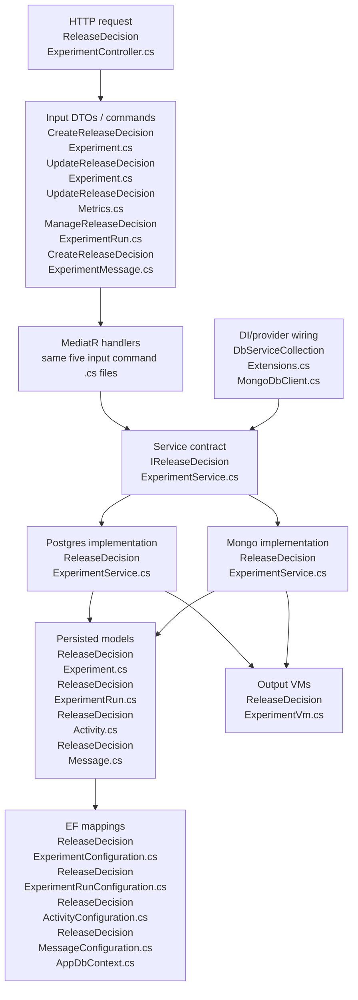
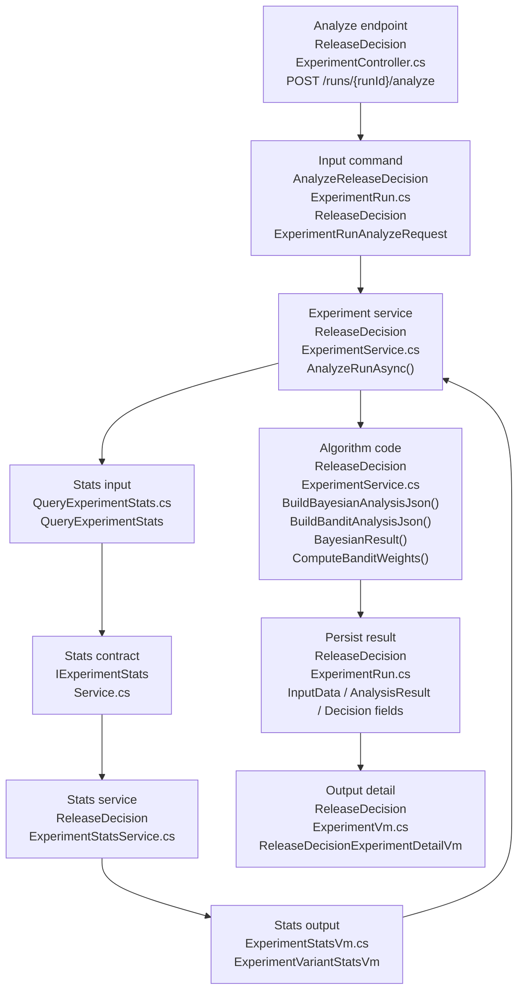
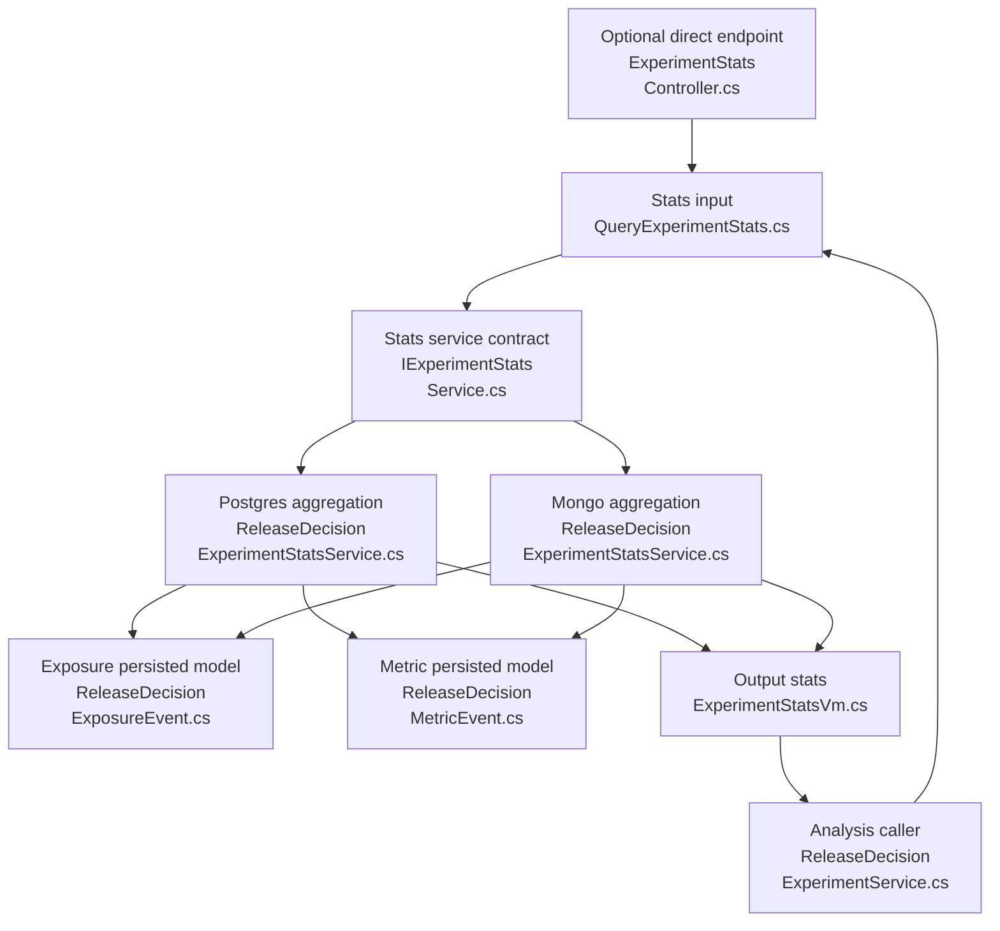
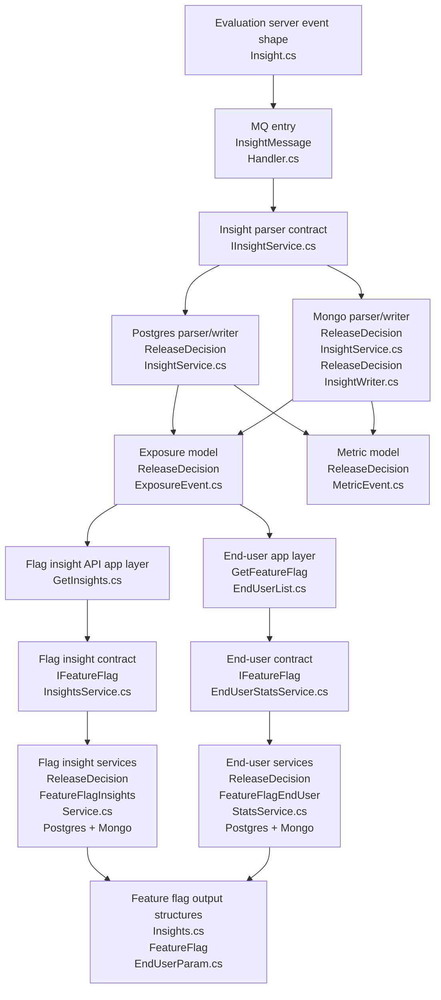
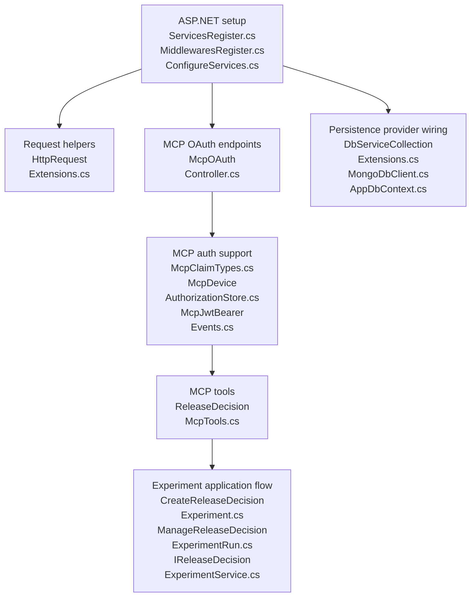

# v5.5.0 PR Review - API / eval C# flow

Scope: `featbit/featbit#921`, `main` -> `release-decision`.

Confirmed base/head:

- base `main`: `5b9d6a74fd927e5f4012235521dbc09eb3afbc99`
- head `release-decision`: `76639eefa705019925a71cc89a5a2af120878860`

This version only reviews added / modified / renamed C# files under:

- `modules/back-end/src`
- `modules/evaluation-server/src`

Frontend, SQL, JSON, Docker, Aspire, and deleted old files are not expanded here except where needed to explain the C# runtime flow.

Mermaid diagrams wrap long C# filenames across multiple lines to avoid renderer clipping. Concatenate the lines inside one node to get the full `.cs` filename.

## 1. Experiment CRUD / Run Management

This is the core release-decision workspace flow: create experiment, update decision state, configure metrics, create/update runs, add messages, and read detail/list output.

Data structure direction:

| File | Direction | What it carries |
|---|---|---|
| `CreateReleaseDecisionExperiment.cs` | input | Create experiment request: name, description, flag key, project key. |
| `UpdateReleaseDecisionExperiment.cs` | input | Patch decision-state fields: goal, intent, hypothesis, change, constraints, stage, flag binding metadata. |
| `UpdateReleaseDecisionMetrics.cs` | input | Structured primary metric and guardrail config. |
| `ManageReleaseDecisionExperimentRun.cs` | input | Run update payloads: method, variants, traffic, observation window, pasted/input analysis data, decision/learning fields. |
| `CreateReleaseDecisionExperimentMessage.cs` | input | Conversation message append payload. |
| `ReleaseDecisionExperimentVm.cs` | output and query input | List/detail VMs, run/activity/message VMs, plus list filter/query request classes. |
| `ReleaseDecisionExperiment.cs` | persisted model | Experiment workspace state. |
| `ReleaseDecisionExperimentRun.cs` | persisted model | One analysis/run attempt under an experiment. |
| `ReleaseDecisionActivity.cs` | persisted model | Timeline/audit activity for experiment operations. |
| `ReleaseDecisionMessage.cs` | persisted model | Stored chat/agent conversation message. |

Notes:

- PostgreSQL `ReleaseDecisionExperimentService.cs` is the complete implementation.
- Mongo `ReleaseDecisionExperimentService.cs` exists, but run create/update/analyze behavior is not equivalent to PostgreSQL.

## 2. Server-side Analysis / A/B Algorithm

This flow starts after an experiment run exists and the user asks the server to analyze it.

Data structure direction:

| File | Direction | What it carries |
|---|---|---|
| `AnalyzeReleaseDecisionExperimentRun.cs` | input | Analyze request. Currently `ForceFresh`. |
| `QueryExperimentStats.cs` | input | Stats query: env, flag, metric event, date window, metric type, aggregation. |
| `ExperimentStatsVm.cs` | output | Per-variant stats: users, conversions, sum, sum squares, conversion rate, average. |
| `ReleaseDecisionExperimentRun.cs` | persisted input/output | Stores metric config before analysis; stores `InputData`, `AnalysisResult`, `Decision*` after analysis. |
| `ReleaseDecisionExperimentVm.cs` | output | Returns refreshed run analysis to caller. |

Notes:

- The actual Bayesian / bandit algorithm is inside `Infrastructure/Services/EntityFrameworkCore/ReleaseDecisionExperimentService.cs`.
- Mongo has `ReleaseDecisionExperimentStatsService.cs`, but Mongo experiment `AnalyzeRunAsync()` does not perform the algorithm.

## 3. Exposure + Metric Stats Query

This is the data query layer consumed by the analysis flow and optionally exposed through a direct stats endpoint.

Query mechanism:

- First exposure per `user_key` in window determines the user's variant.
- Metric events are counted only when `occurred_at >= exposure_ts`.
- Aggregation returns per-variant users/conversions/value moments.
- Binary metrics force `once`; continuous metrics can use `count`, `sum`, or `average`.

Data structure direction:

| File | Direction | What it carries |
|---|---|---|
| `ReleaseDecisionExposureEvent.cs` | persisted input source | Raw flag evaluation/exposure event. |
| `ReleaseDecisionMetricEvent.cs` | persisted input source | Raw metric/custom event. |
| `QueryExperimentStats.cs` | input | Query parameters for the aggregation. |
| `ExperimentStatsVm.cs` | output | Aggregated variant stats returned to analysis/API. |

## 4. Insight Event Ingestion / Feature Flag Insight Reads

This flow converts existing insight messages into release-decision exposure/metric events, then uses those events for feature flag insight and A/B stats queries.

Data structure direction:

| File | Direction | What it carries |
|---|---|---|
| `modules/evaluation-server/src/Domain/Insights/Insight.cs` | emitted input | Produces insight payload; `FlagValue` now includes `variationValue`. |
| `ReleaseDecisionExposureEvent.cs` | persisted output from ingestion, input to queries | Exposure event parsed from `FlagValue`. |
| `ReleaseDecisionMetricEvent.cs` | persisted output from ingestion, input to queries | Metric event parsed from non-`FlagValue` insights. |
| `Domain/FeatureFlags/Insights.cs` | output | Time bucket + variation counts for flag insight charts. |
| `Domain/FeatureFlags/FeatureFlagEndUserParam.cs` | service input/output support | Query parameters plus returned end-user stats shape. |

Important dependency: if `FlagValue` events are not ingested into `ReleaseDecisionExposureEvent`, feature-flag insights and A/B analysis both appear empty.

## 5. MCP / Auth / API Wiring

These files do not own experiment data, but they make the API and agent-facing workflow reachable.

Data structure direction:

| File | Direction | What it carries |
|---|---|---|
| `McpClaimTypes.cs` | auth metadata | Claim name constants. |
| `McpDeviceAuthorizationStore.cs` | auth state | Device authorization state. |
| `McpJwtBearerEvents.cs` | auth input validation | JWT bearer event handling for MCP auth. |
| `ReleaseDecisionMcpTools.cs` | agent input/output bridge | Maps MCP tool inputs to application requests and returns release-decision VMs. |

## 6. Complete A/M/R C# Inventory

Every added / modified / renamed C# file under `modules/back-end/src` and `modules/evaluation-server/src` is included below.

| Status | File | Flow | Role |
|---|---|---|---|
| A | `modules/back-end/src/Api/Controllers/ExperimentStatsController.cs` | Stats query | Direct HTTP endpoint for `QueryExperimentStats`; output is `ExperimentStatsVm`. |
| A | `modules/back-end/src/Api/Controllers/McpOAuthController.cs` | MCP/Auth | OAuth/device endpoints for MCP access. |
| A | `modules/back-end/src/Api/Controllers/ReleaseDecisionExperimentController.cs` | CRUD / analysis | Main release-decision REST controller. |
| M | `modules/back-end/src/Api/HttpRequestExtensions.cs` | MCP/Auth | Request helper changes used by auth/context handling. |
| A | `modules/back-end/src/Api/Mcp/McpClaimTypes.cs` | MCP/Auth | Auth data constants. |
| A | `modules/back-end/src/Api/Mcp/McpDeviceAuthorizationStore.cs` | MCP/Auth | Auth state store. |
| A | `modules/back-end/src/Api/Mcp/McpJwtBearerEvents.cs` | MCP/Auth | JWT event handling. |
| A | `modules/back-end/src/Api/Mcp/ReleaseDecisionMcpTools.cs` | MCP/Auth + CRUD | Agent-facing tool layer over release-decision application requests. |
| M | `modules/back-end/src/Api/Setup/MiddlewaresRegister.cs` | Wiring | Middleware registration for new auth/MCP behavior. |
| M | `modules/back-end/src/Api/Setup/ServicesRegister.cs` | Wiring | Service registration for new auth/MCP behavior. |
| M | `modules/back-end/src/Application/EndUsers/GetFeatureFlagEndUserList.cs` | Insight reads | App request now uses `IFeatureFlagEndUserStatsService` instead of old OLAP service. |
| A | `modules/back-end/src/Application/ExperimentStats/ExperimentStatsVm.cs` | Stats query | Output DTOs for per-variant stats. |
| A | `modules/back-end/src/Application/ExperimentStats/QueryExperimentStats.cs` | Stats query | Input command, validator, handler for stats aggregation. |
| M | `modules/back-end/src/Application/FeatureFlags/GetInsights.cs` | Insight reads | App request now uses `IFeatureFlagInsightsService` instead of old OLAP service. |
| A | `modules/back-end/src/Application/ReleaseDecisions/AnalyzeReleaseDecisionExperimentRun.cs` | Analysis | Input command for server-side analysis. |
| A | `modules/back-end/src/Application/ReleaseDecisions/CreateReleaseDecisionExperiment.cs` | CRUD | Input command for experiment creation. |
| A | `modules/back-end/src/Application/ReleaseDecisions/CreateReleaseDecisionExperimentMessage.cs` | CRUD | Input command for message append. |
| A | `modules/back-end/src/Application/ReleaseDecisions/ManageReleaseDecisionExperimentRun.cs` | CRUD / run | Input commands for run create/update/delete/audience/window. |
| A | `modules/back-end/src/Application/ReleaseDecisions/ReleaseDecisionExperimentVm.cs` | CRUD | Output VMs and list/detail query request classes. |
| A | `modules/back-end/src/Application/ReleaseDecisions/UpdateReleaseDecisionExperiment.cs` | CRUD | Input command for experiment state/stage patching. |
| A | `modules/back-end/src/Application/ReleaseDecisions/UpdateReleaseDecisionMetrics.cs` | CRUD / metrics | Input command for structured primary metric and guardrails. |
| A | `modules/back-end/src/Application/Services/IExperimentStatsService.cs` | Stats query | Contract for stats aggregation. |
| A | `modules/back-end/src/Application/Services/IFeatureFlagEndUserStatsService.cs` | Insight reads | Contract for end-user exposure stats. |
| A | `modules/back-end/src/Application/Services/IFeatureFlagInsightsService.cs` | Insight reads | Contract for flag insight time series. |
| A | `modules/back-end/src/Application/Services/IReleaseDecisionExperimentService.cs` | CRUD / analysis | Contract for release-decision experiment persistence and analysis. |
| M | `modules/back-end/src/Domain/FeatureFlags/FeatureFlagEndUserParam.cs` | Insight reads | Service input and output support for end-user exposure stats. |
| A | `modules/back-end/src/Domain/FeatureFlags/Insights.cs` | Insight reads | Output structure for flag insight time series. |
| A | `modules/back-end/src/Domain/ReleaseDecisions/ReleaseDecisionActivity.cs` | CRUD | Persisted activity model. |
| A | `modules/back-end/src/Domain/ReleaseDecisions/ReleaseDecisionExperiment.cs` | CRUD | Persisted experiment model. |
| A | `modules/back-end/src/Domain/ReleaseDecisions/ReleaseDecisionExperimentRun.cs` | CRUD / analysis | Persisted run model; algorithm input/output fields live here. |
| A | `modules/back-end/src/Domain/ReleaseDecisions/ReleaseDecisionExposureEvent.cs` | Ingestion / stats | Persisted exposure event model. |
| A | `modules/back-end/src/Domain/ReleaseDecisions/ReleaseDecisionMessage.cs` | CRUD | Persisted message model. |
| A | `modules/back-end/src/Domain/ReleaseDecisions/ReleaseDecisionMetricEvent.cs` | Ingestion / stats | Persisted metric event model. |
| M | `modules/back-end/src/Infrastructure/ConfigureServices.cs` | Wiring | Infrastructure service registration entrypoint. |
| M | `modules/back-end/src/Infrastructure/MQ/InsightMessageHandler.cs` | Ingestion | Existing insights topic now writes through release-decision event parser. |
| M | `modules/back-end/src/Infrastructure/Persistence/DbServiceCollectionExtensions.cs` | Wiring | Registers Postgres/Mongo release-decision services. |
| M | `modules/back-end/src/Infrastructure/Persistence/EntityFrameworkCore/AppDbContext.cs` | Persistence | Applies new EF configurations. |
| A | `modules/back-end/src/Infrastructure/Persistence/EntityFrameworkCore/Configurations/ReleaseDecisionActivityConfiguration.cs` | Persistence | EF mapping for activity. |
| A | `modules/back-end/src/Infrastructure/Persistence/EntityFrameworkCore/Configurations/ReleaseDecisionExperimentConfiguration.cs` | Persistence | EF mapping for experiment. |
| A | `modules/back-end/src/Infrastructure/Persistence/EntityFrameworkCore/Configurations/ReleaseDecisionExperimentRunConfiguration.cs` | Persistence | EF mapping for run. |
| A | `modules/back-end/src/Infrastructure/Persistence/EntityFrameworkCore/Configurations/ReleaseDecisionExposureEventConfiguration.cs` | Persistence | EF mapping for exposure event. |
| A | `modules/back-end/src/Infrastructure/Persistence/EntityFrameworkCore/Configurations/ReleaseDecisionMessageConfiguration.cs` | Persistence | EF mapping for message. |
| A | `modules/back-end/src/Infrastructure/Persistence/EntityFrameworkCore/Configurations/ReleaseDecisionMetricEventConfiguration.cs` | Persistence | EF mapping for metric event. |
| M | `modules/back-end/src/Infrastructure/Persistence/MongoDb/MongoDbClient.cs` | Persistence | Registers Mongo collection names for release-decision models. |
| A | `modules/back-end/src/Infrastructure/Services/EntityFrameworkCore/ReleaseDecisionExperimentService.cs` | CRUD / analysis | Main Postgres implementation and algorithm host. |
| A | `modules/back-end/src/Infrastructure/Services/EntityFrameworkCore/ReleaseDecisionExperimentStatsService.cs` | Stats query | Postgres stats aggregation. |
| A | `modules/back-end/src/Infrastructure/Services/EntityFrameworkCore/ReleaseDecisionFeatureFlagEndUserStatsService.cs` | Insight reads | Postgres end-user exposure stats. |
| A | `modules/back-end/src/Infrastructure/Services/EntityFrameworkCore/ReleaseDecisionFeatureFlagInsightsService.cs` | Insight reads | Postgres flag insight time series. |
| A | `modules/back-end/src/Infrastructure/Services/EntityFrameworkCore/ReleaseDecisionInsightService.cs` | Ingestion | Postgres insight parser/writer. |
| A | `modules/back-end/src/Infrastructure/Services/MongoDb/ReleaseDecisionExperimentService.cs` | CRUD | Mongo experiment service. Incomplete vs Postgres for run/analyze. |
| A | `modules/back-end/src/Infrastructure/Services/MongoDb/ReleaseDecisionExperimentStatsService.cs` | Stats query | Mongo stats aggregation. |
| A | `modules/back-end/src/Infrastructure/Services/MongoDb/ReleaseDecisionFeatureFlagEndUserStatsService.cs` | Insight reads | Mongo end-user exposure stats. |
| A | `modules/back-end/src/Infrastructure/Services/MongoDb/ReleaseDecisionFeatureFlagInsightsService.cs` | Insight reads | Mongo flag insight time series. |
| R | `modules/back-end/src/Infrastructure/Services/MongoDb/InsightService.cs` -> `modules/back-end/src/Infrastructure/Services/MongoDb/ReleaseDecisionInsightService.cs` | Ingestion | Renamed Mongo insight parser/writer for release-decision event pipeline. |
| A | `modules/back-end/src/Infrastructure/Services/MongoDb/ReleaseDecisionInsightWriter.cs` | Ingestion | Mongo helper that splits BSON insight docs into exposure and metric collections. |
| M | `modules/evaluation-server/src/Domain/Insights/Insight.cs` | Ingestion input | Emits `variationValue` in `FlagValue` event properties. |

## 7. Back-end cleanup notes

Static check result: among the A/M/R C# files above, I did not find an obvious file that is clearly unused and safe to delete immediately.

Already deleted in this PR, so not in the inventory above:

- old `ExperimentController`, `ExperimentMetricController`
- old `Application/Experiments/*`
- old `Application/ExperimentMetrics/*`
- old `Domain/Experiments/*`
- old `Domain/ExperimentMetrics/*`
- old `ExperimentService`, `ExperimentMetricService`
- old `IOlapService` / `OlapService`
- old `GetVariationReferences`
- old `InsightsParam`

Review attention:

- Mongo release-decision services are wired and therefore not unused, but they are not behaviorally equivalent to PostgreSQL for run creation/update/analyze.
- `ExperimentStatsController.cs` may look unreferenced from code, but it is a discovered ASP.NET Core controller.
- EF configuration files may look unreferenced except from `AppDbContext.cs`; that reference is the runtime mapping path.
