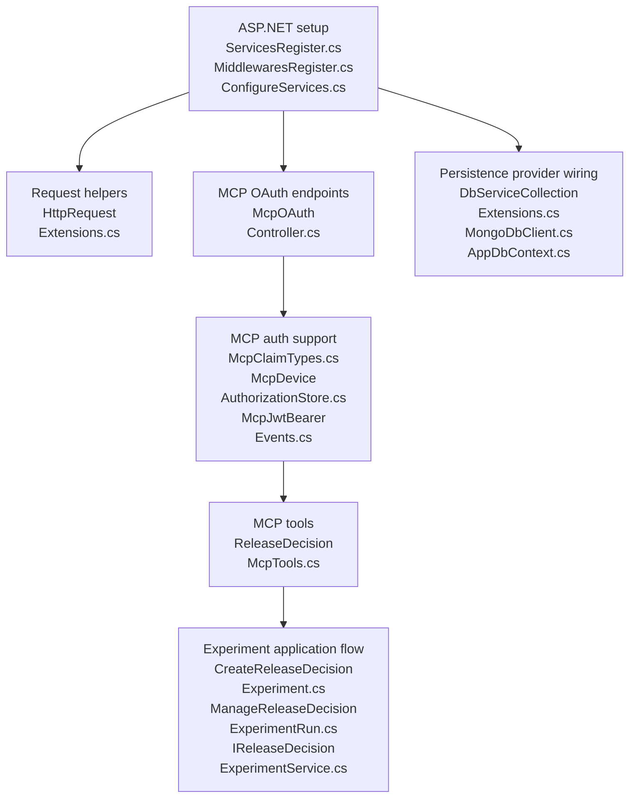

# v5.5.0 PR Review - API / eval C# flow

Scope: `featbit/featbit#921`, `main` -> `release-decision`.

Confirmed base/head:

- base `main`: `5b9d6a74fd927e5f4012235521dbc09eb3afbc99`
- head `release-decision`: `76639eefa705019925a71cc89a5a2af120878860`

This version only reviews added / modified / renamed C# files under:

- `modules/back-end/src`
- `modules/evaluation-server/src`

Frontend, SQL, JSON, Docker, Aspire, and deleted old files are not expanded here except where needed to explain the C# runtime flow.

Mermaid diagrams wrap long C# filenames across multiple lines to avoid renderer clipping. Concatenate the lines inside one node to get the full `.cs` filename.

## 1. Experiment CRUD / Run Management

This is the core release-decision workspace flow after native agent conversation storage was removed: create experiment, update decision state, configure metrics, create/update/delete runs, and read detail/list output. Server-side run analysis is only shown as a boundary here; its algorithm is expanded in section 2.

### Files covered in this section

Only files added, modified, or renamed by [featbit/featbit#921](https://github.com/featbit/featbit/pull/921) are listed here. `[PR A]` means added, `[PR M]` means modified, and `[PR R]` means renamed.

- [PR A] `modules/back-end/src/Api/Controllers/ReleaseDecisionExperimentController.cs`
- [PR A] `modules/back-end/src/Api/Mcp/ReleaseDecisionMcpTools.cs`
- [PR A] `modules/back-end/src/Application/ReleaseDecisions/CreateReleaseDecisionExperiment.cs`
- [PR A] `modules/back-end/src/Application/ReleaseDecisions/ManageReleaseDecisionExperimentRun.cs`
- [PR A] `modules/back-end/src/Application/ReleaseDecisions/ReleaseDecisionExperimentVm.cs`
- [PR A] `modules/back-end/src/Application/ReleaseDecisions/UpdateReleaseDecisionExperiment.cs`
- [PR A] `modules/back-end/src/Application/ReleaseDecisions/UpdateReleaseDecisionMetrics.cs`
- [PR A] `modules/back-end/src/Application/Services/IReleaseDecisionExperimentService.cs`
- [PR A] `modules/back-end/src/Domain/ReleaseDecisions/ReleaseDecisionActivity.cs`
- [PR A] `modules/back-end/src/Domain/ReleaseDecisions/ReleaseDecisionExperiment.cs`
- [PR A] `modules/back-end/src/Domain/ReleaseDecisions/ReleaseDecisionExperimentRun.cs`
- [PR M] `modules/back-end/src/Infrastructure/Persistence/DbServiceCollectionExtensions.cs`
- [PR M] `modules/back-end/src/Infrastructure/Persistence/EntityFrameworkCore/AppDbContext.cs`
- [PR A] `modules/back-end/src/Infrastructure/Persistence/EntityFrameworkCore/Configurations/ReleaseDecisionActivityConfiguration.cs`
- [PR A] `modules/back-end/src/Infrastructure/Persistence/EntityFrameworkCore/Configurations/ReleaseDecisionExperimentConfiguration.cs`
- [PR A] `modules/back-end/src/Infrastructure/Persistence/EntityFrameworkCore/Configurations/ReleaseDecisionExperimentRunConfiguration.cs`
- [PR M] `modules/back-end/src/Infrastructure/Persistence/MongoDb/MongoDbClient.cs`
- [PR A] `modules/back-end/src/Infrastructure/Services/EntityFrameworkCore/ReleaseDecisionExperimentService.cs`
- [PR A] `modules/back-end/src/Infrastructure/Services/MongoDb/ReleaseDecisionExperimentService.cs`
- [PR A] `infra/postgresql/docker-entrypoint-initdb.d/v5.5.0.sql`

### Serial review method

1. Start at `modules/back-end/src/Api/Controllers/ReleaseDecisionExperimentController.cs` [PR A]. Trace each REST entry point from route binding into `Mediator.Send(...)`: create/list/get/delete experiment, update experiment/stage/metrics, create/delete/update run, update run audience/window, and analyze boundary.
2. For create flow, continue to `modules/back-end/src/Application/ReleaseDecisions/CreateReleaseDecisionExperiment.cs` [PR A]. Review request validation, normalized input, handler delegation, and the expected return through `ReleaseDecisionExperimentVm`.
3. For experiment update flow, continue to `modules/back-end/src/Application/ReleaseDecisions/UpdateReleaseDecisionExperiment.cs` [PR A] and `modules/back-end/src/Application/ReleaseDecisions/UpdateReleaseDecisionMetrics.cs` [PR A]. Review how generic decision-state fields and structured primary metric/guardrail fields enter the same service boundary.
4. For run-management flow, continue to `modules/back-end/src/Application/ReleaseDecisions/ManageReleaseDecisionExperimentRun.cs` [PR A]. Review create/delete/update/audience/window commands and confirm each handler delegates instead of mutating persistence directly.
5. Open `modules/back-end/src/Application/Services/IReleaseDecisionExperimentService.cs` [PR A]. Use it as the contract checklist from application handlers into persistence providers: CRUD, metrics, run management, analysis boundary, list/detail return.
6. Open `modules/back-end/src/Infrastructure/Persistence/DbServiceCollectionExtensions.cs` [PR M]. Confirm the selected provider wires `IReleaseDecisionExperimentService` to the Postgres or Mongo implementation used by the handlers.
7. Open `modules/back-end/src/Infrastructure/Services/EntityFrameworkCore/ReleaseDecisionExperimentService.cs` [PR A] and `modules/back-end/src/Infrastructure/Services/MongoDb/ReleaseDecisionExperimentService.cs` [PR A]. Trace each service method from loaded experiment/run state through mutation, activity write, child cleanup, provider persistence, and final `GetAsync()` / VM return.
8. Open `modules/back-end/src/Domain/ReleaseDecisions/ReleaseDecisionExperiment.cs` [PR A], `modules/back-end/src/Domain/ReleaseDecisions/ReleaseDecisionExperimentRun.cs` [PR A], and `modules/back-end/src/Domain/ReleaseDecisions/ReleaseDecisionActivity.cs` [PR A]. Confirm the fields mutated by the provider methods match the workflow state exposed by the API.
9. For Postgres persistence, open `modules/back-end/src/Infrastructure/Persistence/EntityFrameworkCore/Configurations/ReleaseDecisionExperimentConfiguration.cs` [PR A], `modules/back-end/src/Infrastructure/Persistence/EntityFrameworkCore/Configurations/ReleaseDecisionExperimentRunConfiguration.cs` [PR A], `modules/back-end/src/Infrastructure/Persistence/EntityFrameworkCore/Configurations/ReleaseDecisionActivityConfiguration.cs` [PR A], and `modules/back-end/src/Infrastructure/Persistence/EntityFrameworkCore/AppDbContext.cs` [PR M]. Confirm mappings, indexes, and model registration match the service reads/writes.
10. For Mongo persistence, open `modules/back-end/src/Infrastructure/Persistence/MongoDb/MongoDbClient.cs` [PR M]. Confirm collection names exist for experiments, runs, and activities and match the Mongo service usage.
11. Open `modules/back-end/src/Application/ReleaseDecisions/ReleaseDecisionExperimentVm.cs` [PR A]. Review the final list/detail/run/activity shape returned by controller actions and provider `GetAsync()` / `GetListAsync()`.
12. Open `modules/back-end/src/Api/Mcp/ReleaseDecisionMcpTools.cs` [PR A]. Review the parallel MCP entry path and confirm it lands on the same application requests/service methods as the REST flow instead of creating a separate persistence path.
13. Open `infra/postgresql/docker-entrypoint-initdb.d/v5.5.0.sql` [PR A]. Review the backing Postgres tables/indexes for the CRUD/run/activity writes and confirm there are no database foreign keys, matching the provider-owned cleanup behavior.

### Database script review

- Main script: `infra/postgresql/docker-entrypoint-initdb.d/v5.5.0.sql`.
- Legacy native-agent storage cleanup: `DROP TABLE IF EXISTS release_decision_messages;`.
- CRUD workspace table: `release_decision_experiments`, with indexes on `(featbit_env_id, updated_at)`, `featbit_project_key`, `flag_key`, and `(featbit_env_id, flag_key)`.
- Run table: `release_decision_experiment_runs`, with unique index `ux_release_decision_experiment_runs_experiment_slug` on `(experiment_id, slug)`.
- Activity table: `release_decision_activities`, with index `ix_release_decision_activities_experiment_created_at` on `(experiment_id, created_at)`.
- Important constraint rule: no database foreign keys are created. Parent/child cleanup is an application-service responsibility.
- `release_decision_exposure_events`, `release_decision_metric_events`, and `release_decision_run_variant_stats` are not CRUD workspace tables; they support ingestion/stats/analysis flows covered later.

Notes:

- PostgreSQL `ReleaseDecisionExperimentService.cs` is the complete CRUD/run implementation.
- Mongo `ReleaseDecisionExperimentService.cs` is wired and now implements the same release-decision run-management behavior as PostgreSQL.
- Native conversation/message storage was removed. Users now run local agents such as Claude Code or Codex and persist release-decision state through MCP/REST update tools.

## 2. Server-side Analysis / A/B Algorithm

This flow starts after an experiment run exists and the user asks the server to analyze it. Both provider implementations read the run configuration, query FeatBit exposure/metric stats, convert those stats into algorithm input JSON, build either Bayesian or bandit output JSON, store both JSON payloads on the run, then return the refreshed experiment detail.

### Files covered in this section

Only files added, modified, or renamed by [featbit/featbit#921](https://github.com/featbit/featbit/pull/921) are listed here. `[PR A]` means added, `[PR M]` means modified, and `[PR R]` means renamed.

- [PR A] `modules/back-end/src/Api/Controllers/ReleaseDecisionExperimentController.cs`
- [PR A] `modules/back-end/src/Application/ExperimentStats/ExperimentStatsVm.cs`
- [PR A] `modules/back-end/src/Application/ExperimentStats/QueryExperimentStats.cs`
- [PR A] `modules/back-end/src/Application/ReleaseDecisions/AnalyzeReleaseDecisionExperimentRun.cs`
- [PR A] `modules/back-end/src/Application/ReleaseDecisions/ReleaseDecisionExperimentVm.cs`
- [PR A] `modules/back-end/src/Application/Services/IExperimentStatsService.cs`
- [PR A] `modules/back-end/src/Application/Services/IReleaseDecisionExperimentService.cs`
- [PR A] `modules/back-end/src/Domain/ReleaseDecisions/ReleaseDecisionActivity.cs`
- [PR A] `modules/back-end/src/Domain/ReleaseDecisions/ReleaseDecisionExperiment.cs`
- [PR A] `modules/back-end/src/Domain/ReleaseDecisions/ReleaseDecisionExperimentRun.cs`
- [PR A] `modules/back-end/src/Domain/ReleaseDecisions/ReleaseDecisionExposureEvent.cs`
- [PR A] `modules/back-end/src/Domain/ReleaseDecisions/ReleaseDecisionMetricEvent.cs`
- [PR M] `modules/back-end/src/Infrastructure/Persistence/DbServiceCollectionExtensions.cs`
- [PR M] `modules/back-end/src/Infrastructure/Persistence/EntityFrameworkCore/AppDbContext.cs`
- [PR A] `modules/back-end/src/Infrastructure/Persistence/EntityFrameworkCore/Configurations/ReleaseDecisionActivityConfiguration.cs`
- [PR A] `modules/back-end/src/Infrastructure/Persistence/EntityFrameworkCore/Configurations/ReleaseDecisionExperimentConfiguration.cs`
- [PR A] `modules/back-end/src/Infrastructure/Persistence/EntityFrameworkCore/Configurations/ReleaseDecisionExperimentRunConfiguration.cs`
- [PR A] `modules/back-end/src/Infrastructure/Services/EntityFrameworkCore/ReleaseDecisionExperimentService.cs`
- [PR A] `modules/back-end/src/Infrastructure/Services/EntityFrameworkCore/ReleaseDecisionExperimentStatsService.cs`
- [PR A] `modules/back-end/src/Infrastructure/Services/MongoDb/ReleaseDecisionExperimentService.cs`
- [PR A] `modules/back-end/src/Infrastructure/Services/MongoDb/ReleaseDecisionExperimentStatsService.cs`

Serial runtime call:

```csharp
ReleaseDecisionExperimentController.AnalyzeRunAsync(envId, id, runId, request)
    -> Mediator.Send(new AnalyzeReleaseDecisionExperimentRun { EnvId, Id, RunId, Request })
    -> AnalyzeReleaseDecisionExperimentRunHandler.Handle(...)
    -> IReleaseDecisionExperimentService.AnalyzeRunAsync(envId, id, runId, request)
    -> provider ReleaseDecisionExperimentService.AnalyzeRunAsync(...)
        -> request ??= new ReleaseDecisionExperimentRunAnalyzeRequest()
        -> load experiment by envId/id
        -> load run by experiment id/runId
        -> HydrateRunMetricConfig(run, experiment)
        -> AlignRunVariantsAsync(envId, experiment, run, inferMissing: true)
        -> validate experiment.FlagKey and run.PrimaryMetricEvent
        -> derive observation window, metric type, and metric aggregation
        -> statsService.QueryAsync(new QueryExperimentStats { primary metric config })
        -> BuildMetricData(metricType, stats.Variants)
        -> ParseGuardrailDefinitions(run.GuardrailEvents)
        -> statsService.QueryAsync(...) once per guardrail
        -> BuildInputDataJson(metrics)
        -> ResolveAnalysisVariantKeys(experiment.Variants, primaryMetricData, control, treatments)
        -> run.Method == "bandit"
            ? BuildBanditAnalysisJson(...)
            : BuildBayesianAnalysisJson(...)
        -> run.InputData = inputData
        -> run.AnalysisResult = analysisResult
        -> run.Status = no users ? "collecting" : "analyzing"
        -> AddActivityAsync(...)
        -> persist provider-specific changes
        -> GetAsync(envId, id)
```

### Serial review method

1. Start at `modules/back-end/src/Api/Controllers/ReleaseDecisionExperimentController.cs` [PR A]. Trace `POST {id}/runs/{runId}/analyze` from route inputs into `AnalyzeReleaseDecisionExperimentRun` and `Mediator.Send(...)`.
2. Continue to `modules/back-end/src/Application/ReleaseDecisions/AnalyzeReleaseDecisionExperimentRun.cs` [PR A]. Review request handling, `ForceFresh`, and delegation to `IReleaseDecisionExperimentService.AnalyzeRunAsync(...)`.
3. Open `modules/back-end/src/Application/Services/IReleaseDecisionExperimentService.cs` [PR A] and `modules/back-end/src/Infrastructure/Persistence/DbServiceCollectionExtensions.cs` [PR M]. Confirm the analyze contract is implemented by both selected providers and that `IExperimentStatsService` is registered for the same provider family.
4. Open `modules/back-end/src/Infrastructure/Services/EntityFrameworkCore/ReleaseDecisionExperimentService.cs` [PR A] and `modules/back-end/src/Infrastructure/Services/MongoDb/ReleaseDecisionExperimentService.cs` [PR A]. Trace `AnalyzeRunAsync()` end to end: load experiment, load run, hydrate metric config, align variants, validate flag/metric, derive observation window, and prepare stats requests.
5. Open `modules/back-end/src/Domain/ReleaseDecisions/ReleaseDecisionExperiment.cs` [PR A] and `modules/back-end/src/Domain/ReleaseDecisions/ReleaseDecisionExperimentRun.cs` [PR A]. Confirm analysis input comes from experiment flag/metric/guardrail/variant fields plus run method, priors, minimum sample, and observation window.
6. From the provider services, follow the stats dependency into `modules/back-end/src/Application/ExperimentStats/QueryExperimentStats.cs` [PR A] and `modules/back-end/src/Application/Services/IExperimentStatsService.cs` [PR A]. Confirm the analysis path asks for aggregates through the shared stats contract.
7. Open `modules/back-end/src/Infrastructure/Services/EntityFrameworkCore/ReleaseDecisionExperimentStatsService.cs` [PR A] and `modules/back-end/src/Infrastructure/Services/MongoDb/ReleaseDecisionExperimentStatsService.cs` [PR A]. Review how primary and guardrail stats are calculated before returning `ExperimentStatsVm`.
8. Open `modules/back-end/src/Domain/ReleaseDecisions/ReleaseDecisionExposureEvent.cs` [PR A] and `modules/back-end/src/Domain/ReleaseDecisions/ReleaseDecisionMetricEvent.cs` [PR A]. Confirm the stats services read exposure and metric events as the raw evidence source for analysis.
9. Open `modules/back-end/src/Application/ExperimentStats/ExperimentStatsVm.cs` [PR A]. Confirm the returned users, conversions, value sums, sum squares, conversion rate, and average value contain everything the algorithm builders consume.
10. Return to both provider `ReleaseDecisionExperimentService.cs` files [PR A]. Review `BuildMetricData()`, `BuildInputDataJson()`, guardrail parsing, variant-key resolution, SRM helpers, Bayesian helpers, and bandit helpers from stats input to analysis JSON output.
11. Return to `modules/back-end/src/Domain/ReleaseDecisions/ReleaseDecisionExperimentRun.cs` [PR A]. Confirm analysis writes land on run fields such as `InputData`, `AnalysisResult`, and status.
12. Open `modules/back-end/src/Domain/ReleaseDecisions/ReleaseDecisionActivity.cs` [PR A]. Confirm the analysis activity written by provider services has enough metadata for the refreshed experiment detail.
13. Open `modules/back-end/src/Infrastructure/Persistence/EntityFrameworkCore/Configurations/ReleaseDecisionExperimentConfiguration.cs` [PR A], `modules/back-end/src/Infrastructure/Persistence/EntityFrameworkCore/Configurations/ReleaseDecisionExperimentRunConfiguration.cs` [PR A], `modules/back-end/src/Infrastructure/Persistence/EntityFrameworkCore/Configurations/ReleaseDecisionActivityConfiguration.cs` [PR A], and `modules/back-end/src/Infrastructure/Persistence/EntityFrameworkCore/AppDbContext.cs` [PR M]. Confirm Postgres maps the experiment input, analysis output, and activity fields used by `AnalyzeRunAsync()`.
14. Return to both provider service files [PR A]. Confirm the final steps write activity, persist changes, and return refreshed experiment detail through `GetAsync(envId, id)`.
15. Open `modules/back-end/src/Application/ReleaseDecisions/ReleaseDecisionExperimentVm.cs` [PR A]. Review the returned run VM fields that expose `InputData`, `AnalysisResult`, status, and activity context to API/MCP clients.

Algorithm review notes:

- Bayesian and bandit analysis are implemented as JSON builders inside both provider-specific `ReleaseDecisionExperimentService.cs` files; there is no separate algorithm service yet.
- The stats query is part of the analysis contract. The algorithm never reads raw events directly; it consumes per-variant aggregates produced by `IExperimentStatsService`.
- Binary metrics use proportion-style input `{ n, k }`. Continuous metrics use moment-style input `{ n, sum, sum_squares }`.
- SRM is checked from observed users per analyzed variant using a chi-square survival function. The current expected split is equal allocation across observed variants.
- Bayesian output is decision-support output, not an automatic run decision write. The method persists `AnalysisResult`, but does not populate `Decision`, `DecisionSummary`, or learning fields.
- Bandit output recommends traffic weights, but the method does not apply those weights back to a FeatBit flag or run audience settings.
- `ForceFresh` exists on the request contract but is not used by the current Postgres implementation.
- Mongo now implements the same release-decision run analysis loop at the service level, using Mongo stats aggregation and the same Bayesian/bandit helper logic as the Postgres path.

## 3. Exposure + Metric Stats Query

This is the evidence aggregation layer shared by the direct `/experiment-stats/query` endpoint and by server-side run analysis. It reads raw exposure and metric events, derives the first exposure per user, counts only post-exposure metric events, returns per-variant aggregates, and leaves persisted analysis decisions to section 2.

### Files covered in this section

Only files added, modified, or renamed by [featbit/featbit#921](https://github.com/featbit/featbit/pull/921) are listed here. `[PR A]` means added, `[PR M]` means modified, and `[PR R]` means renamed.

- [PR A] `modules/back-end/src/Api/Controllers/ExperimentStatsController.cs`
- [PR A] `modules/back-end/src/Application/ExperimentStats/ExperimentStatsVm.cs`
- [PR A] `modules/back-end/src/Application/ExperimentStats/QueryExperimentStats.cs`
- [PR A] `modules/back-end/src/Application/Services/IExperimentStatsService.cs`
- [PR A] `modules/back-end/src/Domain/ReleaseDecisions/ReleaseDecisionExposureEvent.cs`
- [PR A] `modules/back-end/src/Domain/ReleaseDecisions/ReleaseDecisionMetricEvent.cs`
- [PR M] `modules/back-end/src/Infrastructure/Persistence/DbServiceCollectionExtensions.cs`
- [PR M] `modules/back-end/src/Infrastructure/Persistence/EntityFrameworkCore/AppDbContext.cs`
- [PR A] `modules/back-end/src/Infrastructure/Persistence/EntityFrameworkCore/Configurations/ReleaseDecisionExposureEventConfiguration.cs`
- [PR A] `modules/back-end/src/Infrastructure/Persistence/EntityFrameworkCore/Configurations/ReleaseDecisionMetricEventConfiguration.cs`
- [PR M] `modules/back-end/src/Infrastructure/Persistence/MongoDb/MongoDbClient.cs`
- [PR A] `modules/back-end/src/Infrastructure/Services/EntityFrameworkCore/ReleaseDecisionExperimentService.cs`
- [PR A] `modules/back-end/src/Infrastructure/Services/EntityFrameworkCore/ReleaseDecisionExperimentStatsService.cs`
- [PR A] `modules/back-end/src/Infrastructure/Services/MongoDb/ReleaseDecisionExperimentService.cs`
- [PR A] `modules/back-end/src/Infrastructure/Services/MongoDb/ReleaseDecisionExperimentStatsService.cs`
- [PR A] `infra/postgresql/docker-entrypoint-initdb.d/v5.5.0.sql`

### Serial runtime call

```csharp
// Direct stats API path
ExperimentStatsController.QueryAsync(envId, request)
    -> request.EnvId = envId
    -> Mediator.Send(request)
    -> QueryExperimentStatsHandler.Handle(request, cancellationToken)
    -> IExperimentStatsService.QueryAsync(request)
    -> provider ReleaseDecisionExperimentStatsService.QueryAsync(request)
        -> parse StartDate as inclusive window start
        -> parse EndDate + 1 day as exclusive window end
        -> load first exposure per user for env + flag + window
        -> load metric events for env + metric event + window
        -> keep metric events with occurred_at >= exposure timestamp
        -> aggregate one user contribution per exposed user
        -> return ExperimentStatsVm with per-variant aggregate rows

// Analysis internal caller path
provider ReleaseDecisionExperimentService.AnalyzeRunAsync(...)
    -> statsService.QueryAsync(new QueryExperimentStats { primary metric config })
    -> statsService.QueryAsync(new QueryExperimentStats { guardrail metric config }) per guardrail
    -> consume ExperimentStatsVm in section 2 input-data and algorithm builders
```

### Serial review method

1. Start at `modules/back-end/src/Api/Controllers/ExperimentStatsController.cs` [PR A]. Trace the direct stats API from route `envId` into `QueryExperimentStats`, then into `Mediator.Send(...)`.
2. Continue to `modules/back-end/src/Application/ExperimentStats/QueryExperimentStats.cs` [PR A]. Review request validation, date/type/aggregation normalization, and handler delegation to `IExperimentStatsService`.
3. Open `modules/back-end/src/Application/Services/IExperimentStatsService.cs` [PR A] and `modules/back-end/src/Infrastructure/Persistence/DbServiceCollectionExtensions.cs` [PR M]. Confirm the shared stats contract is wired to the selected Postgres or Mongo provider.
4. Open `modules/back-end/src/Domain/ReleaseDecisions/ReleaseDecisionExposureEvent.cs` [PR A] and `modules/back-end/src/Domain/ReleaseDecisions/ReleaseDecisionMetricEvent.cs` [PR A]. Review the raw input records consumed by the stats query: env, flag, user, variation, metric event, timestamps, and metric values.
5. For Postgres storage, open `modules/back-end/src/Infrastructure/Persistence/EntityFrameworkCore/Configurations/ReleaseDecisionExposureEventConfiguration.cs` [PR A], `modules/back-end/src/Infrastructure/Persistence/EntityFrameworkCore/Configurations/ReleaseDecisionMetricEventConfiguration.cs` [PR A], and `modules/back-end/src/Infrastructure/Persistence/EntityFrameworkCore/AppDbContext.cs` [PR M]. Confirm mappings and indexes support first-exposure and post-exposure metric lookups.
6. For Mongo storage, open `modules/back-end/src/Infrastructure/Persistence/MongoDb/MongoDbClient.cs` [PR M]. Confirm exposure and metric event collections are registered for the Mongo stats service.
7. Open `modules/back-end/src/Infrastructure/Services/EntityFrameworkCore/ReleaseDecisionExperimentStatsService.cs` [PR A]. Trace the Postgres query from filtered exposures to first exposure per user, post-exposure metric join, per-user contribution, per-variant aggregate, and returned VM.
8. Open `modules/back-end/src/Infrastructure/Services/MongoDb/ReleaseDecisionExperimentStatsService.cs` [PR A]. Trace the Mongo implementation through exposure load, first exposure grouping, metric load, post-exposure filtering, contribution aggregation, ordering, and returned VM.
9. Open `modules/back-end/src/Application/ExperimentStats/ExperimentStatsVm.cs` [PR A]. Confirm the final response fields match both direct API output and the analysis consumer in section 2.
10. Open `modules/back-end/src/Infrastructure/Services/EntityFrameworkCore/ReleaseDecisionExperimentService.cs` [PR A] and `modules/back-end/src/Infrastructure/Services/MongoDb/ReleaseDecisionExperimentService.cs` [PR A]. Review the internal caller path where `AnalyzeRunAsync()` builds `QueryExperimentStats` for primary and guardrail metrics and consumes the same `ExperimentStatsVm`.
11. Open `infra/postgresql/docker-entrypoint-initdb.d/v5.5.0.sql` [PR A]. Review the backing Postgres event tables/indexes and confirm `release_decision_run_variant_stats` is storage-only for this flow unless a future C# query path uses it.

### Query mechanism

- First exposure per `user_key` in window determines the user's variant.
- Metric events are counted only when `occurred_at >= exposure_ts`.
- Aggregation returns per-variant users/conversions/value moments.
- Binary metrics force `once`; continuous metrics can use `count`, `sum`, or `average`.
- Postgres implements this with SQL CTEs; Mongo implements the same contract in memory after loading matching exposure and metric documents.

### Database script review

- Main script: `infra/postgresql/docker-entrypoint-initdb.d/v5.5.0.sql`.
- Exposure table: `release_decision_exposure_events`, with indexes on `(env_id, flag_key, exposed_at)` and `(env_id, user_key, exposed_at)`.
- Metric table: `release_decision_metric_events`, with indexes on `(env_id, event_name, occurred_at)` and `(env_id, event_name, user_key, occurred_at)`.
- Optional rollup table: `release_decision_run_variant_stats`, with unique index `ux_release_decision_run_variant_stats_window`.
- Current query rule: direct stats and analysis read raw exposure/metric event tables, not the optional rollup cache.

### Data structure direction

| File | Direction | What it carries |
|---|---|---|
| `modules/back-end/src/Domain/ReleaseDecisions/ReleaseDecisionExposureEvent.cs` | persisted input source | Raw flag evaluation/exposure event used to choose each user's first variant in the query window. |
| `modules/back-end/src/Domain/ReleaseDecisions/ReleaseDecisionMetricEvent.cs` | persisted input source | Raw metric/custom event counted only after that user's exposure timestamp. |
| `modules/back-end/src/Application/ExperimentStats/QueryExperimentStats.cs` | input | Env, flag, metric event, date window, metric type, and aggregation method. |
| `modules/back-end/src/Application/ExperimentStats/ExperimentStatsVm.cs` | output | Aggregated variant stats returned to the direct API and consumed by analysis. |

### Notes

- This section does not cover event ingestion. The services that populate exposure/metric events are reviewed in section 4.
- `release_decision_run_variant_stats` currently has SQL storage only; there is no C# model or active query path using it in this section.

## 4. Insight Event Ingestion / Feature Flag Insight Reads

This flow converts SDK insight payloads into release-decision exposure/metric events, then reuses exposure events for feature flag insight charts and feature-flag end-user lists. It is also the data source dependency for section 3 stats and section 2 analysis.

### Files covered in this section

Only files added, modified, or renamed by [featbit/featbit#921](https://github.com/featbit/featbit/pull/921) are listed here. `[PR A]` means added, `[PR M]` means modified, and `[PR R]` means renamed.

- [PR M] `modules/evaluation-server/src/Domain/Insights/Insight.cs`
- [PR M] `modules/back-end/src/Application/EndUsers/GetFeatureFlagEndUserList.cs`
- [PR M] `modules/back-end/src/Application/FeatureFlags/GetInsights.cs`
- [PR A] `modules/back-end/src/Application/Services/IFeatureFlagEndUserStatsService.cs`
- [PR A] `modules/back-end/src/Application/Services/IFeatureFlagInsightsService.cs`
- [PR M] `modules/back-end/src/Domain/FeatureFlags/FeatureFlagEndUserParam.cs`
- [PR A] `modules/back-end/src/Domain/FeatureFlags/Insights.cs`
- [PR A] `modules/back-end/src/Domain/ReleaseDecisions/ReleaseDecisionExposureEvent.cs`
- [PR A] `modules/back-end/src/Domain/ReleaseDecisions/ReleaseDecisionMetricEvent.cs`
- [PR M] `modules/back-end/src/Infrastructure/MQ/InsightMessageHandler.cs`
- [PR M] `modules/back-end/src/Infrastructure/Persistence/DbServiceCollectionExtensions.cs`
- [PR M] `modules/back-end/src/Infrastructure/Persistence/EntityFrameworkCore/AppDbContext.cs`
- [PR A] `modules/back-end/src/Infrastructure/Persistence/EntityFrameworkCore/Configurations/ReleaseDecisionExposureEventConfiguration.cs`
- [PR A] `modules/back-end/src/Infrastructure/Persistence/EntityFrameworkCore/Configurations/ReleaseDecisionMetricEventConfiguration.cs`
- [PR M] `modules/back-end/src/Infrastructure/Persistence/MongoDb/MongoDbClient.cs`
- [PR A] `modules/back-end/src/Infrastructure/Services/EntityFrameworkCore/ReleaseDecisionFeatureFlagEndUserStatsService.cs`
- [PR A] `modules/back-end/src/Infrastructure/Services/EntityFrameworkCore/ReleaseDecisionFeatureFlagInsightsService.cs`
- [PR A] `modules/back-end/src/Infrastructure/Services/EntityFrameworkCore/ReleaseDecisionInsightService.cs`
- [PR A] `modules/back-end/src/Infrastructure/Services/MongoDb/ReleaseDecisionFeatureFlagEndUserStatsService.cs`
- [PR A] `modules/back-end/src/Infrastructure/Services/MongoDb/ReleaseDecisionFeatureFlagInsightsService.cs`
- [PR R] `modules/back-end/src/Infrastructure/Services/MongoDb/ReleaseDecisionInsightService.cs`
- [PR A] `modules/back-end/src/Infrastructure/Services/MongoDb/ReleaseDecisionInsightWriter.cs`
- [PR A] `infra/postgresql/docker-entrypoint-initdb.d/v5.5.0.sql`

### Serial review method

1. Start at `modules/evaluation-server/src/Api/Public/InsightController.cs`. This entry file is context only. Follow `TrackAsync()` from HTTP payload to insight message creation and publish to `Topics.Insights`.
2. Open `modules/evaluation-server/src/Domain/Insights/Insight.cs` [PR M]. Review how variation insights become `FlagValue` messages and the PR change that adds `variationValue = variation.Variation.Value` without changing the legacy event contract.
3. Follow the MQ envelope through `modules/evaluation-server/src/Domain/Insights/InsightMessage.cs` and `modules/evaluation-server/src/Domain/Messages/Topics.cs`. These files are context only and explain the message shape/topic consumed by the back end.
4. On the back-end side, follow the topic subscription through `modules/back-end/src/Domain/Messages/Topics.cs` and `modules/back-end/src/Infrastructure/MQ/MqServiceCollectionExtensions.cs`. These files are context only and show why insight messages land in `InsightMessageHandler`.
5. Open `modules/back-end/src/Infrastructure/MQ/InsightMessageHandler.cs` [PR M]. Review the changed parse behavior: failed `TryParse()` now throws, and successful parsed messages continue into the writer path.
6. Follow `InsightsWriter.Record()` in `modules/back-end/src/Infrastructure/AppService/InsightsWriter.cs`. This file is context only and shows buffering, flush timing, and final calls to `IInsightService.AddManyAsync()`.
7. Open `modules/back-end/src/Infrastructure/Persistence/DbServiceCollectionExtensions.cs` [PR M]. Confirm the selected provider wires `IInsightService`, `IFeatureFlagInsightsService`, and `IFeatureFlagEndUserStatsService`.
8. For Postgres ingestion, open `modules/back-end/src/Infrastructure/Services/EntityFrameworkCore/ReleaseDecisionInsightService.cs` [PR A]. Trace `AddManyAsync()` from raw insight JSON into parsed `ReleaseDecisionExposureEvent` for `FlagValue` and `ReleaseDecisionMetricEvent` for non-`FlagValue`, then into `SaveChangesAsync()`.
9. For Mongo ingestion, open `modules/back-end/src/Infrastructure/Services/MongoDb/ReleaseDecisionInsightService.cs` [PR R] and `modules/back-end/src/Infrastructure/Services/MongoDb/ReleaseDecisionInsightWriter.cs` [PR A]. Trace the renamed Mongo service and writer from BSON insight documents into exposure/metric Mongo documents.
10. Open `modules/back-end/src/Domain/ReleaseDecisions/ReleaseDecisionExposureEvent.cs` [PR A] and `modules/back-end/src/Domain/ReleaseDecisions/ReleaseDecisionMetricEvent.cs` [PR A]. Confirm the persisted event fields populated by both provider ingestion paths.
11. For Postgres event storage, open `modules/back-end/src/Infrastructure/Persistence/EntityFrameworkCore/Configurations/ReleaseDecisionExposureEventConfiguration.cs` [PR A], `modules/back-end/src/Infrastructure/Persistence/EntityFrameworkCore/Configurations/ReleaseDecisionMetricEventConfiguration.cs` [PR A], and `modules/back-end/src/Infrastructure/Persistence/EntityFrameworkCore/AppDbContext.cs` [PR M]. Confirm mappings and indexes are applied.
12. For Mongo event storage, open `modules/back-end/src/Infrastructure/Persistence/MongoDb/MongoDbClient.cs` [PR M]. Confirm release-decision exposure and metric collections are registered.
13. For the feature-flag insight chart return path, start at `modules/back-end/src/Api/Controllers/FeatureFlagController.cs`. This file is context only. Follow `GET /insights` into `GetInsights`.
14. Open `modules/back-end/src/Application/FeatureFlags/GetInsights.cs` [PR M]. Review the request handler change from `IOlapService` / `InsightsParam` to `IFeatureFlagInsightsService.GetFeatureFlagInsightsAsync(envId, filter)`.
15. Open `modules/back-end/src/Application/Services/IFeatureFlagInsightsService.cs` [PR A], `modules/back-end/src/Domain/FeatureFlags/Insights.cs` [PR A], `modules/back-end/src/Infrastructure/Services/EntityFrameworkCore/ReleaseDecisionFeatureFlagInsightsService.cs` [PR A], and `modules/back-end/src/Infrastructure/Services/MongoDb/ReleaseDecisionFeatureFlagInsightsService.cs` [PR A]. Trace exposure-event reads into bucketed variation counts and returned chart data.
16. For the feature-flag end-user return path, start at `modules/back-end/src/Api/Controllers/EndUserController.cs`. This file is context only. Follow `GET /get-by-featureflag` into `GetFeatureFlagEndUserList`.
17. Open `modules/back-end/src/Application/EndUsers/GetFeatureFlagEndUserList.cs` [PR M]. Review the request handler change from `IOlapService` to `IFeatureFlagEndUserStatsService`, and from `FlagExptId` to `FeatureFlagKey`.
18. Open `modules/back-end/src/Application/Services/IFeatureFlagEndUserStatsService.cs` [PR A], `modules/back-end/src/Domain/FeatureFlags/FeatureFlagEndUserParam.cs` [PR M], `modules/back-end/src/Infrastructure/Services/EntityFrameworkCore/ReleaseDecisionFeatureFlagEndUserStatsService.cs` [PR A], and `modules/back-end/src/Infrastructure/Services/MongoDb/ReleaseDecisionFeatureFlagEndUserStatsService.cs` [PR A]. Trace exposure-event reads into latest user/variation rows and final end-user list output.
19. Open `infra/postgresql/docker-entrypoint-initdb.d/v5.5.0.sql` [PR A]. Review the exposure/metric event tables and indexes used by ingestion, feature-flag insight reads, feature-flag end-user reads, stats, and analysis.

### Ingestion and read mechanism

- `FlagValue` insight messages become `ReleaseDecisionExposureEvent` rows/documents.
- Non-`FlagValue` insight messages become `ReleaseDecisionMetricEvent` rows/documents.
- Feature flag insight charts read exposure events only, bucket by time interval, and count exposures per `variation_id`.
- Feature-flag end-user lists read exposure events only, then attach user names from `end_users` / `EndUsers`.
- Experiment stats and analysis depend on this section because they also read the same exposure/metric event stores.

### Database script review

- Main script: `infra/postgresql/docker-entrypoint-initdb.d/v5.5.0.sql`.
- Exposure table: `release_decision_exposure_events`, populated from `FlagValue` insights and read by feature flag insights, end-user stats, experiment stats, and analysis.
- Metric table: `release_decision_metric_events`, populated from non-`FlagValue` insights and read by experiment stats and analysis.
- There are no foreign keys from raw event tables to experiment/run records. Runs join events by env, flag, metric event, and observation window.

### Data structure direction

| File | Direction | What it carries |
|---|---|---|
| `modules/evaluation-server/src/Domain/Insights/Insight.cs` | modified emitted input | `FlagValue` insight properties now include `variationValue`. |
| `modules/back-end/src/Domain/ReleaseDecisions/ReleaseDecisionExposureEvent.cs` | persisted output from ingestion, input to queries | Exposure event parsed from `FlagValue`; shared by flag insight reads, end-user reads, stats, and analysis. |
| `modules/back-end/src/Domain/ReleaseDecisions/ReleaseDecisionMetricEvent.cs` | persisted output from ingestion, input to queries | Metric event parsed from non-`FlagValue` insights; shared by stats and analysis. |
| `modules/back-end/src/Domain/FeatureFlags/Insights.cs` | provider output | Time bucket plus variation id counts for feature flag insight charts. |
| `modules/back-end/src/Domain/FeatureFlags/FeatureFlagEndUserParam.cs` | service input/output support | Query parameters plus provider returned end-user stats shape. |

### Notes

- If `FlagValue` events are not ingested into `ReleaseDecisionExposureEvent`, feature-flag insights, feature-flag end-user stats, experiment stats, and A/B analysis all appear empty.
- If metric/custom events are not ingested into `ReleaseDecisionMetricEvent`, exposure counts can still render, but experiment metric conversions and values stay empty.
- `sendToExperiment` is carried in the `FlagValue` properties but the current release-decision event writer does not filter on it; every valid `FlagValue` insight becomes an exposure event.

## 5. MCP / Auth / API Wiring

These files do not own experiment data, but they make the API and agent-facing workflow reachable.



Data structure direction:

| File | Direction | What it carries |
|---|---|---|
| `McpClaimTypes.cs` | auth metadata | Claim name constants. |
| `McpDeviceAuthorizationStore.cs` | auth state | Device authorization state. |
| `McpJwtBearerEvents.cs` | auth input validation | JWT bearer event handling for MCP auth. |
| `ReleaseDecisionMcpTools.cs` | agent input/output bridge | Maps MCP tool inputs to application requests and returns release-decision VMs. |

## 6. Complete A/M/R C# Inventory

Every added / modified / renamed C# file under `modules/back-end/src` and `modules/evaluation-server/src` is included below.

| Status | File | Flow | Role |
|---|---|---|---|
| A | `modules/back-end/src/Api/Controllers/ExperimentStatsController.cs` | Stats query | Direct HTTP endpoint for `QueryExperimentStats`; output is `ExperimentStatsVm`. |
| A | `modules/back-end/src/Api/Controllers/McpOAuthController.cs` | MCP/Auth | OAuth/device endpoints for MCP access. |
| A | `modules/back-end/src/Api/Controllers/ReleaseDecisionExperimentController.cs` | CRUD / analysis | Main release-decision REST controller. |
| M | `modules/back-end/src/Api/HttpRequestExtensions.cs` | MCP/Auth | Request helper changes used by auth/context handling. |
| A | `modules/back-end/src/Api/Mcp/McpClaimTypes.cs` | MCP/Auth | Auth data constants. |
| A | `modules/back-end/src/Api/Mcp/McpDeviceAuthorizationStore.cs` | MCP/Auth | Auth state store. |
| A | `modules/back-end/src/Api/Mcp/McpJwtBearerEvents.cs` | MCP/Auth | JWT event handling. |
| A | `modules/back-end/src/Api/Mcp/ReleaseDecisionMcpTools.cs` | MCP/Auth + CRUD | Agent-facing tool layer over release-decision application requests. |
| M | `modules/back-end/src/Api/Setup/MiddlewaresRegister.cs` | Wiring | Middleware registration for new auth/MCP behavior. |
| M | `modules/back-end/src/Api/Setup/ServicesRegister.cs` | Wiring | Service registration for new auth/MCP behavior. |
| M | `modules/back-end/src/Application/EndUsers/GetFeatureFlagEndUserList.cs` | Insight reads | App request now uses `IFeatureFlagEndUserStatsService` instead of old OLAP service. |
| A | `modules/back-end/src/Application/ExperimentStats/ExperimentStatsVm.cs` | Stats query | Output DTOs for per-variant stats. |
| A | `modules/back-end/src/Application/ExperimentStats/QueryExperimentStats.cs` | Stats query | Input command, validator, handler for stats aggregation. |
| M | `modules/back-end/src/Application/FeatureFlags/GetInsights.cs` | Insight reads | App request now uses `IFeatureFlagInsightsService` instead of old OLAP service. |
| A | `modules/back-end/src/Application/ReleaseDecisions/AnalyzeReleaseDecisionExperimentRun.cs` | Analysis | Input command for server-side analysis. |
| A | `modules/back-end/src/Application/ReleaseDecisions/CreateReleaseDecisionExperiment.cs` | CRUD | Input command for experiment creation. |
| A | `modules/back-end/src/Application/ReleaseDecisions/ManageReleaseDecisionExperimentRun.cs` | CRUD / run | Input commands for run create/update/delete/audience/window. |
| A | `modules/back-end/src/Application/ReleaseDecisions/ReleaseDecisionExperimentVm.cs` | CRUD | Output VMs and list/detail query request classes. |
| A | `modules/back-end/src/Application/ReleaseDecisions/UpdateReleaseDecisionExperiment.cs` | CRUD | Input command for experiment state/stage patching. |
| A | `modules/back-end/src/Application/ReleaseDecisions/UpdateReleaseDecisionMetrics.cs` | CRUD / metrics | Input command for structured primary metric and guardrails. |
| A | `modules/back-end/src/Application/Services/IExperimentStatsService.cs` | Stats query | Contract for stats aggregation. |
| A | `modules/back-end/src/Application/Services/IFeatureFlagEndUserStatsService.cs` | Insight reads | Contract for end-user exposure stats. |
| A | `modules/back-end/src/Application/Services/IFeatureFlagInsightsService.cs` | Insight reads | Contract for flag insight time series. |
| A | `modules/back-end/src/Application/Services/IReleaseDecisionExperimentService.cs` | CRUD / analysis | Contract for release-decision experiment persistence and analysis. |
| M | `modules/back-end/src/Domain/FeatureFlags/FeatureFlagEndUserParam.cs` | Insight reads | Service input and output support for end-user exposure stats. |
| A | `modules/back-end/src/Domain/FeatureFlags/Insights.cs` | Insight reads | Output structure for flag insight time series. |
| A | `modules/back-end/src/Domain/ReleaseDecisions/ReleaseDecisionActivity.cs` | CRUD | Persisted activity model. |
| A | `modules/back-end/src/Domain/ReleaseDecisions/ReleaseDecisionExperiment.cs` | CRUD | Persisted experiment model. |
| A | `modules/back-end/src/Domain/ReleaseDecisions/ReleaseDecisionExperimentRun.cs` | CRUD / analysis | Persisted run model; algorithm input/output fields live here. |
| A | `modules/back-end/src/Domain/ReleaseDecisions/ReleaseDecisionExposureEvent.cs` | Ingestion / stats | Persisted exposure event model. |
| A | `modules/back-end/src/Domain/ReleaseDecisions/ReleaseDecisionMetricEvent.cs` | Ingestion / stats | Persisted metric event model. |
| M | `modules/back-end/src/Infrastructure/ConfigureServices.cs` | Wiring | Infrastructure service registration entrypoint. |
| M | `modules/back-end/src/Infrastructure/MQ/InsightMessageHandler.cs` | Ingestion | Existing insights topic now writes through release-decision event parser. |
| M | `modules/back-end/src/Infrastructure/Persistence/DbServiceCollectionExtensions.cs` | Wiring | Registers Postgres/Mongo release-decision services. |
| M | `modules/back-end/src/Infrastructure/Persistence/EntityFrameworkCore/AppDbContext.cs` | Persistence | Applies new EF configurations. |
| A | `modules/back-end/src/Infrastructure/Persistence/EntityFrameworkCore/Configurations/ReleaseDecisionActivityConfiguration.cs` | Persistence | EF mapping for activity. |
| A | `modules/back-end/src/Infrastructure/Persistence/EntityFrameworkCore/Configurations/ReleaseDecisionExperimentConfiguration.cs` | Persistence | EF mapping for experiment. |
| A | `modules/back-end/src/Infrastructure/Persistence/EntityFrameworkCore/Configurations/ReleaseDecisionExperimentRunConfiguration.cs` | Persistence | EF mapping for run. |
| A | `modules/back-end/src/Infrastructure/Persistence/EntityFrameworkCore/Configurations/ReleaseDecisionExposureEventConfiguration.cs` | Persistence | EF mapping for exposure event. |
| A | `modules/back-end/src/Infrastructure/Persistence/EntityFrameworkCore/Configurations/ReleaseDecisionMetricEventConfiguration.cs` | Persistence | EF mapping for metric event. |
| M | `modules/back-end/src/Infrastructure/Persistence/MongoDb/MongoDbClient.cs` | Persistence | Registers Mongo collection names for release-decision models. |
| A | `modules/back-end/src/Infrastructure/Services/EntityFrameworkCore/ReleaseDecisionExperimentService.cs` | CRUD / analysis | Main Postgres implementation and algorithm host. |
| A | `modules/back-end/src/Infrastructure/Services/EntityFrameworkCore/ReleaseDecisionExperimentStatsService.cs` | Stats query | Postgres stats aggregation. |
| A | `modules/back-end/src/Infrastructure/Services/EntityFrameworkCore/ReleaseDecisionFeatureFlagEndUserStatsService.cs` | Insight reads | Postgres end-user exposure stats. |
| A | `modules/back-end/src/Infrastructure/Services/EntityFrameworkCore/ReleaseDecisionFeatureFlagInsightsService.cs` | Insight reads | Postgres flag insight time series. |
| A | `modules/back-end/src/Infrastructure/Services/EntityFrameworkCore/ReleaseDecisionInsightService.cs` | Ingestion | Postgres insight parser/writer. |
| A | `modules/back-end/src/Infrastructure/Services/MongoDb/ReleaseDecisionExperimentService.cs` | CRUD | Mongo experiment service. Incomplete vs Postgres for run/analyze. |
| A | `modules/back-end/src/Infrastructure/Services/MongoDb/ReleaseDecisionExperimentStatsService.cs` | Stats query | Mongo stats aggregation. |
| A | `modules/back-end/src/Infrastructure/Services/MongoDb/ReleaseDecisionFeatureFlagEndUserStatsService.cs` | Insight reads | Mongo end-user exposure stats. |
| A | `modules/back-end/src/Infrastructure/Services/MongoDb/ReleaseDecisionFeatureFlagInsightsService.cs` | Insight reads | Mongo flag insight time series. |
| R | `modules/back-end/src/Infrastructure/Services/MongoDb/InsightService.cs` -> `modules/back-end/src/Infrastructure/Services/MongoDb/ReleaseDecisionInsightService.cs` | Ingestion | Renamed Mongo insight parser/writer for release-decision event pipeline. |
| A | `modules/back-end/src/Infrastructure/Services/MongoDb/ReleaseDecisionInsightWriter.cs` | Ingestion | Mongo helper that splits BSON insight docs into exposure and metric collections. |
| M | `modules/evaluation-server/src/Domain/Insights/Insight.cs` | Ingestion input | Emits `variationValue` in `FlagValue` event properties. |

## 7. Back-end cleanup notes

Static check result: among the A/M/R C# files above, I did not find an obvious file that is clearly unused and safe to delete immediately.

Already deleted in this PR, so not in the inventory above:

- old `ExperimentController`, `ExperimentMetricController`
- old `Application/Experiments/*`
- old `Application/ExperimentMetrics/*`
- old `Domain/Experiments/*`
- old `Domain/ExperimentMetrics/*`
- old `ExperimentService`, `ExperimentMetricService`
- old `IOlapService` / `OlapService`
- old `GetVariationReferences`
- old `InsightsParam`

Review attention:

- Mongo release-decision services are wired and therefore not unused, but they are not behaviorally equivalent to PostgreSQL for run creation/update/analyze.
- `ExperimentStatsController.cs` may look unreferenced from code, but it is a discovered ASP.NET Core controller.
- EF configuration files may look unreferenced except from `AppDbContext.cs`; that reference is the runtime mapping path.
